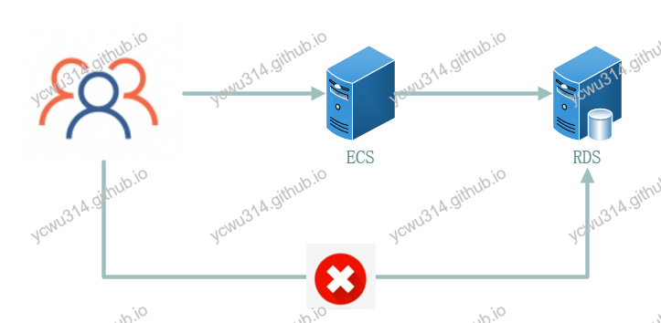
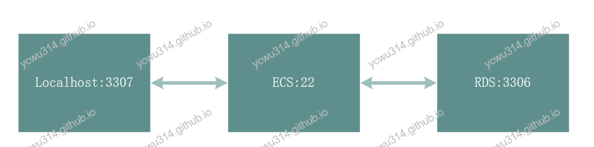
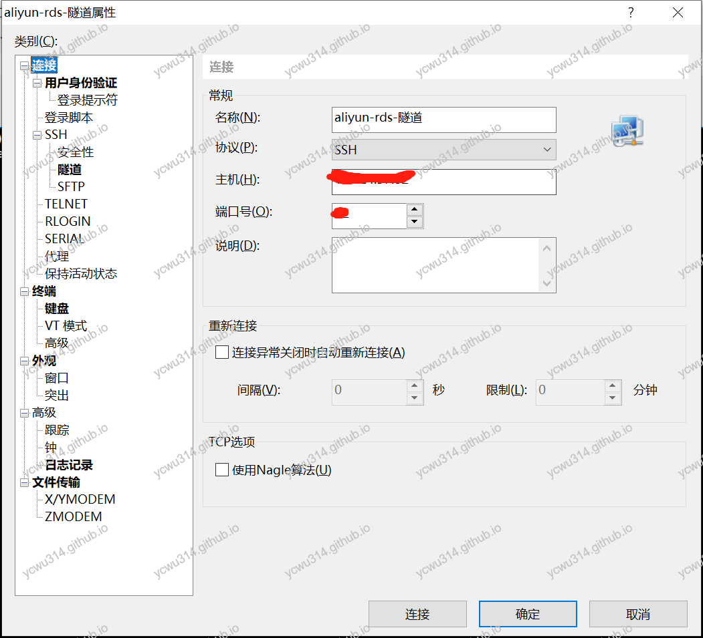
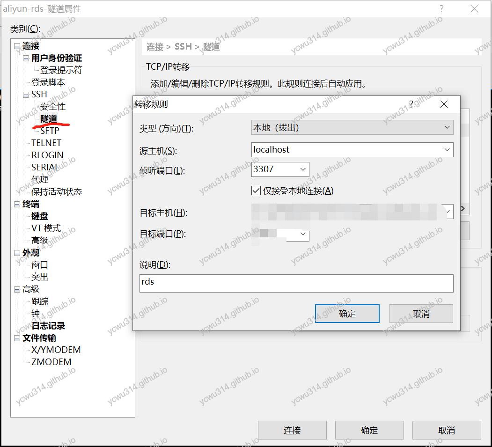
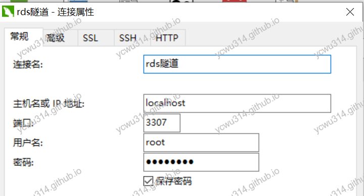

# 问题

我的mysql数据库使用阿里云RDS，默认情况下只能通过阿里云内网访问，除非走白名单申请才能开放外网访问权限。如下图所示：





从系统安全性来说，对敏感的数据库资源进行网络隔离是很有必要的。但是日常开发来说，每次都要在ECS上运行mysql client操作就效率太低了。

既然我可以ssh到ECS机器，ECS机器又可以直接访问到RDS，那么先ssh到ECS，把所有操作mysql的请求，都交给ECS转发到RDS，问题就解决了。
这就是ssh端口转发（ssh port forwarding），也叫ssh隧道（ssh tunnel）。

虽然对mysql的操作来自公网，但是数据经过ssh隧道，是被加解密的，因此安全性还是有的。





期望的效果是，mysql客户端连接本机的3307端口就可以访问远程的mysql。实际上是通过ECS做端口转发到RDS的3306端口。

# 使用ssh命令做隧道

我本地安装了Cmder的完整版，带有ssh命令，可以直接做端口转发。

```bash
# ssh
usage: ssh [-46AaCfGgKkMNnqsTtVvXxYy] [-B bind_interface]
           [-b bind_address] [-c cipher_spec] [-D [bind_address:]port]
           [-E log_file] [-e escape_char] [-F configfile] [-I pkcs11]
           [-i identity_file] [-J [user@]host[:port]] [-L address]
           [-l login_name] [-m mac_spec] [-O ctl_cmd] [-o option] [-p port]
           [-Q query_option] [-R address] [-S ctl_path] [-W host:port]
           [-w local_tun[:remote_tun]] destination [command]
```

头晕了吧，这么多参数。需要关注的是`-L`，本地转发。Cmder没有man，于是从ECS上拷贝一份解释
```
-L [bind_address:]port:host:hostport
-L [bind_address:]port:remote_socket
-L local_socket:host:hostport
-L local_socket:remote_socket
        Specifies that connections to the given TCP port or Unix socket on the local
-L local_socket:host:hostport
-L local_socket:remote_socket
        Specifies that connections to the given TCP port or Unix socket on the local
        (client) host are to be forwarded to the given host and port, or Unix socket, on
        the remote side.  This works by allocating a socket to listen to either a TCP port
        on the local side, optionally bound to the specified bind_address, or to a Unix
        socket.  Whenever a connection is made to the local port or socket, the connection
        is forwarded over the secure channel, and a connection is made to either host port
        hostport, or the Unix socket remote_socket, from the remote machine.
        Port forwardings can also be specified in the configuration file.  Only the supe‐
        ruser can forward privileged ports.  IPv6 addresses can be specified by enclosing
        the address in square brackets.
```

简单来说，`-L <本地端口>:<目标服务器>:<目标端口>`，对于我的例子，是`-L 3307:<RDS内网地址>:<RDS端口3306>`
```
ssh -L 3307:<RDS内网地址>:3306 ecs_user@ecs_host
```
表示本机的3307端口做本地转发到RDS服务器的3306端口，由ecs_host做隧道。
登录之后，就可以正常使用本地3307端口访问远程mysql了。

这里还有个小问题。ssh连接到ECS服务器，只是为了做端口转发，并不会使用ssh远程命令。另外，上面的ssh命令会一直占用foreground，一旦关闭ssh连接，隧道也会关闭。对此，ssh提供了`-N`和`-f`参数。
`-N`参数只做端口转发。
```
-N      Do not execute a remote command.  This is useful for just forwarding ports.
```
`-f`参数ssh保留在后台状态。
```
-f      Requests ssh to go to background just before command execution.  This is useful if
        ssh is going to ask for passwords or passphrases, but the user wants it in the
        background.  This implies -n.  The recommended way to start X11 programs at a
        remote site is with something like ssh -f host xterm.
        If the ExitOnForwardFailure configuration option is set to “yes”, then a client
        started with -f will wait for all remote port forwards to be successfully estab‐
        lished before placing itself in the background.
```
因此，最后的命令是
```
ssh -fNL 3307:<RDS内网地址>:3306 ecs_user@ecs_host
```

# Windows：使用xshell做ssh隧道

习惯图形界面操作的也可以用xshell来完成端口转发。

1. 新建连接到ECS的ssh配置





2. `SSH`、`隧道`。源主机选择`localhost`，监听端口是3307。**目标主机、目标端口填RDS的内网地址和内网端口**。





3. xshell打开刚才配置的连接

4. navicat配置。主机是localhost，端口3307，账号和密码填RDS的。





注意这种方式，每次都要先打开xshell才能访问mysql。

