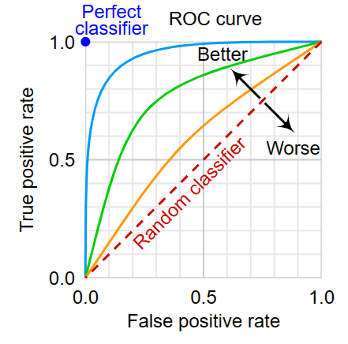
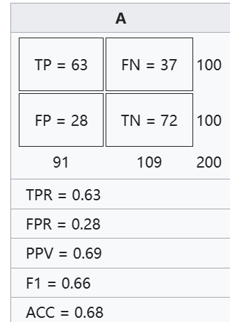
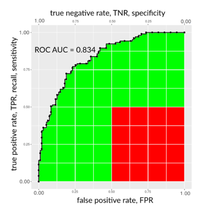

通过chatgpt、llama3整理。

一种用于评估二元分类器性能的常用工具。

# ROC曲线

ROC曲线（Receiver Operating Characteristic curve），是用于评价二分类模型性能的常用指标。该曲线是基于阈值变化的真阳性率（True Positive Rate）和假阳性率（False Positive Rate）构成。
ROC曲线的特点：
1. 横轴：假阳性率（False Positive Rate）
2. 纵轴：真阳性率（True Positive Rate）
3. 曲线越靠近左上角，模型的性能越好

其中：
* 假阳性率（FPR）：预测为正例但实际为负例的样本所占的比例
* 真阳性率（TPR）：预测为正例且实际为正例的样本所占的比例，也就是recall（召回率）

ROC曲线的优点：
1. 可以直观地评估模型的性能
2. 能够比较不同模型的性能

ROC曲线的缺点：
1. 只能用于二分类问题
2. 不适用于多分类问题

其中：
- 假阳性率 FPR = FP / (FP + TN)
- 真阳性率 TPR = TP / (TP + FN)

wiki上的例子：

# ROC曲线的特性

1. **Threshold-invariant**：ROC曲线不受阈值的影响，能够客观地评价模型的性能
2. **Class-balanced**：ROC曲线能够处理类别不均衡的问题，例如正负例样本数目差别很大的情况
3. **Monotonicity**：ROC曲线的曲线是单调递增的，即随着阈值的增加，真阳性率（TPR）和假阳性率（FPR）都会增加
4. **Convexity**：ROC曲线是凸的，即曲线的上半部分是凸的，下半部分是凹的
5. **Symmetry**：ROC曲线关于对角线（y=x）对称，即如果将ROC曲线关于对角线对称，得到的曲线仍然是ROC曲线
6. **AUC**：ROC曲线下的面积（AUC）能够评价模型的性能，AUC越大，模型的性能越好

# AUC

AUC（Area Under the ROC Curve）是ROC曲线下的面积，衡量二分类模型对样本的分类性能。

ROC曲线并不能清晰的说明哪个分类器的效果更好，而作为一个数值，对应AUC更大的分类器效果更好。

AUC值为x，则对于随机选择的一个正样本和一个负样本，模型有x的概率将正样本的预测评分高于负样本的预测评分。

AUC的取值范围为[0,1]，其含义为：
* AUC = 1：模型完美分类
* AUC = 0.5：模型分类结果与随机猜测相同
* AUC < 0.5：模型分类结果比随机猜测还差
* AUC > 0.5：模型分类结果比随机猜测好

AUC的优点：
1. 能够评估模型的分类性能
2. 不受阈值的影响
3. 能够比较不同模型的性能

AUC的缺点：
1. 只能用于二分类问题
2. 不适用于多分类问题

# AUC的问题

来自wiki：

>对这些研究中描述的 ROC 曲线的主要批评意见是，在计算曲线下总面积（AUC）时，将低灵敏度和低特异性（均低于 0.5）的区域纳入其中。
>
>这些研究的作者认为，曲线下面积的这一部分（低灵敏度和低特异性）表明混淆矩阵中的二元预测结果不佳，因此不应纳入总体性能评估。此外，AUC 的这一部分表示混淆矩阵阈值较高或较低的空间，这对于在任何领域进行二元分类的科学家来说都很少有意义。
>
>对 ROC 及其曲线下面积的另一个批评是，它们对精确度和负预测值只字未提。

# 资料

- [Receiver operating characteristic](https://en.wikipedia.org/wiki/Receiver_operating_characteristic)