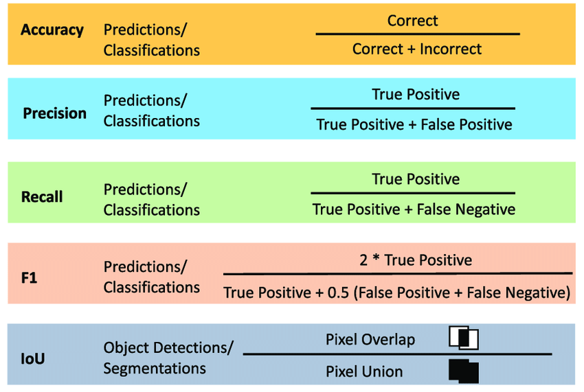
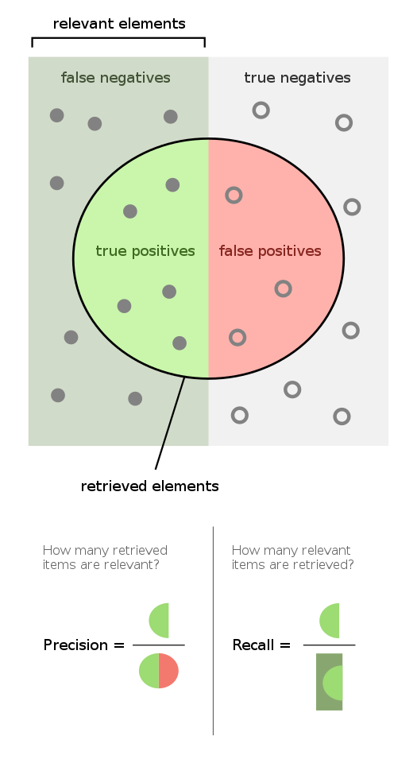
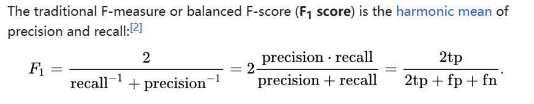

使用gpt、llama3整理。




# 数据集

- 训练集（Training Set）：用于训练和调整模型参数。
- 验证集（Validation Set）：用于验证模型精度和调整模型参数。
- 测试集（Test Set）：用于验证模型的泛化能力。


# IoU

IOU（Intersection over Union）是一种常用的评价 metrics，在目标检测、图像分割等领域中使用。它衡量的是预测框（Predicted Bounding Box）与真实框（Ground Truth Bounding Box）之间的相似度。
IOU 的计算公式如下：
```
IOU = (预测框 ∩ 真实框) / (预测框 ∪ 真实框)
```

其中，∩ 表示交叠面积，∪ 表示并集面积。
例如，如果预测框的坐标为 (x1, y1, x2, y2)，真实框的坐标为 (x3, y3, x4, y4)，则可以计算出交叠面积和并集面积：
```
交叠面积 = max(0, min(x2, x4) - max(x1, x3)) × max(0, min(y2, y4) - max(y1, y3))
并集面积 = (x2 - x1) × (y2 - y1) + (x4 - x3) × (y4 - y3) - 交叠面积
```

然后，计算 IOU 值：
```
IOU = 交叠面积 / 并集面积
```

IOU 值越大，表示预测框与真实框越相似。通常情况下，IOU 值在 0 到 1 之间，1 表示完全重叠，0 表示不重叠。

在目标检测中，常用 IOU 阈值来判断预测框是否是正确的检测结果，`一般来说，IOU 阈值设为 0.5 或 0.7`，即当 IOU 值大于或等于阈值时，认为预测框是正确的检测结果。


# mAP50, mAP75, and mAP50-95

mAP50-95 是目标检测算法的evaluation metric之一，即`Mean Average Precision（mAP）`的一个 variant。
* mAP：是平均精度（Average Precision）的均值，它衡量了检测算法在不同 IOU 阈值下的性能。IOU（Intersection over Union）是目标检测中的评价 metrics，表示预测框与真实框的交叠面积占预测框和真实框总面积的比例。
* AP50、AP75 等：分别表示在 IOU 阈值为 0.5、0.75 时的平均精度。
* mAP50-95：是指在 IOU 阈值从 0.5 到 0.95 之间，以 0.05 为步长，计算 AP 值，然后取其平均值。这个 metrics 能够更好地反映检测算法在不同难度级别下的性能。
例如，如果某个检测算法的 mAP50-95 值为 0.6，则表示该算法在 IOU 阈值从 0.5 到 0.95 之间的平均精度为 0.6。


# 混淆矩阵

Confusion Matrix（混淆矩阵）是一种常用的评价 metrics，在机器学习、模式识别等领域中使用。它衡量的是分类模型或检测算法的性能，特别是对于多类别分类问题。

Confusion Matrix 是一个 square matrix，通常用来评价二分类问题，但也可以扩展到多分类问题。矩阵的行表示预测结果，列表示真实结果。矩阵的元素表示不同类别下的预测结果和真实结果的组合。
典型的 Confusion Matrix 如下所示：


|            | 判断为真         | 判断不为真           |
|------------|------------------|-----------------------|
| 事实上为真 | TP (True Positive) | FN (False Negative)   |
| 事实上不为真 | FP (False Positive) | TN (True Negative)    |

其中：
* TP (True Positive)：预测正确的正例数
* FN (False Negative)：预测错误的正例数
* FP (False Positive)：预测错误的负例数
* TN (True Negative)：预测正确的负例数

基于 Confusion Matrix，可以计算出一些重要的评价 metrics，例如：
* Accuracy（准确率）：(TP + TN) / (TP + TN + FP + FN)
* Precision（精度）：TP / (TP + FP)
* Recall（召回率）：TP / (TP + FN)
* F1-score（F1 值）：2 \* (Precision \* Recall) / (Precision + Recall)

在目标检测中，Confusion Matrix 也可以用于评价检测结果的质量，例如：
* TP：正确检测到的目标数
* FN：漏检的目标数
* FP：虚警的目标数
* TN：正确拒绝的非目标数




参考资料：https://en.wikipedia.org/wiki/Precision_and_recall


## Precision 和 Recall

```
Precision（精度）：TP / (TP + FP)
Recall（召回率）：TP / (TP + FN)
```

- 精确率：主要关注的是模型在预测为正例的样本中，有多少是真正的正例。在一些应用场景中，如垃圾邮件过滤、风险控制等，`需要尽量减少误报率`，即提高精确率。
- 召回率：主要关注的是模型能够尽可能多地识别出实际正例样本，即尽量减少漏掉正例的情况。在一些应用场景中，如医学诊断、安全检测等，尽可能高的召回率很重要，`即尽量减少漏检率`。


# F1 score

F1 分数（F1-score）是一种常用的评价 metrics，在机器学习、自然语言处理等领域中使用。它衡量的是模型或算法的精度（Precision）和召回率（Recall）之间的平衡。



F1 分数的值介于 0 和 1 之间，越接近 1 表示模型或算法的性能越好。

优点：
- 综合考虑了召回率和精确率，适用于不平衡数据集，能够对模型在各个类别上的性能进行综合评估。
- 在关注误分类代价较高的场景中，F1 分数能够提供更为全面的评价。

缺点：
- 对于类别不平衡的数据集，F1 分数较为敏感，可能无法很好地反映出真实情况。
- 由于是召回率和精确率的调和平均值，因此当召回率和精确率存在明显的偏差时，F1 分数可能无法准确反映模型的性能。


参考资料：https://zh.wikipedia.org/zh-cn/F-score


# 几个指标对比


| 指标             | 介绍                                      | 优点                                       | 缺点                                       | 使用场景                                                                                          |
|------------------|-------------------------------------------|--------------------------------------------|--------------------------------------------|---------------------------------------------------------------------------------------------------|
| F1 分数         | 将召回率和精确率的调和平均值作为度量标准。 |  综合考虑了召回率和精确率，适用于不平衡数据集。 | 对类别不平衡问题较为敏感。                   | 二分类任务、不平衡数据集、关注误分类代价较高的场景、医学影像识别中的疾病检测任务等。              |
| mAP| 目标检测任务中常用的评价指标。               |  考虑了不同类别之间的性能差异。            |  计算较为复杂。                           | 目标检测、物体识别任务、多类别分类问题、多尺度检测任务、命名实体识别任务等。                    |
| 召回率（recall）        | 正例样本中被正确识别的比例。                 |  关注查全率，较少漏掉正例。               |  对误分类不敏感。                         | 需要尽可能少遗漏正例的场景、医学影像识别中的疾病检测任务、搜索引擎优化、航空安全等。（FN要小）         |
| 精确率（precision） | 正例预测中真正正例的比例。                   |  关注预测准确性，减少误报。               |  对漏掉正例不敏感。                       | 需要确保预测结果准确性的场景、垃圾邮件过滤中的正常邮件识别任务、在线广告投放、产品质量控制等。（FP要小）|

这个表格综合了关于 F1 分数、mAP、召回率和精确率的介绍、优缺点以及更多具体使用场景的内容。

# 模型的泛化能力


模型的泛化能力（Model Generalization Ability）指的是模型在未见过的数据或新的环境中保持其性能的能力。以下是影响模型泛化能力的几个重要因素：
1. 训练数据的多样性（Diversity of Training Data）：训练数据越多样化，模型越容易泛化到新数据。
2. 模型复杂度（Model Complexity）：模型越简单，泛化能力越强；模型越复杂，泛化能力越弱。
3. 正则化技术（Regularization Techniques）：使用正则化技术，例如dropout、L1/L2正则项等，可以提高模型的泛化能力。
4. 超参数调整（Hyperparameter Tuning）：合适地调整超参数可以提高模型的泛化能力。
5. 数据增强（Data Augmentation）：对训练数据进行增强处理，例如图像旋转、翻转等，可以提高模型的泛化能力。

为了提高模型的泛化能力，可以采取以下策略：
1. 收集更多的训练数据。
2. 使用 transfer learning，利用预训练模型来初始化当前模型。
3. 使用 ensemble 方法，组合多个模型以提高泛化能力。
4. 对模型进行early stopping，以避免过拟合。
5. 使用交叉验证，选择最优的超参数。