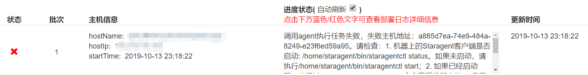

后台app要发布新版本，但是在流水线执行部署失败：
<!-- more -->
```
调用agent执行任务失败，失败主机地址：a885d7ea-74e9-484a-8249-e23f6ed59a95。请检查：
1. 机器上的Staragent客户端是否启动: /home/staragent/bin/staragentctl status。如果未启动，请执行/home/staragent/bin/staragentctl start；
2. 如果已经启动了，请通过cat /usr/sbin/staragent_sn命令查看机器上的SN是否是a885d7ea-74e9-484a-8249-e23f6ed59a95。如果不是，则有可能是在该机器上多次运行了Agent安装脚本导致的。您可以将该机器从该环境去关联，然后重新添加。
```





```
#  /home/staragent/bin/staragentctl status
connect to inner listener failed:-1,err:11,errinfo:Resource temporarily unavailable
operate failed
```
检查失败，于是执行`/home/staragent/bin/staragentctl start`，重新启动服务。
等了半分钟，再次用status命令检查，发现同样的报错。
于是通过`staragent_sn`命令检查机器sn，跟提示的一致。

嗯，阿里云的操作提示并没有提到上面的staragentctl启动失败的处理。。。
重启是解决很多问题的方式😥，尝试重启staragent。

查找staragent相关的进程
```bash
root@iZwz9h8m2chowowqckbcy0Z:/home/staragent# ps aux | grep star
root       466  0.0  0.2 170516  4520 ?        Ssl  Sep03   0:00 /usr/bin/python3 /usr/bin/networkd-dispatcher --run-startup-triggers
root      4897  0.0  0.0   4628   228 ?        S    Oct07   0:00 /bin/sh -c /home/staragent/bin/staragentd
root      4898  0.9  0.2 823656  4680 ?        Sl   Oct07  90:13 staragent-core
root      9702  0.0  0.0  41816   168 ?        Ss   Sep04   1:15 /home/staragent/bin/staragentd
root      9704  0.0  0.0   4628     0 ?        S    Sep04   0:00 /bin/sh -c /home/staragent/bin/staragentd
root      9705  0.2  1.7 670528 34880 ?        Sl   Sep04 122:01 staragent-ppf
root     20060  0.0  0.0  14428  1024 pts/0    S+   23:33   0:00 grep --color=auto star
```
staragentd、 staragent-core、 staragent-ppf 都是相关进程。
一个小问题：正确的启动顺序呢？
这里用粗暴的方式：从控制台删除关联机器，再重新绑定机器资源。
这几个进程pid改变了，表明被重启了。
```bash
root@iZwz9h8m2chowowqckbcy0Z:/home/staragent# ps aux | grep star
root       466  0.0  0.2 170516  4520 ?        Ssl  Sep03   0:00 /usr/bin/python3 /usr/bin/networkd-dispatcher --run-startup-triggers
root     20126  0.0  0.3  41816  7008 ?        Ss   23:33   0:00 /home/staragent/bin/staragentd
root     20127  0.0  0.0   4628   772 ?        S    23:33   0:00 /bin/sh -c /home/staragent/bin/staragentd
root     20128  0.0  0.0   4628   844 ?        S    23:33   0:00 /bin/sh -c /home/staragent/bin/staragentd
root     20129  1.5  0.6 815560 13176 ?        Sl   23:33   0:00 staragent-core
root     20130  0.2  0.5 277156 10476 ?        Sl   23:33   0:00 staragent-ppf
root     20262  0.0  0.0  14428  1008 pts/0    S+   23:33   0:00 grep --color=auto star
```

再次检查staragent status:
```bash
root@iZwz9h8m2chowowqckbcy0Z:~# /home/staragent/bin/staragentctl status
------agent running ok------
  StartTime           : 2019-10-13 23:33:38 CST
  RegisterTime        : 2019-10-13 23:33:40 CST
  ServiceTag          : 6a94612e-0be8-47ec-9c17-fdc7e4f48589
  ServerConnected     : 1
  LastHeartBeatTime   : 2019-10-13 23:37:29 CST
  ServerAddr          : ***.***.***.***:**** （此处打码）
  LocalAddr           : 172.18.151.35
  Max Core count      : 0
  Total CPU Count     : 1
  Total CPU Rate      : 100.00%
  Total MEM Rate      : 49.66%
  Process CPU Rate    : 1.00%
  Load Avg (1,5,15)   : 30,14,12
  Virtual Memory      : 820MB
  Physical Memory     : 14MB
```

然后在云效控制台重新部署，执行成功。