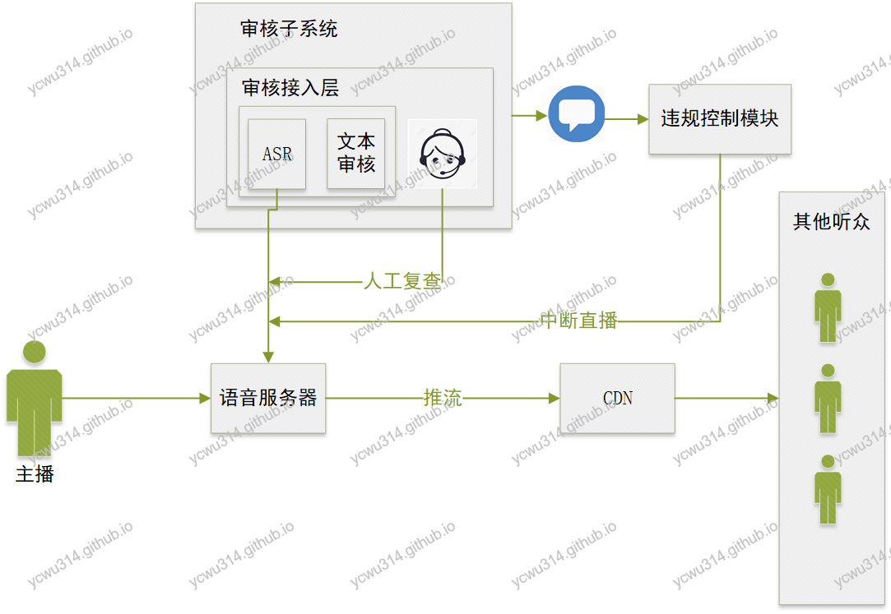

当前环境下，做互联网产品尤其是面向C端用户的，一个最不能忽视问题是做好内容监管。不能发布有害社会的内容，一旦发现被举报，轻则下架停改，重则永远say goodbye。对于传统的文本、图片、视频，业界已经有比较好的内容审核方案。至于音频相关审核方案，目前还在成长期。

# 项目需求

作为语音直播项目，SD项目既然规划日活要XXXX万。完善的审核机制是不可以少的，否则分分钟就踩雷。在第一版主功能开发差不多的时候，我就提议要把审核方案放到日程上，安排人力去实现，只可惜未被得到重视。
不过对于自己认可的事情，花点自己的时候去思考也是大有裨益的。

# 语音识别挑战

语音识别来自多个方面的挑战：
- 语言。普通话，广东话，四川话，东北话，……，blablabla。通常模型只针对某个语言做训练和优化。一旦是多人聊天还东一句普通话、西一句广东化，效果好不到哪里。
- 口音。哪怕都是讲普通话，口音会有很大的差别。
- 声纹的多样性。不同人的声纹不一样，同一个人不同状态下的声纹也不一样：平常说话的声音，跟昨晚唱K后沙哑的声音。
- 环境噪音。一般人不可能在很安静的地方说话，环境噪音无法避开。
- 语气。一句话正常说，跟用发喋的声音说，意思就很不一样了。（跑题了，跑到语义识别去~）

# 语音审核方案

## 产品的审核功能设计建议

人们对隐私越来越看重，谁也不想自己做的事情被监控。因此，ugc内容避免在产品设计上突出“审核”、尤其是“人工审核”之类的字眼。这些字眼会对令人感到不适，缺乏隐私。

个人觉得觉得审核设计有2点注意：
1. 举报功能。由用户触发，人人都是朝阳区热心群众呢。实际上，举报的实际功效是相当分化的，要么没人用，要么被玩坏。在运营后台可以看到各式沙雕的举报理由。
因此，我建议“举报”按钮，可以做成固定几个选项，让用户选择就好了。
2. 机器审核。机器是冰冷冷的，相比人工检查，更让人觉得隐私安全。可以突出全程机器审核，减轻用户的焦虑。

## 架构设计

与ASR工作相关的流程：
- 由ASR从语音通道获取输入
- 转化为文本
- 把文本输入到文本审核系统
- 审核结果通过发送消息，通知到审核控制模块，再做处理

## 服务器对接ASR

[图片来源阿里云ASR](http://docs-aliyun.cn-hangzhou.oss.aliyun-inc.com/assets/pic/84442/cn_zh/1558427378727/SpeechRecognizer.png)

## 热词管理

为了提升ASR的识别率，可以增加热词。在这个项目场景，可以把常见敏感词贴上去。

## 模型管理

ASR支持自定义模型，提升识别率。但是目前来看，没有足够的能力去优化模型，先用默认就好。

# 方案风险和收益分析

1. 没有审核方案（自动、人工）。一旦被举报，必死无疑。
2. 只有人工审核，对于一个全天候都有人使用的app，根本处理不过来，而且质量参差不齐。哪怕是外包，人力成本相当高。
3. 只有ASR自动机器审核。质量也是不令人放心的。
4. ASR+人工，用人工去弥补ASR不能很好识别的内容。质量上比较妥当，成本也可以接受。

由于使用了第三方房屋，极端情况下还可以踢下球，态度诚恳些，避免被下架。
另外，由于使用量大，对于第三方来说，我们可以成为一个很好的合作方，提供大量训练语料，可以用来优化模型，双方达到共赢。

# 其他内容形式的审核

## 文本

从最基本的敏感词、到各种自然语言模型，已经玩得比较成熟了。以后有机会再详细说说。

## 图片

从人工审核发展到深度学习，也是很多选择，以后有机会再详细说说。

## 视频直播

逐帧截图，再做图片审核。通常是按图片数量收费（贵啊）。
个人觉得可以按照关键关键帧截图，这样图片数量少很多。
