# 又是推酷爬虫

不幸的消息，推酷爬虫又来了。


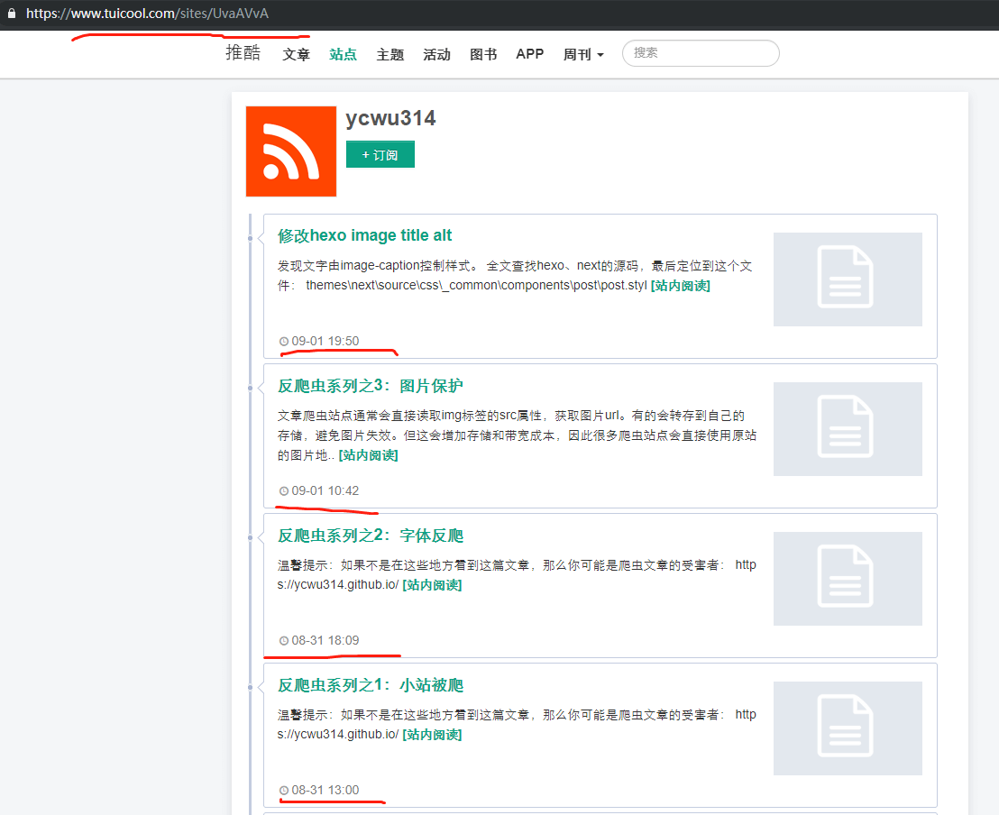


打开html，发现字体反爬已经被破😭，直接解析为文字了：


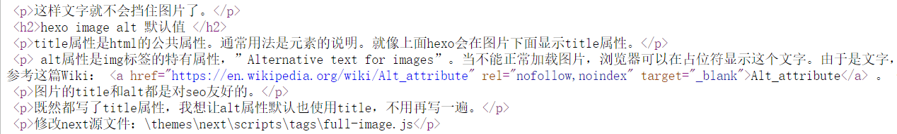


不过图片保护还能用。


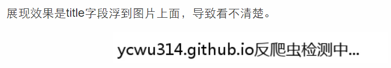


另外，至今推酷官方邮件biz@tuicool.com一直没有回复。

<!-- more -->

现在的结论是：
- 推酷爬虫对我的小站应该是一周更新一次。
- 文章链接还是暴露。猜测是从首页遍历。
- 简单的一套转换字体映射名的方式，不保险。

低估了这个多年文章搬运工。

应对措施：
- 先把还没被爬的文章撤下
- 买了新域名，赶紧搞备案。直接nginx + iptables封杀


# cloudflare 防火墙策略防爬

更新于2019.9.6：
在阿里云买了域名之后，发现备案要求续费主机至少3个月以上。。。如果使用另一个开发账号的ECS去备案，又涉及到备案人和域名持有人的问题。

域名和备案，只是为了能在ecs上部署站点，并且使用nginx做waf。
如果有另外的方式能够实现waf，就可以防爬，不需要这么折腾。
搜索资料，发现cloudflare提供了一些waf功能。
于是新的方案出来：

1. 登录阿里云域名控制台，新域名`ycwu314.top`域名解析从万网，改为cloudflare nameserver。
```
ines.ns.cloudflare.com
ivan.ns.cloudflare.com
```

2. dns解析转移，要等待一段时间才生效。
```
# whois ycwu314.top | grep 'Name Server'
Name Server: ines.ns.cloudflare.com
Name Server: ivan.ns.cloudflare.com
```

3. 在cloudflare中增加A记录或者CNAME，指向github。
>Custom domains configured with A records
>If you configured your custom domain using an A record, your A record must point to one of the following IP addresses for HTTPS to work:
>
>185.199.108.153
>185.199.109.153
>185.199.110.153
>185.199.111.153


4. GitHub pages指向新的域名`ycwu314.top`。

5. 开启https。cf默认给站点提供了免费证书，并且开启了https，也支持强制https传输、hsts等特性。

6. 在cf中配置waf


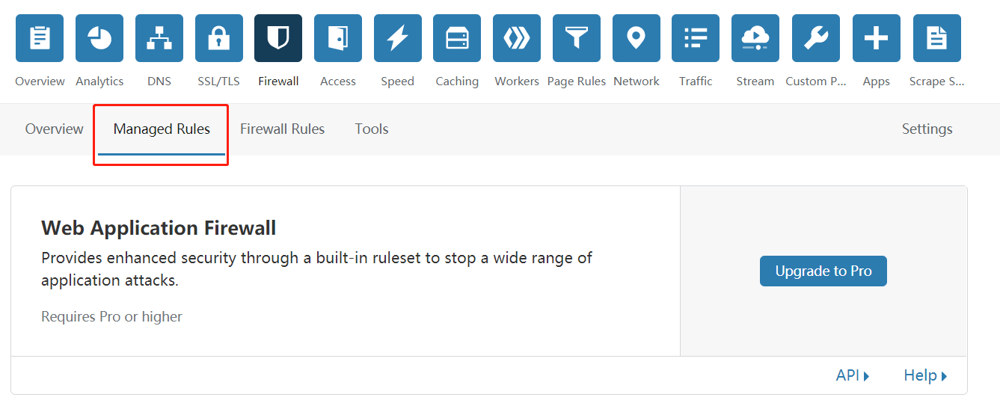


纳尼，要付费用户才能使用。。。其实有隔壁的入口是免费的，可以配置5条规则


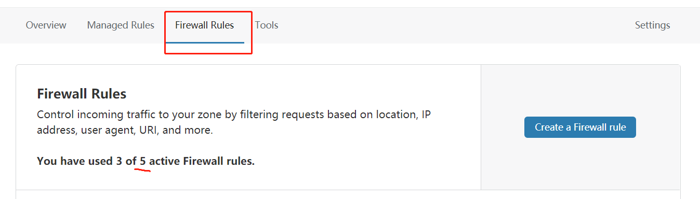


使用github pages自定义域名的另一个好处是，由github直接返回301做重定向，加快google索引转移权重。

# 解决cloudflare access log 问题

拦截爬虫请求，可以根据ip、user-agent拦截，通常是在nginx/apache的access log获取。
但是，cloudflare只有企业版用户才能获取（人民币玩家😂）。
不过我想到一个方法，增加一个防火墙rule，用于记录access log。
再从这个rule观察可疑的ip和user-agent。

在firewall、tools这个入口也可以配置ip、user-agent拦截，但是只能一个一个添加。


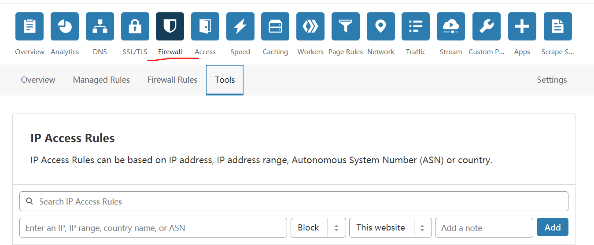


Firewall Rules页面可以使用cf的语法，结合脚本生成拦截规则。但是生成的cf表达式要小于4KB，因此UA不能无限配置。具体语法使用很简单，看下官网介绍就可以了。


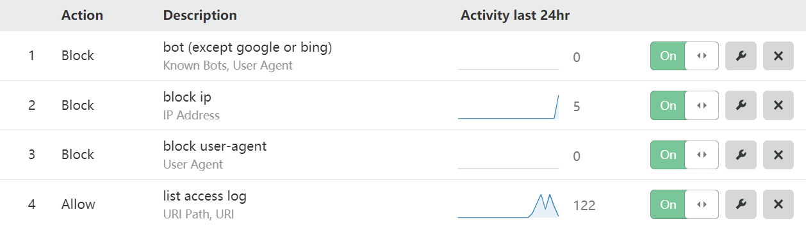


最大问题是不支持下载access log，目前只能人工看和分析。以后写个脚本，直接提取access log日志，方便做行为分析。

另外，使用cloudflare之后，速度比直连github page要慢一些。


# logflare.app

研究cloudflare功能的时候在app页面发现了好东西：logflare.app。


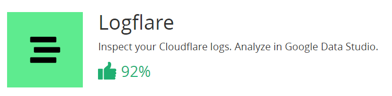


logflare使用cloudflare worker（serverless应用），异步采集请求日志，不对页面请求发生影响。
logflare.app收集请求日志，并且和Google Data Studio集成。这就是我想要的access log，还有数据分析工具可以使用，太赞了！


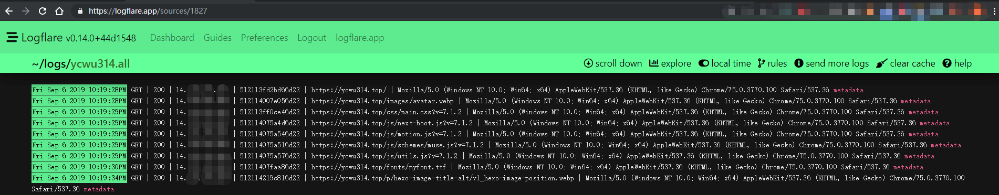


不过只有IP地址，没有地理信息，可以去IPInfo.io注册一个key，free plan一个月5w requests。


# 捕捉爬虫

剩下的就是发几篇占位符文章，尝试捕捉推酷爬虫了。

# github pages 自定义域名设置丢失

使用travis ci构建后，发现GitHub pages设置的自定义域名没了。
改为使用CNAME文件，还是没有生效。
发现17年的时候就有人汇报了这个问题：[Pushing changes to GitHub Pages branch removes custom domain setting #7538](https://github.com/travis-ci/travis-ci/issues/7538)。
travis ci官网fqdn选项：[deployment](https://docs.travis-ci.com/user/deployment/pages/)
```
deploy:
    - fqdn: Optional, sets a custom domain for your website, defaults to no custom domain support.
```
然而也没有用。
因为deploy是使用hexo d命令操作的。并非travis ci的deploy任务。
后来想起来，我是在源码目录建立的CNAME文件，构建完之后当然没有拷贝到master分支的根目录。
因为使用了next主题，直接把CNAME文件丢到`themes\next\source`。

# 后续更新

## 屏蔽IDC机房、xxx云

更新于2019.9.10：
经过几天的观察，屏蔽了一些IDC机房、xxx云、疑似代理的ip。后来ip太多，用C段地址屏蔽也麻烦，对于IDC机房地址，直接屏蔽ASN。用到3个工具：
1. 根据名字或者asn查找
https://hackertarget.com/as-ip-lookup/
输入idc、cloud之类关键字得到一些asn。

2. 根据asn查找ip段
https://traceroute-online.com/ip-asn-lookup/

3. ip地址查询，包括asn、idc机房等
https://www.ipip.net/ip.html

小心骨干网的asn，不要手抖屏蔽😀。主要屏蔽云主机厂商的asn就可以。

比较难对付的是代理ip，只能见一个封一个。

## 国外机房的爬虫

除了国内几大云厂商外，爬虫站点还使用了国外，统计下来法国、俄罗斯的机房请求普遍可疑，直接增加一个规则，对国家级别拦截并且弹出验证码
```
ip.geoip.country in {"RU" "FR"}
```

## atom.xml和站点根目录

之前猜测，站点链接泄露，是首页、atom.xml、sitemap、归档页面。
于是加了规则观察这些地址。最后发现/atom.xml和站点根目录是重灾区：


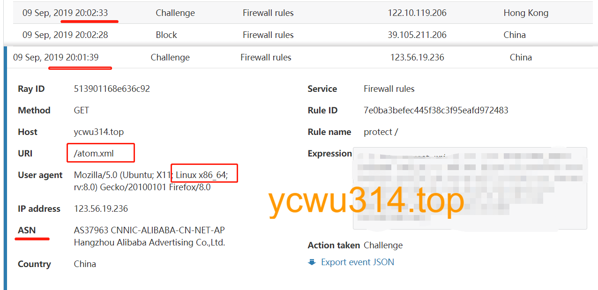


这种在一个云平台短时间更换ip（国内、日本等，观察ASN）反复查询/atom.xml、/的地址，基本是爬虫。
另外，linux桌面端比例很少，user agent带有“Linux x86_x64”很有可能是爬虫。

之前提到分类目录也可能泄露


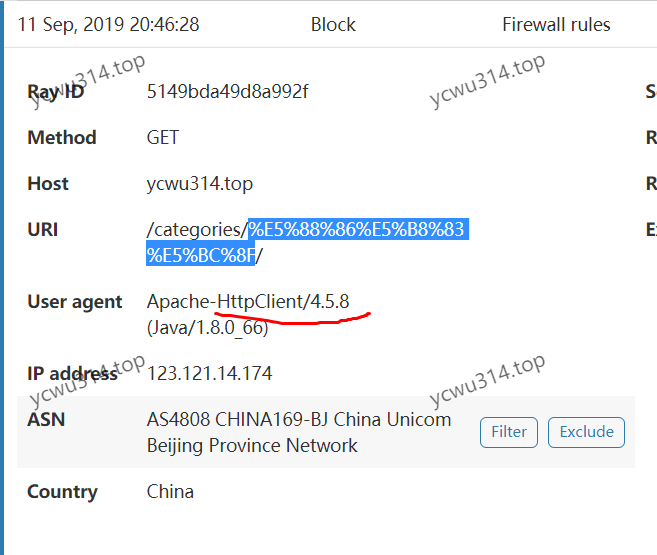


url转码之后是“分布式”。

## 爬虫新手

不要以为这年头做爬虫的都会改个user-agent


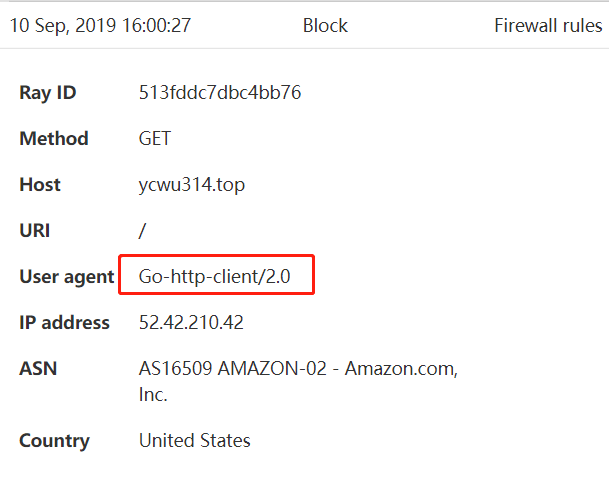


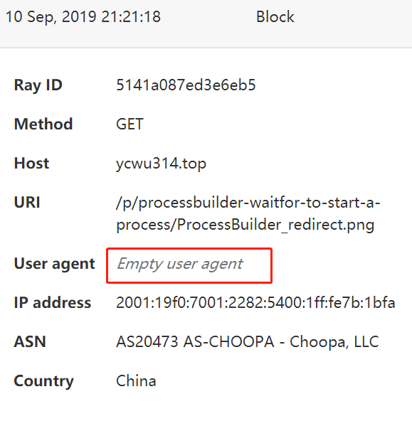


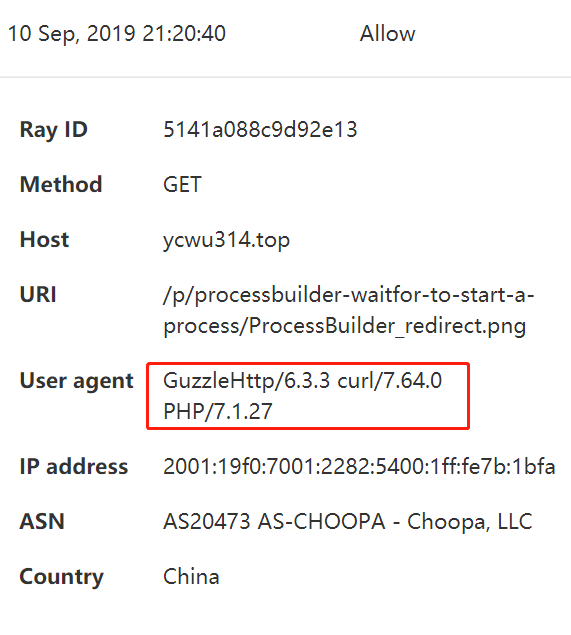


话说这是很早之前暴露的图片地址，早就换链接了。肯定是爬了另一个网站，恰好又是爬了之前我的文章。
顺带又屏蔽了一个idc。

初级爬虫最大的危害是不限速。分分钟可以拖垮原站点


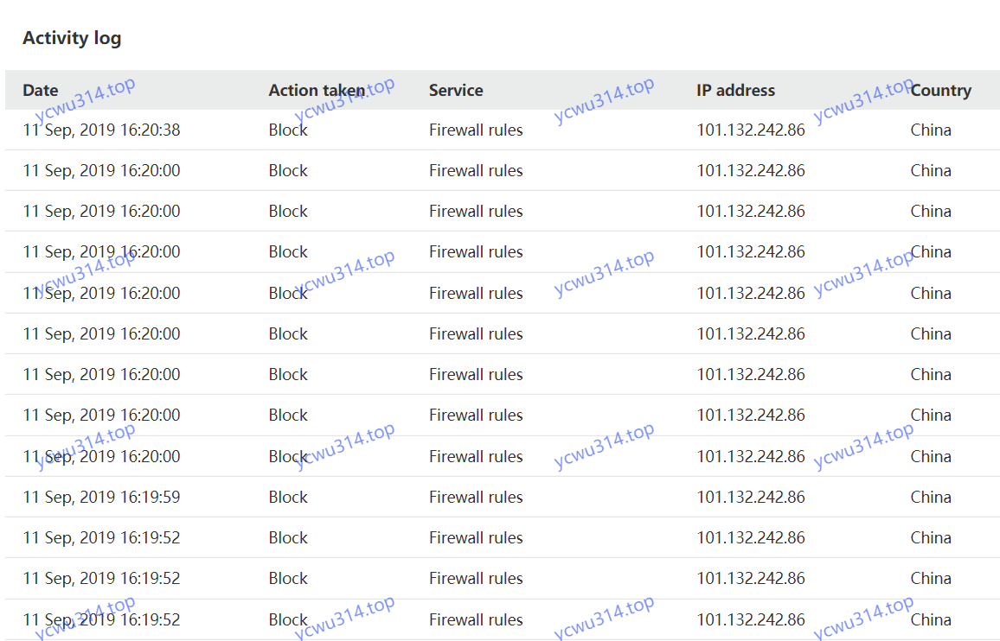


这是是很久以前暴露出去的链接了。打开详情，原来是wordpress采集插件。


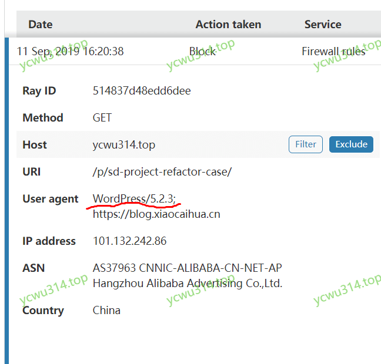


我的策略是block IP优先，并且包括几个常见云服务IDC的ASN，因此顶住了。
顺便block UA策略也更新了。

## 遇到高级爬虫

有的爬虫比较高级。单个ip访问频次很低，并且是使用未被发现的代理ip。
但是由于访问时间间隔太长反而暴露了。
一篇短文章，有几张图，正常人阅读两三分钟就读完了，但是图片的地址却是间隔5、6分钟才下载一张。
对于这种类型的爬虫，静态的waf是很难防住的。只能根据文章特征和访问行为特征做建模😂

## 图片保护

cloudflare支持图片保护（referer检查），具体功能叫“Hotlink Protection”：
>Protect your images from off-site linking.
>Supported file extensions: gif, ico, jpg, jpeg, and png.

注意暂时不支持webp，落后了。以后图片优先使用png。

## 效果

距离上次被爬取10天了


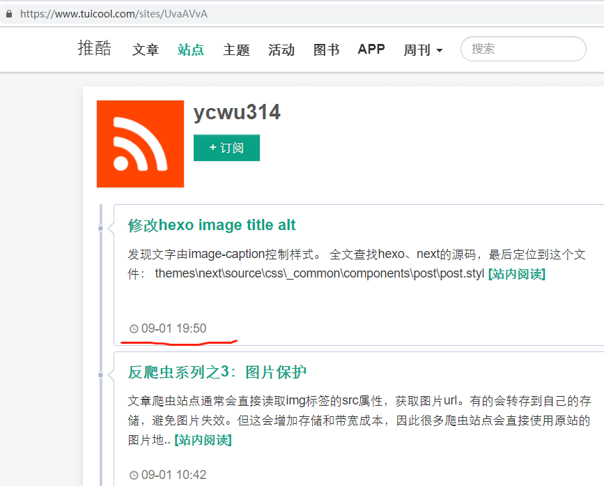


# 加速cloudflare访问

（updated at 2019.9.11） 
cloudflare免费账号，只能使用NS方式接入，dns记录生效慢，而且不能指定cf节点；只有付费版才可以使用cname记录方式接入。
cloudflare尽管有全球各地的cdn节点，但是因为众所周知的原因，国内访问访问cloudflare站点，默认访问美国西岸的节点。so，这个cdn加速还不如不加速。付费用户可以选择cloudflare域名节点。
其实GitHub pages直连访问速度比cf美国西岸要快。

网上查到其他人的解决方案：
使用第三方的cloudflare管理后台服务。第三方服务应该是付费的cloudflare账号，再使用API更新cname记录。具体可以参照这个文章：[张戈博客使用CloudFlare CDN加速的经验技巧分享](https://zhang.ge/5149.html)。
温馨提示：注册的时候，提供cf账号和密码。
所以我没有使用。

后来无意中看到这个文章：[基于 Hexo 的 GitHub Pages 配置 CloudFlare CDN](https://qhh.me/2018/11/04/%E5%9F%BA%E4%BA%8E-Hexo-%E7%9A%84-GitHub-Pages-%E9%85%8D%E7%BD%AE-CloudFlare-CDN/)。
cf提供CNAME flatten技术，支持根域名直接cname到另一个域名，并且dns查询的时候，直接返回对应CNAME的A记录或者AAAA记录。
[Understand and configure CNAME Flattening](https://support.cloudflare.com/hc/en-us/articles/200169056-CNAME-Flattening-RFC-compliant-support-for-CNAME-at-the-root)

之前是在cf中配置域名直接走A记录从ycwu314.top到github.com的ip地址，访问很慢；现在改为cname方式从ycwu314.top到github pages的地址，结果速度和之前差不多，防火墙功能也正常。