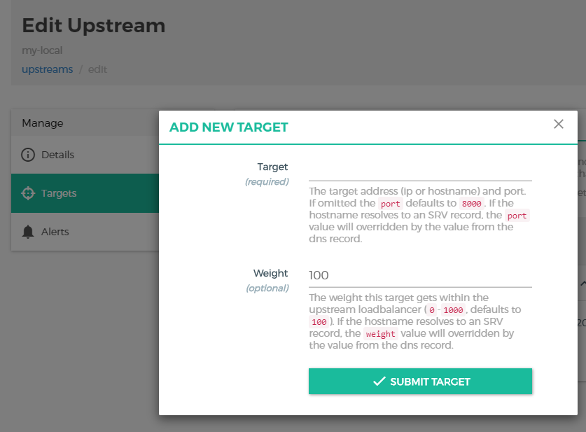
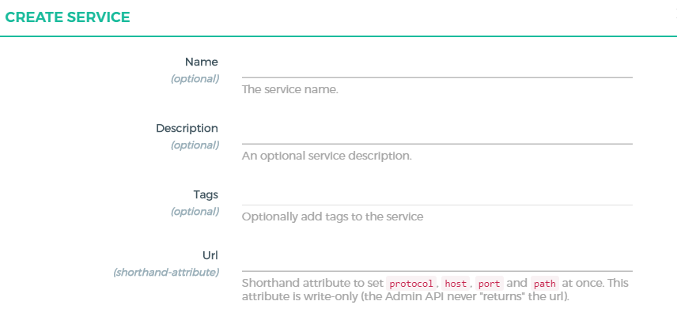
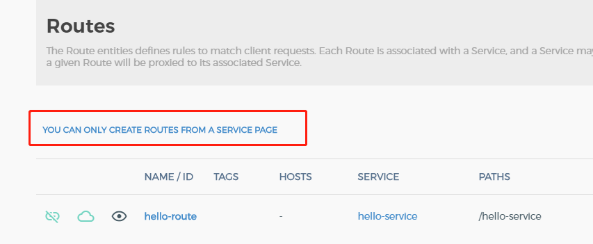

使用kong的几个基本概念。
<!-- more -->

# kong的几个概念

## Upstream

Upstream 对象表示虚拟主机名，可用于通过多个服务（目标）对传入请求进行负载均衡。

## Target

目标的IP地址/主机名，其端口表示后端服务的实例。每个上游都可以有多个 Target，并且可以动态添加 Target。

## Service

服务实体是每个上游服务的抽象。服务的示例是数据转换微服务，计费API等。
服务的主要属性是它的 URL（其中，Kong 应该代理流量），其可以被设置为单个串或通过指定其 protocol， host，port 和path。
服务与路由相关联（服务可以有许多与之关联的路由）。
Service可以是一个实际的地址，也可以是Kong内部提供的Upstream组件关联，由Upstream将请求转发到实际的服务。

## Route

路由实体定义规则以匹配客户端的请求。每个 Route 与一个 Service 相关联，一个服务可能有多个与之关联的路由。
在kong中，route在service里面添加。

## Consumer

Consumer 对象表示服务的使用者或者用户。

# kong相关概念的操作

## Upstream

和Upstream相关的重要配置有：
- 负载均衡
- 健康检查

参见：[Loadbalancing reference](https://docs.konghq.com/2.1.x/loadbalancing/)。

### 负载均衡

ring-balancer是kong提供的负载均衡器。支持以下算法：
- round-robin (默认)
- consistent-hashing
- least-connections

每个upstream都有自己的ring-balancer。

一致性哈希和RR算法，通过配置项切换：
>When using the consistent-hashing algorithm, the input for the hash can be either none, consumer, ip, header, or cookie. When set to none, the round-robin scheme will be used, and hashing will be disabled. 


slot的配置，至少每个target分配100个slots。slots越多，随机分布效果越好，但是添加/删除target的维护成本越大。
>The number of slots to use per target should (at least) be around 100 to make sure the slots are properly distributed. Eg. for an expected maximum of 8 targets, the upstream should be defined with at least slots=800, even if the initial setup only features 2 targets.
>
>The tradeoff here is that the higher the number of slots, the better the random distribution, but the more expensive the changes are (add/removing targets)


### 健康检查

健康检查：
- 主动检查（active）：定期检查 target 中指定的 Http 或 Https 端点，并根据其响应确定 target 的运行状况
- 被动检查（passive）：也称为断路器，Kong会分析正在运行的代理流量，并根据其响应请求行为确定 target 的运行状况

健康检查仅作用于活动状态的 target，但是不修改Kong数据库中 target 的活动状态。
不健康的 target 不会从负载均衡器中移除，因此在使用Hash算法时，不会对平衡器布局造成任何影响（它们只是被跳过）。

主动健康检查器可以在 target 恢复健康之后自动恢复流量；但是被动健康检查器不能。
主动健康检查器需要一条URL路径可以访问，作为探测的端点（通常简单配置为"/"）；被动检查器不需要这样的配置

## Target





target是upstream下真实的服务器端点，配置ip和port。

## Service





url是protocol、host、port、path的缩写。


## Route

Route要在Service中创建！
Route要在Service中创建！
Route要在Service中创建！





这里有个操作上的坑，多选项的配置，要使用回车键才能正常录入！


Route上有2个配置项值得留意：Strip Path和Preserve Host，都会影响访问upstream。


### Strip Path

启用strip_uri属性来指示Kong在代理此API时，在上游请求的URI中不应包含匹配的URI前缀。

```
GET /service/path/to/resource HTTP/1.1
Host:
```
kong代理到上游服务的真实uri为（此时的uri不包含uris中配置的内容，少了/service部分）
```
GET /path/to/resource HTTP/1.1
Host: my-api.com
```

### Preserve Host

Preserve Host：当启用代理时，KONG默认将API的 upstream_url 的值配置为上游服务主机的 host 。

客户端发送请求：
```
GET / HTTP/1.1
Host: service.com
```

1. Preserve Host=fase
```json
{
    "name": "my-api",
    "upstream_url": "http://my-api.com",
    "hosts": ["service.com"],
}
```

KONG会从API的upstream_url中提取HOST值，在做代理时，会向上游服务发送类似的请求：
```
GET / HTTP/1.1
Host: my-api.com
```

2. Preserve Host=true
```json
{
    "name": "my-api",
    "upstream_url": "http://my-api.com",
    "hosts": ["service.com"],
    "preserve_host": true
}
```

KONG将会保留客户端发送来的HOST值，在做代理时，会向上游服务发送以下的请求：
```
GET / HTTP/1.1
Host: service.com
```

## 验证

一个名为my-local的Upstream，指向物理服务器，提供`hello222`接口的实现。
一个名为hello-service的Service；url为`http://my-local`。
一个名为hello-route的Route；设置path为`/hello-service`。

kong默认使用8000端口访问http服务：
```
curl http://<kong ip>:8000/hello-service/hello222
```
