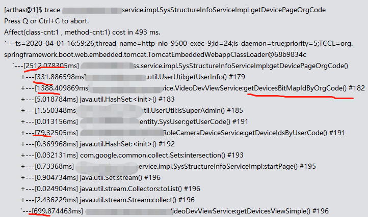
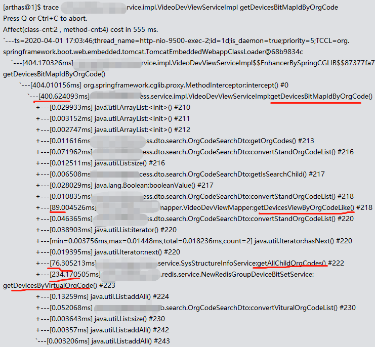
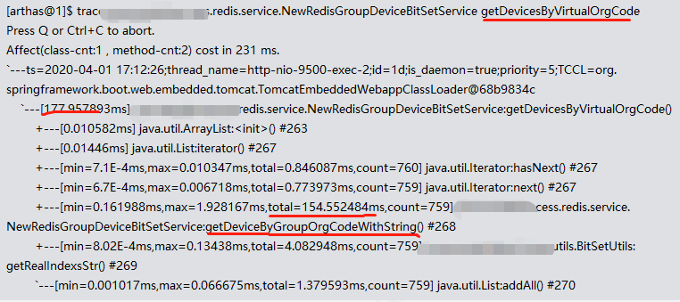
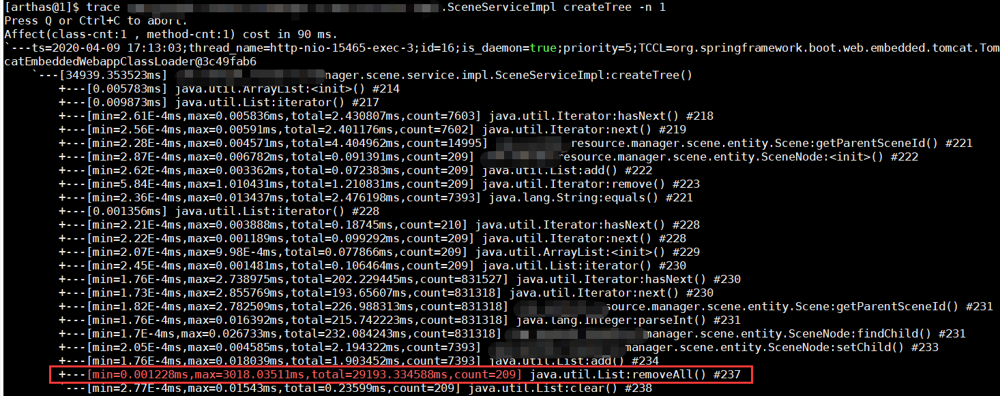
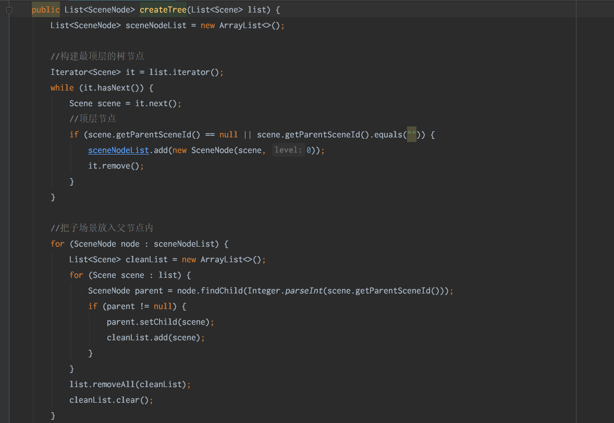
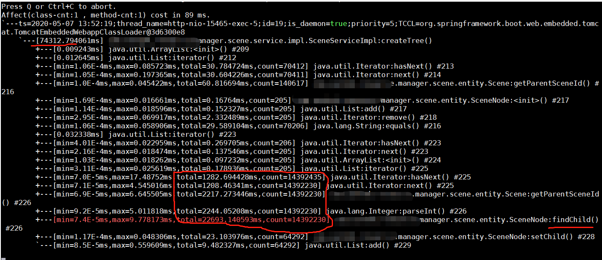
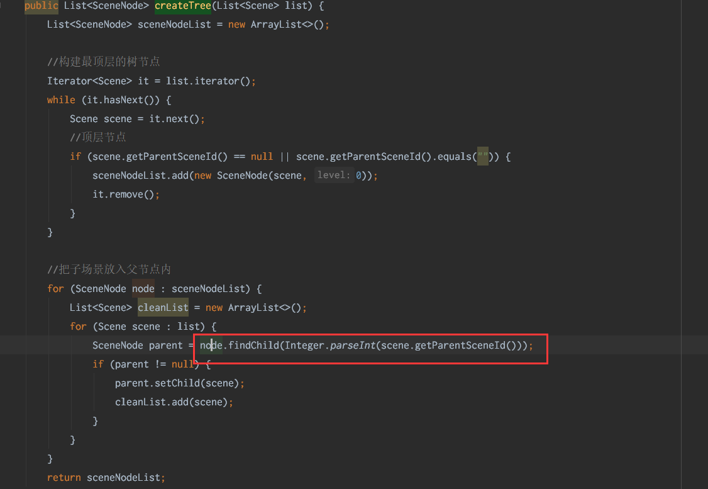
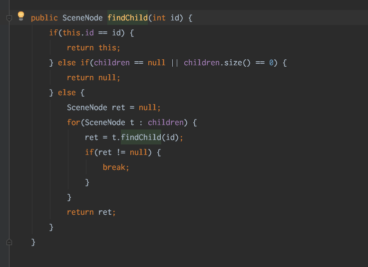

最近指导年轻同事做性能优化的经过。
<!-- more -->

# retainAll 对集合求交集优化

最先处理的是一个java方法调用很慢。


具体参见：
- [java-retainAll-interset](/posts/java-retainAll-interset)

# 批量操作优化

定位入口方法





## redis hash 批量读读取

从耗时大头的`getDevicesBitMapIdByOrgCode`入手





里面的大头是`getDevicesByVirtualOrgCode`





里面的大头是`getDeviceByGroupOrgCodeWithString`。这个方法被循环调用次数非常多。


整个操作里面，访问redis是耗时操作。


解决思路是使用批量读取。redis本来就支持一次读取hash的多个field：
```java
/**
 * Get values for given {@code hashKeys} from hash at {@code key}.
 *
 * @param key must not be {@literal null}.
 * @param hashKeys must not be {@literal null}.
 * @return {@literal null} when used in pipeline / transaction.
 */
List<HV> multiGet(H key, Collection<HK> hashKeys);
```

一顿修改之后，访问redis耗时降低到1ms左右。但是接口整体还是很慢。

## 多次全表扫描

继续调查，发现了坑爹的事情。


这是从数据库捞取所有行政区划，再组装为树。

问题是，这个接口被反复调用。每次都full table scan，多次捞取全量数据，不慢才怪。
其实外层一次操作之中，这个树结构应该看成固定不变的。

优化：
1. 只计算一次树结构
2. 新增接口，接受1)的树作为参数，避免反复读取数据库计算
3. 使用2)的接口，重构原有调用

这下耗时进一步缩减，非常可观（当时忘了截图）。

## 增加必要的索引

捞取一批行政区划，还是很慢，最后发现是漏掉索引。


## 潜在的并发优化

之前的图发现`getUserInfo()`有点慢，有时候要300ms。


这个接口要串行读取3次db。
继续trace（不贴图了），发现3个请求耗时比较相近。
另外这个接口流量很少（因此做并发优化对db影响很少）。
因此可以考虑做个并发优化，同时发起这3个db请求，再汇总结果。


## 去掉频繁访问 List.removeAll()

这个接口功能很简单，把一堆节点构建成一棵树，结果用8000个节点测试就产生严重的性能问题。








代码简单。先找到并且标记一级节点。然后再遍历找到各级节点。
因为传入的列表可能很大，原来的作者做了一个“优化”：找到一颗子树之后，把这些节点从原来列表删除，减少下次遍历的数量。
看起来合理，但是List类型要删除一个节点，先要遍历检查，标记，然后新建数组复制目标结果（见`batchRemove`的实现）。

优化：
- 去掉删除removeAll()调用

效果：
- 相同数据量，原来30s+返回，现在0.5s返回

## 小结

到此接口整体性能在500ms~1000ms，对于管理系统来说，已经够用了。

优化过程：
- trace定位耗时操作
- 求交集，把List改成Set数据结构再操作
- redis hash 支持批量读取field。（但是要控制一次读取field数量）。
- 对于一次调用不变的数据，可以在外围计算一次，并且作为参数，给其他接口使用（避免反复计算产生IO、cpu消耗）。
- 建立必要的索引。
- 并发优化访问数据库（未实施）

# 减少操作的数据量

背景：在页面上修改角色和权限的映射，保存的时候很慢。

先trace入口方法：


最后发现是批量插入很慢：


对于mysql批量写入操作很慢，条件反射是一条一条数据操作，即
```
for x in batch_data:
    mysql.insert(x);
```

但确认是真正的batch insert：
```sql
insert into table_name (c1, c2, .., cn) values
(x1), (x2), .., (xn);
```

于是查了一下数据量


这个角色管关联8000多设备权限。按照mysql单节点8K~12K insert tps来算，这个时间是正常的。

但问题是，如果我只增加、删除一个设备权限，还是要这么慢，还是操作了这么多数据。
这就有问题了。打开源码一看：


后端直接接受前端传来的全量权限映射，哪怕修改一个设备权限，都要全量操作数据库。

这是设计上不合理：
- 前后端应该只关注本次操作权限的差集部分
- 后端对差集部分进行落盘

但是API接口改动涉及前后端，这次可以只修改后端实现。
考虑到现场操作场景，没有并发修改。因此可以先load数据，找到差集，再修改。这样真正落盘的数据就会减少很多。

（其实这个走了弯路。一开始直接看源码都可以解决问题）

优化结果：
- 一个角色第一次大量关联设备权限还是会很慢。（通过告诉交付人员分批操作解决）
- 后续关联操作就很快。

# 递归改非递归

背景：
- 目录树返回，需要70+s。
- 目录项有7w多。
- 采用递归方式构建目录树。











这个功能原本设计是给几百、最多几千个目录项使用，最初使用递归方式构建树。但是实际上现场已经有几万数据。从trace图可以看到，递归调用了140+W次，非常缓慢。

解决方法是，采用非递归方式构建，思路是先构建顶层树，然后为每个节点增加id索引、并且添加到map，通过map查找对应节点，避免递归查找。

```java
    public List<SceneNode> createTree(List<Scene> list) {
        List<SceneNode> sceneNodeList = new ArrayList<>();

        // 根据 parent scene id 分组
        // key: parent scene id
        // value: scene
        // 注意：groupingBy方法不支持null key
        Map<String, List<Scene>>  sceneGroupByMap= list.stream().collect(Collectors.groupingBy(Scene::getParentSceneId));
        if(sceneGroupByMap==null || sceneGroupByMap.isEmpty()){
            return sceneNodeList;
        }

        // 辅助索引，快速找到
        // key: scene id
        // val: scene node
        Map<String, SceneNode> indexMap=new HashMap<>(1024);

        // 顶级节点
        if(sceneGroupByMap.get("")!=null){
            sceneGroupByMap.get("").forEach(scene->{
                SceneNode t=new SceneNode(scene, 0);
                sceneNodeList.add(t);
                indexMap.put(scene.getSceneId(), t);
            });
            sceneGroupByMap.remove("");
        }

        // 各级节点
        List<String> cleanList=new ArrayList<>();

        while(!sceneGroupByMap.isEmpty()){
            sceneGroupByMap.entrySet().stream().forEach(item->{
                if(indexMap.containsKey(item.getKey())){
                    SceneNode parentNode= indexMap.get(item.getKey());
                    for(Scene childScene: item.getValue()){
                        SceneNode child= parentNode.setChild(childScene);
                        indexMap.put(child.getId()+"", child);
                    }

                    cleanList.add(item.getKey());
                }
            });
            cleanList.forEach(i-> sceneGroupByMap.remove(i));
            cleanList.clear();
        }


        return sceneNodeList;
    }
```

效果：
- 7w数据，后端优化后耗时2s。勉强能接受。
- 但是前端dom解析撑不住了。

后续：
根据现场反馈，是数据会增长到百万级别😥。
只能重新设计：根据父节点，返回直接子节点，分层展示。