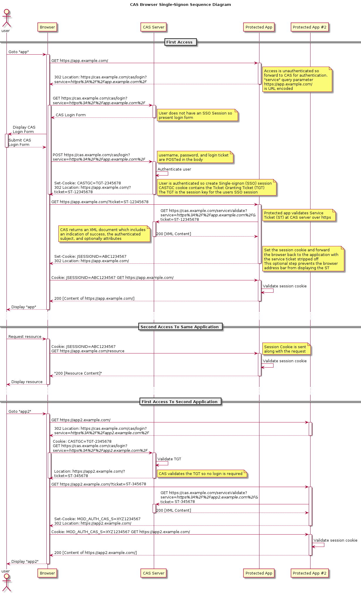

基于cas server 4.x 代码以及CAS 1.0协议。

# 背景

单点登录（Single Sign On）在多个应用系统中，用户只需要登录一次就可以访问所有相互信任的应用系统。
CAS（Central Authentication Service），中央认证服务，一个开源的SSO框架。

<!-- more -->

# CAS ticket相关概念

## TGT （Ticket Grangting Ticket）

TGT是CAS为用户签发的登录票据，拥有了TGT，用户就可以证明自己在CAS成功登录过。
用户在CAS认证成功后，生成一个TGT对象，放入自己的缓存，同时生成TGC cookie，写入浏览器。TGT对象的ID就是cookie的值。

## TGC （Ticket Granting Cookies）

存放用户身份认证凭证的cookie，在浏览器和CAS Server间通讯时使用。
当HTTP再次请求，如果传过来 CAS生成的cookie，则CAS以此cookie值为key查询缓存中有无TGT，如果有的话，则说明用户之前登录过，如果没有，则用户需要重新登录。

## ST（Service Ticket）

ST是CAS为用户签发的访问某一service的票据。用户访问service时，service发现用户没有ST，则要求用户去CAS获取ST。
用户向CAS发出获取ST的请求，如果用户的请求中包含cookie，则CAS会以此cookie值为key查询缓存中有无TGT，如果存在TGT，则用此TGT签发一个ST，返回给用户。
用户凭借ST去访问service，service拿ST去CAS验证，验证通过后，允许用户访问资源。

## 小结

- TGT：在CAS登录后，server端保留的凭证。
- TGC：登录后的cas server cookies。根据TGC反查TGT，判断用户是否登录。
- ST：一次性使用，service拿ST去CAS验证。

# CAS 登录流程

图片来源自官网。

TLDR：app先检查JSESSIONID有效性。如果session无效，则检查有无ST。有ST则去CAS server校验ST有效性；没有ST则告诉客户端去CAS server登录。

留意登录流程的302响应和cookies变化。

1. 未登录的用户访问受保护的资源。
2. 第一个302： app发现用户未验证。app通过返回302响应，把cas登录地址、访问servcie（作为url参数）告诉浏览器。
3. 浏览器处理302响应，重定向到cas登录页。
4. 用户登录。
5. 第二个302： CAS server验证用户登录成功，生成了TGT，并且向客户端写入TGC cookies。同时返回302， 告诉浏览器要跳转的（service）地址，并且携带service ticket。
6. 浏览器处理302响应，访问目标app（第1步访问的资源）。
7. app向CAS server验证ST的有效性。
8. 第三个302： ST验证成功后，app为用户创建session。JSESSIONID写入cookies，返回302告诉浏览器要跳转的地址。
9. 浏览器处理302响应，携带JSESSIONID访问app目标路径。
10. app检验session有效性，返回响应。

当浏览器登录cas后，第一次访问另一个受保护的app2：
1. 浏览器访问app2，这时候没有app2的JSESSION。
2. 第一个302： app2告诉浏览器重定向到CAS server登录，以及要访问的service。
3. 因为之前在CAS server登录过（假设登录未过期），再次访问CAS server，**携带了TGC cookies**。
4. 第二个302： CAS server根据TGC，验证了TGT有效，告诉浏览器重定向到目标service，并且为要访问的service颁发ST。
5. 接下来app2验证ST有效，创建session，重定向，blablabla。。。

留意cookies的作用域：
- TGC cookies默认有效域是`/cas`。
- app有效域是`/app`。
- app2有效域是`/app2`。
不同app根据各自的JESSIONID判定登录状态。
如果多个app的context-root相同，则JSESSIONID会被相互覆盖！

留意访问cas server登录的url，service写在url参数上。

一个有效的TGC cookies，可以在多个app创建session。

# ajax和302问题

请求分为普通请求（HttpRequest）和Ajax请求（XMLHttpRequest）。
ajax请求跨域的时候，默认不会携带cookie。
在做前端后端接入cas，前端使用ajax发送请求，遇到问题：ajax请求处理不了302响应，导致cas server返回的重定向跳转无法被正确处理。

具体方案以后文章再展开。

