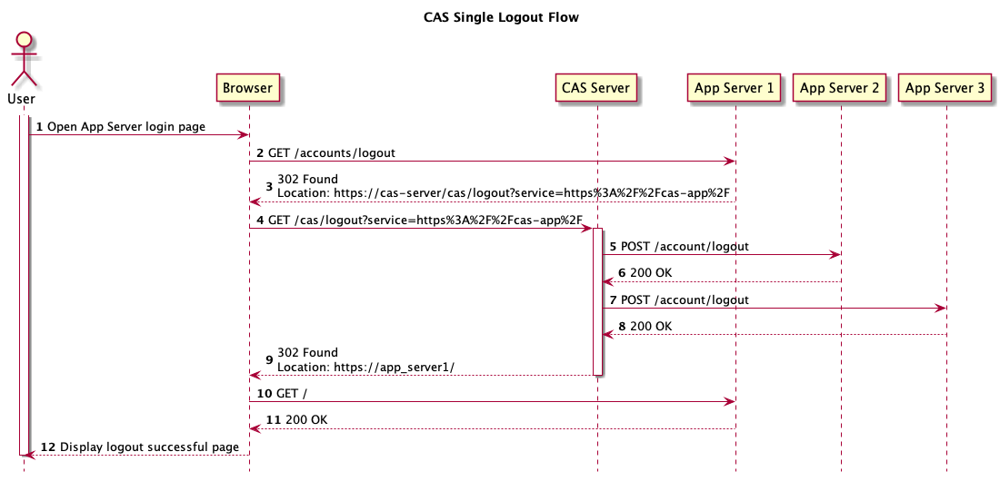
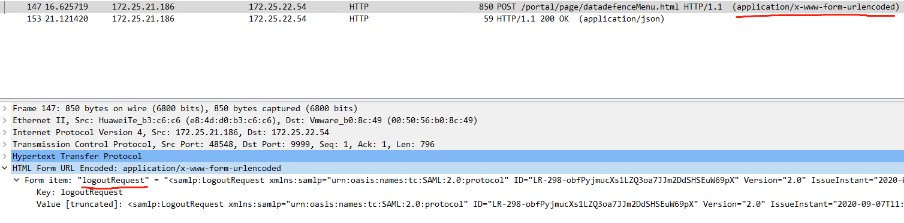
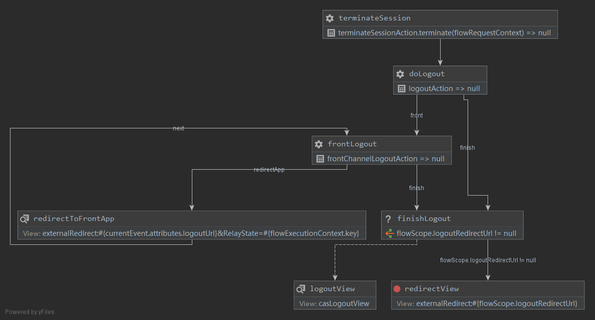

前台应用被客户发现单点退出服务不生效，又丢到架构部处理。结果发现了祖传代码的问题😂。
基于CAS server 4.1.x。
<!-- more -->

# 问题排查

这是tomcat war应用。发现使用祖传的tomcat cas client。
祖传自定义的logout handler：
```java
public class SimpleURILogoutHandler extends AbstractLogoutHandler {
    
    public SimpleURILogoutHandler(String casServer) {
        this(casServer, "/logout", "/logout");
    }

    public void logout(HttpServletRequest request, HttpServletResponse response) {
        HttpSession session = request.getSession();
        if (session != null) {
            session.invalidate();
        }
        AuthenticationUtil.removeAuthenticatedCookie(request, response);
        super.logout(request, response);
    }
```

失效session之后，使用父类的logout能力`org.jasig.cas.client.tomcat.AbstractLogoutHandler`：
```java
public abstract class AbstractLogoutHandler implements LogoutHandler {

    public void logout(final HttpServletRequest request, final HttpServletResponse response) {
        logger.debug("Processing logout request from CAS server.");

        final Assertion assertion;
        final HttpSession httpSession = request.getSession(false);
        if (httpSession != null
                && (assertion = (Assertion) httpSession.getAttribute(AbstractCasFilter.CONST_CAS_ASSERTION)) != null) {
            httpSession.removeAttribute(AbstractCasFilter.CONST_CAS_ASSERTION);
            logger.info("Successfully logged out {}", assertion.getPrincipal());
        } else {
            logger.info("Session already ended.");
        }

        final String redirectUrl = constructRedirectUrl(request);
        if (redirectUrl != null) {
            logger.debug("Redirecting to {}", redirectUrl);
            CommonUtils.sendRedirect(response, redirectUrl);
        }
    }    
```

从上面流程来看，自定义的logout handler占用了`/logout`入口。它的登出只做了2件事情：
- 使session失效
- 发送重定向

少了通知cas server做单点登出动作！这就是没有实现单点登出的原因。

# CAS单点登出原理

CAS官方的单点登出流程图如下。





当一个web浏览器要求退出应用服务器，应用服务器application会把url重定向到CAS server上的`/cas/logout`。
然后cas server向各个服务发出logout请求。

很明显要解决的问题：
1. 从应用logout怎么重定向到cas server的logout？
2. cas server怎么知道要把这个session关联的其他应用也logout？

在深入之前，先介绍2个概念；CAS定义了2种单点登出方式：
1. Back Channel
CAS服务端直接向各服务客户端发送HTTP POST消息。这是向服务执行通知的传统方式。
2. Front Channel
CAS 通过一个GET请求，通过JSONP去验证各客户端服务，来使得各客户端的session无效。
注意：该方式不一定适用所有客户端，必须要确保客户端支持该方式。

CAS单点注销请求默认是在后台通过logoutType的属性配置好了的，默认为LogoutType.BACK_CHANNEL。

# 解决方案

官方SLO方式，使用SingleSignOutFilter。
在web.xml增加：
```xml
<filter>
   <filter-name>CAS Single Sign Out Filter</filter-name>
   <filter-class>org.jasig.cas.client.session.SingleSignOutFilter</filter-class>
</filter>
<filter-mapping>
   <filter-name>CAS Single Sign Out Filter</filter-name>
   <url-pattern>/*</url-pattern>
</filter-mapping>
<listener>
    <listener-class>org.jasig.cas.client.session.SingleSignOutHttpSessionListener</listener-class>
</listener>
```
SLO filter要配置在SSO filter之前！
SLO filter要配置在SSO filter之前！
SLO filter要配置在SSO filter之前！

SingleSignOutHttpSessionListener则是清理session，避免内存泄漏。


# 源码分析

## cas client

SingleSignOutFilter的核心逻辑由SingleSignOutHandler负责。

```java
public final class SingleSignOutHandler {

    public boolean process(final HttpServletRequest request, final HttpServletResponse response) {
        if (isTokenRequest(request)) {
            logger.trace("Received a token request");
            recordSession(request);
            return true;
        } 
        
        if (isLogoutRequest(request)) {
            logger.trace("Received a logout request");
            destroySession(request);
            return false;
        } 
        logger.trace("Ignoring URI for logout: {}", request.getRequestURI());
        return true;
    }
```

如果是token request，则记录token和session的映射。
```java
    private void recordSession(final HttpServletRequest request) {
        final HttpSession session = request.getSession(this.eagerlyCreateSessions);

        if (session == null) {
            logger.debug("No session currently exists (and none created).  Cannot record session information for single sign out.");
            return;
        }

        final String token = CommonUtils.safeGetParameter(request, this.artifactParameterName, this.safeParameters);
        logger.debug("Recording session for token {}", token);

        try {
            this.sessionMappingStorage.removeBySessionById(session.getId());
        } catch (final Exception e) {
            // ignore if the session is already marked as invalid. Nothing we can do!
        }
        // 划重点
        sessionMappingStorage.addSessionById(token, session);
    }
```

如果是logout request，则销毁session。
```java
    private void destroySession(final HttpServletRequest request) {
        // logoutRequest是post请求，从form body解析。
        String logoutMessage = CommonUtils.safeGetParameter(request, this.logoutParameterName, this.safeParameters);
        if (CommonUtils.isBlank(logoutMessage)) {
            logger.error("Could not locate logout message of the request from {}", this.logoutParameterName);
            return;
        }
        
        // logoutMessage可能是 base64+deflate 处理过
        if (!logoutMessage.contains("SessionIndex")) {
            logoutMessage = uncompressLogoutMessage(logoutMessage);
        }
        
        logger.trace("Logout request:\n{}", logoutMessage);
        // 解析SessionIndex
        final String token = XmlUtils.getTextForElement(logoutMessage, "SessionIndex");
        if (CommonUtils.isNotBlank(token)) {
            final HttpSession session = this.sessionMappingStorage.removeSessionByMappingId(token);

            if (session != null) {
                final String sessionID = session.getId();
                logger.debug("Invalidating session [{}] for token [{}]", sessionID, token);

                try {
                    session.invalidate();
                } catch (final IllegalStateException e) {
                    logger.debug("Error invalidating session.", e);
                }
                this.logoutStrategy.logout(request);
            }
        }
    }
```
cas server向client发送的logout request，是一个POST请求，并且是form编码，包含一个key为`logoutRequest`。

从抓包看就很清楚。这里186是cas server，54是cas client。
在cas server上执行（为了简化，只关注对cas client的出站流量）：
```
tcpdump -nn -A -i enp2s0f0 '((tcp) and ( (dst host 172.25.22.54) ))' -w logout.cap
```





## cas server

cas server使用spring webflow控制流程。从`logout-webflow.xml`看流程：





第一个入口类是LogoutAction。
```java
public final class LogoutAction extends AbstractLogoutAction {

    protected Event doInternalExecute(final HttpServletRequest request, final HttpServletResponse response,
            final RequestContext context) throws Exception {

        boolean needFrontSlo = false;
        putLogoutIndex(context, 0);
        final List<LogoutRequest> logoutRequests = WebUtils.getLogoutRequests(context);
        if (logoutRequests != null) {
            for (final LogoutRequest logoutRequest : logoutRequests) {
                // if some logout request must still be attempted
                // 只要有一个请求为未处理，则执行SLO
                if (logoutRequest.getStatus() == LogoutRequestStatus.NOT_ATTEMPTED) {
                    needFrontSlo = true;
                    break;
                }
            }
        }

        // 从logout请求中提取sevice字段
        final String service = request.getParameter("service");
        if (this.followServiceRedirects && service != null) {
            // 从service找到对应应用
            final Service webAppService = new SimpleWebApplicationServiceImpl(service);
            final RegisteredService rService = this.servicesManager.findServiceBy(webAppService);

            if (rService != null && rService.getAccessStrategy().isServiceAccessAllowed()) {
                context.getFlowScope().put("logoutRedirectUrl", service);
            }
        }

        // there are some front services to logout, perform front SLO
        if (needFrontSlo) {
            // 需要front logout
            return new Event(this, FRONT_EVENT);
        } else {
            // otherwise, finish the logout process
            return new Event(this, FINISH_EVENT);
        }
    }    

```

LogoutAction的核心流程：
1. 如果有一个logout request为未处理（`LogoutRequestStatus.NOT_ATTEMPTED`），则需要单点登出SLO。
2. 从request中找到service参数，以及对应的应用。如果找到，则把service放进webflow的上下文变量`logoutRedirectUrl`。
3. 对于front SLO，则执行front logout动作。

FrontChannelLogoutAction也是使用SAML协议发送logoutRequest。

server端销毁ticket的入口在`CentralAuthenticationService`：
```java
public final class CentralAuthenticationServiceImpl implements CentralAuthenticationService {

    public List<LogoutRequest> destroyTicketGrantingTicket(@NotNull final String ticketGrantingTicketId) {
        try {
            logger.debug("Removing ticket [{}] from registry...", ticketGrantingTicketId);
            final TicketGrantingTicket ticket = getTicket(ticketGrantingTicketId, TicketGrantingTicket.class);
            logger.debug("Ticket found. Processing logout requests and then deleting the ticket...");
            final List<LogoutRequest> logoutRequests = logoutManager.performLogout(ticket);
            this.ticketRegistry.deleteTicket(ticketGrantingTicketId);

            return logoutRequests;
        } catch (final InvalidTicketException e) {
            logger.debug("TicketGrantingTicket [{}] cannot be found in the ticket registry.", ticketGrantingTicketId);
        }
        return Collections.emptyList();
    }

```

LogoutManagerImpl负责构造logout消息、执行logout动作。
```java
    public List<LogoutRequest> performLogout(final TicketGrantingTicket ticket) {
        final Map<String, Service> services = ticket.getServices();
        final List<LogoutRequest> logoutRequests = new ArrayList<>();
        // if SLO is not disabled
        if (!this.singleLogoutCallbacksDisabled) {
            // through all services
            for (final Map.Entry<String, Service> entry : services.entrySet()) {
                // it's a SingleLogoutService, else ignore
                final Service service = entry.getValue();
                if (service instanceof SingleLogoutService) {
                    final LogoutRequest logoutRequest = handleLogoutForSloService((SingleLogoutService) service, entry.getKey());
                    if (logoutRequest != null) {
                        LOGGER.debug("Captured logout request [{}]", logoutRequest);
                        logoutRequests.add(logoutRequest);
                    }
                }
            }
        }

        return logoutRequests;
    }


    private LogoutRequest handleLogoutForSloService(final SingleLogoutService singleLogoutService, final String ticketId) {
        if (!singleLogoutService.isLoggedOutAlready()) {

            final RegisteredService registeredService = servicesManager.findServiceBy(singleLogoutService);
            if (serviceSupportsSingleLogout(registeredService)) {

                final URL logoutUrl = determineLogoutUrl(registeredService, singleLogoutService);
                final DefaultLogoutRequest logoutRequest = new DefaultLogoutRequest(ticketId, singleLogoutService, logoutUrl);
                final LogoutType type = registeredService.getLogoutType() == null
                        ? LogoutType.BACK_CHANNEL : registeredService.getLogoutType();

                switch (type) {
                    // back_channel是http post请求
                    case BACK_CHANNEL:
                        if (performBackChannelLogout(logoutRequest)) {
                            logoutRequest.setStatus(LogoutRequestStatus.SUCCESS);
                        } else {
                            logoutRequest.setStatus(LogoutRequestStatus.FAILURE);
                            LOGGER.warn("Logout message not sent to [{}]; Continuing processing...", singleLogoutService.getId());
                        }
                        break;
                    default:
                    // front_channel是http get请求
                        logoutRequest.setStatus(LogoutRequestStatus.NOT_ATTEMPTED);
                        break;
                }
                return logoutRequest;
            }

        }
        return null;
    }

```


在client源码分析看到，server端构造一个logoutRequest，携带要登出的session id。
构造saml格式的logout message：
```java

public final class SamlCompliantLogoutMessageCreator implements LogoutMessageCreator {

    /** The logger. */
    private static final Logger LOGGER = LoggerFactory.getLogger(SamlCompliantLogoutMessageCreator.class);
    
    /** A ticket Id generator. */
    private static final UniqueTicketIdGenerator GENERATOR = new DefaultUniqueTicketIdGenerator();

    /** The logout request template. */
    private static final String LOGOUT_REQUEST_TEMPLATE =
            "<samlp:LogoutRequest xmlns:samlp=\"urn:oasis:names:tc:SAML:2.0:protocol\" ID=\"%s\" Version=\"2.0\" "
            + "IssueInstant=\"%s\"><saml:NameID xmlns:saml=\"urn:oasis:names:tc:SAML:2.0:assertion\">@NOT_USED@"
            + "</saml:NameID><samlp:SessionIndex>%s</samlp:SessionIndex></samlp:LogoutRequest>";

    @Override
    public String create(final LogoutRequest request) {
        final String logoutRequest = String.format(LOGOUT_REQUEST_TEMPLATE, GENERATOR.getNewTicketId("LR"),
                new ISOStandardDateFormat().getCurrentDateAndTime(), request.getTicketId());
        
        LOGGER.debug("Generated logout message: [{}]", logoutRequest);
        return logoutRequest;
    }
    
}
```

抠出来来看。
```xml
<samlp:LogoutRequest ID="[RANDOM ID]" Version="2.0" IssueInstant="[CURRENT DATE/TIME]">
<saml:NameID>@NOT_USED@</saml:NameID>
<samlp:SessionIndex>[SESSION IDENTIFIER]</samlp:SessionIndex>
</samlp:LogoutRequest>
```
划重点：**SessionIndex**字段携带了session标记，实际是`request.getTicketId()`，是service ticket id。
对应于client端的`SingleSignOutHandler#destroySession()`。


# 参考资料

[Java Apereo CAS Client](https://github.com/apereo/java-cas-client)。
后来发现这里有官方cas client的集成方式，包括单点登录和单点登出。

