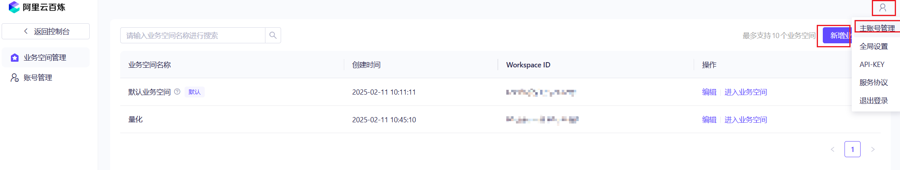
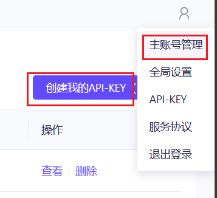
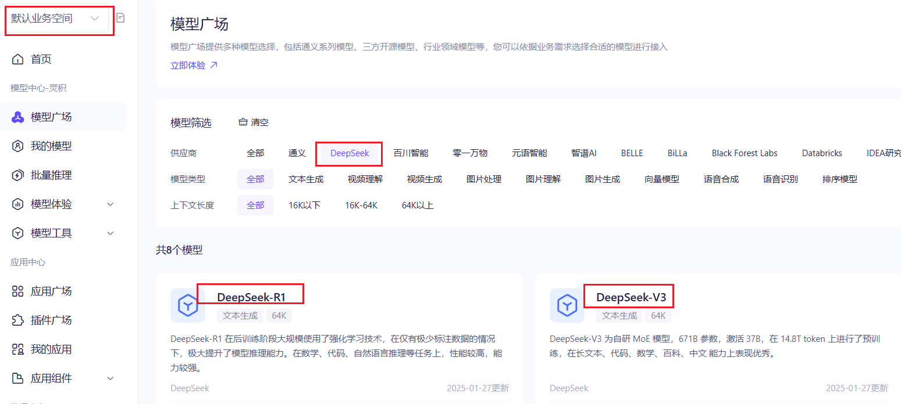
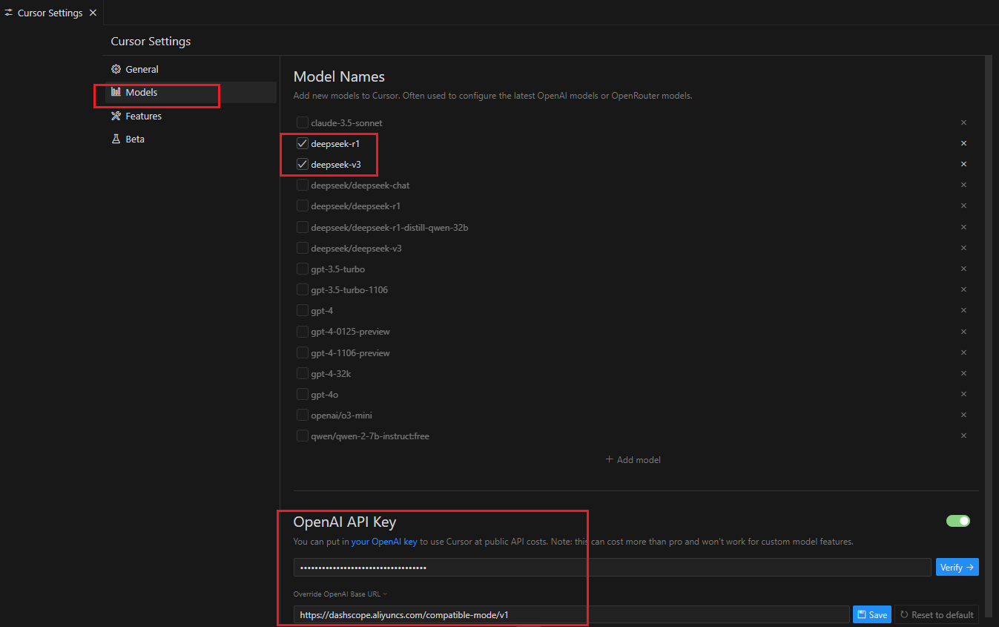

阿里云百炼提供DeepSeek-V3和DeepSeek-R1满血版各自提供了高达100万免费tokens的使用额度，有效期6个月。

# 百炼创建子空间



# 创建api key



# 授权deepseek模型访问



查看然后`查看详情`，最末尾`授权`到子空间。

# 在cursor ide中配置



添加模型：
```
deepseek-r1
deepseek-v3
```

覆盖OpenAI接口地址：
```
https://dashscope.aliyuncs.com/compatible-mode/v1
```

填入百炼授权的api key。

关键的一步：取消选择其他模型。

默认Verify的时候，会使用`gpt4-o`去测试，导致报错。

# 参考

- [DeepSeek全尺寸模型上线阿里云百炼！](https://developer.aliyun.com/article/1651668)
- [Invalid openAI API Key](https://forum.cursor.com/t/invalid-openai-api-key/36401)
