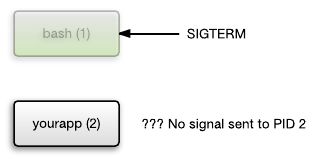

# 僵尸进程、PID 1进程

推荐阅读这篇文章，快速了解僵尸进程、pid 1进程：
- [Docker and the PID 1 zombie reaping problem](https://blog.phusion.nl/2015/01/20/docker-and-the-pid-1-zombie-reaping-problem/)

在unix系列系统，父进程应该等待子进程结束（waitpid系统调用）：
>Unix is designed in such a way that parent processes must explicitly "wait" for child process termination, in order to collect its exit status.
<!-- more -->


当子进程结束，会向父进程发送SIGCHLD信号，通知父进程回收


会有一种异常情况，父进程在子进程结束之前被杀死，那么这个子进程会被pid 1进程管理：


在docker中，如果使用bash作为pid 1进程，那么向容器发送SIGTERM信号，bash退出了，但是没有向子进程传递信号、等待子进程关闭，导致形成僵尸进程





PID 1有一个独特的职责，那就是收割“僵尸进程”。init进程周期执行wait系统调用reap其所收养的所有僵尸进程。

那么what is 僵尸进程：
- 已经退出
- 父进程也退出
- 没有被其父进程wait（wait是指syscall父进程用于检索其子进程的退出代码）

>from a Unix operating system point of view -- zombie processes have a very specific definition. They are processes that have terminated but have not (yet) been waited for by their parent processes.


init进程的职责：向子进程发送信号，同时等待子进程结束：
>Sending signals to child processes is not enough: the init process must also wait for child processes to terminate, before terminating itself. If the init process terminates prematurely then all children are terminated uncleanly by the kernel.

僵尸进程的危害：消耗PID空间。
僵尸进程被reap后，其进程号与在进程表中的表项都可以被系统重用。但如果父进程没有调用wait，僵尸进程将保留进程表中的表项，导致资源泄漏。

如何处理僵尸进程
>父进程捕获SIGCHLD信号，并调用wait或waitpid。

什么是SIGCHLD？来自百度：
>在一个进程终止或者停止时，将SIGCHLD信号发送给其父进程。按系统默认将忽略此信号。如果父进程希望被告知其子系统的这种状态，则应捕捉此信号。信号的捕捉函数中通常调用wait函数以取得进程ID和其终止状态。

如何避免僵尸进程？（来自文章：[linux下的僵尸进程处理SIGCHLD信号](https://www.cnblogs.com/wuchanming/p/4020463.html)）
- 通过signal(SIGCHLD, SIG_IGN)通知内核对子进程的结束不关心，由内核回收。如果不想让父进程挂起，可以在父进程中加入一条语句：signal(SIGCHLD,SIG_IGN);表示父进程忽略SIGCHLD信号，该信号是子进程退出的时候向父进程发送的。
- 父进程调用wait/waitpid等函数等待子进程结束，如果尚无子进程退出wait会导致父进程阻塞。waitpid可以通过传递WNOHANG使父进程不阻塞立即返回。
- 如果父进程很忙可以用signal注册信号处理函数，在信号处理函数调用wait/waitpid等待子进程退出。
- 通过两次调用fork。父进程首先调用fork创建一个子进程然后waitpid等待子进程退出，子进程再fork一个孙进程后退出。这样子进程退出后会被父进程等待回收，而对于孙子进程其父进程已经退出所以孙进程成为一个孤儿进程，孤儿进程由init进程接管，孙进程结束后，init会等待回收。


SIG_IGN又是什么？
>`signal.h`中的宏定义`SIG_DFL`及`SIG_IGN`
>SIG_DFL, SIG_IGN 分别表示无返回值的函数指针，指针值分别是0和1，这两个指针值逻辑上讲是实际程序中不可能出现的函数地址值。
>SIG_DFL：默认信号处理程序
>SIG_IGN：忽略信号的处理程序

ps. defunct: 死了的；不存在的

# docker容器和信号处理

Docker 的 stop 和 kill 命令都是用来向容器发送信号的。注意，只有容器中的 1 号进程能够收到信号。
>stop 命令会首先发送 SIGTERM 信号，并等待应用优雅的结束。默认是等待10s，可以通过`-t <seconds>`设置等待时间；如果发现应用没有结束(用户可以指定等待的时间)，就再发送一个 SIGKILL 信号强行结束程序。
>
>kill 命令默认发送的是 SIGKILL 信号，当然你可以通过 -s 选项指定任何信号。

如果PID 1不处理信号传递，那么由PID 1启动的子进程将不能接收docker发送的信号（比如bash作为ENTRYPOINT入口）。

# 案例一： 非PID 1的ENTRYPOINT进程不能正确处理SIGTERM

Dockerfile
```Dockerfile
FROM alpine:3.11.6
MAINTAINER ycwu

ADD t.sh .
RUN chmod u+x t.sh
# 使用
ENTRYPOINT ["./t.sh"]
```

其中`t.sh`文件
```sh
#! /bin/sh

for x in `seq 1 1000`
do
  echo $x
  sleep 1
done
```
然后构建镜像。

第一个窗口执行
```sh
[root@host143 ycwu]# docker run -it --name  test  ycwu/ycwu-alpine:v1 
1
2
3
4
```

第二个窗口执行
```sh
[root@host143 ~]# docker exec -it test top
Mem: 16025852K used, 224024K free, 54120K shrd, 40K buff, 4391664K cached
CPU:   7% usr  10% sys   0% nic  82% idle   0% io   0% irq   0% sirq
Load average: 0.02 0.04 0.05 3/1192 66
  PID  PPID USER     STAT   VSZ %VSZ CPU %CPU COMMAND
    1     0 root     S     1584   0%   0   0% {t.sh} /bin/sh ./t.sh
   61     0 root     R     1568   0%   1   0% top
   66     1 root     S     1560   0%   2   0% sleep 1

# shell脚本以/bin/sh解析

[root@host143 ~]# docker stop test
# stop 命令会首先发送 SIGTERM 信号，并等待应用优雅的结束。如果发现应用没有结束(用户可以指定等待的时间)，就再发送一个 SIGKILL 信号强行结束程序。
# 在此期间窗口一继续输出数字。
# sleep本身支持响应SIGTERM信号，但是外层的sh并没有传递信号。
```


# tini

tini是一个极简的init程序。使用tini的好处：
- 避免产生僵尸进程
- 为docker容器提供默认的信号处理器，能够处理SIGTERM


tini原理：
>After spawning your process, Tini will wait for signals and forward those to the child process, and periodically reap zombie processes that may be created within your container.
>
>When the "first" child process exits (/your/program in the examples above), Tini exits as well, with the exit code of the child process (so you can check your container's exit code to know whether the child exited successfully).


tini使用tips：
1. Tini在退出时会重复使用子进程的退出代码。可以使用`-e`把任意子进程的exit code重新映射为0。
```Dockerfile
ENTRYPOINT ["/tini", "-v", "-e", "143", "--", "your_app"]
```

2. Tini可以使用`-v`、`-vv`、`-vvv`输出更多的debug信息。

3. Tini可以结合`docker-entrypoint.sh`使用。
```Dockerfile
ENTRYPOINT ["/tini", "--", "/docker-entrypoint.sh"]
```

4. Subreaping问题。
默认情况下tini应该作为PID 1进程，这样能够回收僵尸进程。如果tini不能作为PID 1进程，则可以使用`-s`参数：
- `tini -s -- `


# tini和`docker --init`关系

>NOTE: If you are using Docker 1.13 or greater, Tini is included in Docker itself. This includes all versions of Docker CE. To enable Tini, just pass the --init flag to docker run.
>`--init`: Run an init inside the container that forwards signals and reaps processes

docker 1.13以后内置了tini，通过`--init`启动。
用docker时，如果不加 `--init` 参数，容器中的1号进程就是所给的ENTRYPOINT，而加上 `--init` 之后，1号进程就会是 tini。
tini 进程能够将终止信号转发给其子进程, 同时能reap子进程, 不会出现因孤儿进程导致的线程句柄无法回收情形。

# 案例二： docker init和信号处理

这里使用docker CE 19.03.5。
还是上面的镜像，但是启动时候加上`--init`:
```sh
[root@host143 ~]# docker run -it --init  ycwu/ycwu-alpine:v1

[root@host143 ~]# docker exec -it 9da ps aux
PID   USER     TIME  COMMAND
    1 root      0:00 /sbin/docker-init -- ./t.sh
    6 root      0:00 {t.sh} /bin/sh ./t.sh
   66 root      0:00 sleep 1
   67 root      0:00 ps aux
```
加上`--init`之后，PID 1 进程变成了`/sbin/docker-init `，并且由它来执行ENTRYPOINT指定的脚本。

第二个窗口执行：
```sh
[root@host143 ~]# docker stop  9da 
9da
```
第一个窗口立即退出了。因此SIGTERM信号能够正确传播到`./t.sh`。


# 使用tini向前兼容

为docker 1.13以前版本增加tini支持，比如在alpine基础镜像：
```Dockerfile
RUN apk add --no-cache tini bash
ENTRYPOINT ["/tini", "--", "/docker-entrypoint.sh"]
```

# 案例三： java容器化

在容器中通过自定义脚本启动java应用，
```Dockerfile
ENTRYPOINT ["./run.sh"]
```
init进程是sh或者bash，处理了SIGTERM，但是没有传播到里面启动的java进程；这就导致了java不能正常接收docker发出的SIGTERM，不能实现优雅关闭。

如果直接使用java作为init进程，则可以接收docker发送的信号：
```Dockerfile
ENTRYPOINT ["java", "-jar", ...]
```
但是openjdk对于java作为init进程有点bug：[jmap not happy on alpine #76](https://github.com/docker-library/openjdk/issues/76)。

现在可以简单地使用`docker --init`或者tini，避免java作为PID 1进程；解决了僵尸进程、信号处理、openjdk工具bug问题。

# 其他init进程方案

例如sysvinit、upstart、systemd、supervisord。
但是相比tini，都很重型。
TODO：后续了解这些方案。

# 小结

- docker 1.13以后，集成了tini。`docker --init`把PID 1进程修改为`/sbin/docker-init --`
- docker 1.13以前，可以手动在镜像安装tini

# 参考

- [Docker and the PID 1 zombie reaping problem](https://blog.phusion.nl/2015/01/20/docker-and-the-pid-1-zombie-reaping-problem/)
- [linux下的僵尸进程处理SIGCHLD信号](https://www.cnblogs.com/wuchanming/p/4020463.html)
- [在entrypoint.sh中使用Tini的优势是什么？](https://zhuanlan.zhihu.com/p/59796137)
- [krallin / tini](https://github.com/krallin/tini)
- [在 docker 容器中捕获信号](https://www.cnblogs.com/sparkdev/p/7598590.html)
- [docker reap僵尸进程问题](https://www.jianshu.com/p/200ad2a547bf)