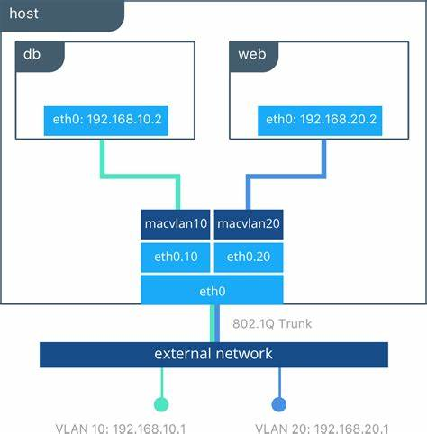
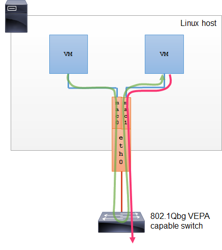
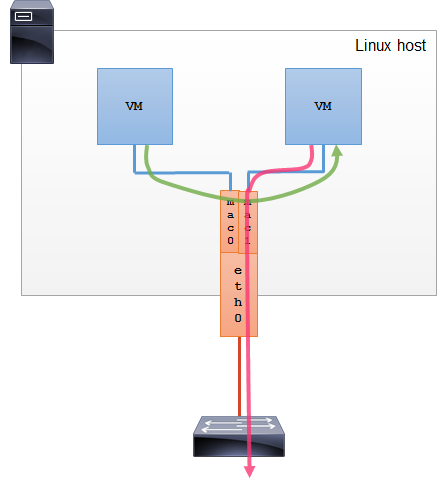
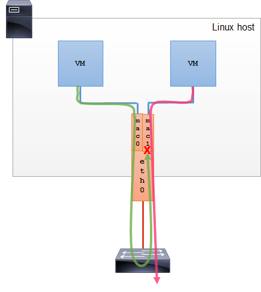
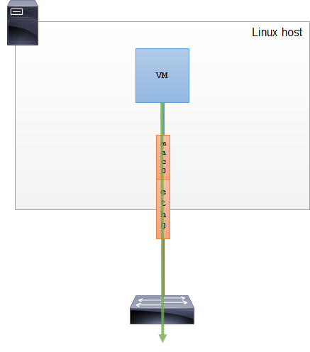

整理macvlan学习笔记。

# 混杂模式

默认情况下网卡只把发给本机的包（包括广播包）传递给上层程序，其它的包一律丢弃。
混杂模式（Promiscuous Mode）是指一台机器能够接收所有经过它的数据流，而不论其目的地址是否是它。具体的地址转发则是在接受到数据后由MAC层来进行。
<!-- more -->

使用ifconfig操作promisc模式：
```sh
(base) [root@publicService ~]# ifconfig ens192 
ens192: flags=4163<UP,BROADCAST,RUNNING,MULTICAST>  mtu 1500
        inet 172.25.22.109  netmask 255.255.252.0  broadcast 172.25.23.255
        inet6 fe80::bca3:c77b:a9b:a75a  prefixlen 64  scopeid 0x20<link>
        ether 00:50:56:b0:80:c6  txqueuelen 1000  (Ethernet)
        RX packets 249274336  bytes 18440080984 (17.1 GiB)
        RX errors 0  dropped 101622  overruns 0  frame 0
        TX packets 17261240  bytes 2476002584 (2.3 GiB)
        TX errors 0  dropped 0 overruns 0  carrier 0  collisions 0

# 开启promisc
(base) [root@publicService ~]# ifconfig ens192 promisc
(base) [root@publicService ~]# ifconfig ens192
ens192: flags=4419<UP,BROADCAST,RUNNING,PROMISC,MULTICAST>  mtu 1500
        inet 172.25.22.109  netmask 255.255.252.0  broadcast 172.25.23.255
        inet6 fe80::bca3:c77b:a9b:a75a  prefixlen 64  scopeid 0x20<link>
        ether 00:50:56:b0:80:c6  txqueuelen 1000  (Ethernet)
        RX packets 249275279  bytes 18440147356 (17.1 GiB)
        RX errors 0  dropped 101622  overruns 0  frame 0
        TX packets 17261309  bytes 2476012173 (2.3 GiB)
        TX errors 0  dropped 0 overruns 0  carrier 0  collisions 0

# 关闭promisc
(base) [root@publicService ~]# ifconfig ens192 -promisc
(base) [root@publicService ~]# ifconfig ens192
ens192: flags=4163<UP,BROADCAST,RUNNING,MULTICAST>  mtu 1500
        inet 172.25.22.109  netmask 255.255.252.0  broadcast 172.25.23.255
        inet6 fe80::bca3:c77b:a9b:a75a  prefixlen 64  scopeid 0x20<link>
        ether 00:50:56:b0:80:c6  txqueuelen 1000  (Ethernet)
        RX packets 249275622  bytes 18440170311 (17.1 GiB)
        RX errors 0  dropped 101622  overruns 0  frame 0
        TX packets 17261333  bytes 2476015397 (2.3 GiB)
        TX errors 0  dropped 0 overruns 0  carrier 0  collisions 0
```

或者使用ip命令
```sh
# 开启promisc
(base) [root@publicService ~]# ip link set ens192 promisc on
(base) [root@publicService ~]# ifconfig ens192
ens192: flags=4419<UP,BROADCAST,RUNNING,PROMISC,MULTICAST>  mtu 1500
        inet 172.25.22.109  netmask 255.255.252.0  broadcast 172.25.23.255
        inet6 fe80::bca3:c77b:a9b:a75a  prefixlen 64  scopeid 0x20<link>
        ether 00:50:56:b0:80:c6  txqueuelen 1000  (Ethernet)
        RX packets 249285891  bytes 18440882352 (17.1 GiB)
        RX errors 0  dropped 101622  overruns 0  frame 0
        TX packets 17261762  bytes 2476085900 (2.3 GiB)
        TX errors 0  dropped 0 overruns 0  carrier 0  collisions 0

# 关闭promisc
(base) [root@publicService ~]# ip link set ens192 promisc off
(base) [root@publicService ~]# ifconfig ens192
ens192: flags=4163<UP,BROADCAST,RUNNING,MULTICAST>  mtu 1500
        inet 172.25.22.109  netmask 255.255.252.0  broadcast 172.25.23.255
        inet6 fe80::bca3:c77b:a9b:a75a  prefixlen 64  scopeid 0x20<link>
        ether 00:50:56:b0:80:c6  txqueuelen 1000  (Ethernet)
        RX packets 249286554  bytes 18440926574 (17.1 GiB)
        RX errors 0  dropped 101622  overruns 0  frame 0
        TX packets 17261792  bytes 2476091316 (2.3 GiB)
        TX errors 0  dropped 0 overruns 0  carrier 0  collisions 0
```


# macvlan

macvlan是一种网卡虚拟化技术。允许在同一个物理网卡上配置多个 MAC 地址，即多个 interface，每个 interface 可以配置自己的 IP。
macvlan 的最大优点是性能极好，相比其他实现，macvlan 不需要创建 Linux bridge。
Macvlan 的缺点是需要将主机网卡（NIC）设置为混杂模式（Promiscuous Mode），这在大部分公有云平台上是不允许的。


工作在混乱模式下的物理网卡，其MAC地址会失效，所以，此模式中运行的容器并不能与外网进行通信。
macvlan接口会监听并接收链路上到达本mac地址的报文，因此macvlan（除bridge外）仅能向外部网络发送报文，并接受目的为本机mac的报文。

一个网卡只能创建一个 macvlan 网络, 如果要支持多个macvlan网络, 就要使用vlan子接口实现多macvlan网络。

来自docker官网的示意图：





# macvlan模式

macvlan有四种模式：VEPA，bridge，Private和Passthru。

## VEPA

Virtual Ethernet Port Aggregator。





在 VEPA 模式下，所有从 Macvlan 接口发出的流量，不管目的地全部都发送给父接口，即使流量的目的地是共享同一个父接口的其它 Macvlan 接口。
不同子接口的通信，必须通过交换机实现，并且交换机要支持802.1q。
Linux主机可以通过一种 Hairpin 模式的 Bridge 来让 VEPA 模式下的不同 Macvlan 接口通信。

```
brctl hairpin br0 eth0 on
```

适合场景：
- 因为所有流量都要经过交换机，适合在外部交换机上做流量进行优化设定。比如物理交换机和虚拟机/容器之间的通信。

扩展：hairpin技术
>Hairpin技术需要NAT网关支持，它能够让两台位于同一台NAT网关后面的主机，通过对方的公网地址和端口相互访问，NAT网关会根据一系列规则，将对内部主机发往其NAT公网IP地址的报文进行转换，并从私网接口发送给目标主机。

hairpin在这篇文章进一步学习：
- [network-nat-hairpin](/posts/network-nat-hairpin)

## bridge

macvlan的默认模式。





拥有相同父接口的两块 Macvlan 虚拟网卡是可以直接通讯的，不需要把流量通过父网卡发送到外部网络。
类似于linux bridge，但是不需要mac地址学习、STP，因此性能更好。

适合场景：
- 让共享同一个父接口的 Macvlan 网卡进行直接通讯的场景


扩展知识：
1. mac地址学习，来自百度百科：
>描述学习网桥的服务，每个所接收的分组的源MAC地址存储在这个学习网桥里，以便将来送达该地址的分组只转发到此地址所在伪网桥接口。前往未识别地址的分组则转发到每个网桥接口上。这个方法有助于把相连局域网的业务量最小化。

2. STP （生成树协议），来自百度百科：
>STP（Spanning Tree Protocol）是生成树协议的英文缩写，可应用于计算机网络中树形拓扑结构建立，主要作用是防止网桥网络中的冗余链路形成环路工作。
>
>生成树协议是IEEE 802.1D中定议的数据链路层协议，用于解决在网络的核心层构建冗余链路里产生的网络环路问题，通过在交换机之间传递网桥协议数据单元（Bridge Protocol Data Unit，简称BPDU），通过采用STA生成树算法选举根桥、根端口和指定端口的方式，最终将网络形成一个树形结构的网络，其中，根端口、指定端口都处于转发状态，其他端口处于禁用状态。如果网络拓扑发生改变，将重新计算生成树拓扑。生成树协议的存在，既解决了核心层网络需要冗余链路的网络健壮性要求，又解决了因为冗余链路形成的物理环路导致“广播风暴”问题。
>
>由于协议机制本身的局限，STP保护速度慢。


## private





>完全阻止共享同一父接口的 Macvlan 虚拟网卡之间的通讯，即使配置了 Hairpin 让从父接口发出的流量返回到宿主机，相应的通讯流量依然被丢弃。具体实现方式是丢弃广播/多播数据，这就意味着以太网地址解析 arp 将不可运行，除非手工探测 MAC 地址，否则通信将无法在同一宿主机下的多个 Macvlan 网卡间展开。


## passthru





>直接把父接口和相应的MacVLAN接口捆绑在一起，**这种模式每个父接口只能和一个 Macvlan 虚拟网卡接口进行捆绑**，并且 Macvlan 虚拟网卡接口继承父接口的 MAC 地址。

适用场景：
- 需要在虚拟机/容器修改网卡的mac地址等参数。

# docker创建macvlan (bridge模式)

首先查找物理网卡对应网关地址
```
(base) [root@publicService opt]# route -n
Kernel IP routing table
Destination     Gateway         Genmask         Flags Metric Ref    Use Iface
0.0.0.0         172.25.23.254   0.0.0.0         UG    100    0        0 ens192
172.17.0.0      0.0.0.0         255.255.0.0     U     0      0        0 docker0
172.21.0.0      0.0.0.0         255.255.0.0     U     0      0        0 br-b0a8e75c0663
172.25.20.0     0.0.0.0         255.255.252.0   U     100    0        0 ens192
```
ens192网卡ip地址为172.25.20.143，对应的网关为172.25.23.254。

创建macvlan网络。一个docker host只能创建一个macvlan类型的网络。
```sh
[root@host143 ~]# docker network create -d macvlan mymacvlan \
> --subnet=172.25.20.0/24 \
> --gateway=172.25.23.254 \
> -o parent=ens192
no matching subnet for gateway 172.25.23.254
```

原因：
>A gateway address must be on the same subnet as an interface. 

解决；修改子网地址，与gateway在同一个子网。
```
docker network create -d macvlan mymacvlan \
--subnet=172.25.23.0/24 \
--gateway=172.25.23.254 \
-o parent=ens192
```

创建容器my-alpine-1
```sh
[root@host143 ~]# docker run --rm -it --network mymacvlan --name my-alpine-1 alpine:3.11.6 sh
/ # ip a
1: lo: <LOOPBACK,UP,LOWER_UP> mtu 65536 qdisc noqueue state UNKNOWN qlen 1000
    link/loopback 00:00:00:00:00:00 brd 00:00:00:00:00:00
    inet 127.0.0.1/8 scope host lo
       valid_lft forever preferred_lft forever
312: eth0@if2: <BROADCAST,MULTICAST,UP,LOWER_UP,M-DOWN> mtu 1500 qdisc noqueue state UNKNOWN 
    link/ether 02:42:ac:19:17:01 brd ff:ff:ff:ff:ff:ff
    inet 172.25.23.1/24 brd 172.25.23.255 scope global eth0
       valid_lft forever preferred_lft forever
```

创建容器my-alpine-2
```sh
[root@host143 ~]# docker run --rm -it --network mymacvlan --name my-alpine-2 alpine:3.11.6 sh
/ # ip a
1: lo: <LOOPBACK,UP,LOWER_UP> mtu 65536 qdisc noqueue state UNKNOWN qlen 1000
    link/loopback 00:00:00:00:00:00 brd 00:00:00:00:00:00
    inet 127.0.0.1/8 scope host lo
       valid_lft forever preferred_lft forever
313: eth0@if2: <BROADCAST,MULTICAST,UP,LOWER_UP,M-DOWN> mtu 1500 qdisc noqueue state UNKNOWN 
    link/ether 02:42:ac:19:17:02 brd ff:ff:ff:ff:ff:ff
    inet 172.25.23.2/24 brd 172.25.23.255 scope global eth0
       valid_lft forever preferred_lft forever
```

观察这两个容器的eth0网卡ip地址，在同一个子网。
因为是macvlan网络，并且默认是bridge模式，两个容器可以直接ping通。
```sh
/ # ping 172.25.23.2
PING 172.25.23.2 (172.25.23.2): 56 data bytes
64 bytes from 172.25.23.2: seq=0 ttl=64 time=0.096 ms
64 bytes from 172.25.23.2: seq=1 ttl=64 time=0.060 ms
64 bytes from 172.25.23.2: seq=2 ttl=64 time=0.057 ms
^C
--- 172.25.23.2 ping statistics ---
3 packets transmitted, 3 packets received, 0% packet loss
round-trip min/avg/max = 0.057/0.071/0.096 ms
```

**当使用 Macvlan 时，宿主机无法和 VM 或容器直接进行通讯。**
在容器ping宿主机，ping不通。
```sh
/ # ping 172.25.20.143 
PING 172.25.20.143 (172.25.20.143): 56 data bytes
^C
--- 172.25.20.143 ping statistics ---
41 packets transmitted, 0 packets received, 100% packet loss
```

在宿主机ping容器，也不通。
```sh
[root@host143 ~]# ping 172.25.23.2
PING 172.25.23.2 (172.25.23.2) 56(84) bytes of data.
From 172.25.20.143 icmp_seq=1 Destination Host Unreachable
From 172.25.20.143 icmp_seq=2 Destination Host Unreachable
From 172.25.20.143 icmp_seq=3 Destination Host Unreachable
From 172.25.20.143 icmp_seq=4 Destination Host Unreachable
^C
--- 172.25.23.2 ping statistics ---
4 packets transmitted, 0 received, +4 errors, 100% packet loss, time 3001ms
pipe 4
```

# 参考

- [Linux 虚拟网卡技术：Macvlan](https://mp.weixin.qq.com/s?__biz=MzU1MzY4NzQ1OA==&mid=2247484064&idx=1&sn=ffd745069b6c4aeac0589de00467b2f2&chksm=fbee426dcc99cb7bdf26f5e6a21bbeaebba7ccd384a02f850d4461ea92331ed140edf98ffaec&token=982949453&lang=zh_CN&scene=21#wechat_redirect)
- [Docker Macvlan网络驱动使用详解](http://c.biancheng.net/view/3191.html)
- [macvlan和pipework](https://yq.aliyun.com/articles/645839)
- [docker网络之macvlan](https://www.cnblogs.com/charlieroro/p/9656769.html)
- [Docker 网络 host、bridge、macvlan 基本原理和验证](http://yangjunsss.github.io/2018-07-29/Docker-%E7%BD%91%E7%BB%9C-Host-Bridge-Macvlan-%E5%9F%BA%E6%9C%AC%E5%8E%9F%E7%90%86%E5%92%8C%E9%AA%8C%E8%AF%81/)
