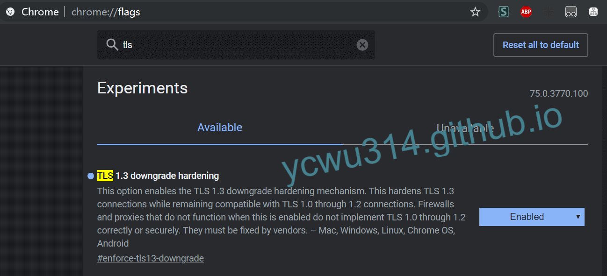

开启TLS v1.3的要求：
- openssl版本>=1.1.1
- nginx使用对应版本openssl构建

ubuntu 18.04LTS默认是openssl 1.1.0g。因此2个软件都要升级。

# 升级openssl

```bash
# wget https://www.openssl.org/source/openssl-1.1.1c.tar.gz
# gunzip openssl-1.1.1c.tar.gz 
# tar xvf openssl-1.1.1c.tar 
# cd openssl-1.1.1c/
# ./config
# make
# make install
```

新的openssl放在apps目录。先尝试执行
```bash
# cd apps
# ./openssl
./openssl: /usr/lib/x86_64-linux-gnu/libssl.so.1.1: version `OPENSSL_1_1_1' not found (required by ./openssl)
./openssl: /usr/lib/x86_64-linux-gnu/libcrypto.so.1.1: version `OPENSSL_1_1_1' not found (required by ./openssl)
```

这是因为so文件没有加入到动态链接库路径。google到这个帖子[`OPENSSL_1_1_1' not found (required by openssl) ](https://github.com/openssl/openssl/issues/5845)
```bash
# echo "export LD_LIBRARY_PATH=/usr/local/lib" >> ~/.bashrc
# ldconfig

# openssl
OpenSSL> version
OpenSSL 1.1.1c  28 May 2019
```

至此，openssl升级成功。

# 升级nginx

一般思路是，卸载旧的nginx，再用源码构建，比较麻烦的是configure加上一堆with_XXX module。
google发现有个PPA库正合适。参见[How to Easily Enable TLS 1.3 in Nginx on Ubuntu 18.10, 18.04, 16.04, 14.04](https://www.linuxbabe.com/ubuntu/enable-tls-1-3-nginx-ubuntu-18-10-18-04-16-04-14-04)
```bash
# add-apt-repository ppa:ondrej/nginx
# apt update
# apt remove nginx
# apt install nginx
```
中途会询问要不要更新配置文件。因为我已经配置好，选择保留旧的。

```bash
# nginx -V
nginx version: nginx/1.16.0
built with OpenSSL 1.1.1b  26 Feb 2019 (running with OpenSSL 1.1.1c  28 May 2019)
```

# nginx配置

```
ssl_protocols TLSv1.2  TLSv1.3;  
```

# 验证

ssllabs.com


chrome75上要手动开启TLS1.3支持。地址栏输入`chrome://flag`，搜索`tls`





重启chrome后，打开我的项目站点


