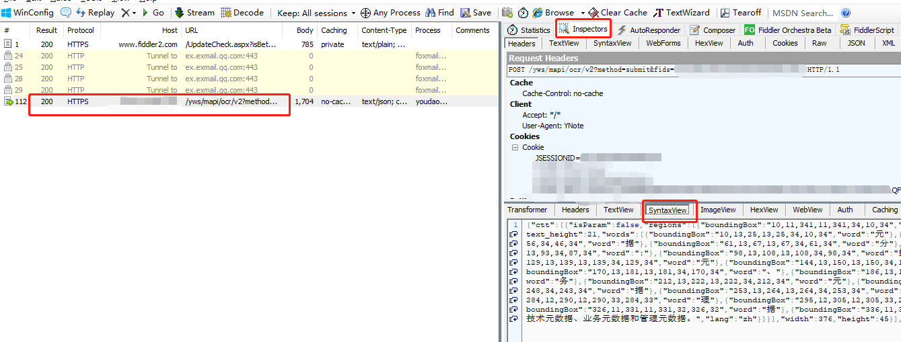
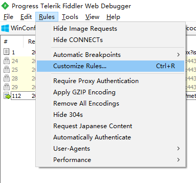
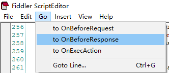

贫穷使我掌握新技能系列。

# 背景

最近看扫描版的pdf，做笔记很不方便、效率低。
需要一个简单、免费的ocr软件，截图后简单操作一下就能够把图片转为文字。
<!-- more -->

# 候选软件

首先，所有需要上传图片的在线识别都pass掉，操作复杂。

经过排查，有几个软件可以用。

1. microsoft onenote

onenote自带ocr。但是，onenote for windows 10版本阉割掉。
需要重新安装onenote和激活。
office全家桶激活有点烦。先进入备选。

2. capture2text

这是个开源软件，托管在sourceforge。
需要下载中文包。
识别比较慢。坑爹的是要每次截图后默认是用英语识别，等差不多10秒识别不出来后，手动选择中文，再识别，太反人类了（也许是我没认真找修改配置项？）。
只能pass掉。

3. 某笔记软件

体验很好。截图后识别很方便，云计算识别速度快、精度高。
但是。。。要开通会员才能使用。

结论：
- 如果能薅羊毛使用某笔记软件的ocr接口结果就好了。

# fiddler拦截和分析ocr接口

于是看下ocr接口有没有被加密。

因为是https接口，要先安装信任fiddler的根证书：


然后就可以愉快的抓包了。





发现ocr接口响应体没有加密
```json
{
  "ctt": [
    {
      "isParam": false,
      "regions": [
        {
          "boundingBox": "10,11,341,11,341,34,10,34",
          "dir": "h",
          "lang": "zh",
          "lines": [
            {
              "boundingBox": "10,11,341,11,341,34,10,34",
              "text_height": 21,
              "words": [
                {
                  "boundingBox": "10,13,25,13,25,34,10,34",
                  "word": "元"
                },
                {
                  "boundingBox": "30,13,41,13,41,34,30,34",
                  "word": "数"
                },
                {
                  "boundingBox": "46,13,56,13,56,34,46,34",
                  "word": "据"
                },
                {
                  "boundingBox": "61,13,67,13,67,34,61,34",
                  "word": "分"
                },
                {
                  "boundingBox": "72,13,82,13,82,34,72,34",
                  "word": "类"
                },
                {
                  "boundingBox": "87,13,93,13,93,34,87,34",
                  "word": ":"
                },
                {
                  "boundingBox": "98,13,108,13,108,34,98,34",
                  "word": "技"
                },
                {
                  "boundingBox": "113,13,124,13,124,34,113,34",
                  "word": "术"
                },
                {
                  "boundingBox": "129,13,139,13,139,34,129,34",
                  "word": "元"
                },
                {
                  "boundingBox": "144,13,150,13,150,34,144,34",
                  "word": "数"
                },
                {
                  "boundingBox": "155,13,165,13,165,34,155,34",
                  "word": "据"
                },
                {
                  "boundingBox": "170,13,181,13,181,34,170,34",
                  "word": "、"
                },
                {
                  "boundingBox": "186,13,191,13,191,34,186,34",
                  "word": "业"
                },
                {
                  "boundingBox": "196,13,207,13,207,34,196,34",
                  "word": "务"
                },
                {
                  "boundingBox": "212,13,222,13,222,34,212,34",
                  "word": "元"
                },
                {
                  "boundingBox": "227,13,238,13,238,34,227,34",
                  "word": "数"
                },
                {
                  "boundingBox": "243,13,248,13,248,34,243,34",
                  "word": "据"
                },
                {
                  "boundingBox": "253,13,264,13,264,34,253,34",
                  "word": "和"
                },
                {
                  "boundingBox": "269,13,279,12,279,33,269,34",
                  "word": "管"
                },
                {
                  "boundingBox": "284,12,290,12,290,33,284,33",
                  "word": "理"
                },
                {
                  "boundingBox": "295,12,305,12,305,33,295,33",
                  "word": "元"
                },
                {
                  "boundingBox": "310,12,321,12,321,33,310,33",
                  "word": "数"
                },
                {
                  "boundingBox": "326,11,331,11,331,32,326,32",
                  "word": "据"
                },
                {
                  "boundingBox": "336,11,341,11,341,32,336,32",
                  "word": "。"
                }
              ],
              "text": "元数据分类:技术元数据、业务元数据和管理元数据。",
              "lang": "zh"
            }
          ]
        }
      ],
      "width": 376,
      "height": 45
    }
  ],
  "failList": []
}

```

按区域来识别文字，字体大小也尝试识别。
识别的文字按行放在text属性。
到此已经基本可以使用。但是如果是多行文字，要在这一堆json中找到每行text字段，还是很低效。

更好的方式是，fiddler拦截响应，解析每行的text，再拼凑出一个简单的响应体返回。


# fiddler脚本修改响应体

查了一下，fiddler脚本的入口在：





要修改的函数在





剩下的就是在`OnBeforeResponse`增加解析json的代码。

但是在这个步骤耗费了很多时间：
1. 一开始用JavaScript的语法，怎么都解析不了！后来网上查了才知道Fiddler脚本用的是jscript.net，类似c#的语法。
2. Fiddler解析返回的json对象，非常弱鸡，不支持返回json数组，遍历麻烦。官网直接推荐用第三方json库处理，比如JSON.net。
3. 于是下载JSON.net，但是用起来也蛋疼。
4. 现在是卡在怎么方便的遍历。
发现`responseJSON.JSONObject['ctt']`返回的是`Hashtable`对象，于是找Hashtable的api：[Hashtable Class](https://docs.microsoft.com/en-us/dotnet/api/system.collections.hashtable?view=netframework-4.7.2)，里面有Count字段，可以用来控制遍历次数，到此可以解决问题。

```c#
	static function OnBeforeResponse(oSession: Session) {
		if (m_Hide304s && oSession.responseCode == 304) {
			oSession["ui-hide"] = "true";
		}

		if (oSession.host == 'xxx.com' && oSession.fullUrl.Contains('/yws/mapi/ocr/v2')) {
			var responseStringOriginal = oSession.GetResponseBodyAsString();
			//FiddlerObject.log('orginal string \n' + responseStringOriginal);
			var responseJSON = Fiddler.WebFormats.JSON.JsonDecode(responseStringOriginal);
			//FiddlerObject.log('body: '+responseJSON.JSONObject['ctt'][0]['regions'][0]['lines'][0]['text']);
			var str = '';
			//FiddlerObject.log('xx:' + responseJSON.JSONObject['ctt'].Count);

			for (var i = 0; i < responseJSON.JSONObject['ctt'].Count; i++) {
				var ctt = responseJSON.JSONObject['ctt'][i];

				for (var j = 0; j < ctt['regions'].Count; j++) {

					var region = ctt['regions'][j];
					for (var k = 0; k < region['lines'].Count; k++) {
						var text = region['lines'][k]['text'];
						str += '\n' + text;
					}
				}
			}
			//FiddlerObject.log(''+str);
			oSession.utilSetResponseBody(str);
		}
	}
```

Fiddler脚本的断点功能不是很好用，于是用`FiddlerObject.log()`在控制台打印日志。

最后看下效果：


也不知道能用多久，抓紧时间看书做笔记😂。

ps. 有能力的话还是开个会员支持下。