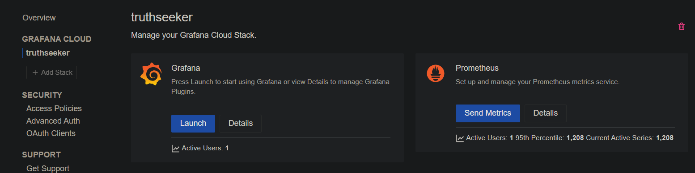
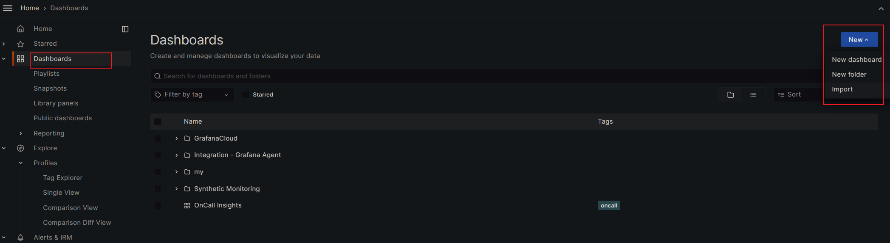

# grafana cloud 免费版

Monthly limits
```
50 GB Logs
3 Grafana Monthly Active Users
50 GB Traces
metrics icon
10k Metrics
50 GB Profiles
500 k6 Virtual User Hours
3 IRM Monthly Active Users
```

监控几个vps够用了。

# grafana cloud 账号



然后进去创建访问配置。

https://truthseeker.grafana.net/connections/add-new-connection/hmInstancePromId?src=hg_notification_trial


# prometheus node exporter docker

收集本地系统信息。使用9100端口。

https://github.com/prometheus/node_exporter


上面给出的是`3.8`版本，需要docker 1.25.5 以上才支持，否则`Version in ".\docker-compose.yml" is unsupported.`

https://github.com/docker/compose/releases/tag/1.25.5

升级docker版本，或者手动修改下version：

```yaml
---
version: '3.3'

services:
  node_exporter:
    image: quay.io/prometheus/node-exporter:latest
    container_name: node_exporter
    command:
      - '--path.rootfs=/host'
    network_mode: host
    pid: host
    restart: unless-stopped
    volumes:
      - '/:/host:ro,rslave'
```

然后启动
```
docker-compose up -d
```


# 安装 & 配置 grafana agent

使用apt源：
```shell
mkdir -p /etc/apt/keyrings/
wget -q -O - https://apt.grafana.com/gpg.key | gpg --dearmor | sudo tee /etc/apt/keyrings/grafana.gpg > /dev/null
echo "deb [signed-by=/etc/apt/keyrings/grafana.gpg] https://apt.grafana.com stable main" | sudo tee /etc/apt/sources.list.d/grafana.list
sudo apt-get update
sudo apt-get install grafana-agent
```


或者直接下载二进制包：
```shell
# https://github.com/grafana/agent/releases

wget -q https://github.com/grafana/agent/releases/download/v0.38.1/grafana-agent-0.38.1-1.amd64.deb -O /tmp/grafana-agent.deb
dpkg -i /tmp/grafana-agent.deb
rm -f /tmp/grafana-agent.deb
```

grafana agent默认使用9090端口，如果有冲突就修改。这里改成使用19090、19091：
```shell
# port 9090 maybe occupied by, such as cockpit
# change to use 19090, 19091
sed -i -e "s/127.0.0.1:9090/127.0.0.1:19090/g" -e "s/127.0.0.1:9091/127.0.0.1:19091/g" /etc/default/grafana-agent
```

配置`/etc/grafana-agent.yaml`。把grafana cloud的账号和url地址填上。
```yml
integrations:
  prometheus_remote_write:
  - basic_auth:
      password: <password>
      username: <username>
    url: <url>
  agent:
    enabled: true
    relabel_configs:
    - action: replace
      source_labels:
      - agent_hostname
      target_label: instance
    - action: replace
      target_label: job
      replacement: "integrations/agent-check"
    metric_relabel_configs:
    - action: keep
      regex: (prometheus_target_.*|prometheus_sd_discovered_targets|agent_build.*|agent_wal_samples_appended_total|process_start_time_seconds)
      source_labels:
      - __name__
  # Add here any snippet that belongs to the `integrations` section.
  # For a correct indentation, paste snippets copied from Grafana Cloud at the beginning of the line.
  node_exporter:
    enabled: true
    include_exporter_metrics: true  
logs:
  configs:
  - clients:
    - basic_auth:
        password: <password>
        username: <username>
      url: <url>
    name: integrations
    positions:
      filename: /tmp/positions.yaml
    scrape_configs:
      # Add here any snippet that belongs to the `logs.configs.scrape_configs` section.
      # For a correct indentation, paste snippets copied from Grafana Cloud at the beginning of the line.

metrics:
  configs:
  - name: integrations
    remote_write:
    - basic_auth:
        password: <password>
        username: <username>
      url:  <url>
    scrape_configs:
      # Add here any snippet that belongs to the `metrics.configs.scrape_configs` section.
      # For a correct indentation, paste snippets copied from Grafana Cloud at the beginning of the line.
  global:
    scrape_interval: 60s
  wal_directory: /tmp/grafana-agent-wal
```

启动grafana agent
```shell
systemctl enable grafana-agent.service
systemctl start grafana-agent
systemctl status grafana-agent
```

# dashboard

选择喜欢的面板：

https://grafana.com/grafana/dashboards/


