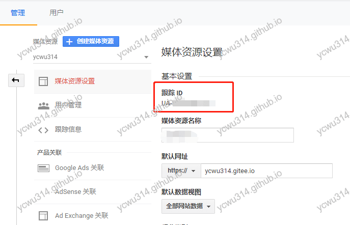
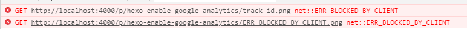

# 问题

Google分析是一个由Google所提供的网站流量统计服务。既然是免费，就接进来研究下。

hexo next已经集成了一系列统计插件，开启很方便。打开next的`_config.yml`
```yml
# Google Analytics
google_analytics:
  tracking_id: 
  localhost_ignored: true
```
`track_id`是“媒体资源设置”的“跟踪ID”。





如果只有一个站点，那么一切都很好。但是现在有 https://ycwu314.github.io/ 和 https://ycwu314.gitee.io/ 两个站点。如果流量归一的话，用一个track_id就可以。但是我想分别查看流量数据。只用一个track_id是不方便的。于是开始折腾一下。

# hexo next接入GA源码分析

在next项目全文查找`google_analytics`，最后定位接入GA统计的具体文件：
`themes\next\layout\_third-party\analytics\google-analytics.swig`
```html

  <script async src="https://www.googletagmanager.com/gtag/js?id={{ theme.google_analytics.tracking_id }}"></script>
  <script>
    var host = window.location.hostname;
    if (host !== "localhost" || !{{theme.google_analytics.localhost_ignored}}) {
      window.dataLayer = window.dataLayer || [];
      function gtag(){dataLayer.push(arguments);}
      gtag('js', new Date());
      gtag('config', '{{ theme.google_analytics.tracking_id }}');
    }
  </script>

```
根据track_id判断是否加载脚本，并且脚本id包含track_id。
数据打标签的时候，把track_id也打进去。

# 解决

思路：
- 在next的`_config.yml`增加github_tracking_id和gitee_tracking_id
- 修改`google-analytics.swig`，根据host，动态加载脚本

## 修改`_config.yml`

```yml
# Google Analytics
google_analytics:
  enable: true
  github_tracking_id: 
  gitee_tracking_id: 
  localhost_ignored: true
```

# 修改 google-analytics.swig

第一版
```html
  <script async src="" id="ga"></script>
  <script>
    var host = window.location.hostname;
    var track_id;
    if(host == 'ycwu314.gitee.io'){
      track_id = '{{ theme.google_analytics.gitee_tracking_id }}';  
    }else if(host == 'ycwu314.github.io'){
      track_id = '{{ theme.google_analytics.github_tracking_id }}';
    }

    if(track_id){
      ga.src = "https://www.googletagmanager.com/gtag/js?id=" + track_id;
    }
  </script>
```
以为直接修改src就会触发动态加载脚本。然而chrome F12观察，并没有加载脚本。查html相关资料
>Changing the src, type, charset, async, and defer attributes dynamically has no direct effect; these attribute are only used at specific times described below.

于是改为动态插入`script`标签，并且在`head`插入标签。

```html

  <script>
    var host = window.location.hostname;
    var track_id;
    if(host == 'ycwu314.gitee.io'){
      track_id = '{{ theme.google_analytics.gitee_tracking_id }}';  
    }else if(host == 'ycwu314.github.io'){
      track_id = '{{ theme.google_analytics.github_tracking_id }}';
    }

    if(track_id){
        var script = document.createElement("script");
        script.src = "https://www.googletagmanager.com/gtag/js?id=" + track_id;
        script.async = "async";
        document.head.appendChild(script);
    }
  </script>
  <script>
    var host = window.location.hostname;
    if (host !== "localhost" || !{{theme.google_analytics.localhost_ignored}}) {
      window.dataLayer = window.dataLayer || [];
      function gtag(){dataLayer.push(arguments);}
      gtag('js', new Date());

      if(host == 'ycwu314.gitee.io'){
        gtag('config', '{{ theme.google_analytics.gitee_tracking_id }}');  
      }else if(host == 'ycwu314.github.io'){
        gtag('config', '{{ theme.google_analytics.github_tracking_id }}');
      }
    }
  </script>

```
script async表示异步加载。

# 测试

测试的时候发现报错`net::ERR_BLOCKED_BY_CLIENT`





adblock插件会拦截GA统计。关闭adblock之后就可以了。
原来的博文路径是`hexo-enable-google-analytics`，触发adblock规则了😱

ps. 对于 https://ycwu314.gitee.io/ , 关闭网络工具之后发现ga js也能正常加载，略表惊讶。
