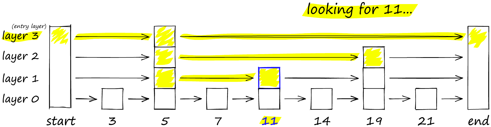
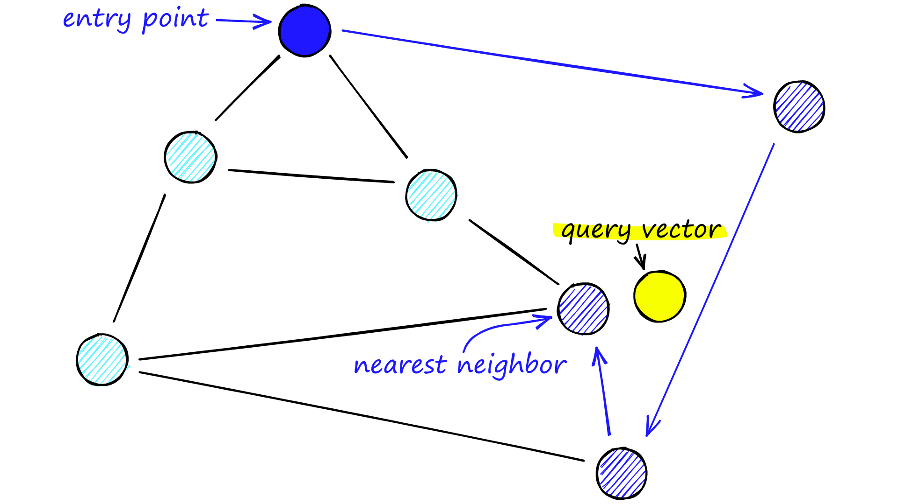
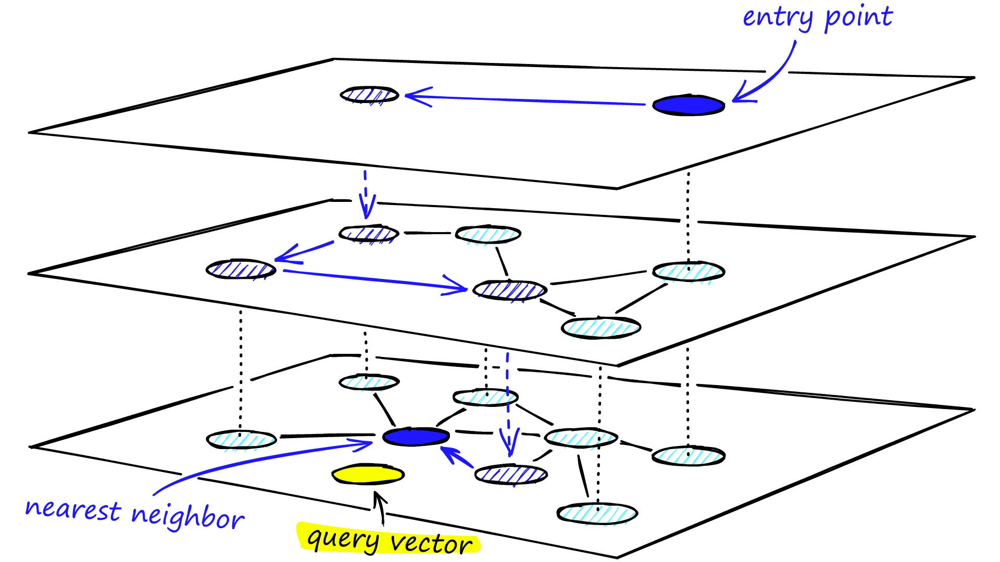
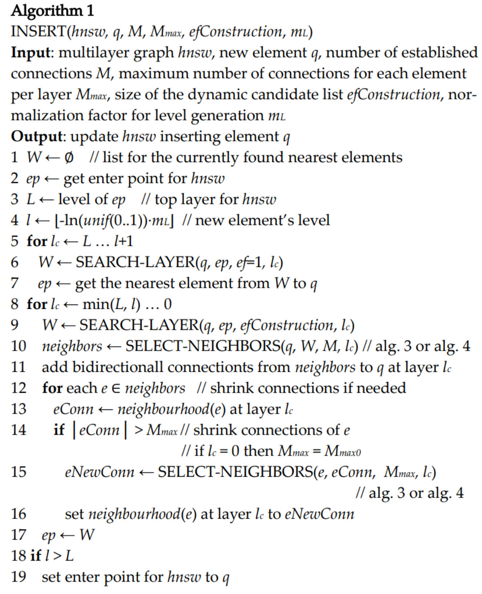
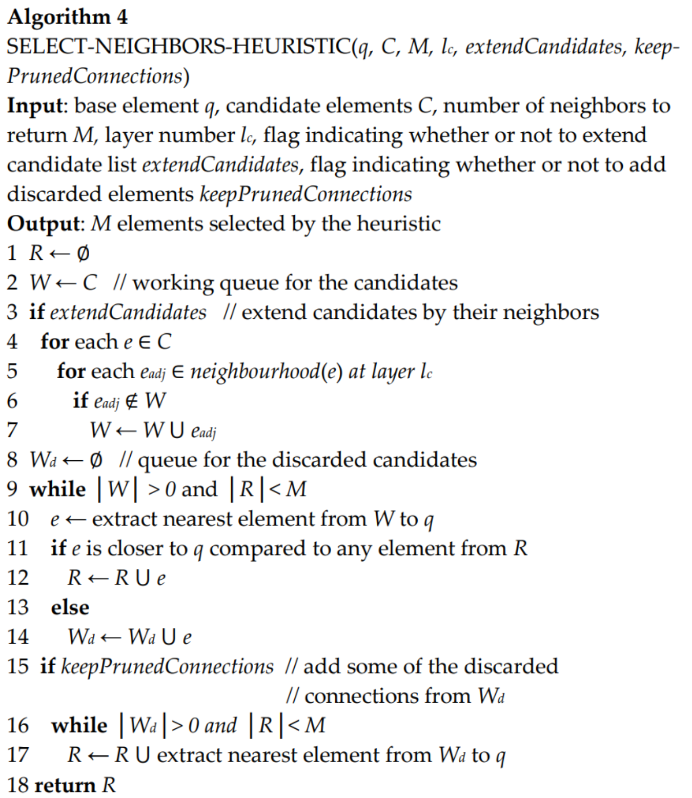

使用gpt整理。

# 跳表

## 介绍

跳表（Skip List）是一种用于有序元素的数据结构，它通过添加多层索引来加快搜索效率。跳表的基本思想是通过建立多层次的链表来实现快速的搜索和插入操作。

跳表的数据结构包含以下几个关键部分：

1. 节点（Node）：每个节点包含一个值和多个指向下一层节点的指针。节点的数目可能因层数而不同。

2. 层级（Level）：跳表由多个层级组成，每个层级包含一个链表。第一层是最底层，包含所有的节点。每个节点有一定的概率随机生成一个指向上一层的指针，这样就形成了多层索引结构。

3. 首节点（Head）：跳表的顶层链表的首节点，它标志着最小的值。

4. 尾节点（Tail）：跳表的顶层链表的尾节点，它标志着最大的值。

## 时间、空间复杂度

跳表的时间复杂度如下：

- 搜索操作的平均时间复杂度为O(log n)，其中n是跳表中元素的个数。这是因为跳表的多层索引结构可以在每一层中跳过一部分元素，从而减少搜索的时间。

- 插入和删除操作的平均时间复杂度也为O(log n)。这是因为插入和删除操作涉及到更新索引结构，需要在每一层中正确地插入或删除节点。

跳表的空间复杂度为O(n)，其中n是跳表中元素的个数。这是因为跳表除了存储节点的值之外，还需要存储每个节点的指针和层级信息。

跳表的优点包括实现简单、查询效率高、支持动态插入和删除等。然而，跳表相对于其他数据结构（如平衡树）来说，需要更多的空间来存储索引结构，并且在某些操作上性能可能略逊一筹。跳表通常在需要高效的有序元素访问和插入操作的场景中使用。

## 优缺点

优点：
1. 查询效率高：跳表通过建立多层索引结构，可以快速定位到目标元素。在平均情况下，跳表的查询时间复杂度为O(log n)，与平衡树等其他有序数据结构相当。

2. 插入和删除操作高效：跳表的插入和删除操作相对简单高效。通过维护索引结构，插入和删除元素的时间复杂度平均为O(log n)。

3. 简单易实现：相对于一些复杂的数据结构如红黑树或AVL树，跳表的实现较为简单。它的基本思想容易理解，易于实现和调试。

4. 不需要平衡操作：跳表不需要像平衡树那样频繁进行平衡操作，使得插入和删除元素的时间复杂度更稳定，避免了频繁的旋转和调整过程。

缺点：
1. 空间复杂度较高：跳表需要额外的空间来构建索引结构，因此相对于其他数据结构如平衡树，跳表的空间消耗较高。索引结构的空间复杂度为O(n)，其中n是跳表中元素的数量。

2. 需要维护索引结构：跳表的插入和删除操作需要维护索引结构的正确性，这可能会导致一定的开销。当插入或删除元素时，需要相应地更新索引结构，以保持跳表的平衡性。

3. 不适用于频繁更新的场景：如果跳表中的元素频繁发生变化，需要频繁地插入或删除元素，这可能导致索引结构的频繁更新，降低了性能。

综上所述，跳表具有查询效率高、插入和删除操作高效、简单易实现等优点。然而，它的空间复杂度较高，需要维护索引结构，并且不适用于频繁更新的场景。跳表通常适用于需要高效的有序元素查询和插入操作的场景，特别是当平衡树等其他数据结构的实现复杂性和性能开销较大时。

# Delaunay三角剖分

Delaunay三角剖分：给出一种“好的”三角网格定义方式，即满足：

- 空圆性：DT（Delaunay Triangulation）是唯一的（任意四点不能共圆），DT中任意三角形的外接圆范围内不会有其它点存在
- 最大化最小角：在点集可能形成的三角剖分中，DT所形成的三角形的最小角最大。从这个意义上讲，DT是最接近于规则化的三角剖分。具体的说是在两个相邻的三角形构成凸四边形的对角线，在相互交换后，两个内角的最小角不再增大。

在Delonay图中，最接近的三点形成三角形且各线段（三角形的边）皆不相交，因为可以利用Delonay三角剖分解决近邻点查找问题。

# NSW

Navigable Small World (NSW) 算法是一种基于图的数据结构，用于处理高维空间中的近似最近邻搜索问题。这个算法通过构建一个小世界网络，有效地在高维数据集中进行搜索和信息检索。

NSW 网络的特点是，任意两个点之间的距离可以通过少数几个跳跃达到。这个特性来自于小世界网络的两个主要方面：局部聚集和长距离连接。局部聚集确保了网络中邻近的点是相互连接的，而长距离连接则是随机引入的，它允许网络中的点可以通过较少的中间点快速地连接起来。

NSW 算法非常适合处理维度灾难（curse of dimensionality），因为它通过智能的图布局来降低在高维空间中搜索的复杂性。这种算法在很多领域都有应用，比如推荐系统、图像检索和机器学习。

NSW 算法通常包括以下步骤：

1. 初始化：创建一个包含所有数据点的图，并随机添加边，以形成网络的基础结构。
2. 插入：当向数据结构中添加一个新点时，会通过已存在的网络结构来寻找这个新点的最近邻。然后，根据算法定义的规则建立与新点的连接。
3. 搜索：给定一个查询点，算法从图中的任意点开始，逐步通过跳跃到更接近目标的点来找到查询点的最近邻。搜索过程中能够快速地越过大区域，并在查询点附近的局部聚集区域精细搜索。

简单来说：向图中逐个插入点，对于每个新插入点，使用近似kNN搜索（approximate kNN search）算法从图中找到与其最近f个点集合，该集合中所有点与插入点连接。

通过上述方式构建的是近似Delonay图，与标准Delonay图相比，随着越来越多的点被插入到图中，初期构建的短距离边会慢慢变成长距离边，形成可导航的小世界，从而在查找时减少跳数加快查找速度。

# HNSW

HNSW (Hierarchical Navigable Small World) 算法是一种用于解决多维度空间最近邻搜索问题的高效算法。它是 Navigable Small World (NSW) 算法的扩展，通过引入层次结构，提高了搜索效率。

在 HNSW 算法中，数据被组织成一个分层的图结构。在这种结构中，底层包含所有数据点，而每一层的数据点都是其下层的子集。在最高层只包含少量的节点，这些节点作为数据集的全局入口点（entry points）。

以下是 HNSW 算法的基本步骤：

1. 初始化：在底层插入所有的数据点，并随机添加连接，形成网络的基础结构。
2. 插入：在向数据结构中添加新点时，首先在最高层找到距离新点最近的点，然后逐层向下，在每一层都找到最近的点并建立连接。
3. 搜索：在查询阶段，算法先从最高层的全局入口点开始，逐步向下搜索，找到与查询点最近的点。

HNSW 算法的优点是搜寻速度快，特别适用于大数据和高维度数据的最近邻搜索。缺点是构建图的时间成本相对较高，对内存的需求也较大。

与NSW相比，HNSW的改进方法：
- 使用分层的结构
- 使用了一种启发式方法选择某节点的邻居。

# HNSW 构建

# HNSW 搜索

# HNSW 复杂度

时间复杂度：
1. 构建索引：构建HNSW索引的时间复杂度主要取决于数据集的大小和维度。在构建过程中，需要逐个插入数据节点，并构建层级结构和邻居关系。如果数据集有N个数据节点，每个节点的维度为d，则构建索引的时间复杂度通常为O(Nd)。

2. 最近邻搜索：在HNSW算法中，最近邻搜索的时间复杂度主要受到层级结构和邻居关系的影响。搜索过程中，从顶层索引节点开始，根据查询向量的相似度逐层导航，直到找到最佳匹配。最近邻搜索的时间复杂度通常为O(log N)，其中N是数据集的大小。

空间复杂度：
1. 数据节点：HNSW算法需要存储数据节点的向量表示，因此数据节点的空间复杂度为O(Nd)，其中N是数据集的大小，d是节点的维度。

2. 索引节点和邻居关系：HNSW算法的空间复杂度还取决于索引节点和邻居关系的存储。每个索引节点需要存储其向量表示、链接到其他节点的指针等信息。邻居关系需要记录节点之间的相似性或距离关系。索引节点和邻居关系的空间复杂度通常为O(N)。

综上所述，HNSW算法的时间复杂度在构建索引时为O(Nd)，最近邻搜索的时间复杂度为O(log N)。空间复杂度主要由数据节点、索引节点和邻居关系的存储决定，通常为O(Nd + N)。

# 资料

- [HNSW算法原理](https://zhuanlan.zhihu.com/p/441470968)
- [Hierarchical Navigable Small Worlds (HNSW)](https://www.pinecone.io/learn/series/faiss/hnsw/)
- [Similarity Search, Part 4: Hierarchical Navigable Small World (HNSW)](https://towardsdatascience.com/similarity-search-part-4-hierarchical-navigable-small-world-hnsw-2aad4fe87d37)

图片来源：https://www.pinecone.io/learn/series/faiss/hnsw/

