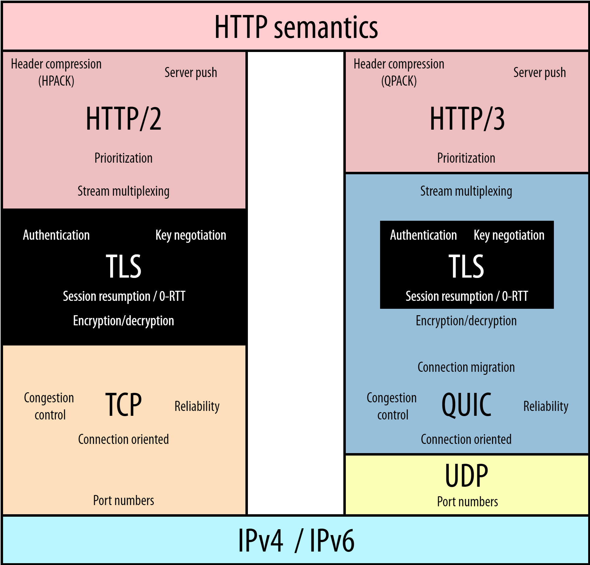
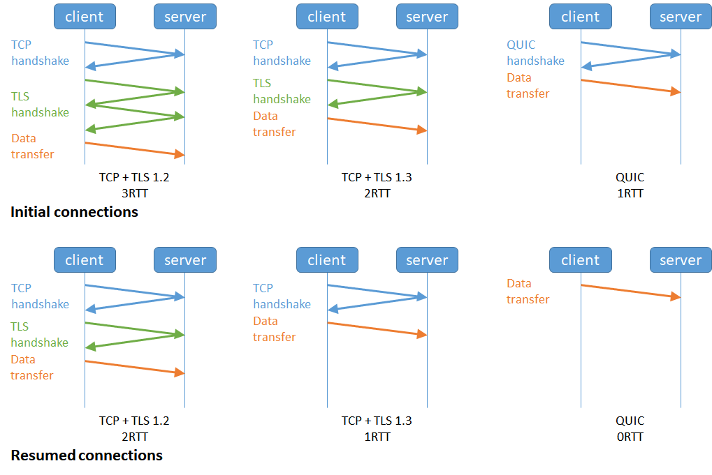
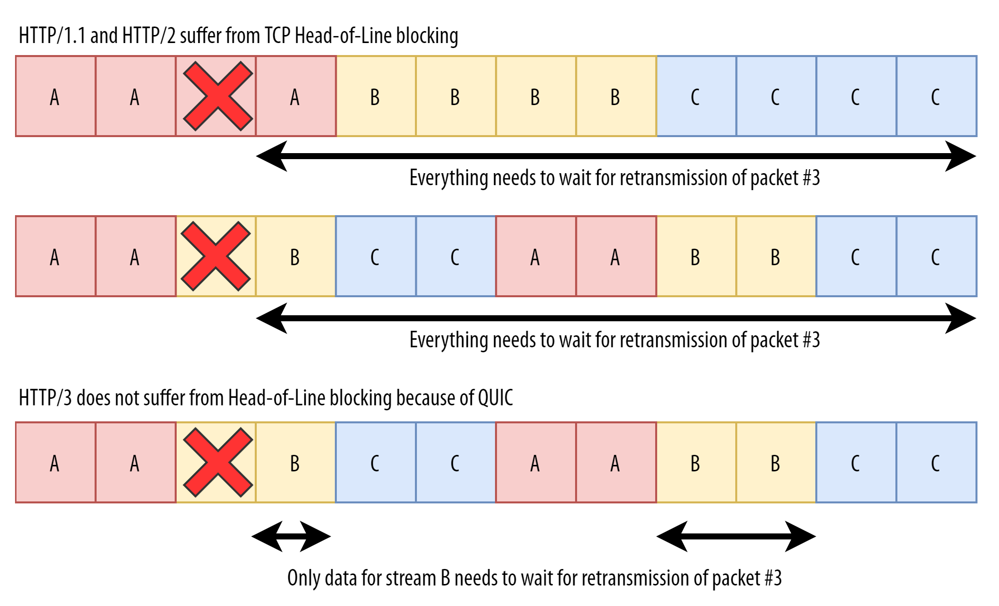
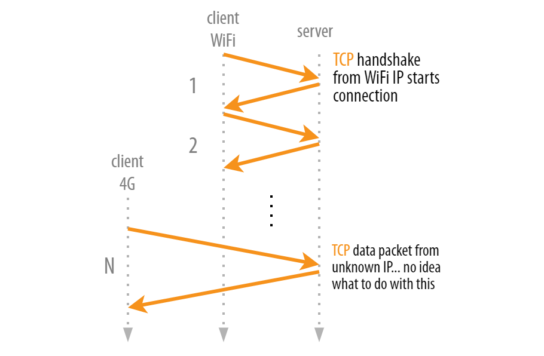
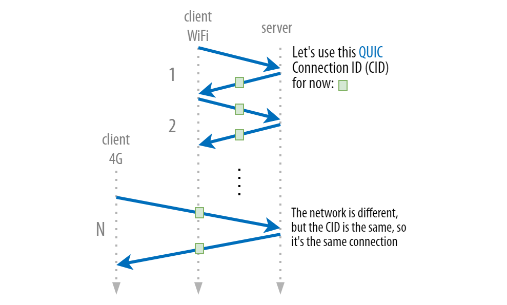
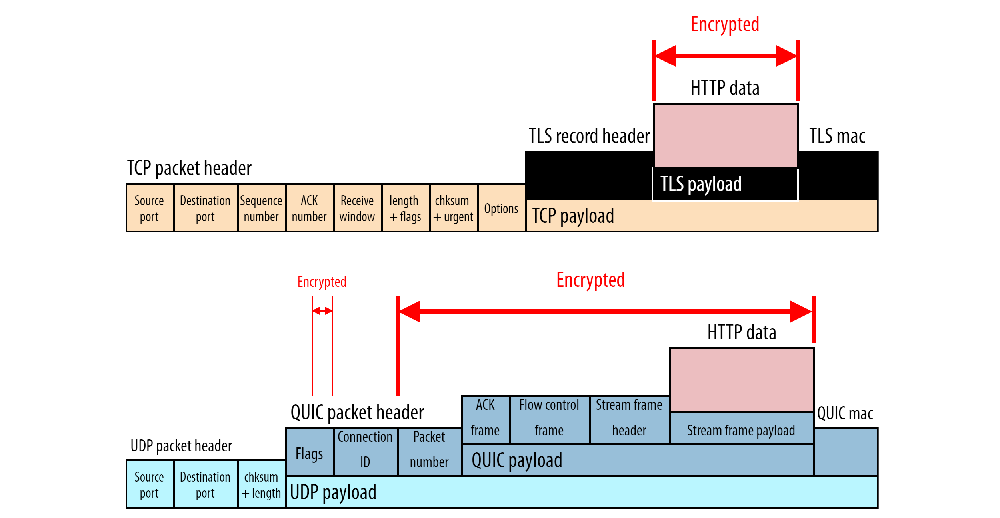

# HTTP3 概述

HTTP/3 实际上是 HTTP/2-over-QUIC。

HTTP/3 并不比 HTTP/2 快，因为我们把 TCP 换成了 UDP。取而代之的是，我们重新构想并实现了更高级的 TCP 版本，并将其称为 QUIC。因为我们想让 QUIC 更易于部署，所以我们在 UDP 上运行它。

接下来从以下几个方面，了解 HTTP/2-over-TCP 协议的局限，以及QUIC协议如何解决这些问题：
- 连接握手和往返时间
- HTTP资源加载和多路复用
- 网络切换
- 数据安全
- 数据标头和帧
- 协议升级

# 连接握手和往返时间

TCP通过三次握手建立连接，并采用序列号、确认应答等机制保证数据的可靠传输。

由于TCP本身不提供数据加密，通常使用TLS进行加密。根据TLS版本不同，需要2次（TLSv1.2）或者1次（TLSv1.3）握手。

在新建HTTPS连接的场景，使用HTTP2 + TCP + TLSv1.3，需要2次RTT才能开始传输应用层数据。
对于连接恢复的场景，也需要1个RTT。

QUIC 握手结合了加密和传输参数的协商。QUIC 通过将传输和加密握手合二为一，已经将典型连接的握手过程缩短了整整一个往返。

# HTTP资源加载和TCP多路复用

## HTTP资源加载

对于 HTTP/1.1，资源加载过程非常简单，因为每个文件都有自己的 TCP 连接并完整下载。
但是这样做效率很低，因为每个新连接都会产生一些开销。

在实践中，浏览器对可以使用的并发连接数（因此可以并行下载的文件数）施加了限制——通常，每次页面加载 6 到 30 个。然后，一旦前一个文件完全传输，连接将被重新用于下载新文件。

为了优化这个场景，HTTP/2 使用单个 TCP 连接下载不同的资源。底层使用TCP 多路复用能力。

## TCP多路复用，以及队头阻塞问题

TCP 多路复用是指在一条 TCP 连接上同时传输多个数据流。

但是，TCP从来都不是为通过单个连接传输多个独立的文件而设计的。TCP认为它只传输一个文件X，它并不关心它所看到的XXXXXXXXXXXX实际上是HTTP级别的AABBCCAABBCC。

这会产生队头阻塞问题。

>队头阻塞（Head-of-Line Blocking）： 当一个数据包发生丢失或乱序时，后续的数据包只能等待重传，导致整个连接上的数据传输都受到影响。

TCP 多路复用的问题：
- 队头阻塞： 当一个数据包发生丢失或乱序时，后续的数据包只能等待重传，导致整个连接上的数据传输都受到影响。
- 拥塞控制的挑战： 多个数据流共享一条连接，如何进行公平的拥塞控制是一个复杂的问题。
- 头部扩展： 每个数据包都需要携带端口号等信息，导致头部开销增加。

为了缓解HoL问题，QUIC将连接拆分成多个独立的流，每个流都可以独立地发送和接收数据。即使一个流中的数据包丢失，也不会影响其他流的数据传输，从而避免了队头阻塞。

扩展: 
[Head-of-Line Blocking in QUIC and HTTP/3: The Details](https://calendar.perfplanet.com/2020/head-of-line-blocking-in-quic-and-http-3-the-details/)

# 网络切换

为了定义跨机器和应用程序的唯一连接，TCP使用 4 元组：`客户端 IP 地址 + 客户端端口 + 服务器 IP 地址 + 服务器端口`。

在 TCP 中，连接仅由 4 元组标识。因此，如果这四个参数中只有一个发生变化，则连接将变为无效，需要重新建立（包括新的握手）。

考虑手机从WiFI网络环境切换到数据网络场景。TCP因为客户端IP地址发生变化，因此要重新发起握手请求。

重新启动 TCP 连接可能会产生严重影响（等待新的握手、重新启动下载、重新建立上下文）。为了解决这个问题，QUIC引入了一个新概念，称为连接标识符（CID）。每个连接都在 4 元组的顶部分配另一个数字，该元组在两个端点之间唯一标识它。

CID 是在 QUIC 本身的传输层定义的，因此在网络之间移动时它不会改变。

为了实现这一点，CID 包含在每个 QUIC 数据包的前面，并且未加密。

通过这种设置，即使 4 元组中的一个内容发生变化，QUIC 服务器和客户端只需要查看 CID 就知道它是相同的旧连接，然后他们就可以继续使用它。

如果我们确实只使用一个 CID，那么黑客和窃听者将非常容易地跨网络跟踪用户，并通过扩展推断出他们（大致的）物理位置。为了防止这种隐私噩梦，QUIC 每次使用新网络时都会更改 CID。

客户端和服务器就一个（随机生成的）CID的通用列表达成一致，这些CID都映射到相同的概念“连接”。

例如，他们都知道 CID K、C 和 D 实际上都映射到连接 X。因此，虽然客户端可能会在 Wi-Fi 上使用 K 标记数据包，但它可以在 4G 上切换到使用 C。这些常见列表在 QUIC 中是完全加密的，因此潜在的攻击者不会知道 K 和 C 实际上是 X，但客户端和服务器会知道这一点，并且可以保持连接。

# 数据安全

>在互联网的早期，加密流量在处理方面是相当昂贵的。此外，它也被认为不是所有用例都必需的。因此，从历史上看，TLS是一个完全独立的协议，可以选择性地在TCP之上使用。这就是为什么我们区分了 HTTP（不带 TLS）和 HTTPS（带 TLS）。
>
>随着时间的流逝，我们对互联网安全的态度当然已经转变为“默认安全”。因此，虽然理论上 HTTP/2 可以直接在 TCP 上运行，而无需 TLS（这在 RFC 规范中甚至被定义为明文 HTTP/2），但没有（流行的）Web 浏览器实际上支持此模式。

QUIC 使用 TLS 加密每个单独的数据包，而 TLS-over-TCP 可以同时加密多个数据包。

QUIC 还加密了几乎所有的数据包标头字段；传输层信息（例如数据包号，这些数据包号永远不会对 TCP 进行加密）。因此 QUIC 具有更高的加密开销。

QUIC协议中存在未加密数据：
- 握手阶段： 在QUIC连接建立的初始阶段，客户端和服务器之间需要交换一些信息来协商加密参数、版本号等。这些信息在加密套件建立之前是明文传输的。
- 包头： QUIC数据包的头部通常包含一些未加密的信息，如版本号、连接ID、包编号等。这些信息对于路由、重组数据包以及进行一些基本的协议处理是必需的。
- 控制帧： QUIC协议中的一些控制帧，比如PING帧、ACK帧等，可能包含一些未加密的信息，用于维护连接状态和进行流量控制。

# 数据标头和帧

与TCP不同，QUIC不使用单个固定数据包头来发送所有协议元数据。取而代之的是，QUIC 具有较短的数据包标头，并在数据包有效载荷内部使用各种“帧”（有点像微型专用数据包）来传达额外信息。例如，有一个帧（用于确认）、一个帧（用于帮助设置连接迁移）和一个帧（用于携带数据）

使用帧的一个非常有用的副作用是，将来将新的帧类型定义为 QUIC 的扩展将非常容易。

# 协议升级

TCP协议已经存在和广泛使用许多年，许多其他设备位于客户端和服务器之间，这些设备也具有自己的TCP代码（例如，防火墙，负载均衡器，路由器，缓存服务器，代理等）。

由于存在大量中间黑盒设备，升级TCP协议是一件艰难的事情。

我们需要一个替代TCP协议，而不是直接升级，以解决这些问题。

QUIC协议，对数据包加密，避免被中间黑盒设备窥探；同时得益于帧的设计，未来扩展方便。

# QUIC vs TCP

| 特性 | QUIC | TCP |
|---|---|---|
| **传输层协议** | UDP | TCP |
| **连接类型** | 无连接（但有类似连接的概念） | 面向连接 |
| **可靠性** | 通过拥塞控制和重传机制实现可靠传输 | 通过序列号、确认应答、重传等机制实现可靠传输 |
| **有序传输** | 允许无序到达，接收端重组 | 严格有序传输 |
| **多路复用** | 支持多个流，每个流独立 | 每个连接一个流 |
| **队头阻塞问题** | 较少 | 较多 |
| **数据包标头** | 变长。较短 | 固定。较长 |
| **头部压缩** | 支持头部压缩，减少包大小 | 不支持头部压缩 |
| **拥塞控制** | 基于流的拥塞控制，更灵活 | 基于窗口的拥塞控制 |
| **连接迁移** | 支持更灵活的连接迁移 | 连接迁移相对困难 |
| **延迟** | 较低延迟 | 延迟相对较高 |
| **应用场景** | 实时通信（如视频会议、在线游戏）、HTTP/3 | 文件传输、邮件等 |
| **安全性** | 内置TLS加密，安全性更高。QUIC协议对每个数据包加密。 | 需要单独配置SSL/TLS。依赖应用层对数据加密。 |
| **协议升级** | 容易 | 困难。大量中间盒子网络设备。 |

# 小结：QUIC 协议

QUIC 是一种面向连接的协议，可在客户端和服务器之间建立有状态的交互。

QUIC 握手结合了加密和传输参数的协商。QUIC 通过将传输和加密握手合二为一，已经将典型连接的握手过程缩短了整整一个往返。 QUIC 集成了 TLS 握手，但使用了定制的框架来保护数据包。 

通过减少一个额外的握手往返，QUIC 实现了真正的 0-RTT 连接建立（特定场景）。

QUIC 支持多个独立的字节流。

QUIC 连接并不严格受限于单一网络路径。 连接迁移使用连接标识符，允许连接转移到新的网络路径。 

