# 为什么需要HTTP头部压缩

HTTP 请求和响应头部中包含了许多元数据，如User-Agent、Cookie、Accept、Host等，这些字段在每个请求中都可能会重复出现。对于 HTTP/1.x，每次请求或响应都会传输完整的头部信息，随着 Web 应用程序的复杂性增加，这些头部信息的大小可能会变得非常大，导致网络带宽的浪费。

HTTP/1.x 时代，为了减少头部消耗的流量，有很多优化方案可以尝试，例如合并请求、启用 Cookie-Free 域名等等，但是这些方案或多或少会引入一些新的问题。

# 题外话：Cookie-Free

HTTP/1.x 减少传输header的一个策略是Cookie-Free。

- Cookies 的开销：Cookies 是存储在客户端（浏览器）上的一小段数据，通常用于跟踪用户的会话状态或其他信息。每次浏览器向服务器发送 HTTP 请求时，都会自动附加这些 Cookies 数据，即使是对于静态资源的请求，这会增加每个请求的大小，造成不必要的网络开销。

- Cookie-Free 资源：为了减少这种不必要的开销，Cookie-Free 的策略是在不同的域名（或子域名）上托管静态资源，这个域名不设置 Cookies。因为没有与该域名关联的 Cookies，浏览器在请求这些静态资源时不会附加 Cookies，从而减少了每次请求的数据量。

# HTTP2 HPACK

HTTP/2 引入了 HPACK 作为头部压缩机制，以解决这一问题。
- 通过静态哈夫曼代码对传输的标头字段进行编码，从而减小数据传输的大小。
- 单个连接中，client 和 server 共同维护一个相同的标头字段索引列表，此列表在之后的传输中用作编解码的参考。

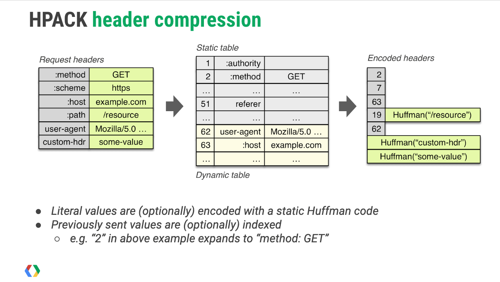


## 哈夫曼编码

HPACK 使用哈夫曼编码对头部字段进行压缩，将头字段的名称和值编码为二进制格式。这种压缩方式减少了数据的冗余，提高了传输效率。

## 静态表

HPACK 使用了一个预定义的静态表，包含常见的61个 HTTP 头字段及其常用值。这些静态表是固定的，且由所有 HTTP/2 实现共享，因此无需在传输时重复发送相同的头部字段。

例如，`:method: GET` 或 `:status: 200` 这些常见的头部就可以在静态表中查找，而不需要在每个请求或响应中重新发送。


## 动态表

动态表包含以先进先出的顺序维护的 header 字段列表。动态表中的第一个条目和最新条目在最低索引处，而动态表的最旧条目在最高索引处。

动态表可以包含重复的条目（即，具有相同名称和相同值的条目）。

动态表用于存储在会话期间动态生成的头字段及其值。这个表会在客户端和服务器之间同步更新，允许在会话过程中重复使用已发送的头字段，进一步减少数据传输量。

动态表是可变大小的，头部字段可以添加到表中，当表满时，最旧的条目会被移除。

## 索引地址空间

静态表和动态表被组合到单个索引地址空间中。

在 1 和静态表的长度（包括在内）之间的索引是指静态表中的元素。严格大于静态表长度的索引是指动态表中的元素。

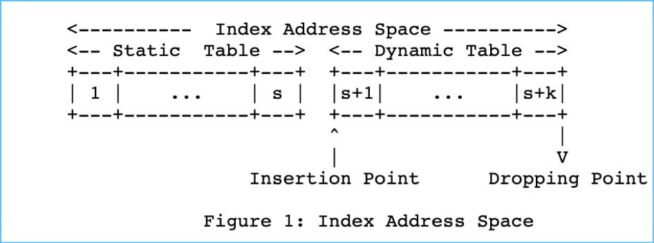

## 头部索引

当一个头部字段或字段值在静态表或动态表中找到时，HPACK 只需要发送相应的索引，而不需要发送整个头部字段及其值。
例如，如果 `:method: GET` 已在静态表中定义，客户端只需发送索引，而不需要发送完整字符串。
头部块：

HPACK 将一组 HTTP 头字段打包成一个“头部块”（Header Block），然后进行压缩。客户端和服务器可以通过流 ID 来识别这些头部块，并独立处理它们。


# HPACK 数据类型

HPACK 编码使用两种原始类型：无符号的可变长度整数和八位字节字符串。

## 整数

在 HPACK（用于 HTTP/2 的头部压缩算法）中，整数的编码采用了一种称为 N 位前缀编码（N-Prefix Coding） 的方法。

N-prefix coding 的核心思想是将整数划分为两部分：
- 前缀 (Prefix): 使用固定数量的比特（由 N 决定）来表示整数的低位部分。
- 后缀 (Continuation): 如果整数无法用前缀表示完毕，则需要使用后续的字节继续编码，形成一个可变长度的整数表示。


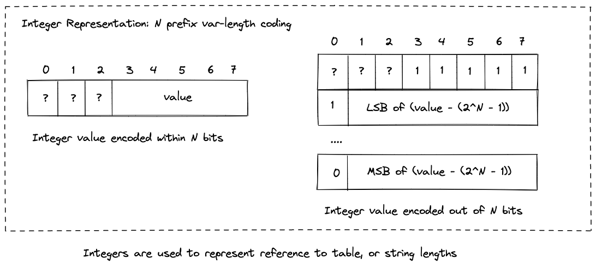

### 编码原理

1. **前 N 位作为前缀位**：在编码整数时，首先使用一个字节的前 N 位（最高位）来存储部分整数值或指示后续字节的存在。N 的取值依赖于具体的上下文，常见的有 4、5、6、7 或 8。

2. **前缀值范围**：前 N 位所能表示的最大整数为 \( 2^N - 1 \)。如果要编码的整数小于该值，直接将其放入前 N 位，编码过程结束。

3. **整数超出前缀范围**：

   - **前 N 位全为 1**：表示整数值超出了前 N 位所能表示的范围，需要使用额外的字节。
   - **剩余值计算**：计算剩余的整数值 \( I - (2^N - 1) \)。

4. **可变长度后续字节**：

   - 将剩余值按 7 位分组，每组使用一个字节表示。
   - **延续位（Continuation Bit）**：每个字节的最高位（第 8 位）作为延续位。
     - 如果后面还有更多字节，延续位设为 1。
     - 如果这是最后一个字节，延续位设为 0。
   - **数值位**：字节的低 7 位用于存储实际的数值部分。


```
if I < 2^N - 1, encode I on N bits
   else
       encode (2^N - 1) on N bits
       I = I - (2^N - 1)
       while I >= 128
            encode (I % 128 + 128) on 8 bits
            I = I / 128
       encode I on 8 bits

```


### 解码原理

解码时，接收方按照以下步骤还原整数：

1. **读取前 N 位**：如果前 N 位小于 \( 2^N - 1 \)，直接得到整数值。

2. **处理超出范围的值**：

   - 如果前 N 位为 \( 2^N - 1 \)，初始化整数值为 \( 2^N - 1 \)。
   - 读取后续字节，按位移和累加的方式重建整数值。


```
   decode I from the next N bits
   if I < 2^N - 1, return I
   else
       M = 0
       repeat
           B = next octet
           I = I + (B & 127) * 2^M
           M = M + 7
       while B & 128 == 128
       return I
```


## 字符串字面量（String Literal）

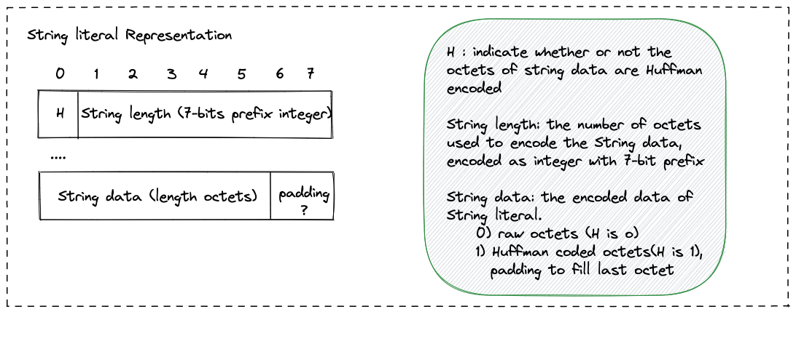

### 字符串字面量编码步骤

1. **Huffman 编码标志位**：
   - 首先，HPACK 会使用 1 个比特位来指示是否启用了 Huffman 编码。
     - 如果第一个比特位为 `1`，表示启用了 Huffman 编码。
     - 如果第一个比特位为 `0`，表示使用原始字节表示字符串。

2. **字符串长度**：
   - 紧接着是一个用来表示字符串长度的整数值。这个整数的编码使用的是 N-Prefix Coding（通常是 7 位前缀编码）。
   - 如果字符串长度小于 127（7 位前缀可以表示的最大值），那么直接将其写入。
   - 如果字符串长度大于 127，那么将长度分片存储在多个字节中，具体的编码方式遵循 N-Prefix Coding 的规则。

3. **字符串内容**：
   - 接着是实际的字符串内容。
   - 如果 Huffman 编码标志位为 `1`，则字符串内容会先经过 Huffman 编码。
   - 如果标志位为 `0`，字符串内容直接按原始字节序列写入。


# HPACK 二进制编码

这部分内容整理自： [详解 HTTP/2 头压缩算法 —— HPACK](https://halfrost.com/http2-header-compression/)

## 1. Name 和 Value 都在索引表(包括静态表和动态表)

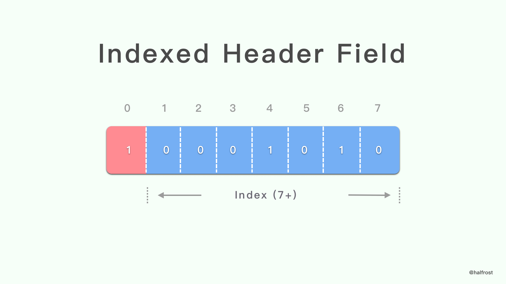

索引 header 字段以 1 位模式 “1” 开头，后跟匹配 header 字段的索引，以 7 位前缀的整数表示。


## 2.1 Name 在索引表(包括静态表和动态表)中，Value 需要编码传递，并同时新增到动态表中

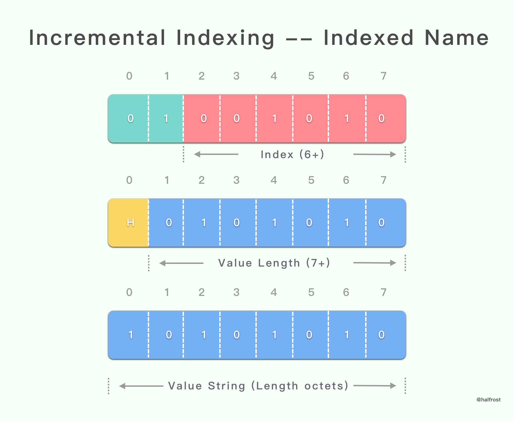

具有增量索引表示的字面 header 字段以 `01` 2 位模式开头。

## 2.2 Name 和 Value 都需要编码传递，并同时新增到动态表中

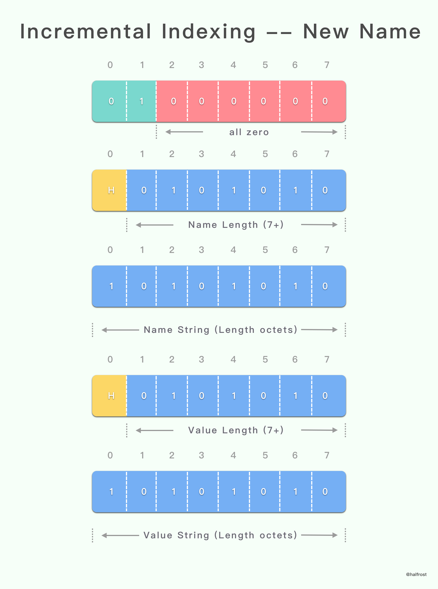

具有增量索引表示的字面 header 字段以 `01` 2 位模式开头。

## 3.1 Name 在索引表(包括静态表和动态表)中，Value 需要编码传递，并不新增到动态表中

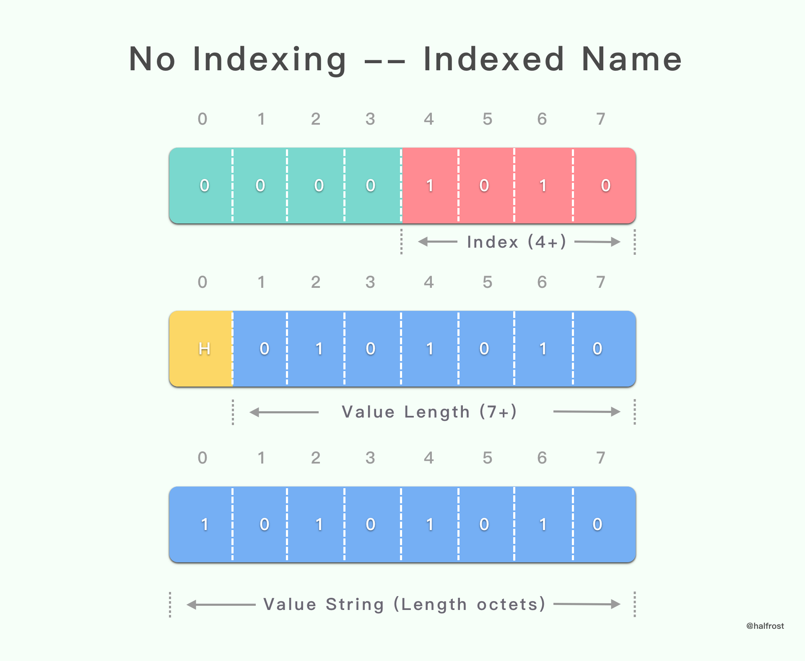

没有索引表示的字面 header 字段以 `0000` 4 位模式开头。

## 3.2 Name 和 Value 需要编码传递，并不新增到动态表中

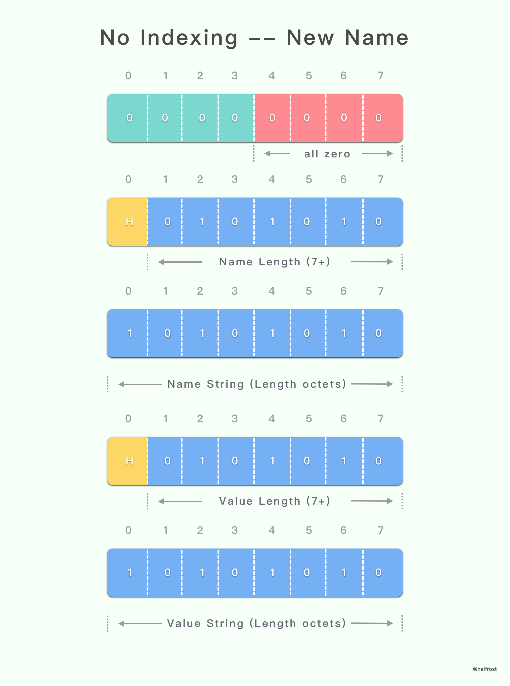

没有索引表示的字面 header 字段以 `0000` 4 位模式开头。

## 4.1 Name 在索引表(包括静态表和动态表)中，Value 需要编码传递，并永远不新增到动态表中 

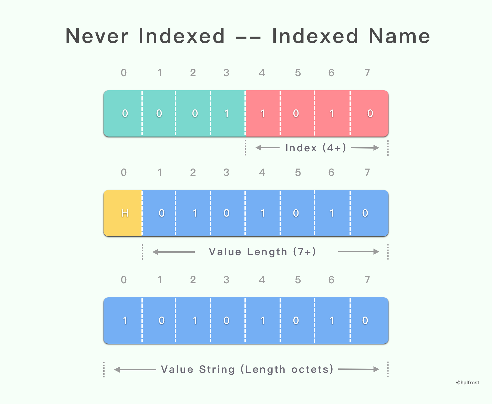

字面 header 字段永不索引的表示形式以 `0001` 4 位模式开头。


## 4.2 Name 和 Value 需要编码传递，并永远不新增到动态表中

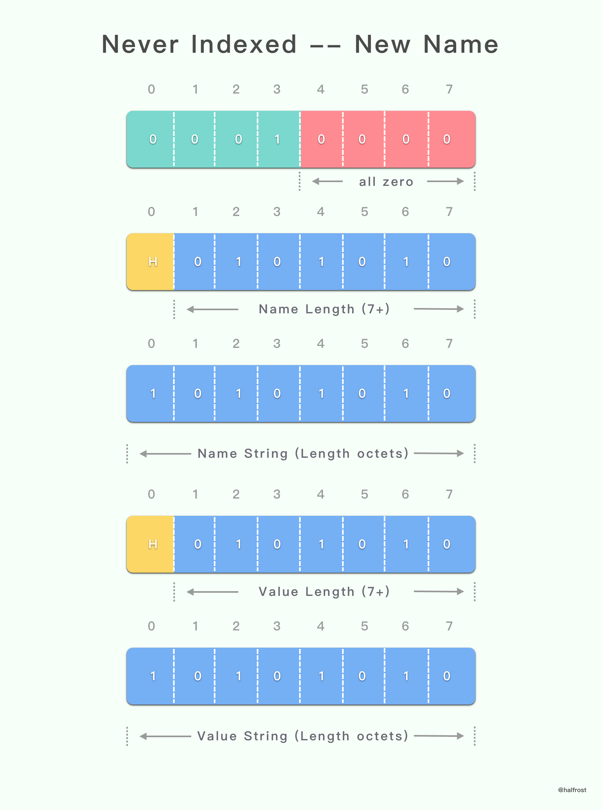

字面 header 字段永不索引的表示形式以 `0001` 4 位模式开头。

## 5 动态表大小更新

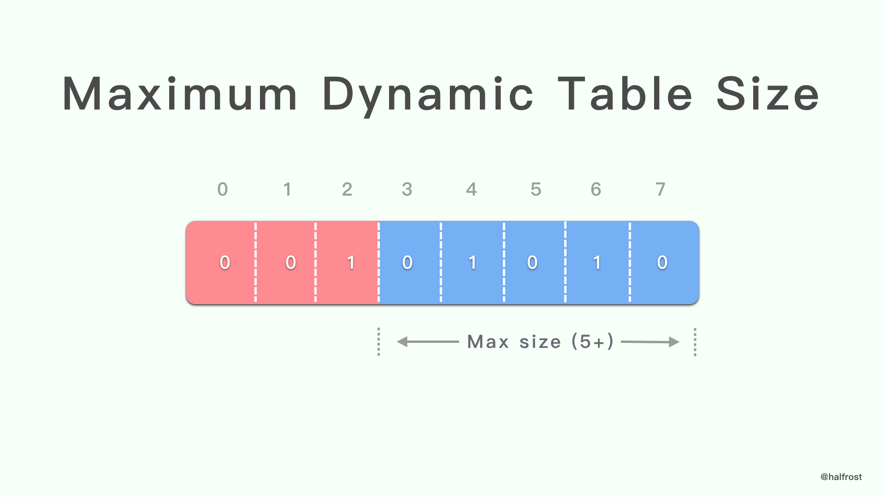

动态表 size 更新从 “001” 3 位模式开始，然后是新的最大 size，以 5 位前缀的整数表示。

# HTTP2 HPACK 的不足

- HOL 阻塞：由于 TCP 的顺序传输特性，如果某个数据包未能按顺序到达（例如丢包或网络延迟），则该数据包后面的所有数据包都必须等待。这在 HTTP/2 中意味着，如果某个头部块未能按顺序到达，整个流可能会被阻塞，直到缺失的数据包被成功传输和处理。这种情况会导致性能下降，特别是在高延迟或不稳定的网络环境中。

- HPACK 的动态表依赖性：HPACK 的动态表在请求和响应之间共享，并且会随着传输的进行而更新。如果某个更新动态表的头部块丢失了，后续的头部块可能无法正确解码，这会导致整个流的阻塞，进一步加剧 HOL 阻塞问题。

# HTTP3 QPACK

为了适应 HTTP/3 的非顺序传输机制（HTTP/3 基于 QUIC 协议，后者允许数据包乱序到达），QPACK 被设计出来，以解决 HPACK 在 HTTP/3 中可能引发的 HOL 阻塞问题。


## QPACK 的特点


- 两个动态表: QPACK 采用了两个动态表，一个在编码端（客户端或服务器端）用于添加新条目，另一个在解码端用于查找和匹配传输的头部字段。这两个动态表是独立维护的，确保了头部字段的有效压缩和传输。
- 头字段块：在 QPACK 中，头字段被编码为头字段块，并且与数据帧分离。头字段块可以与数据帧并行传输，而不会阻塞数据的发送。
- 引用机制：QPACK 中的头字段块可以引用动态表中的条目，使用基于索引的方式来表示这些条目。由于 HTTP/3 的多路复用特性，这种引用不会阻塞其他流的数据传输。
- 独立解码: QPACK 的设计允许头部字段可以独立解码，而无需等待之前的数据包，这大大减少了 HOL 阻塞问题。
- 乱序传输: 与 HPACK 不同，QPACK 允许头部块和数据块乱序传输。这是因为 QUIC 允许数据包乱序到达，并且每个数据包都有独立的确认机制，不再依赖于顺序传输。
- Insert Count：QPACK 引入了 Insert Count 来表示动态表的更新进度。编码器和解码器使用这个计数值来同步动态表的状态。

# 参考

- [HTTP/2 头部压缩技术介绍](https://imququ.com/post/header-compression-in-http2.html)
- [详解 HTTP/2 头压缩算法 —— HPACK](https://halfrost.com/http2-header-compression/)
- [QPACK: Field Compression for HTTP/3](https://autumnquiche.github.io/RFC9204_Chinese_Simplified/)
- [HTTP/2.0 Header Compression](https://kiosk007.top/post/http-2-0-header-compression)
- [HPACK explained in detail](https://kapsterio.github.io/test/2021/07/29/hpack-explained.html)
