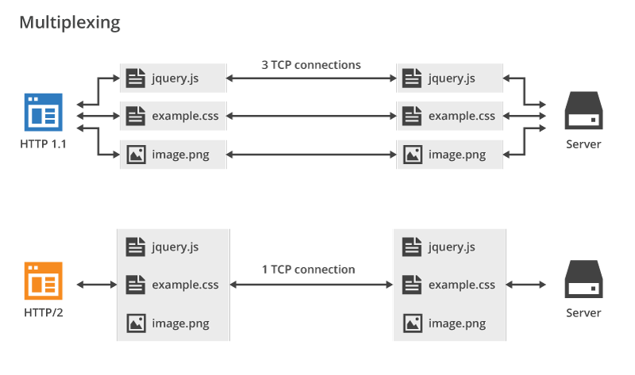
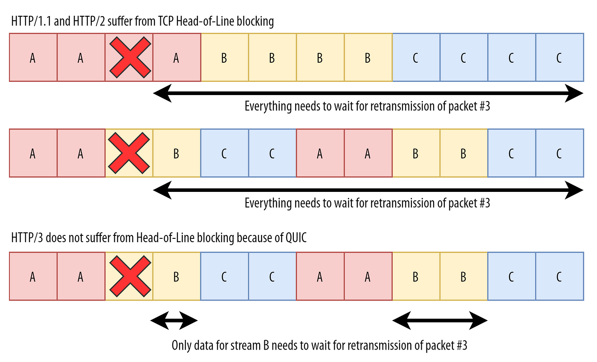
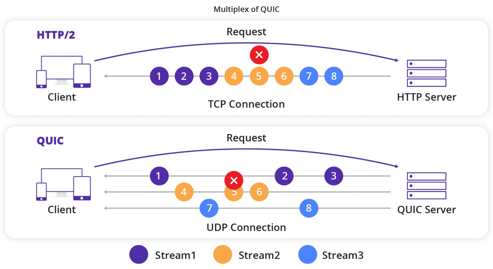

# HTTP 资源下载问题

在 HTTP/1.1 中，每个连接只能有一个活动资源，从而导致 HTTP 级别的线头 （HoL） 阻塞。由于连接数的上限仅为 6 到 30 个，因此资源捆绑（将较小的子资源合并为一个较大的资源）是长期以来的最佳实践。

今天，我们仍然在 Webpack 等打包器中看到了这一点。同样，资源通常内联在其他资源中（例如，关键 CSS 内联在 HTML 中）。

使用 HTTP/2 时，单个连接会多路复用资源，因此您可以有更多未完成的文件请求（换句话说，单个请求不再占用您宝贵的少数连接之一）。

# 什么是队头阻塞

TCP协议在传输数据时，为了保证数据的顺序性和可靠性，采用了字节流的方式。

虽然HTTP/2在应用层上支持多路复用，但是底层的TCP协议，并不支持。TCP并不知道里面传输的数据包属于哪个文件。

由于每个连接只有一个发送窗口，所有数据都按照顺序放入这个窗口中。

当窗口中的第一个数据包（即队头）未被确认时，后续的数据包即使准备好发送，也只能等待，这就造成了所谓的队头阻塞问题。

# QUIC是如何解决队头阻塞问题的

QUIC协议通过引入多路复用和流的概念，有效地解决了TCP的队头阻塞问题。

- 多路复用： QUIC允许在一个连接上同时传输多个数据流，每个流都有独立的窗口和序列号。这样，即使一个流的队头阻塞，也不会影响其他流的传输。
- 流的概念： QUIC将数据分成多个流，每个流可以有不同的优先级和流量控制参数，使得QUIC能够更好地适应不同的应用场景。

# 参考资料

- [Head-of-Line Blocking in QUIC and HTTP/3: The Details](https://calendar.perfplanet.com/2020/head-of-line-blocking-in-quic-and-http-3-the-details/)

