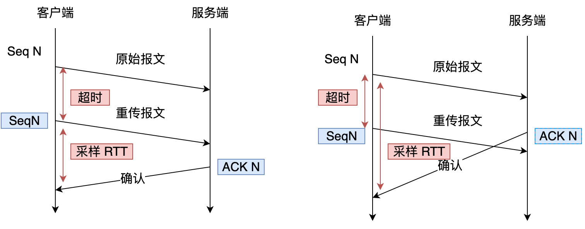
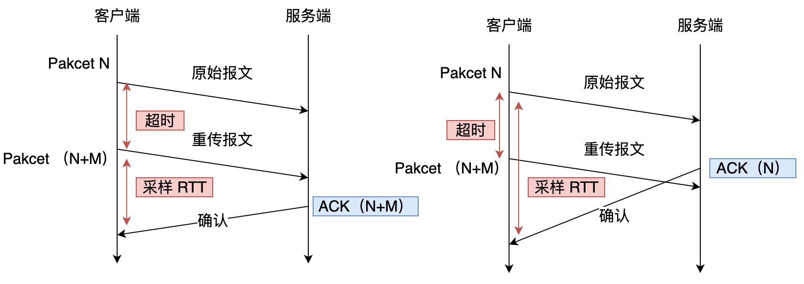

# 拥塞控制的问题背景

影响网络传输的因素：
- TCP连接不会以全带宽开始发送数据，因为这最终可能会导致网络过载（或拥塞）。
- 事先不知道最大带宽是多少。它通常取决于端到端连接中某处的瓶颈，但我们无法预测或知道这将在哪里。
- 即使我们知道可用的物理带宽，这并不意味着我们可以自己使用所有带宽。通常有多个用户同时在网络上处于活动状态，每个用户都需要相当一部分可用带宽。
- 一个连接不知道它可以预先安全或公平地使用多少带宽，并且随着用户加入、离开和使用网络，此带宽可能会发生变化。

TCP使用拥塞控制的机制来发现一段时间内的可用带宽。

TCP使用慢启动方式，需要一段时间才能达到最佳发送速率，具体取决于 RTT 和实际可用带宽。

QUIC实际上使用与TCP非常相似的带宽管理技术。它也从较低的发送速率开始，并随着时间的推移而增长，使用确认作为衡量网络容量的关键机制。

# QUIC 流量控制

QUIC 并没有引入TCP那样的滑动窗口的概念，而是采用一种“限额(limit-base)”流控方案，接收方在一个特定的流上或者整个连接上，给出一个自己能够处理的最大字节数。发送方发送的数据不能超过这两个（流和连接）“限额”。若是达到“限额”，就需要阻塞等待发送方增加限额的命令。

QUIC中有两个级别的数据流控制：

- 基于流的流控，它通过限制可以在单个流上可发送的数据量来防止单个流消耗整个连接的接收缓区。
- 基于连接的流控，它通过限制所有流上通过STREAM帧发送的流数据的总字节数来防止发送方超出接收方的连接缓冲区容量。

QUIC 实现流量控制的方式：
- 通过 window_update 帧告诉对端自己可以接收的字节数，这样发送方就不会发送超过这个数量的数据。
- 通过 BlockFrame 告诉对端由于流量控制被阻塞了，无法发送数据。

参见：[Flow control in QUIC](https://docs.google.com/document/d/1F2YfdDXKpy20WVKJueEf4abn_LVZHhMUMS5gX6Pgjl4/mobilebasic)

# 包号和顺序号

TCP 将发送端的传输顺序与接收端的交付顺序合并在一起，这会导致携带相同序列号的相同数据的重传，从而导致 “重传歧义”。

QUIC将两者分开：QUIC 使用包号来指示传输顺序，并且所有的应用程序数据都在一个或多个流中发送，交付顺序由 STREAM 帧中编码的流偏移确定。

## TCP 重传歧义问题

引用自：[如何基于 UDP 协议实现可靠传输](https://www.cnblogs.com/xiaolincoding/p/16347800.html)

>当 TCP 发生超时重传后，客户端发起重传，然后接收到了服务端确认 ACK 。由于客户端原始报文和重传报文序列号都是一样的，那么服务端针对这两个报文回复的都是相同的 ACK。
>
>这样的话，客户端就无法判断出是「原始报文的响应」还是「重传报文的响应」，这样在计算 RTT（往返时间） 时应该选择从发送原始报文开始计算，还是重传原始报文开始计算呢？
>
>- 如果算成原始报文的响应，但实际上是重传报文的响应（上图左），会导致采样 RTT 变大；
>- 如果算成重传报文的响应，但实际上是原始报文的响应（上图右），又很容易导致采样 RTT 过小；

## QUIC 的单调递增的包序列号

QUIC协议通过引入单调递增的包序列号这一机制，巧妙地解决了TCP的重传歧义问题。

引用自：[如何基于 UDP 协议实现可靠传输](https://www.cnblogs.com/xiaolincoding/p/16347800.html)

>QUIC 报文中的 Pakcet Number 是严格递增的， 即使是重传报文，它的 Pakcet Number 也是递增的，这样就能更加精确计算出报文的 RTT。
>
>如果 ACK 的 Packet Number 是 N+M，就根据重传报文计算采样 RTT。如果 ACK 的 Pakcet Number 是 N，就根据原始报文的时间计算采样 RTT，没有歧义性的问题。

QUIC 较高的包号表示该数据包是较晚发送的，而较低的包号表示该数据包发送的较早。当检测到包含 ACK 诱发帧的包丢失时，QUIC 会将必要的帧重新打包进具有新包号的新数据包中，则当收到 ACK 时，这种做法可以消除该 ACK 在确认哪个数据包的歧义性。因此，可以进行更精确的 RTT 测量，很容易检查到虚假重传，并且可以仅仅基于包号来统一应用诸如快速重传这样的机制。

单调递增的包序列号这一机制，另一个好处是可以让数据包不再像 TCP 那样必须有序确认，QUIC 支持乱序确认，当数据包Packet N 丢失后，只要有新的已接收数据包确认，当前窗口就会继续向右滑动。

# No SACK Reneging

一旦一个包被对端确认，则这个包不能再被申明为丢失。这样的设定大大简化了双端传输协议的设计，也减小了发送端的内存压力。

## 什么是 SACK Reneging？

在TCP协议中，SACK（Selective Acknowledgement，选择性确认）允许接收端告诉发送端哪些数据已经正确接收，哪些数据丢失。然而，SACK Reneging指的是接收端有权撤回之前在SACK中确认的数据。也就是说，接收端可以告诉发送端某个数据包已经收到了，但随后又告诉发送端这个数据包丢失了。

使用场景：
- 回退N帧（Go-Back-N）协议： 在某些协议中，如果接收端发现一个数据包出错，会要求发送端重传从出错的数据包开始的所有数据包。
- 选择重传（Selective Repeat）协议： 即使是选择重传协议，也可能需要保留一些已确认的数据包，以便在发生错误时进行重传。

## QUIC的 No SACK Reneging

QUIC协议中引入了No SACK Reneging的概念，意思就是一旦接收端确认了一个数据包，就不能再撤销这个确认。换句话说，QUIC不允许发生SACK Reneging。

## 为什么QUIC要禁止SACK Reneging？

- 简化实现： 禁止SACK Reneging可以大大简化发送端的实现。发送端只需要维护一个简单的重传队列，而不需要担心接收端会突然撤回之前的确认。
- 提高可靠性： 一旦一个数据包被确认，发送端就可以放心地丢弃这个数据包的副本，从而减少内存占用。如果允许SACK Reneging，发送端就必须一直保留所有发送过的数据包，以防接收端撤销确认。
- 增强安全性： 禁止SACK Reneging可以防止恶意节点利用SACK Reneging来攻击其他节点。

# 更多 ACK 范围

TCP支持3个ACK范围，QUIC则支持255个 ACK 范围。在高丢包环境，这将加速恢复，降低伪重传，并确保发送过程不依赖于超时。

# 延迟确认 ACK 提案

选择更激进的方法可能会在高带宽和高延迟网络上获得更好的结果（比如卫星网络），尤其是在不关心偶尔的数据包丢失的情况下。QUIC的延迟确认频率延长提案。默认情况下，QUIC 每接收 2 个数据包发送一次确认，而此扩展允许端点每 10 个数据包确认一次。这已被证明在卫星和非常高带宽的网络上具有很大的速度优势，因为传输确认数据包的开销降低了。

确认频率调整:
- 基于时间间隔: 每隔固定的时间间隔发送ACK包，而不是在收到每个数据包后立即发送。
- 基于数据量: 当接收缓冲区达到一定的数据量时，再发送ACK包。
- 基于事件触发: 在特定的事件发生时（如接收到特定类型的包、连接空闲等）发送ACK包。

确认合并:
- 将多个ACK包合并为一个，减少ACK包的数量。

# RTT测量方式

TCP使用基于样本的方式计算RTT，受延迟ACK、重传等因素影响，精度相对较低。

QUIC 协议将计算从接收包到发送该包 ACK 之间的延迟时间，并显式写入 ACK 帧中。

通过在ACK帧中包含ACK Delay信息，发送方可以更精确地估计往返时延（RTT）。传统的RTT估计方法往往会受到网络抖动和拥塞的影响，而ACK Delay则直接反映了接收端处理数据包所花费的时间，从而提高了RTT估计的准确性。

| 特征 | TCP | QUIC |
|---|---|---|
| RTT测量方式 | 基于样本RTT的计算，使用加权平均算法平滑 | 基于ACK延迟时间，计算网络传输时间与ACK延迟时间之和 |
| RTT估计精度 | 受延迟ACK、重传等因素影响，精度相对较低 | 通过显式写入ACK延迟时间，提高了RTT估计的准确性 |
| 复杂网络环境适应性 | 适应性相对较弱 | 能够适应多路径传输和复杂的网络环境 |
| 拥塞控制 | 基于RTT估计的拥塞控制算法，如AIMD | 基于更准确的RTT估计和多路径信息，拥塞控制算法性能更佳 |
| 其他 | 使用Karn算法和Pausch算法处理重传 | 支持多路径RTT测量，并使用更精细的RTT估计方法 |

# 探测超时机制

QUIC 协议使用 PTO（probe timeout）探测超时机制，代替TCP的RTO & TLP，包含了对端的期望最大确认延时，而不是一个固定的最小超时。

## QUIC的PTO机制

PTO的工作原理：
- PTO计时器的启动： 当一个数据包被发送出去后，就会启动一个PTO计时器。
- PTO超时： 如果在PTO时间内没有收到该数据包的ACK，则认为该数据包可能丢失，触发重传。
- PTO时间的计算： PTO时间是动态计算的，通常基于RTT（往返时延）估计和一个安全裕量。
- TLP（Tail Loss Probe）： QUIC的PTO机制还引入了TLP的概念。当PTO超时时，会发送一个TLP探测包。如果TLP得到了确认，说明之前的包可能已经到达，否则就认为该包确实丢失了。

QUIC协议中定义了多种PTO时间的计算公式，例如：
- 基于RTT的简单计算： PTO = RTT * 安全裕量
- 考虑ACK延迟的计算： PTO = (RTT + ACK延迟) * 安全裕量
- 基于丢包率和拥塞窗口的计算： PTO = f(RTT, 丢包率, 拥塞窗口)

其中，安全裕量（safety margin）是一个经验值，用于避免过早地认为数据包丢失。

## 对比

TCP的探测超时机制：
- RTO（Retransmission Timeout）：TCP的核心超时机制，用于判断一个数据包是否丢失。当发送端在RTO时间内未收到ACK，则认为该数据包丢失并进行重传。
- 快速重传： 当连续收到三个重复的ACK时，即使RTO未到期，也会立即重传，以加快恢复速度。

QUIC的探测超时机制：
- PTO（Probe Timeout）：QUIC主要采用PTO机制，结合了TCP的RTO和TLP（Tail Loss Probe）。PTO的计算考虑了对端的最大预估确认延迟，避免了固定最小超时时间带来的问题。
- RTO计算： QUIC也使用RTT估计来计算PTO，但其RTT估计方式更加精细，考虑了ACK延迟时间等因素。
- 尾部丢失探测： QUIC的PTO机制实现了尾部丢失探测，可以更早地检测到网络拥塞。
- 灵活的超时调整： QUIC的PTO可以根据网络状况和拥塞控制算法进行动态调整，适应性更强。

| 特征 | TCP | QUIC |
|---|---|---|
| 主要超时机制 | RTO（重传超时） | PTO（探测超时） |
| 超时计算 | 基于RTT加权平均，考虑Karn和Pausch算法 | 基于RTT估计，考虑ACK延迟时间，更加精细 |
| 丢失检测 | 主要依赖重复ACK | 结合RTO和TLP（尾部丢失探测），更早检测丢失 |
| 适应性 | 适应性较弱 | 适应性更强，可根据网络状况动态调整 |

# 最小拥塞窗口设置

TCP使用一个包的最小拥塞窗口。如果丢失单个数据包意味着发送方需要等待PTO来恢复，当接收方延迟确认时，发送一个单一的ack-eliciting包也增加了引起额外延迟。

QUIC 的最小拥塞窗口设置更加灵活，建议值为2个MSS，这有助于在发生丢包时更快地恢复发送，同时不会对网络造成过大的负担。

| 特征 | TCP | QUIC |
|---|---|---|
| 默认最小拥塞窗口 | 1个MSS | 建议2个MSS，但可灵活设置 |
| 目的 | 防止网络拥塞过分严重 | 尽快恢复发送，同时保护网络 |
| 影响因素 | 拥塞控制算法 | 网络环境、应用场景、拥塞控制算法 |

# 协议栈的实现

TCP 通常是在操作系统内核中实现的，对于大多数操作系统来说，它甚至不是开源的。因此，调整拥塞逻辑通常只能由少数开发人员完成，而且发展缓慢。

大多数 QUIC 实现目前都是在“用户空间”完成的，并且是开源的。

虽然TCP协议的实现得到操作系统和硬件级别的优化，吞吐量更高，但是QUIC协议能够更加灵活的演变和升级。

TCP更改拥塞控制算法是对系统中所有应用都生效，无法根据不同应用设定不同的拥塞控制策略。

# 总结

QUIC在拥塞控制方面的改进：
- 摒弃滑动窗口概念。使用stream和connection两个级别限流
- 多路复用，每个流独立，避免队头阻塞
- 通过显式发送帧控制流量
- 单调递增的包号，解决TCP重传歧义问题
- 使用 stream id + offset id，确认传输内容的顺序
- 支持数据包乱序确认、延迟确认。一旦确认，不允许重新发送该数据包，简化发送端设计
- 更大的ACK范围
- 使用PTO探测机制代替RTO机制，把ACK时间加入到数据包，优化RTT计算
- 支持更大的最小拥塞窗口设置
- 在应用层实现拥塞算法，更加灵活，但吞吐量比TCP低

# 参考资料

- [QUIC流控和拥塞控制](https://juejin.cn/post/7111301610935943182)
- [网易云信 QUIC 应用优化实践](https://juejin.cn/post/7091478561613152269)
- [QUIC技术创新 让视频和图片分发再提速](https://developer.aliyun.com/article/855867)
- [QUIC 丢包检测和拥塞控制](https://hanpfei.github.io/2019/08/29/draft-ietf-quic-recovery/)
- [如何基于 UDP 协议实现可靠传输](https://www.cnblogs.com/xiaolincoding/p/16347800.html)
- [Flow control in QUIC](https://docs.google.com/document/d/1F2YfdDXKpy20WVKJueEf4abn_LVZHhMUMS5gX6Pgjl4/mobilebasic)