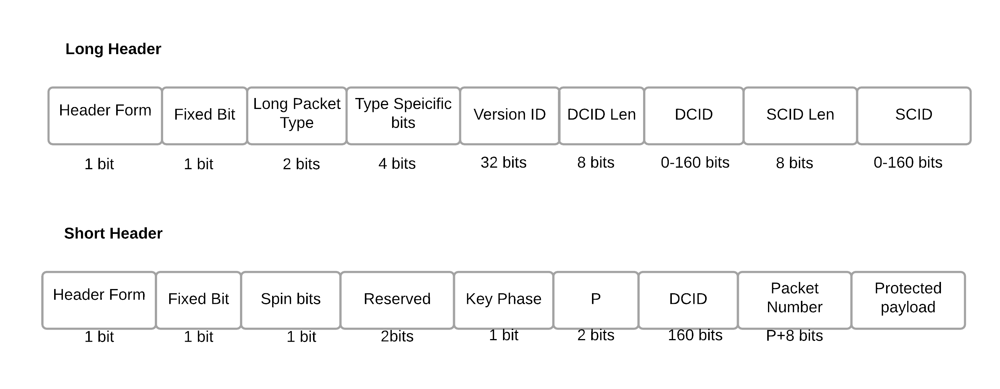

QUIC协议为了在连接建立和数据传输阶段达到最佳的效率，设计了长包头和短包头两种格式。

长包头被用于在1-RTT密钥建立前发送的数据包。一旦有了1-RTT密钥，发送方就会改用短包头发送数据包。

# 长包头

长包头主要用于连接建立阶段，包含比较多的信息，以便双方协商连接参数。一般来说，长包头包含以下内容：

- Header Form (HF) - identify the header type
- Fixed Bit (FB) - indicates if the packet is valid or not. If it is set to 0, the packet is invalid
- Long Packet Type (T) - indicates the type of long header packet, as show in Table 1
- Type-Specific Bits (S) - Bits specific for the long header packet types
- Version ID (VID) - 32 bits to identify the version of QUIC
- Destination Connection ID Length (DCID Len)
- Destination Connection ID (DCID)
- Source Connection ID Length (SCID Len)
- Source Connection ID (SCID)

# 短包头

短包头主要用于数据传输阶段，为了提高传输效率，只包含最必要的信息。一般来说，短包头包含以下内容：

- Header Form (HF)
- Fixed Bit (FB)
- Spin Bit - latency spin bit
- Reserved Bits
- Key Phase - identify packet protection key 指示当前使用的加密密钥
- Packet Number Length (P)
- Destination Connection ID (DCID)
- Packet Number: 用于保证包的有序到达和重传。
- Packet Payload

# 为什么需要两种类型的报头？

- 灵活性: 在连接建立阶段，需要更多的信息来协商连接参数，长包头可以满足这个需求。而在数据传输阶段，只需要保证包的有序性和安全性，短包头就足够了。
- 安全性: 长包头中的Diversification Nonce可以增强连接安全性，防止攻击。
- 效率: 短包头包含的信息更少，可以减少报头开销，提高数据传输效率。

# 长包头数据包

## 1. Initial包

>初始数据包（Initial packet）使用类型值为0x00的长包头。它携带着发送自客户端和服务器的最初的加密帧以进行密钥交换，同时它还携带着任意方向的ACK帧。

特点: 这是客户端发送的第一个包，用于初始化连接。

包含内容: 版本号、源连接ID、目标连接ID、长度、Packet Number、Public Flags、Diversification Nonce、Token（可选）、Version Negotiation（可选）、Crypto帧、Padding帧等。

作用:
- 通知服务器客户端支持的QUIC版本。
- 提供初始的连接ID。
- 包含客户端的初始密钥材料。
- 通过Padding帧来抵抗UDP攻击。

## 2. Version Negotiation包

>版本协商数据包（Version Negotiation packet）本质上不是版本特定的。客户端收到后，将根据版本字段值为0将其识别为版本协商数据包。
>
>版本协商数据包是对一个包含了服务器不支持的版本的客户端数据包的响应。它只能被服务器发送。

特点: 服务器在不支持客户端请求的版本时发送。

包含内容: 支持的版本列表。

作用: 告知客户端服务器支持的QUIC版本，以便客户端重新发起连接。

## 3. Retry包

>重试数据包（Retry packet）使用类型值为0x03的长包头。它携带着由服务器创建的一个地址验证令牌。想要进行重试的服务器会使用它。
>
>重试数据包不包含任何受保护的字段。未使用字段中的值被服务器设置为任意值；客户端必须忽略这些比特位。除了来自长包头的字段之外，它还包含以下额外字段：
- 重试令牌（Retry Token）：
- 重试完整性标签（Retry Integrity Tag）

特点: 服务器发送给客户端的包，用于验证客户端的身份。

包含内容: 目标连接ID、Original Destination Connection ID、Token。

作用:
- 验证客户端是否合法。
- 提供0-RTT的可能性。

## 4. Handshake包

>握手数据包（Handshake packet）使用类型值为0x02的长包头，后面跟着长度和数据包号字段。首个字节包含保留比特位和数据包号长度比特位。这种数据包被用来携带来自服务器和客户端的加密握手消息和确认。
>
>一旦客户端接收到了来自服务器的握手数据包，它就开始使用握手数据包来向服务器发送后续加密握手消息和确认。
>
>握手数据包有它们自己的数据包号空间，因此由服务器发送的首个握手数据包使用的是值为0的数据包号。
>
>这种数据包的载荷是加密帧，也可以包含Ping帧、填充帧或ACK帧。握手数据包可以包含类型为0x1c的连接关闭帧。若握手数据包中出现了其他种类的帧，则接收到该数据包的终端必须将该情况视作一个类型为PROTOCOL_VIOLATION（协议违背）的连接错误。

特点: 客户端和服务器在协商密钥和参数时交换的包。

包含内容: Crypto帧、Version Negotiation（可选）。

作用:
- 完成密钥交换。
- 协商连接参数。

## 0-RTT包

>0-RTT数据包使用类型值为0x01的长包头，后面跟着长度和数据包号字段。首个字节包含保留比特位和数据包号长度比特位。0-RTT数据包被用来在握手完成前，携带来自客户端的“早期”数据，作为第一轮通信的一部分被发向服务器。
>
>受0-RTT保护的数据包，与受1-RTT保护的数据包使用相同的数据包号空间。
>
>在客户端接收到重试数据包时，0-RTT数据包有可能是被弄丢了，或者被服务器丢弃了。客户端应该在发送新的初始数据包后尝试用0-RTT数据包重新发送数据。所有新发送的数据包都必须使用新的数据包号；重用数据包号可能使数据包保护失效。
>
>客户端只有在握手完成后才会收到0-RTT数据包的确认。
>
>一旦客户端开始处理来自服务器的1-RTT数据包，它就必须不再发送0-RTT数据包。这意味着0-RTT数据包不能包含任何对于来自1-RTT数据包中的帧的回复。比如说，客户端不能在0-RTT数据包中发送ACK帧，因为它只能被用来确认1-RTT数据包。必须用1-RTT数据包来携带对于1-RTT数据包的确认。

# 短包头数据包

1-RTT数据包使用短数据包包头。它在协商出版本和1-RTT密钥之后被使用。

## 延迟自旋比特位 Spin Bit

自旋比特位仅在1-RTT数据包中出现，因为若要测量一条连接的初始RTT，可以通过观察握手过程来实现。因此，自旋比特位在版本协商和连接建立完成后才可用。

自旋比特位是一个可选特性。不支持此特性的终端必须禁用它。

每个终端对一条连接是否启用自旋比特位做单方面的决定。各个实现必须允许客户端和服务器的管理员能够禁用自旋比特位，要么全局禁用要么基于单条连接禁用。即使自旋比特位没有被管理员禁用，终端也必须在每16条网络路径中随机地选择至少一条，或每16个连接ID中选择一个，然后在使用这些选出的路径或连接ID时禁用自旋比特位，这是为了确保在网络上能经常观察到禁用自旋比特位的QUIC连接。当每个终端独立地禁用自旋比特位时，能确保自旋比特位信号量在大约八分之一的网络路径中是关闭的。

# Key Phase

QUIC协议采用多阶段密钥机制，以增强安全性并提高性能。

为什么需要多阶段密钥？
- 安全性: 不同的阶段使用不同的密钥，可以限制攻击者获取密钥后造成的影响范围。如果攻击者获取了一个阶段的密钥，也只能解密该阶段的数据，无法解密其他阶段的数据。
- 性能: 不同的阶段可以采用不同的加密算法和参数，以适应不同的网络环境和应用需求。例如，在连接建立初期，可以使用较轻量级的加密算法，而在数据传输阶段，可以使用更安全的加密算法。

QUIC协议通常定义以下几个Key Phase：
- Initial密钥阶段: 用于保护连接初始阶段的数据，包括客户端发送的Initial包。
- 0-RTT密钥阶段: 用于保护0-RTT数据，即客户端在没有等待服务器确认的情况下发送的应用数据。
- Handshake密钥阶段: 用于保护握手阶段的数据，即客户端和服务器协商密钥的过程。
- 1-RTT密钥阶段: 用于保护1-RTT数据，即在握手完成之后发送的应用数据。

Key Phase的切换
- 触发条件: 当满足特定的条件时，QUIC连接就会从一个Key Phase切换到另一个Key Phase。例如，当客户端收到服务器的Initial包时，就会从无密钥阶段切换到Initial密钥阶段。
- 密钥更新: 在Key Phase切换的过程中，QUIC协议会生成新的密钥，并更新加密参数。

Key Phase的安全性
- 前向保密: QUIC协议的Key Phase设计具有前向保密性。即使攻击者获取了某个阶段的密钥，也无法解密之前或之后的阶段的数据。
- 完美前向保密: QUIC协议还可以实现完美前向保密，即即使攻击者获取了当前阶段的密钥，也无法解密过去的会话密钥。

# Packet Number

Packet Number空间的作用
- 唯一标识数据包: 每个数据包都有一个唯一的Packet Number，接收方可以根据这个号码来判断数据包的顺序，并进行重传确认。
- 支持重传: 如果某个数据包丢失，发送方可以通过重传该数据包来保证数据的完整性。
- 实现拥塞控制: QUIC协议通过监测Packet Number的丢失情况来调整发送速率，实现拥塞控制。

Packet Number空间的设计考虑
- 单调递增: Packet Number的值是单调递增的，即后发送的数据包的Packet Number总是大于前面的数据包。
- 足够大: Packet Number的空间需要足够大，以满足长时间连接的需求。
- 防止回绕: 为了防止Packet Number回绕导致的混乱，QUIC协议通常会采用62位或64位的Packet Number。
- 高效编码: Packet Number的编码方式需要考虑效率和兼容性。

Packet Number空间与Key Phase的关系
- 不同Key Phase的Packet Number空间: 在QUIC协议中，不同的Key Phase（加密密钥阶段）可能对应不同的Packet Number空间。
- Packet Number的起始值: 每个Key Phase的Packet Number都有一个起始值，这个起始值可以用来区分不同Key Phase的数据包。
- Packet Number的增长: 在同一个Key Phase内，Packet Number是单调递增的。

Packet Number空间与0-RTT和1-RTT的关系
- 共用Packet Number空间: 0-RTT和1-RTT的数据包通常共用同一个Packet Number空间。
- 不同的Packet Number起始值: 为了区分0-RTT和1-RTT数据包，它们可能使用不同的Packet Number起始值。
- 重传机制: 对于丢失的0-RTT数据包，服务器可以根据Token和Packet Number来判断是否需要重传。

# 参考资料

- [IETF QUIC v1 Design](https://www.cse.wustl.edu/~jain/cse570-21/ftp/quic/index.html)
- [17. 数据包格式](https://autumnquiche.github.io/RFC9000_Chinese_Simplified/#17_Packet_Formats)