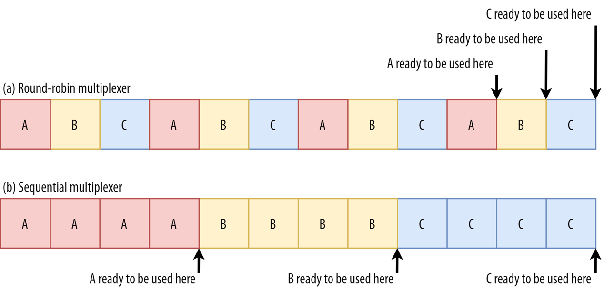
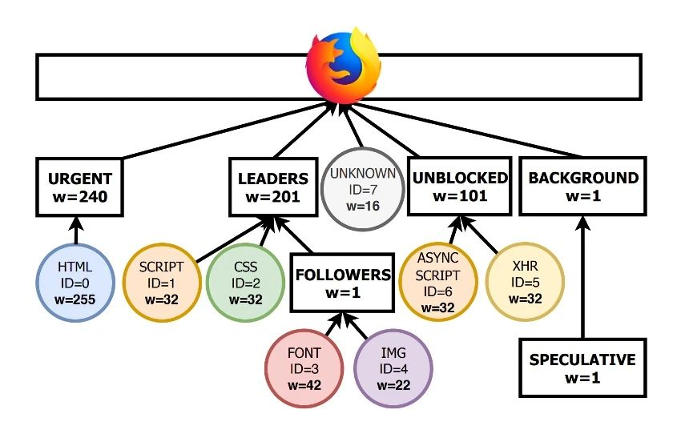
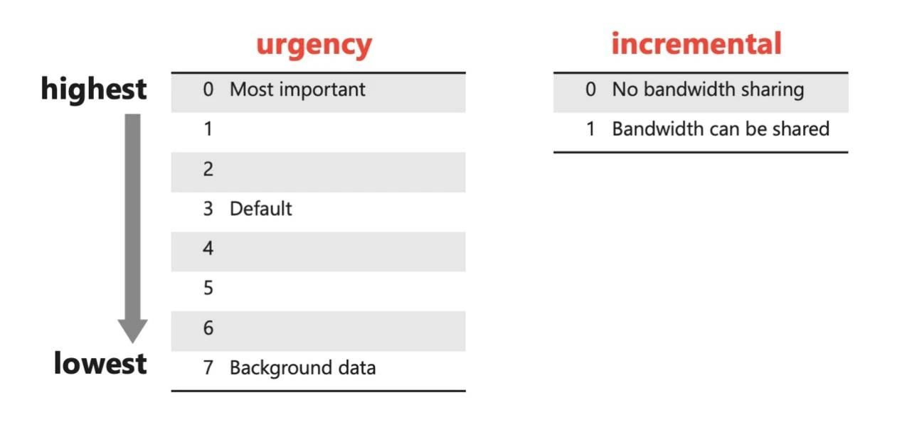

# HTML页面加载和渲染阻塞问题

HTML中某些资源（如 CSS 和 JavaScript 文件）可能会阻塞后续资源的加载或页面渲染，从而影响网页的加载速度和用户体验。
- CSS 是阻塞渲染的资源。当浏览器遇到 `<link>` 标签引入的 CSS 文件时，会立即停止页面内容的渲染，直到该 CSS 文件完全加载并解析完毕。
- 传统上，JavaScript 文件通过 `<script>` 标签引入，浏览器在遇到 `<script>` 标签时会停止页面的渲染，直到该脚本文件加载完成并执行完毕。
- 字体文件在网页中的加载也可能会影响页面的性能和用户体验，尤其是在使用自定义字体（如 Web 字体）时。如果字体文件加载较慢或未能加载，浏览器在显示文本时可能会出现闪烁（FOIT，Flash of Invisible Text）或替代字体（FOUT，Flash of Unstyled Text）的问题。
- 如果页面中包含大量或高分辨率的图片，可能会延迟页面的首次可见内容的显示，或导致页面滚动时出现卡顿。

# 浏览器策略

在加载周期的那部分时间里，最好将 100% 的连接带宽用于下载阻塞资源，并按照 HTML 中定义的顺序一次下载一个资源。这让浏览器在下载下一个阻塞资源时解析和执行每个项目，从而允许下载和执行通过管道传输。

权衡利弊，在大多数情况下行之有效的一种策略是：
- 自定义字体按顺序下载，并将可用带宽与可见图像分开。
- 可见图像并行下载，在它们之间分配带宽的“图像”份额。

当没有更多字体或可见图像待处理时：
- 非阻塞脚本按顺序下载，并将可用带宽与不可见图像分开
- 不可见的图像并行下载，在它们之间分配带宽的“图像”份额。

然而，不同浏览器实现策略差异很大。

# HTTP对资源加载的升级

HTTP 1.1，一个连接下载一个资源。

HTTP 2，引入了多路复用，一个连接能够处理多个流，多个文件加载可以共用一个HTTP2连接。多路复用策略：顺序或者轮询，对阻塞资源有比较大的影响。但是HTTP2 over TCP，会遇到队头阻塞问题。

HTTP3 在使用QUIC替换TCP传输协议，尽可能解决HTTP2的队头阻塞问题。

# HTTP优先级

在HTTP协议中，"优先级"是指在客户端和服务器之间传输多个资源时，如何确定这些资源的传输顺序或重要性。

HTTP/1.1，客户端无法告诉服务器哪些资源更重要，这可能导致关键资源（如 HTML 和 CSS）被延迟加载。

# HTTP2

HTTP2加入了优先级和依赖树的概念。

- 优先级树：HTTP/2 允许客户端为每个请求设置优先级，甚至可以定义请求之间的依赖关系，形成一个优先级树。每个请求可以有一个 31 位的优先级值（从 0 到 2^31-1），数字越小优先级越高。此外，请求可以依赖于其他请求，形成父子关系。
- 优先级调整：客户端可以在任何时候通过发送 PRIORITY 帧来调整已经发送请求的优先级。

问题：尽管有这些机制，实际的优先级处理在不同服务器和浏览器中的实现可能有所不同。很多服务器不完全遵循客户端的优先级建议，导致资源加载顺序不如预期。依赖关系树通常比较复杂。

# HTTP3

HTTP/3 的优先级模型采用了更简单的优先级信号，客户端可以直接告诉服务器某个流的优先级，而无需构建依赖关系树。

问题：尽管 HTTP/3 提供了简化的优先级模型，实际的效果仍然取决于服务器和客户端的实现。例如，浏览器可能会根据自己的策略调整优先级，而不是完全依赖服务器。

# HTTP优先级的“增量”

“增量”优先级指的是将资源逐步发送给客户端，使得在资源还未完全加载完成之前，客户端可以利用已经接收到的数据开始呈现内容。这对于某些类型的资源特别有用，例如：
- 渐进式图片加载：图片在网络上传输时可以逐渐显现，提升用户体验。
- 流媒体：视频和音频流可以边下载边播放。

这在网络带宽有限或网络条件不佳时，尤其有助于提升用户体验。

以下是 HTTP/3 中“增量”优先级的主要应用：
- 交错传输：服务器可以根据客户端的“增量”信号，交替发送不同资源的一部分，以确保重要资源能够更快地开始显示。
- 优化初始页面加载：在加载网页时，HTML、CSS 和 JavaScript 等关键资源可能被标记为“增量”资源，以便浏览器能够尽快开始渲染页面，即使资源尚未完全加载。

# 总结

HTTP3用资源优先级替换了HTTP2优先级依赖树，简化了实现。引入“增量”，逐步分发资源，客户端可以利用已有数据尽快渲染。

# 参考资料

- [揭秘HTTP/3优先级](https://livevideostack.cn/news/%E6%8F%AD%E7%A7%98http-3%E4%BC%98%E5%85%88%E7%BA%A7/)
- [更好的 HTTP/2 优先级，实现更快的 Web](https://blog.cloudflare.com/better-http-2-prioritization-for-a-faster-web/)

