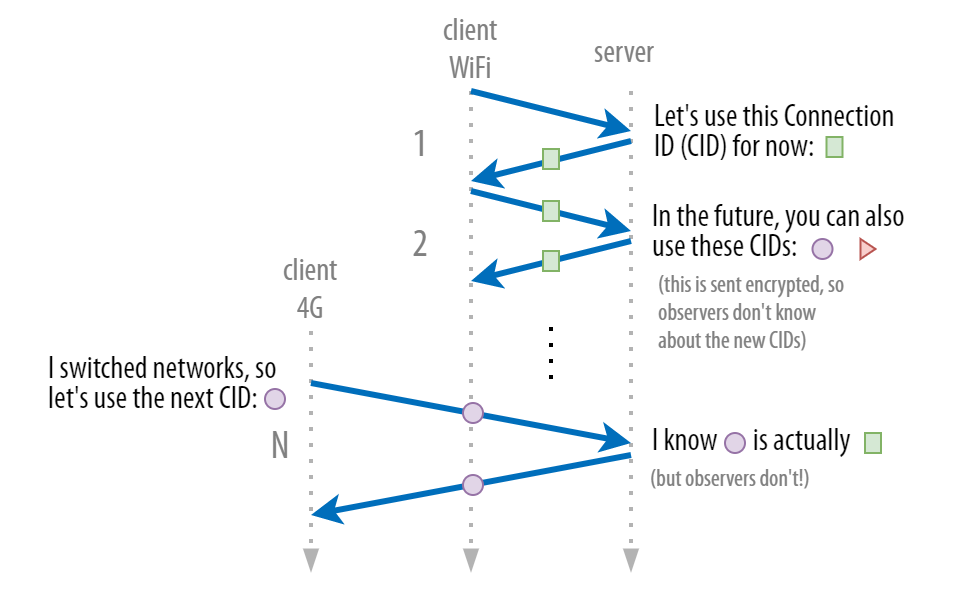

# QUIC 连接迁移

QUIC 连接迁移是指在不关闭现有连接的情况下，客户端或服务器在网络路径变化时（如切换网络或IP地址）保持连接的连续性和稳定性。连接迁移是 QUIC 协议的一个关键特性，特别适用于移动环境或多路径通信场景。

一个典型场景是，从WiFi网络切换到移动数据网络。

# 安全考虑

QUIC的设计要求终端在握手过程中保持稳定的地址。在握手确认前，终端必须不发起连接迁移。

## 1. 地址欺骗攻击（Address Spoofing）

攻击描述： 攻击者伪装成合法客户端，向服务器发送数据包，试图劫持或干扰现有的 QUIC 连接。这可能导致服务器误将攻击者的地址作为合法路径，从而中断或截获通信。

解决方案：
- 地址验证机制： QUIC 在路径迁移时会使用 PATH_CHALLENGE 和 PATH_RESPONSE 帧进行地址验证。服务器会向新路径发送一个随机生成的 PATH_CHALLENGE，并期望客户端通过该路径返回相应的 PATH_RESPONSE。如果服务器没有收到正确的响应，它会拒绝接受来自新路径的包。
- Rate Limiting（速率限制）： 服务器可以对未经验证的路径进行速率限制，以减少可能的攻击影响。

## 2. 中间人攻击（Man-in-the-Middle Attack, MitM）

攻击描述： 在路径迁移期间，攻击者可能试图插入自己为中间人，篡改、阻断或重放通信数据。

解决方案：
- TLS 加密： QUIC 的所有数据都是通过 TLS 1.3 加密传输的，确保攻击者即使拦截了数据包，也无法解密或篡改数据。
- 完整性检查： QUIC 对所有数据包都进行完整性检查，确保数据包没有被篡改。即使攻击者成功注入了数据包，这些包也会因为校验失败而被丢弃。

## 3. 重放攻击（Replay Attack）

攻击描述： 攻击者重放合法的路径迁移数据包，试图重复先前的路径迁移过程，以干扰或劫持连接。

解决方案：
- 不可重放的挑战： 在 PATH_CHALLENGE 和 PATH_RESPONSE 中使用不可重放的随机值，确保即使数据包被重放，服务器也不会接受重复的响应。
- 时间戳验证： 服务器可以使用时间戳来判断数据包是否在合理的时间窗口内，从而防止重放攻击。

## 4. 路径拥塞攻击（Path Congestion Attack）

攻击描述： 攻击者在网络 ID 迁移时，试图通过向服务器发送大量伪造的数据包，导致网络路径拥塞，从而降低合法客户端的服务质量。

解决方案：
- 拥塞控制机制： QUIC 协议内置了拥塞控制机制，服务器可以根据网络状况动态调整数据包发送速率。如果检测到新的路径拥塞，服务器可以选择回退到原始路径或采取其他缓解措施。
- 路径验证机制： 和地址验证一样，路径验证有助于确认新路径的有效性，防止未经验证的路径占用大量网络资源。

## 5. 资源耗尽攻击（Resource Exhaustion Attack）

攻击描述： 攻击者通过频繁触发路径迁移，使服务器耗费大量资源进行路径验证和状态管理，从而导致服务器资源耗尽。

解决方案：
- 限制路径迁移次数： 服务器可以设置对每个连接的路径迁移次数进行限制，防止单一连接滥用资源。
- 路径验证速率限制： 对频繁的路径验证请求进行速率限制，以防止资源耗尽攻击。

# NAT 重绑定

除了WiFi和移动数据网络切换外，NAT 重绑定也会导致连接迁移。

NAT 重绑定（NAT Rebinding）是指 NAT 设备可能出于多种原因（如负载均衡、资源重用、超时等）改变了外部 IP 地址或端口的映射，从而导致通信双方的 NAT 映射发生变化。

在 IPv6 环境下，由于不需要 NAT，NAT 重绑定问题几乎不会发生。

# 总结

- Connection ID（连接 ID）： QUIC 连接通过 Connection ID 来标识，而不是依赖于传统的 IP 地址和端口组合。这样，当网络发生变化时，客户端可以继续使用相同的 Connection ID 与服务器通信，而无需重新建立连接。
- Path Migration（路径迁移）： Path Migration 是 QUIC 中用于支持网络 ID 迁移的机制。当设备切换网络时，客户端可以通过新的路径发送数据包，同时附带新的网络信息（如新的 IP 地址）。服务器通过验证新的路径来继续维护原来的连接。
- 地址验证： 为了防止地址欺骗，QUIC 在路径迁移时会对新路径进行验证。服务器会向客户端发送验证包（如 PATH_CHALLENGE 和 PATH_RESPONSE），确保数据包确实来自客户端声称的新地址。
- 零中断迁移： 当网络发生变化时，QUIC 的设计允许在数据路径切换期间维持现有的传输，尽量减少因网络切换导致的中断。

# 参考

- [连接迁移](https://autumnquiche.github.io/RFC9000_Chinese_Simplified/#9_Connection_Migration)

