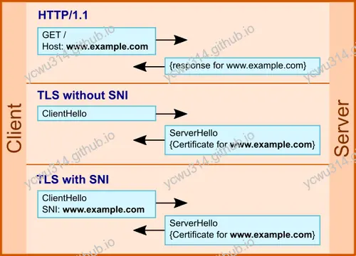
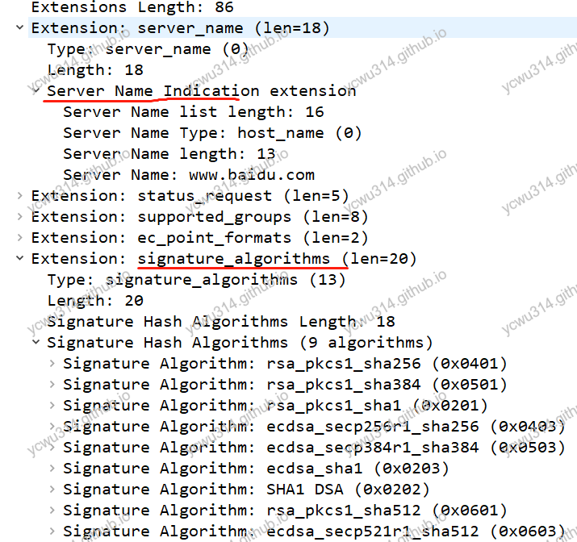

# 背景

原来申请的正式域名备案通过，TLS证书也申请了。之前使用的临时域名和证书作为测试环境使用。于是要在单个ECS主机上配置nginx多个证书和多个域名。

<!-- more -->

# 实践

nginx部署多个TLS证书很简单，在不同的virtual host分别配置证书就搞定了。比如我有`a.com`和`b.com`两个域名，在`nginx.conf`分别配置2个server就可以了
```nginx
server {
    listen 443 ssl http2;
    server_tokens off;
    server_name a.com; 

    ssl_certificate cert/a.com.pem;     #将domain name.pem替换成您证书的文件名。
    ssl_certificate_key cert/a.com.key; #将domain name.key替换成您证书的密钥文件名。

    # more config
}

server {
    listen 443 ssl http2;
    server_tokens off;
    server_name b.com; 

    ssl_certificate cert/b.com.pem;     #将domain name.pem替换成您证书的文件名。
    ssl_certificate_key cert/b.com.key; #将domain name.key替换成您证书的密钥文件名。

    # more config
}

```
ps. 推荐一个nginx conf配置在线美化工具：[Nginx Beautifier](https://nginxbeautifier.com/)

# 问题再深入

在一个主机（IP）上配置多个域名，使用虚拟主机（virtual host）就可以解决了。但是申请TLS证书的时候，是绑定了具体的域名和IP地址。建立TLS连接的时候，服务器要下发哪个证书呢？
等等，证书明明和域名绑定，都知道了域名，为什么会有选择选择证书的问题？
那是因为，域名是http的概念。client和server先建立了tcp连接，再经过TLS握手，才能实现https通信。在最初，这个过程，是没有域名的概念的！
为了解决当个主机部署多个TLS证书的问题，带来了TLS的SNI扩展。





（图片来源：`https://blogs.akamai.com/2017/03/reaching-toward-universal-tls-sni.html`）

# SNI介绍

摘自wiki，"服务器名称指示"
>服务器名称指示（英语：Server Name Indication，缩写：SNI）是TLS的一个扩展协议，在该协议下，在握手过程开始时客户端告诉它正在连接的服务器要连接的主机名称。这允许服务器在相同的IP地址和TCP端口号上呈现多个证书，并且因此允许在相同的IP地址上提供多个安全（HTTPS）网站（或其他任何基于TLS的服务），而不需要所有这些站点使用相同的证书。

TLS SNI在client hello握手阶段，增加了一个扩展字段，表明想要和哪个域名建立TLS连接（注意是**明文**）。服务器根据SNI，选择证书并且下发。以下是TLS v1.2握手抓包





这个扩展字段，OpenSSL 0.9.8 版本开始支持。现代的浏览器和服务器都支持了。

TLS v1.2的SNI是明文传输，这就可以被第三方直接截获，暴露了域名，甚至阻止建立https连接（等等，有人在敲门，我先收个快递）。。。这就是censorship问题了。

# TLS ESNI扩展

TLS v1.2的SNI是明文传输引发安全隐患，那么加密不就可以了吗？不行，因为TLS连接还没有建立。这就是先有鸡还是先有蛋的问题。
google、amazon、microsoft等大厂想出一个办法，既然SNI是明文，我就传输无公害的host，比如他们自家的域名，等tls连接建立之后，再把真实域名传输过去。
这就是TLS ESNI扩展，使用的技术叫**域前置（英语：Domain fronting）**。

如果要censorship，那么就要一刀切都关闭！
怎么样，是不是很狂拽酷炫吊炸天！不过，理想很丰满，现实很骨感。截至目前，Google、Amazon都由于不可描述的原因，关闭了此项服务。

在此只聊聊技术上的问题。
即使有了TLS v1.3 ESNI，在建立连接后返回真实域名，但是传统的DNS查询是明文的！解决方式就是加密DNS，DNS over TLS (DoT) and DNS over HTTPS (DoH)。具体以后再研究。

# 小结

- 单个主机上nginx多个证书的配置，在不同的server上配置`ssl_certificate`和`ssl_certificate_key`即可。
- 背后的原理涉及到TLS的SNI扩展。
- TLS v1.2的SNI扩展字段是明文的，并且由于在client hello阶段传输，会被第三方直接获取，带来安全隐患。
- TLS v1.3引入ESNI扩展，技术上叫domian fronting，使用安全的host建立TLS连接，之后再传输目标域名。结合加密DNS，实现安全通信。

# 参考资料

- [Encrypt it or lose it: how encrypted SNI works](https://new.blog.cloudflare.com/encrypted-sni/)


