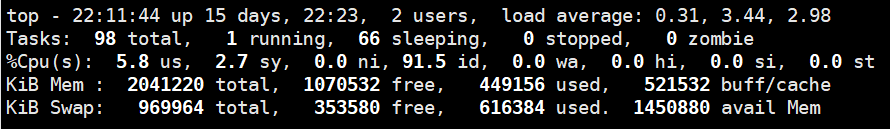
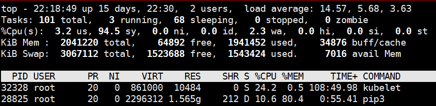

开发机配置从2c4g降配到1c2g，在新vps上安装spacy遇到内存不足的问题。
<!-- more -->
安装spacy命令如下
```
apt-get update
apt-get install build-essential python3-dev git
apt install python3-pip
pip3 install -U spacy
```
过了几十秒之后
```
Installing collected packages: spacy
Killed
```
Killed？
重试之后，还是同样问题。
没有报错信息，应该不是程序问题。使用`tail -f /var/log/kern.log`查看内核日志
```
Sep 19 22:07:19 iZwz9h8m2********** kernel: [1376339.542163] Out of memory: Kill process 25349 (pip3) score 610 or sacrifice child
```
恍然大悟！linux oom killer问题，很久没有遇到过了。
先看看现在的配置





才1g不到的swap文件，太小了。
解决方法是增大swap文件，先增加到3g：
```
$ create swap file of 2048 MB
dd if=/dev/zero of=/swapfile.new bs=1024 count=2097152

$ modify permissions
chown root:root /swapfile.new
chmod 0600 /swapfile.new

$ setup swap area
mkswap /swapfile.new

$ turn swap on
swapon /swapfile.new
```
再次安装spacy，同时打开top命令观察





还是很消耗资源，不过最终安装成功
```
Installing collected packages: spacy
Successfully installed spacy-2.1.8
```