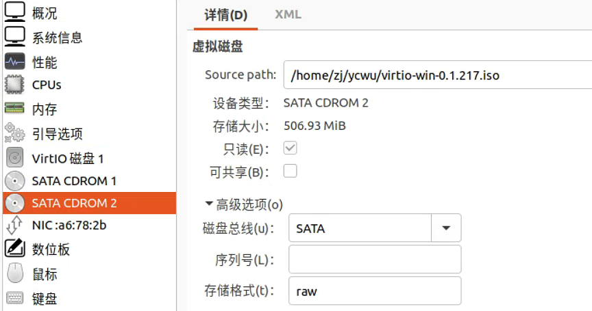
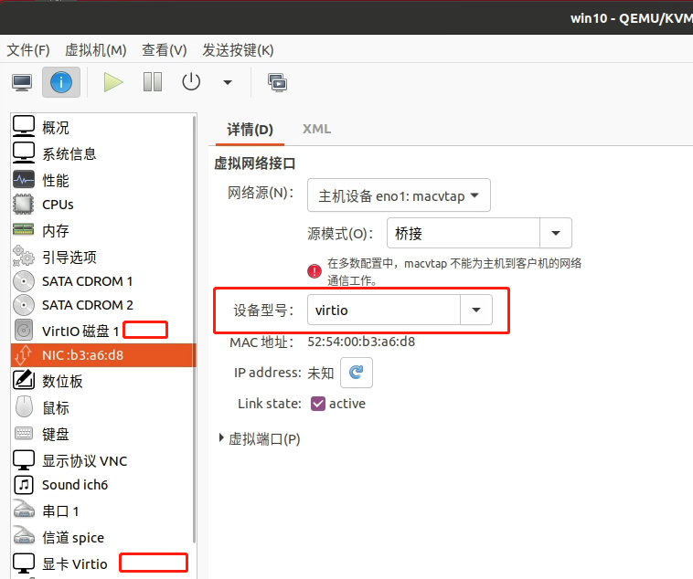
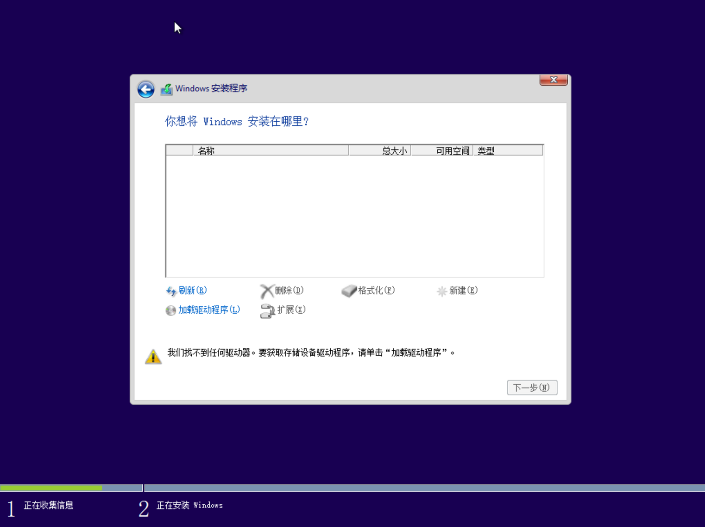
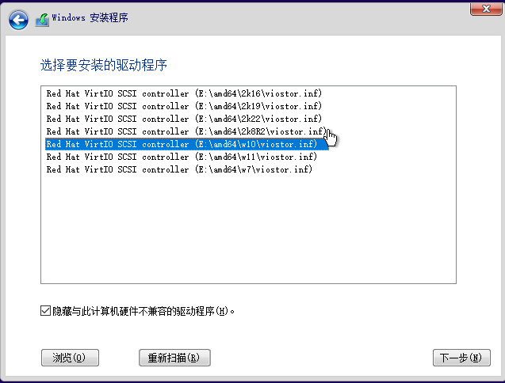
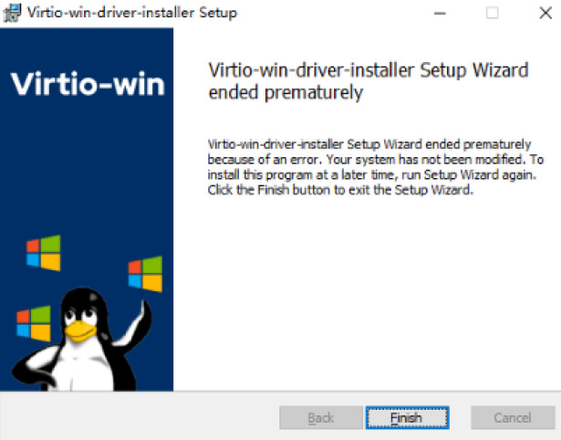
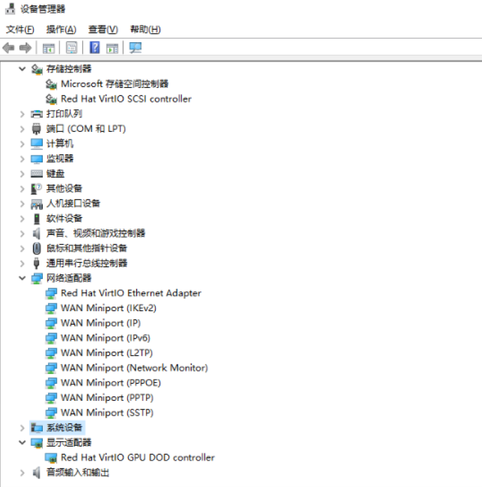
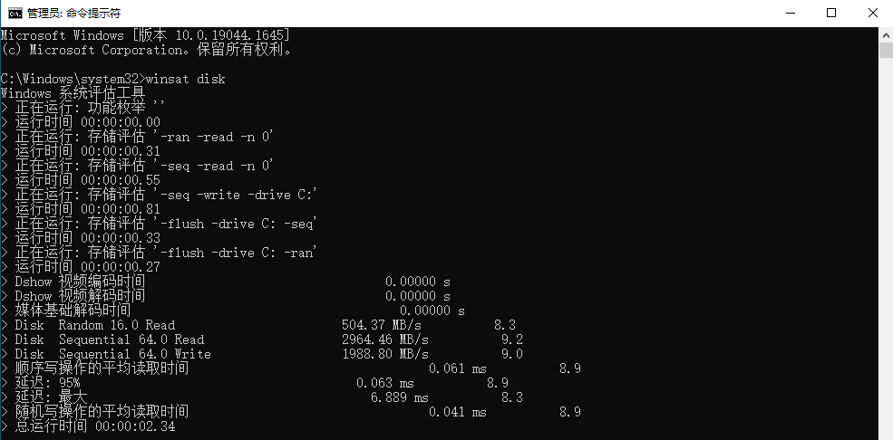

使用virtio半虚拟化驱动的虚拟机，能够有更好的性能。

<!-- more -->

1. 下载驱动

https://fedorapeople.org/groups/virt/virtio-win/direct-downloads/stable-virtio/virtio-win.iso

2. 挂载驱动iso

3. 磁盘，网卡，显卡，选择virtio。

4. 启动虚拟机，进入win10安装程序。

5. 这时候找不到磁盘，选择“加载驱动”

6. 安装windows后，使用virtio iso的virtio-win-gt-x64程序安装剩余驱动。
然而报错了。

改为在设备管理手动安装，包括网卡、gpu、ballon设备等驱动。

7. 使用winsat简单看下virtio-blk的性能。要使用管理员权限执行。

和宿主机性能差不多了。