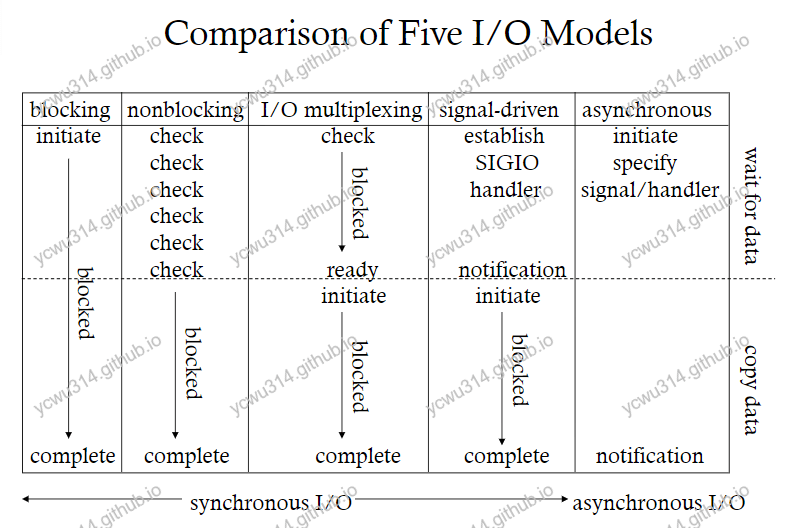
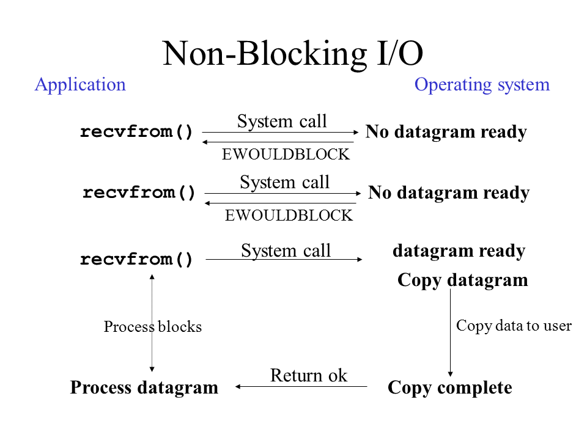
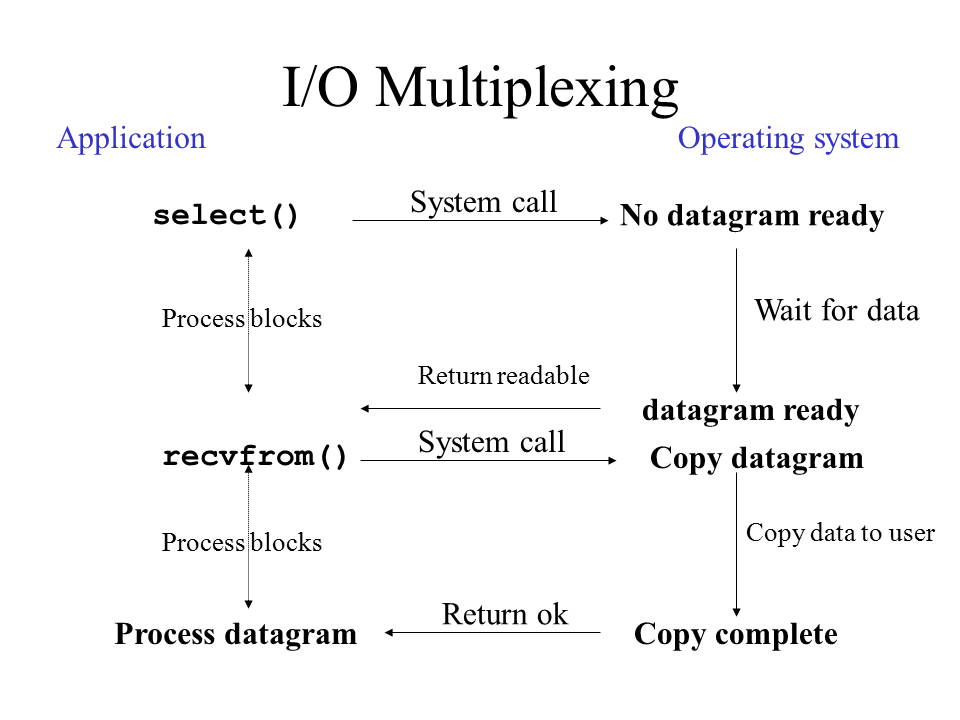
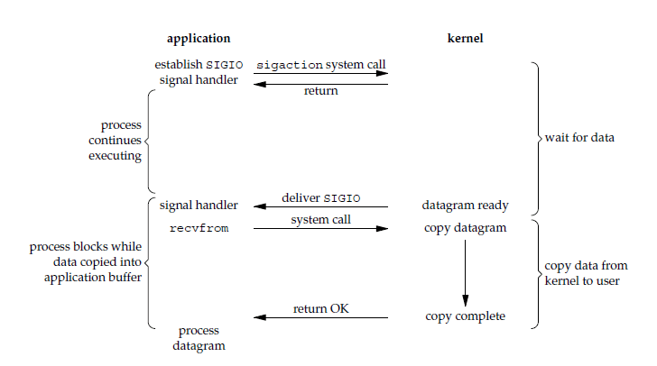
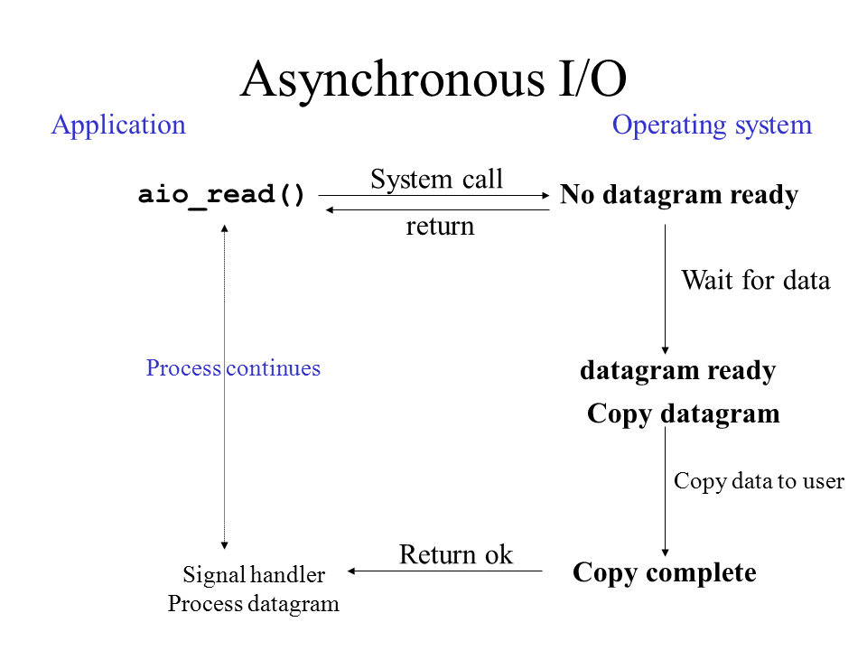

# 用户空间，内核空间，系统调用

CPU将指令分为特权指令和非特权指令。特权指令可以操作IO、设置或者忽略中断、设置时钟等操作。由于特权指令可以执行高危操作，一旦被不恰当使用，会导致系统崩溃。
从系统安全和稳定性的角度出发，特权指令只允许被操作系统执行（内核空间），普通用户进程只能执行非特权指令（用户空间）。
当进程运行在内核空间时就处于内核态，而进程运行在用户空间时则处于用户态。

系统调用（system call）是操作系统提供给应用程序的接口。 用户通过调用系统调用来完成那些需要操作系统内核进行的操作， 例如硬盘， 网络接口设备的读写等。

<!-- more -->

# 同步，异步

POSIX对同步、异步的定义
- A synchronous I/O operation causes the requesting process to be blocked until that I/O operation completes
- An asynchronous I/O operation does not cause the requesting process to be blocked

异步IO在实现上，通过通知用户进程，或者调用用户进程注册的回调函数。

# 阻塞，非阻塞

- 阻塞是指 I/O 操作需要彻底完成后才返回到用户空间；
- 非阻塞是指 I/O 操作被调用后立即返回给用户一个状态值(EWOULDBOLCK)，无需等到 I/O 操作彻底完成。

# Linux IO模型

以读操作为例子，主要包含2个阶段
- Waiting for the data to be ready. This involves waiting for data to arrive on the network. When the packet arrives, it is copied into a buffer within the kernel.
- Copying the data from the kernel to the process. This means copying the (ready) data from the kernel's buffer into our application buffer

翻译过来是
- 等待数据就绪。就绪数据保存在内核空间
- 把就绪数据从内核空间复制到进程

这2个阶段处理上的不同，linux演化了5种io模型
- blocking I/O
- nonblocking I/O
- I/O multiplexing (select and poll)
- signal driven I/O (SIGIO)
- asynchronous I/O (the POSIX aio_ functions)
 
先上对比图，在后面的介绍中可以返回来比较





<!-- more -->

# 阻塞IO，blocking IO


步骤
1. 等待数据就绪
2. 把就绪数据从内核空间复制到进程

如果数据未ready，就一直阻塞。
最简单直接的模型。但是一个用户线程只能阻塞一个IO操作。伪代码如下
```
while(true){ 
    socket = accept(); 
    handle(socket) 
} 
```
如果要同时阻塞多个IO操作，只能使用多线程。
```
while(true){ 
    socket = accept(); 
    new handler_thread(socket); 
} 
```
线程的创建、销毁产生额外的性能损耗。使用线程池可以减少线程创建、销毁的开销。但是太多线程数依然会引起上下文切换开销占比变大，导致高并发性能瓶颈。

# 非阻塞IO，non blocking IO





步骤
1. socket设置为non blocking。当数据未就绪，操作系统不会挂起进程，内核向用户进程返回错误码(EWOULDBLOCK) 
2. 尽管用户进程没有被阻塞，但是因为不知道数据是否就绪，只能不断轮询，消耗大量的cpu资源
3. 数据就绪，把数据从内核空间复制到进程

在实际中，很少直接使用非阻塞IO模型。

# IO多路复用，IO multiplexing





多路复用使用select函数或者epoll函数。这2个函数也是阻塞调用，**但是一次调用能够检查多个IO操作的状态**，一旦有就绪数据，才真正执行底层阻塞IO操作。

多路复用最大的特点是，一个用户线程可以注册检查多个IO请求。传统的blocking io模型，一个用户线程只能检查一个IO请求。在高并发的情况下，多路复用能够减少IO线程数量，提高了高并发性能。

多路复用模型使用了 Reactor 设计模式实现了这一机制。
netty使用了Channel这个概念。一个channel监听一个IO操作。一个用户线程注册多个Channel，从而关注多个IO操作。 最大的好处是，一个线程可以处理多个IO操作：一个用户线程不停地select，获取已经就绪的Channel。

相关资料参见：
- [reactor-pattern](/posts/reactor-pattern)
- [linux-select-epoll-poll](/posts/linux-select-epoll-poll)

# 信号驱动IO，signal driven IO





1. 通过一个system call，注册信号handler，并且立即返回
2. 当数据就绪，由系统发送SIGIO信号，触发信号handler
3. 把数据从内核空间复制到进程


# 异步IO，asynchronous IO





>We call aio_read (the POSIX asynchronous I/O functions begin with aio_ or lio_) and pass the kernel the following:
>
>   - descriptor, buffer pointer, buffer size (the same three arguments for read),
>   - file offset (similar to lseek),
>   - and how to notify us when the entire operation is complete.
>
>This system call returns immediately and our process is not blocked while waiting for the I/O to complete.

调用 aio_read 函数，告诉内核fd，缓冲区指针，缓冲区大小，文件偏移以及通知的方式，然后立即返回。当内核将数据拷贝到缓冲区后，再通知应用程序。

异步 I/O 模型使用了 Proactor 设计模式实现了这一机制。

对比信号驱动IO，AIO由内核自动完成复制数据到用户空间这个操作。

TODO：proactor设计模式

# 小结

- 阻塞IO一直等待，直到数据就绪
- 非阻塞IO会返回**EWOULDBOLCK错误码**，用户进程要不停检查，消耗cpu资源。很少单独使用非阻塞IO
- 信号驱动IO安装信号handler之后立即返回。一旦数据就绪，内核通知用户进程，需要进程自行复制数据。
- 异步IO告诉系统fd、缓冲区地址、复制字节数，由内核完成就绪数据复制到用户空间的动作后，再通知用户进程。
- **非阻塞IO，信号驱动IO，异步IO，这3者的明显区别：非阻塞IO返回的是状态值，数据未就绪；后两者返回的是就绪数据。**

# 参考资料

- [Linux 内核空间与用户空间](https://www.cnblogs.com/sparkdev/p/8410350.html)
- [Chapter 6. I/O Multiplexing: The select and poll Functions](https://notes.shichao.io/unp/ch6/)
- [java Selector is asynchronous or non-blocking architecture](https://stackoverflow.com/questions/17615272/java-selector-is-asynchronous-or-non-blocking-architecture)
 
