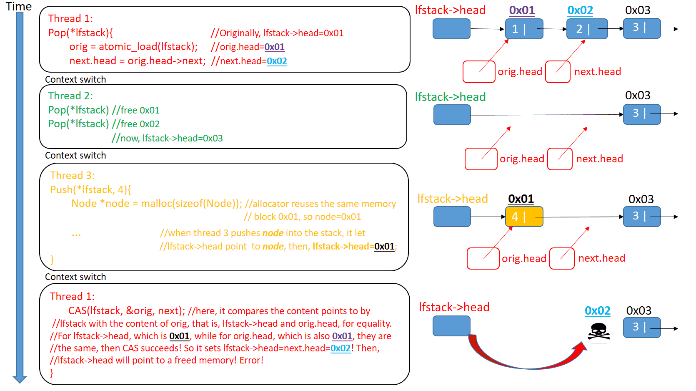

# Java CAS 简介

不管是synchronized还是Lock，都是悲观的操作，假设每个操作都会竞争，因此要先加锁保护，导致吞吐量上不去。
然而很多情况，竞争并不是很激烈，每次加锁保护临界区域并不是必须的。其中一种优化方式是，循环检查旧值是否改变。如果没有，就更新为新值；否则重新读取新值。这里有个隐式要求，检查--更新必须是原子化操作，需要硬件级别的支持。
这就是CAS(compare and swap)的思想，它是一种乐观锁，认为大多数情况下竞争不激烈，使用硬件原子化比较--更新的能力实现线程安全。

<!-- more -->

# AtomicInteger

JUC包中AtomicXXX是使用CAS方式实现的类。
以AtomicInteger为例子介绍。
```java
public class AtomicInteger extends Number implements java.io.Serializable {
    private static final long serialVersionUID = 6214790243416807050L;

    // setup to use Unsafe.compareAndSwapInt for updates
    private static final Unsafe unsafe = Unsafe.getUnsafe();
    private static final long valueOffset;

    static {
        try {
            valueOffset = unsafe.objectFieldOffset
                (AtomicInteger.class.getDeclaredField("value"));
        } catch (Exception ex) { throw new Error(ex); }
    }

    private volatile int value;
```
计数器value使用volatile，保证多线程修改的可见性。关于volatile，参见
- [java-volatile](/posts/java-volatile)
底层CAS操作，依赖Unsafe实现。

AtomicInteger常见的getAndIncrement、getAndIncrement，底层都会使用Unsafe提供的compareAndSwapInt
```java
public final int getAndIncrement() {
    return unsafe.getAndAddInt(this, valueOffset, 1);
}

public final boolean compareAndSet(int expect, int update) {
    return unsafe.compareAndSwapInt(this, valueOffset, expect, update);
}
```

Unsafe
```java
public final int getAndAddInt(Object var1, long var2, int var4) {
    int var5;
    do {
        var5 = this.getIntVolatile(var1, var2);
    } while(!this.compareAndSwapInt(var1, var2, var5, var5 + var4));

    return var5;
}
```
依靠unsafe.compareAndSwapInt实现比较-交换的原子化操作。

unsafe.cpp
```cpp
UNSAFE_ENTRY(jboolean, Unsafe_CompareAndSwapInt(JNIEnv *env, jobject unsafe, jobject obj, jlong offset, jint e, jint x))
  UnsafeWrapper("Unsafe_CompareAndSwapInt");
  oop p = JNIHandles::resolve(obj);
  jint* addr = (jint *) index_oop_from_field_offset_long(p, offset);
  return (jint)(Atomic::cmpxchg(x, addr, e)) == e;
UNSAFE_END
```

atomic.cpp
```java
jbyte Atomic::cmpxchg(jbyte exchange_value, volatile jbyte* dest, jbyte compare_value) {
  assert(sizeof(jbyte) == 1, "assumption.");
  uintptr_t dest_addr = (uintptr_t)dest;
  uintptr_t offset = dest_addr % sizeof(jint);
  volatile jint* dest_int = (volatile jint*)(dest_addr - offset);
  jint cur = *dest_int;
  jbyte* cur_as_bytes = (jbyte*)(&cur);
  jint new_val = cur;
  jbyte* new_val_as_bytes = (jbyte*)(&new_val);
  new_val_as_bytes[offset] = exchange_value;
  while (cur_as_bytes[offset] == compare_value) {
    jint res = cmpxchg(new_val, dest_int, cur);
    if (res == cur) break;
    cur = res;
    new_val = cur;
    new_val_as_bytes[offset] = exchange_value;
  }
  return cur_as_bytes[offset];
}
```
最终使用处理器的cmpxchgl指令原子化地compare-and-swap。


# CAS ABA 问题

CAS可能产生ABA问题。来自wiki
>In multithreaded computing, the ABA problem occurs during synchronization, when a location is read twice, has the same value for both reads, and "value is the same" is used to indicate "nothing has changed". However, another thread can execute between the two reads and change the value, do other work, then change the value back, thus fooling the first thread into thinking "nothing has changed" even though the second thread did work that violates that assumption.

ABA问题发生过程
1. T1 线程从共享的内存地址读取值 A；
2. T1 线程被抢占，线程 T2 开始运行；
3. T2 线程将共享的内存地址中的值由 A 修改成 B，然后又修改回 A；
4. T1 线程继续执行，读取共享的内存地址中的值仍为 A，认为没有改变然后继续执行；





（图片来源：`https://lumian2015.github.io/lockFreeProgramming/aba-problem.html`）

由于ABA问题带来的隐患，各种乐观锁的实现中通常都会用版本戳version来对记录或对象标记，避免并发操作带来的问题。
>A common workaround is to add extra "tag" or "stamp" bits to the quantity being considered. 

AtomicStampedReference是java提供解决CAS ABA问题的工具。

# AtomicStampedReference

AtomicStampedReference给引用打了stamp，作为版本号。
```java
public class AtomicStampedReference<V> {

    private static class Pair<T> {
        final T reference;
        final int stamp;

        private Pair(T reference, int stamp) {
            this.reference = reference;
            this.stamp = stamp;
        }

        static <T> Pair<T> of(T reference, int stamp) {
            return new Pair<T>(reference, stamp);
        }
    }

    private volatile Pair<V> pair;
}
```

AtomicStampedReference进行CAS更新，先判断引用和stamp发生变化。
如果未变，则利用unsafe进行原子化CAS更新，注意包括新的stamp。
```java
public boolean compareAndSet(V   expectedReference,
                             V   newReference,
                             int expectedStamp,
                             int newStamp) {
    Pair<V> current = pair;
    return
        expectedReference == current.reference &&
        expectedStamp == current.stamp &&
        ((newReference == current.reference &&
          newStamp == current.stamp) ||
         casPair(current, Pair.of(newReference, newStamp)));
}

private boolean casPair(Pair<V> cmp, Pair<V> val) {
    return UNSAFE.compareAndSwapObject(this, pairOffset, cmp, val);
}
```

# 参考

- [ABA problem](https://en.wikipedia.org/wiki/ABA_problem)
- [Writing a Lock-free Stack](https://lumian2015.github.io/lockFreeProgramming/lock-free-stack.html)
- [https://lumian2015.github.io/lockFreeProgramming/aba-problem.html](https://lumian2015.github.io/lockFreeProgramming/aba-problem.html)
- [用ATOMICSTAMPEDREFERENCE解决ABA问题](https://hesey.wang/2011/09/resolve-aba-by-atomicstampedreference.html)
