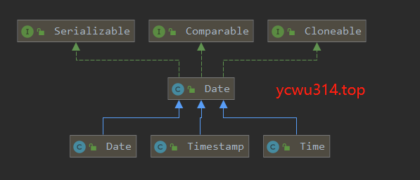

# 简介

java.sql.Date、java.sql.Time、java.sql.Timestamp都是jdbc的日期时间类型。
<!-- more -->
规范化（normalized）的SQL date类型，只包括年月日，其余的时分秒毫秒字段都被设置为0。
Time在Date的基础上，增加保留时分秒。
如果要保留毫秒精度，则使用Timestamp。

jdbc使用的是sql类型，例如PreparedStatement.setDate()、ResultSet.getDate()。

# 源码分析

java.sql.Date、java.sql.Time、java.sql.Timestamp都继承于java.util.Date，包含毫秒精度的日期类型（就是平常使用的）。实际上这3个sql类型底层精度是毫秒级别。





以sql.Date的构造函数来看，把时间丢给父类存储。
```java
public Date(long date) {
    // If the millisecond date value contains time info, mask it out.
    super(date);
}
```

在util.Date，使用fastTime保存毫秒精度的时间。cdate可以知道是否要规范化（isNormalized()），即丢弃时间部分。
```java
public class Date
    implements java.io.Serializable, Cloneable, Comparable<Date>
{
    private transient long fastTime;

    /*
     * If cdate is null, then fastTime indicates the time in millis.
     * If cdate.isNormalized() is true, then fastTime and cdate are in
     * synch. Otherwise, fastTime is ignored, and cdate indicates the
     * time.
     */
    private transient BaseCalendar.Date cdate;

    public Date(long date) {
        fastTime = date;
    }    

    public long getTime() {
        return getTimeImpl();
    }

    private final long getTimeImpl() {
        if (cdate != null && !cdate.isNormalized()) {
            normalize();
        }
        return fastTime;
    }
}
```
规范化是一个懒操作，在getTime()的时候按需要触发。

# 类型转换

util.Date转换为sql.Date
```java
java.sql.Date sqlDate = new java.sql.Date(new java.util.Date().getTime());
```

sql.Date是util.Date的子类，因此可以
```java
java.util.Date ud = sd;
// where sd is an instance of sql.Date
```