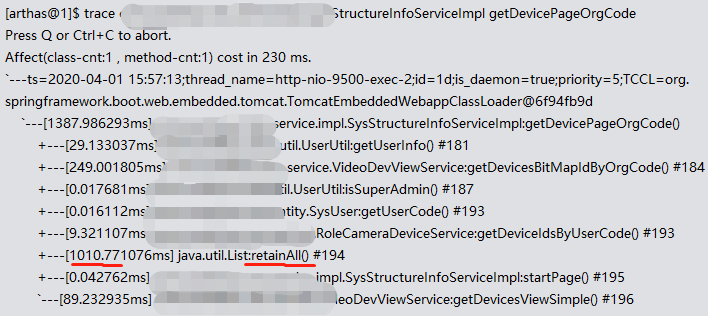

# 背景

现场出现性能问题。用arthas trace发现两个列表求交集慢成狗：
<!-- more -->





# 优化过程

## guava Sets.intersetion

话说第一次见到用List求交集，以前都是直接操作Set，自己遍历一遍。
retainAll是Collection接口提供的方法，可以求交集（retain：保留）。

集合操作，先转换为Set再`Sets.intersetion(s1, s2)`操作。
整体增加的成本是创建并用原来List的数据初始化HashSet。

这个问题就这么解决了😁。

但是感兴趣的是求集合的实现和对比。

## List vs Set retainAll

Collection接口定义了retainAll：
```java
// @return <tt>true</tt> if this list changed as a result of the call
boolean retainAll(Collection<?> c)
```

因为Set也是Collection接口一个实现。对比下两者retainAll性能，看下有无惊喜。

```java
@Test
public void test2() {
    Random random = new Random();
    Set<String> s1 = new HashSet<>();
    for (int i = 0; i < 10000; i++) {
        s1.add(random.nextInt(1000000) + "");
    
    Set<String> s2 = new HashSet<>();
    for (int i = 0; i < 1000000; i++) {
        s2.add(random.nextInt(1000000) + "");
    
    for (int i = 0; i < 1000; i++) {
        String x = random.nextInt(1000000) + "";
        s1.add(x);
        s2.add(x);
    
    List<String> a1 = s1.stream().collect(Collectors.toList());
    List<String> a2 = s1.stream().collect(Collectors.toList())

    long start = System.currentTimeMillis();
    a1.retainAll(a2);
    long end = System.currentTimeMillis();
    System.out.println("list retainAll, cost= " + (end - start) + " ms")

    a1 = s1.stream().collect(Collectors.toList());
    a2 = s1.stream().collect(Collectors.toList());
    start = System.currentTimeMillis();
    ((AbstractCollection) a1).retainAll(a2);
    end = System.currentTimeMillis();
    System.out.println("abstract list retainAll, cost= " + (end - start) + " ms")

    start = System.currentTimeMillis();
    s1.retainAll(s2);
    end = System.currentTimeMillis();
    System.out.println("set retainAll, cost= " + (end - start) + " ms");
}
```

执行结果
```
list retainAll, cost= 325 ms
abstract list retainAll, cost= 263 ms
set retainAll, cost= 5 ms
```

小结：java的`Set.retainAll`也能用。
接下来看具体实现。


## AbstractList的实现

```java
public boolean retainAll(Collection<?> c) {
    Objects.requireNonNull(c);
    boolean modified = false;
    Iterator<E> it = iterator();
    while (it.hasNext()) {
        // 注意不同的底层数据结构，contains、remove方法成本不一样
        if (!c.contains(it.next())) {
            it.remove();
            modified = true;
        }
    }
    return modified;
}
```
AbstractList的实现方式很朴素。直接遍历，找不到相同对象就删掉。
这也是Set的对应retainAll实现。

对于List类型，
- contains要遍历，O(n)
- 每次remove后要重新复制数据。

对于Set类型，
- contians查找比较快（例如HashSet实现）
- 删除后调整内部节点数量少。

## ArrayList的实现

```java
public boolean retainAll(Collection<?> c) {
    Objects.requireNonNull(c);
    return batchRemove(c, true);
}

// complement可以控制获取交集还是差集
// - true:  交集
// - false: 差集
private boolean batchRemove(Collection<?> c, boolean complement) {
    final Object[] elementData = this.elementData;
    int r = 0, w = 0;
    boolean modified = false;
    try {
        for (; r < size; r++)
            // contains 要遍历，O(n)
            if (c.contains(elementData[r]) == complement)
                elementData[w++] = elementData[r];
    } finally {
        // Preserve behavioral compatibility with AbstractCollection,
        // even if c.contains() throws.
        if (r != size) {
            System.arraycopy(elementData, r,
                             elementData, w,
                             size - r);
            w += size - r;
        }
        if (w != size) {
            // clear to let GC do its work
            for (int i = w; i < size; i++)
                elementData[i] = null;
            modCount += size - w;
            size = w;
            modified = true;
        }
    }
    return modified;
}
```
先遍历数据，找到所有的目标位置，再复制。
ArrayList相对AbstractCollection的优化是，避免remove，减少反复伸缩数据的成本。

然而，上面测试被打脸了。AbstractCollection的实现比ArrayList更快。。。数据样本原因？

## guava Sets的实现

guava的`Sets.intersection()`返回一个不可修改的Set视图。
通常把数量少的集合作为第一个参数，数量大的集合作为第二个参数，性能好些。
```java
public final class Sets {
  /**
   * Returns an unmodifiable <b>view</b> of the intersection of two sets. The
   * returned set contains all elements that are contained by both backing sets.
   * The iteration order of the returned set matches that of {@code set1}.
   *
   * <p>Results are undefined if {@code set1} and {@code set2} are sets based
   * on different equivalence relations (as {@code HashSet}, {@code TreeSet},
   * and the keySet of an {@code IdentityHashMap} all are).
   *
   * <p><b>Note:</b> The returned view performs slightly better when {@code
   * set1} is the smaller of the two sets. If you have reason to believe one of
   * your sets will generally be smaller than the other, pass it first.
   * Unfortunately, since this method sets the generic type of the returned set
   * based on the type of the first set passed, this could in rare cases force
   * you to make a cast, for example: <pre>   {@code
   *
   *   Set<Object> aFewBadObjects = ...
   *   Set<String> manyBadStrings = ...
   *
   *   // impossible for a non-String to be in the intersection
   *   SuppressWarnings("unchecked")
   *   Set<String> badStrings = (Set) Sets.intersection(
   *       aFewBadObjects, manyBadStrings);}</pre>
   *
   * <p>This is unfortunate, but should come up only very rarely.
   */
  public static <E> SetView<E> intersection(final Set<E> set1, final Set<?> set2) {
    checkNotNull(set1, "set1");
    checkNotNull(set2, "set2");

    final Predicate<Object> inSet2 = Predicates.in(set2);
    return new SetView<E>() {
      @Override
      public UnmodifiableIterator<E> iterator() {
        // 核心
        return Iterators.filter(set1.iterator(), inSet2);
      }

      @Override
      public Stream<E> stream() {
        return set1.stream().filter(inSet2);
      }

      @Override
      public Stream<E> parallelStream() {
        return set1.parallelStream().filter(inSet2);
      }

      @Override
      public int size() {
        return Iterators.size(iterator());
      }

      @Override
      public boolean isEmpty() {
        return !iterator().hasNext();
      }

      @Override
      public boolean contains(Object object) {
        return set1.contains(object) && set2.contains(object);
      }

      @Override
      public boolean containsAll(Collection<?> collection) {
        return set1.containsAll(collection) && set2.containsAll(collection);
      }
    };
  }
}
```

```java
public final class Iterators {
  /**
   * Returns a view of {@code unfiltered} containing all elements that satisfy
   * the input predicate {@code retainIfTrue}.
   */
  public static <T> UnmodifiableIterator<T> filter(
      final Iterator<T> unfiltered, final Predicate<? super T> retainIfTrue) {
    checkNotNull(unfiltered);
    checkNotNull(retainIfTrue);
    return new AbstractIterator<T>() {
      @Override
      protected T computeNext() {
        while (unfiltered.hasNext()) {
          T element = unfiltered.next();
          if (retainIfTrue.apply(element)) {
            return element;
          }
        }
        return endOfData();
      }
    };
  }
}
```

# 小结

求交集，使用Set性能比List好太多了。
通常使用Java原生的`Set.retainAll()`即可。

