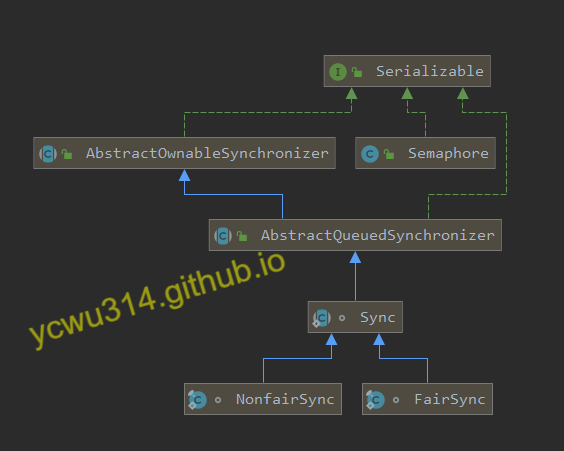

# 前言

Semaphore信号量用来控制同时访问某个特定资源的操作数量，或者同时执行某个指定操作的数量。
操作时首先要获取到许可，才能进行操作，操作完成后需要释放许可。如果没有获取许可，则阻塞到有许可被释放。
如果设置允许的信号量为1，则退化为互斥锁（mutex）。

之前分析了AQS和ReentrantLock，Semaphore就简单了。
相关文章：
- [java-aqs](/posts/java-aqs)
- [java-reentrantlock](/posts/java-reentrantlock)

<!-- more -->

# Semaphore.Sync 源码分析

Semaphore和ReentrantLock类似，支持公平、非公平策略。也有Sync内部类继承自AQS。





```java
abstract static class Sync extends AbstractQueuedSynchronizer {
    private static final long serialVersionUID = 1192457210091910933L;
    
    Sync(int permits) {
        setState(permits);
    }
}
```
回想AQS的属性
```java
private transient volatile Node head;
private transient volatile Node tail;
/**
 * The synchronization state.
 */
private volatile int state;
```
子类使用state字段存储同步状态。这里使用state记录剩余许可数量。

Sync类提供了非公平模式获取许可、以及释放许可的方法。
```java
final int nonfairTryAcquireShared(int acquires) {
    for (;;) {
        // AQS.state保存许可数量
        int available = getState();
        int remaining = available - acquires;
        if (remaining < 0 ||
            compareAndSetState(available, remaining))   // CAS
            return remaining;
    }
}
```
在无限循环中尝试获取许可。CAS方式更新许可剩余数量。

释放许可方式也是类似，但是增加溢出检查
```java
protected final boolean tryReleaseShared(int releases) {
    for (;;) {
        int current = getState();
        int next = current + releases;
        if (next < current) // overflow
            throw new Error("Maximum permit count exceeded");
        if (compareAndSetState(current, next))
            return true;
    }
}
```

# NonfairSync

非公平模式NonfairSync，直接使用Sync提供的方法。

# FairSync

公平模式，则是获取许可之前，先检查AQS sync队列有无等待的节点。
```java
    static final class FairSync extends Sync {
        private static final long serialVersionUID = 2014338818796000944L;

        FairSync(int permits) {
            super(permits);
        }

        protected int tryAcquireShared(int acquires) {
            for (;;) {
                // 检查AQS sync队列有无前驱
                if (hasQueuedPredecessors())
                    return -1;
                int available = getState();
                int remaining = available - acquires;
                if (remaining < 0 ||
                    compareAndSetState(available, remaining))
                    return remaining;
            }
        }
    }
```

# Semaphore例子

只允许3个线程并发打印。
```java
public class TestSemaphore {

    private static int MAX_SIZE = 23;
    private static int SEMAPHORE_SIZE = 3;
    private static AtomicInteger count = new AtomicInteger(MAX_SIZE);
    private static Semaphore semaphore = new Semaphore(SEMAPHORE_SIZE);

    public static void main(String[] args) {
        ExecutorService es = Executors.newCachedThreadPool();
        for (int i = 0; i < 10; i++) {
            es.submit(new PrintTask(i));
        }
        es.shutdown();
        try {
            es.awaitTermination(5, TimeUnit.SECONDS);
        } catch (InterruptedException e) {
            e.printStackTrace();
        }        
    }

    static class PrintTask implements Runnable {

        private int id;

        public PrintTask(int id) {
            this.id = id;
        }

        @Override
        public void run() {
            int curr;
            while ((curr = count.getAndDecrement()) > 0) {
                try {
                    semaphore.acquire();
                    System.out.println("thread[" + id + "] got semphore @ " + curr);

                } catch (InterruptedException e) {
                    e.printStackTrace();
                } finally {
                    semaphore.release();
                }
            }
        }
    }
}
```

# 小结

- Semaphore支持非公平和公平模式。
- Semaphore使用AQS的state字段存放剩余许可数量。
