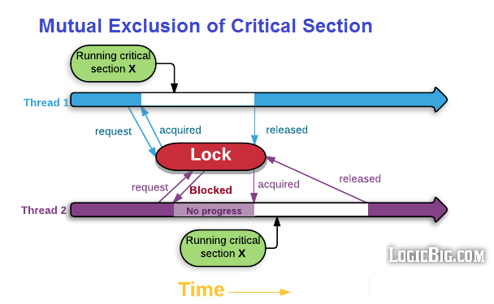
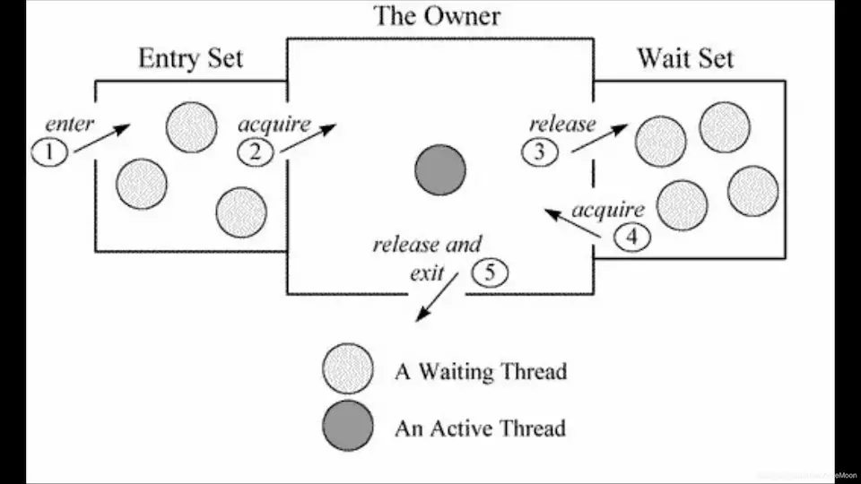
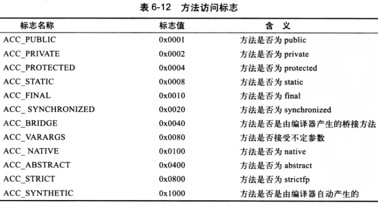
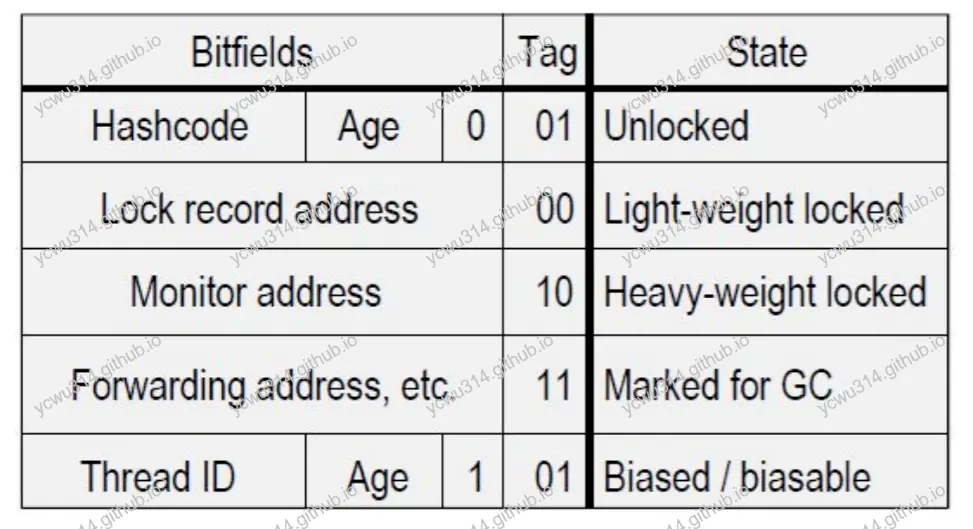

# 前言

上次讲到volatile只保证多线程对共享对象修改的可见性。多线程需要同步的操作，就要使用锁机制。
- [java-volatile](/posts/java-volatile)

锁机制可以控制关键区域代码的访问。只有获得锁，才能执行关键区域代码。





synchronized是java内置的隐式锁机制。

# synchronized

synchronized可以作用于方法级别，或者代码块级别。

synchronized用于方法：
- 静态方法
- 非静态方法

synchronized用于代码块：
- synchronized(this)、synchronized(object)
- synchronized(XXX.class)

不管是用在方法、还是代码块，本质是使用的锁不同。
ps. synchronized关键字不能继承。

<!-- more -->

# java的锁

在了解synchronized实现机制之前，先了解java的锁。

## 内置锁/监视器锁

每个java对象的实例，都有一个关联的锁，称为监视器锁(monitor lock) ，又叫内置锁（intrinsic lock） 。

## 类锁

每一个类都有一个对应的Class对象，这个Class对象的锁叫类锁。

## 和synchronized的关系

1. synchronized修饰静态方法，使用的是类锁。
2. synchronized修饰非静态方法，使用的是实例的监视器锁。
3. synchronized(this)使用的是实例的监视器锁。
4. synchronized(XXX.class)使用的是XXX对象的类锁。
5. **对象锁和类锁是相互独立**。静态方法和非静态方法同时执行，会各自竞争需要的锁。

# synchronized的底层实现

为了探究synchronized的底层实现，首先写个简单的类。
```java
public class TestSynchronized {

    public synchronized int test(int x) {
        return x + 1;
    }

    public int test2(int x) {
        synchronized (this) {
            return x + 1;
        }
    }
}
```
然后使用`javap`查看反编译的字节码
```
>javap -c TestSynchronized.class
Compiled from "TestSynchronized.java"
public class com.example.threads.TestSynchronized {
  public com.example.threads.TestSynchronized();
    Code:
       0: aload_0
       1: invokespecial #1                  // Method java/lang/Object."<init>":()V
       4: return

  public synchronized int test(int);
    Code:
       0: iload_1
       1: iconst_1
       2: iadd
       3: ireturn

  public int test2(int);
    Code:
       0: aload_0
       1: dup
       2: astore_2
       3: monitorenter
       4: iload_1
       5: iconst_1
       6: iadd
       7: aload_2
       8: monitorexit
       9: ireturn
      10: astore_3
      11: aload_2
      12: monitorexit
      13: aload_3
      14: athrow
}
```
synchronized修饰方法，字节码并没有特别指令。
synchronized修饰代码块，则会在进入和离开synchronized块处插入`monitorenter`、`monitorexit`。

## synchronized修饰代码块

关于`monitorenter`、`monitorexit`的具体介绍，参考 [monitorenter/monitorexit](https://docs.oracle.com/javase/specs/jvms/se6/html/Instructions2.doc9.html)。
简单来说，`monitorenter`、`monitorexit`是获得、释放objref关联的监视器（monitor）。之前提到，获取监视器锁的实例，才能执行关键区域的代码。





Monitor是依赖于底层的操作系统的Mutex Lock（互斥锁）来实现的线程同步。因此是一个重量级的锁。在java6之前，性能比较低。java6对synchronized做了优化，把锁分为4种状态，级别从低到高依次是：无锁、偏向锁、轻量级锁和重量级锁。锁状态只能升级不能降级。

## synchronized修饰方法

这次使用`javap -verbose`再次分析
```
public synchronized int test(int);
  descriptor: (I)I
  flags: ACC_PUBLIC, ACC_SYNCHRONIZED
  Code:
    stack=2, locals=2, args_size=2
       0: iload_1
       1: iconst_1
       2: iadd
       3: ireturn
```
发现synchronized方法，flags多了`ACC_SYNCHRONIZED`。





在Class文件的方法表中将该方法的access_flags字段中的synchronized标志位置1，表示该方法是同步方法并使用调用该方法的对象或该方法所属的Class在JVM的内部对象表示Klass做为锁对象。

# java对象头，锁状态

java对象头主要包括两部分数据：Mark Word（标记字段）、Klass Pointer（类型指针）。
Mark Word用于存储对象自身的运行时数据。Klass Point是对象指向它的类元数据的指针。
这里面核心的是mark word。





Mark word为了节省存储空间，会根据state的值重用之前的空间。

| 锁状态 | 存储内容 | 存储内容 |
| :------- | :-------- | :--- |
| 无锁 | 对象的hashCode、对象分代年龄、是否是偏向锁（0） | 01 |
| 偏向锁 | 偏向线程ID、偏向时间戳、对象分代年龄、是否是偏向锁（1） | 01 |
| 轻量级锁 | 指向栈中锁记录的指针 | 00 |
| 重量级锁 | 指向互斥量（重量级锁）的指针 | 10 |

关于锁的状态，强烈推荐阅读这篇文章：[不可不说的Java“锁”事](https://tech.meituan.com/2018/11/15/java-lock.html)。现在简单摘录主要内容。

## 无锁

无锁不会锁定资源。线程在循环内尝试修改共享资源，如果没有冲突，则修改成功，否则修改失败、在下一次循环继续尝试。
CAS操作是典型的无锁方式。

## 偏向锁

一段代码一直被一个线程访问，那么该线程自动获取锁。这样不存在锁的竞争。
线程只需要在获得偏向锁的时候，使用CAS操作，更新thread id，无需要在进入、离开关键区域再进行CAS操作。
偏向锁优化了无多线程竞争的情况，减少不必要的获取轻量级锁。
获得偏向锁的线程，不会主动释放锁。只会在其他线程竞争获取锁的时候，才会释放锁。
偏向锁java6以后默认是打开的，由jvm参数`XX:+UseBiasedLocking`控制。

## 轻量级锁

当锁是偏向锁的时候，被另外的线程所访问，偏向锁就会升级为轻量级锁，其他线程会通过自旋的形式尝试获取锁，不会阻塞，从而提高性能。

若当前只有一个等待线程，则该线程通过自旋进行等待。但是当自旋超过一定的次数，或者一个线程在持有锁，一个在自旋，又有第三个来访时，轻量级锁升级为重量级锁。

## 重量级锁

升级为重量级锁时，锁标志的状态值变为“10”，此时Mark Word中存储的是指向重量级锁的指针，此时等待锁的线程都会进入阻塞状态。

## 4种锁状态的小结

偏向锁通过对比Mark Word解决加锁问题，避免执行CAS操作。
轻量级锁是通过用CAS操作和自旋来解决加锁问题，避免线程阻塞和唤醒而影响性能。
重量级锁是将除了拥有锁的线程以外的线程都阻塞。

## 其他锁优化措施

- 锁粗化（Lock Coarsening）：也就是减少不必要的紧连在一起的unlock，lock操作，将多个连续的锁扩展成一个范围更大的锁。
- 锁消除（Lock Elimination）：通过运行时JIT编译器的逃逸分析来消除一些没有在当前同步块以外被其他线程共享的数据的锁保护，通过逃逸分析也可以在线程本地Stack上进行对象空间的分配（同时还可以减少Heap上的垃圾收集开销）。
- 自适应自旋锁（Adaptive Spinning）：根据jvm运行时的统计，调整自旋的等待时间。

# 参考

- [[Class文件结构]3——方法表、属性表](https://www.jianshu.com/p/d59ded873a2e)
- [out-ofmemoryerror-what-is-the-cost-of-java-objects](https://www.slideshare.net/JeanPhilippeBEMPEL/out-ofmemoryerror-what-is-the-cost-of-java-objects)
- [不可不说的Java“锁”事](https://tech.meituan.com/2018/11/15/java-lock.html)
