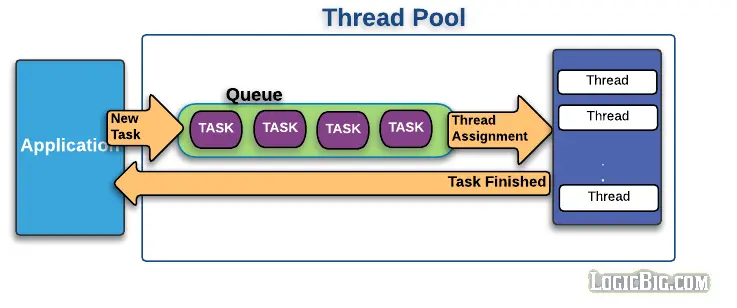

频繁地创建和销毁线程，会浪费资源。因此产生了线程池，缓存并重用线程，提高性能。





使用java线程池，最简单的方式是Executors和ExecutorService。
(图片来源：`https://www.logicbig.com/tutorials/core-java-tutorial/java-multi-threading/thread-pools.html`)

<!-- more -->

# Executors和ExecutorService

ExecutorService提供了线程、线程池相关管理的抽象，包括提交任务（submit、execute）、关闭线程池。
Executors是一个工具类，提供了创建线程池的入口。
```java
ExecutorService es = Executors.newCachedThreadPool();
```
常见创建线程池
- newCachedThreadPool：创建缓存型线程池。适用于大量短生命周期的任务。
- newFixedThreadPool：创建固定线程数量的线程池。
- newScheduledThreadPool：创建延迟/定时任务的线程池。
- newSingleThreadScheduledPool：模拟单个线程操作的线程池。

java8以后新增newWorkStealingPool，创建工作窃取类型的线程池，以后再专门讨论working steal，这里先不深入展开。

# ThreadPoolExecutor

真实创建线程池，依靠ThreadPoolExecutor。Executors只是简单的封装。
```java
public static ExecutorService newCachedThreadPool() {
        return new ThreadPoolExecutor(0, Integer.MAX_VALUE,
                                      60L, TimeUnit.SECONDS,
                                      new SynchronousQueue<Runnable>());
    }
```
ThreadPoolExecutor的构造函数，有一堆定制参数。
```java
public ThreadPoolExecutor(int corePoolSize,
                          int maximumPoolSize,
                          long keepAliveTime,
                          TimeUnit unit,
                          BlockingQueue<Runnable> workQueue,
                          ThreadFactory threadFactory,
                          RejectedExecutionHandler handler) {
                              
                          }
}
```
参数意义如下：
- corePoolSize：核心线程数，默认情况下核心线程会一直存活，即使处于闲置状态也不会受存keepAliveTime限制。除非将allowCoreThreadTimeOut设置为true。
- maximumPoolSize：线程池所能容纳的最大线程数。超过这个数的线程将被阻塞。当任务队列为没有设置大小的LinkedBlockingDeque时，这个值无效。
- keepAliveTime：非核心线程的闲置超时时间，超过这个时间就会被回收。
- unit：指定keepAliveTime的单位，如TimeUnit.SECONDS。
- workQueue：任务队列。常用的有三种队列：SynchronousQueue，LinkedBlockingDeque，ArrayBlockingQueue。
- threadFactory：线程工厂，可以对创建的线程进行定制。
- handler：超出workQueue容量的任务的处理方式。


# DiscardPolicy

当缓存任务数量大于workQueue容量，且工作线程数到达maxPoolSize，会触发DiscardPolicy处理，有4种处理策略
- DiscardOldestPolicy：丢弃workQueue中最老的任务，并且尝试再次把当前任务加入到workQueue。
- AbortPolicy：丢弃任务，且抛出异常。
- CallerRunsPolicy：有发起任务的线程去执行。这就从源头上限流。
- DiscardPolicy：丢弃任务，但是不抛出异常。

# 为什么建议直接使用ThreadPoolExecutor

从ThreadPoolExecutor构造函数可以看到多个控制参数，最为核心的是线程池大小、阻塞队列、拒绝策略。
举个例子，打开Executors，查看newFixedThreadPool
```java
public static ExecutorService newFixedThreadPool(int nThreads) {
    return new ThreadPoolExecutor(nThreads, nThreads,
                                  0L, TimeUnit.MILLISECONDS,
                                  new LinkedBlockingQueue<Runnable>());
}
```
那么当线程数到达corePoolSize，新提交的任务将会堆积到workQueue，由于类型是LinkedBlockingQueue，没有做长度限制，就会有可能堆积大量的任务，消耗大量内存，引发频繁gc、甚至OOM问题。

如果手动使用ThreadPoolExecutor创建线程池，那么新建线程池的时候就要考虑清楚适合业务场景的线程池配置，可控性更高。这也是阿里推荐使用ThreadPoolExecutor创建线程池的原因。

接下来深入了解ThreadPoolExecutor的代码。


# 添加任务到线程池

调用的是execute()。
```java
private final AtomicInteger ctl = new AtomicInteger(ctlOf(RUNNING, 0));

public void execute(Runnable command) {
    if (command == null)
        throw new NullPointerException();
    /*
     * Proceed in 3 steps:
     *
     * 1. If fewer than corePoolSize threads are running, try to
     * start a new thread with the given command as its first
     * task.  The call to addWorker atomically checks runState and
     * workerCount, and so prevents false alarms that would add
     * threads when it shouldn't, by returning false.
     *
     * 2. If a task can be successfully queued, then we still need
     * to double-check whether we should have added a thread
     * (because existing ones died since last checking) or that
     * the pool shut down since entry into this method. So we
     * recheck state and if necessary roll back the enqueuing if
     * stopped, or start a new thread if there are none.
     *
     * 3. If we cannot queue task, then we try to add a new
     * thread.  If it fails, we know we are shut down or saturated
     * and so reject the task.
    */
    int c = ctl.get();
    if (workerCountOf(c) < corePoolSize) {
        if (addWorker(command, true))
            return;
        c = ctl.get();
    }
    if (isRunning(c) && workQueue.offer(command)) {
        int recheck = ctl.get();
        if (! isRunning(recheck) && remove(command))
            reject(command);
        else if (workerCountOf(recheck) == 0)
            addWorker(null, false);
    }
    else if (!addWorker(command, false))
        reject(command);
}
```

1. 如果当前线程数 < corePoolSize，则新建线程。
2. 当前线程数>= corePoolSize，且小于workQueue容量，则添加到workQueue，缓存任务。
3. 如果workQueue已满，并且未达到maxPoolSize，则新建线程并且执行任务。
4. 否则，已经达到maxPoolSize，reject这个任务。

addWorker()是底层实现添加任务的类。核心是在循环内进行CAS检查，避免使用锁。
```java
private boolean addWorker(Runnable firstTask, boolean core) {
    retry:
    for (;;) {
        int c = ctl.get();
        int rs = runStateOf(c);
        // Check if queue empty only if necessary.
        if (rs >= SHUTDOWN &&
            ! (rs == SHUTDOWN &&
               firstTask == null &&
               ! workQueue.isEmpty()))
            return false;
        for (;;) {
            int wc = workerCountOf(c);
            if (wc >= CAPACITY ||
                wc >= (core ? corePoolSize : maximumPoolSize))
                return false;
            if (compareAndIncrementWorkerCount(c))
                break retry;
            c = ctl.get();  // Re-read ctl
            if (runStateOf(c) != rs)
                continue retry;
            // else CAS failed due to workerCount change; retry inner loop
        }
    }

    boolean workerStarted = false;
    boolean workerAdded = false;
    Worker w = null;
    try {
        w = new Worker(firstTask);
        final Thread t = w.thread;
        if (t != null) {
            final ReentrantLock mainLock = this.mainLock;
            mainLock.lock();
            try {
                // Recheck while holding lock.
                // Back out on ThreadFactory failure or if
                // shut down before lock acquired.
                int rs = runStateOf(ctl.get());

                if (rs < SHUTDOWN ||
                    (rs == SHUTDOWN && firstTask == null)) {
                    if (t.isAlive()) // precheck that t is startable
                        throw new IllegalThreadStateException();
                    workers.add(w);
                    int s = workers.size();
                    if (s > largestPoolSize)
                        largestPoolSize = s;
                    workerAdded = true;
                }
            } finally {
                mainLock.unlock();
            }
            if (workerAdded) {
                t.start();
                workerStarted = true;
            }
        }
    } finally {
        if (! workerStarted)
            addWorkerFailed(w);
    }
    return workerStarted;
}
```

# ctl变量

阅读ThreadPoolExecutor源码，需要留意ctl变量。
ctl变量把workerCount和runState打包到一个int类型。很巧妙的做法：
>In order to pack them into one int, we limit workerCount to
>     * (2^29)-1 (about 500 million) threads rather than (2^31)-1 (2
>     * billion) otherwise representable.

定义ctl变量
```java
private final AtomicInteger ctl = new AtomicInteger(ctlOf(RUNNING, 0));
// 32 - 3 = 29
private static final int COUNT_BITS = Integer.SIZE - 3;
private static final int CAPACITY   = (1 << COUNT_BITS) - 1;
```
把运行状态保存在高位，其余位数表示线程数。注意running状态，ctl是负数。
```java
// runState is stored in the high-order bits
private static final int RUNNING    = -1 << COUNT_BITS;
private static final int SHUTDOWN   =  0 << COUNT_BITS;
private static final int STOP       =  1 << COUNT_BITS;
private static final int TIDYING    =  2 << COUNT_BITS;
private static final int TERMINATED =  3 << COUNT_BITS;
```
接下来就容易理解了。
```java
// Packing and unpacking ctl
private static int runStateOf(int c)     { return c & ~CAPACITY; }

// 和CAPACITY按位与，丢弃了高位（状态位）
private static int workerCountOf(int c)  { return c & CAPACITY; }
private static int ctlOf(int rs, int wc) { return rs | wc; }
```


