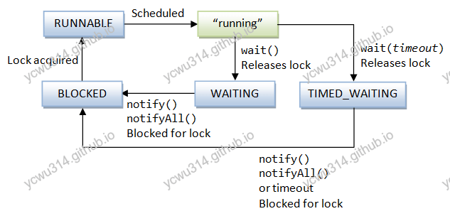

# 方法所属类

sleep()是Thread类的方法。wait()是Object类的方法。

# 调用地方

sleep可以在任何地方调用。wait必须在synchronized中调用，否则抛出`IllegalMonitorStateException`
```java
Object a = new Object();
try {
    a.wait();
} catch (InterruptedException e) {
    e.printStackTrace();
}
```
输出
```
java.lang.IllegalMonitorStateException
	at java.lang.Object.wait(Native Method)
	at java.lang.Object.wait(Object.java:502)
	at com.example.threads.TestSleepAndWait.testWait(TestSleepAndWait.java:11)
```
正确使用wait：
```java
@Test
public void testWait() {
    Object lock = new Object();
    synchronized (lock) {
        try {
            lock.wait(1000);
        } catch (InterruptedException e) {
            e.printStackTrace();
        }
    }
}

@Test
public synchronized void testWait2() {
    try {
        wait(1000);
    } catch (InterruptedException e) {
        e.printStackTrace();
    }
}
```
<!-- more -->

# 是否释放监视器锁

sleep不会释放监视器锁。wait释放监视器锁（因此wait必须在synchronized中使用）

sleep的javadoc
```java
/**
 * Causes the currently executing thread to sleep (temporarily cease
 * execution) for the specified number of milliseconds, subject to
 * the precision and accuracy of system timers and schedulers. The thread
 * does not lose ownership of any monitors.
 */
public static native void sleep(long millis) throws InterruptedException;
```

wait的javadoc，原文太长做了截断
```java
/*
     * The current thread must own this object's monitor. The thread
     * releases ownership of this monitor and waits until another thread
     * notifies threads waiting on this object's monitor to wake up
     * either through a call to the {@code notify} method or the
     * {@code notifyAll} method. The thread then waits until it can
     * re-obtain ownership of the monitor and resumes execution.
*/
public final void wait() throws InterruptedException {
    wait(0);
}     
```





## 测试sleep

```java
@Test
public void testSleepForMonitor(){
    try {
        Thread.sleep(60000L);
    } catch (InterruptedException e) {
        e.printStackTrace();
    }
}
```
jps找到pid，再jstack打印thread dump。

```
C:\Users\ycwu>jps
3312
7744 RemoteMavenServer
13352 Jps
1884 Launcher
8476 JUnitStarter

C:\Users\ycwu>jstack 8476
```
输出
```
"main" #1 prio=5 os_prio=0 tid=0x00000000029f3000 nid=0x2fdc waiting on condition [0x00000000028ae000]
   java.lang.Thread.State: TIMED_WAITING (sleeping)
        at java.lang.Thread.sleep(Native Method)
        at com.example.threads.TestSleepAndWait.testSleepForMonitor(TestSleepAndWait.java:42)
```

## 测试wait

```java
    @Test
    public synchronized void testWaitForMonitor(){
        try {
            wait(60000L);
        } catch (InterruptedException e) {
            e.printStackTrace();
        }
    }
```
jps找到pid，再jstack打印thread dump。
```
C:\Users\ycwu>jps
13408 JUnitStarter
3312
7744 RemoteMavenServer
13220 Launcher
13224 Jps

C:\Users\ycwu>jstack 13408
```
输出
```
"main" #1 prio=5 os_prio=0 tid=0x0000000002ae3000 nid=0x91c in Object.wait() [0x000000000294e000]
   java.lang.Thread.State: TIMED_WAITING (on object monitor)
        at java.lang.Object.wait(Native Method)
        - waiting on <0x000000076c56cc18> (a com.example.threads.TestSleepAndWait)
        at com.example.threads.TestSleepAndWait.testWaitForMonitor(TestSleepAndWait.java:50)
        - locked <0x000000076c56cc18> (a com.example.threads.TestSleepAndWait)
```
从下往上看，先获取了锁（`locked <0x000000076c56cc18>`），然后释放并且等待（`waiting on <0x000000076c56cc18>`）。

# 唤醒

wait能够被notify和notifyAll唤醒。但是sleep不能。


