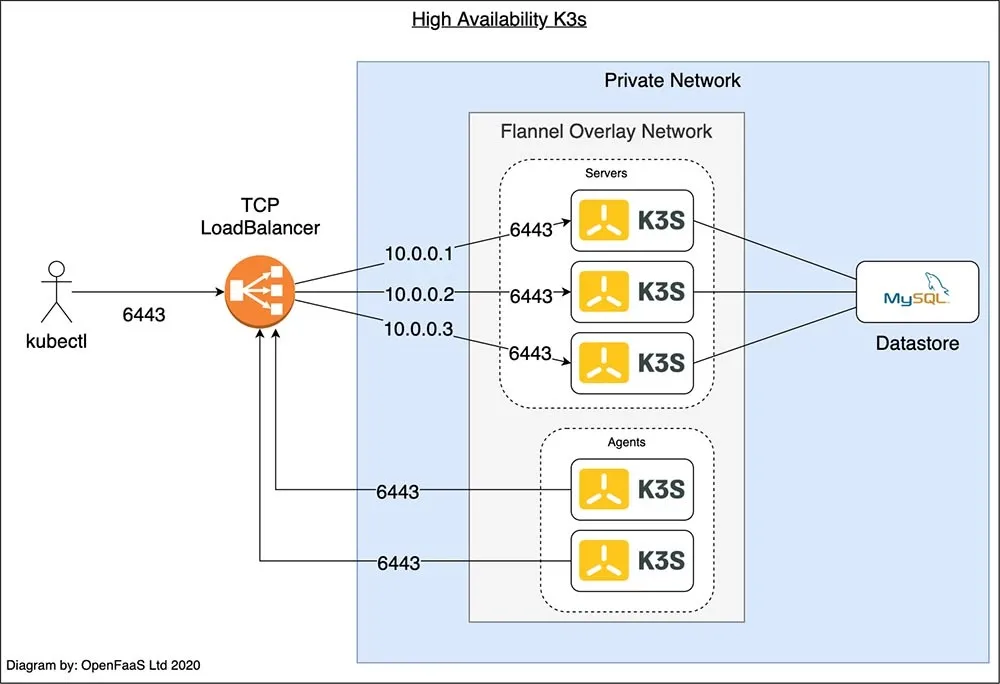

# 单机模式架构

之前安装单机模式的k3s，单个server节点，使用了内置sqlite数据库。


<!-- more -->

# 高可用模式架构

高可用模式的两个关键点：
- 高可用存储替换内嵌的sqlite数据库，保存集群状态
- 部署多个server节点，并且负载均衡


## 状态存储

可以使用关系型数据库，或者etcd
- SQL数据存储：SQL数据库可以用于存储集群状态，但SQL数据库也必须在高可用配置下运行才有效。
- 嵌入式etcd：与Kubernetes的传统配置方式最为类似

安装k3s的时候，使用
- 标志位: `--datastore-endpoint` 
- 或者，环境变量: `K3S_DATASTORE_ENDPOINT`


## 固定agent的注册地址

Kubernetes API server配置为端口 6443 的 TCP 流量。外部流量（如来自kubectl客户端的流量）使用KUBECONFIG文件中的IP地址或DNS条目连接到API server。
因为有多个server节点，所以引入负载均衡器，作为agent固定的注册地址。





一些用到的安装参数：
- `K3S_TOKEN`：agent加入集群的时候使用。server token路径：`/var/lib/rancher/k3s/server/node-token`。
- 各个节点密码路径：`/etc/rancher/node/password`。
- 指定主机名：`--node-name`
- 启动server或者agent的时候，可以在主机名后面增加随机唯一的节点ID：`--with-node-id`。
- `--tls-san`：在TLS证书中添加其他主机名或IP作为主机备用名称。允许通过公网IP访问控制、操作远程集群。Subject Alternative Name，缩写为 SAN。它可以包括一个或者多个的电子邮件地址，域名，IP地址和 URI 等。

# 安装

## server节点
```sh
# --tls-san
# 在TLS证书中添加其他主机名或IP作为主机备用名称
# 即在公网环境下允许通过公网IP访问控制、操作远程集群
# 或者部署多个Server并使用LB进行负责，就需要保留公网地址
$ curl -sfL http://rancher-mirror.cnrancher.com/k3s/k3s-install.sh | \
    INSTALL_K3S_MIRROR=cn sh - server \
    --datastore-endpoint="mysql://root:password@ip:3306/k3s" \
    --tls-san 1.2.3.4
```

负载均衡，可以使用nginx配置，此处省略。


## agent节点

安装agent并且加入到server集群
```sh
# 为每个节点添加随机后缀
$ curl -sfL http://rancher-mirror.cnrancher.com/k3s/k3s-install.sh | \
    INSTALL_K3S_MIRROR=cn K3S_URL=https://fixed-registration-address:6443 \
    K3S_TOKEN=xxx sh -s - --with-node-id


# 为每个节点指定主机名
$ curl -sfL http://rancher-mirror.cnrancher.com/k3s/k3s-install.sh | \
    INSTALL_K3S_MIRROR=cn K3S_URL=https://fixed-registration-address:6443 \
    K3S_TOKEN=xxx sh -s - --node-name k3s2
```

或者，已有agent加入到server集群
```sh
K3S_TOKEN=xxx k3s agent --server https://fixed-registration-address:6443
```


# 参考资料

- https://rancher.com/docs/k3s/latest/en/architecture/
- https://rancher.com/docs/k3s/latest/en/installation/install-options/server-config/


