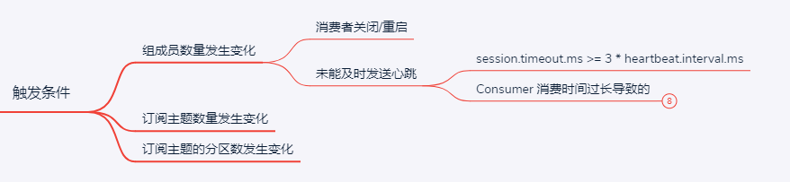

# 背景

最近处理线上kafka rebalance问题，顺便整理笔记。
<!-- more -->





这次讨论的是consumer不能及时发送心跳，导致rebalance的问题。

# kafka 0.10.0以前的消费者心跳问题

kafka官方推荐在consumer thread中完成拉取数据和消费数据，简化编程。
但是，kafka 0.10.0以前，kafka consumer thread在单个线程内既负责消费records数据，又负责维护和kafka server的心跳。
如果消费者消耗大量时间处理records，超过了session timeout还没上报心跳，那么这个consumer会被group移出，它所拥有的partition被指定到其他成员（触发rebalance）。
实际上，消费者并不是死掉，而是正在消费records。因此这个reblance是多余的。

最好的情况，这个消费者重新加入。
最坏的情况，因为消费者被踢出了group，不能正常提交offset，那么这些消息在rebalance之后又被再次消费。

>but if this takes longer than the configured session timeout, the consumer is removed from the group and its partitions are assigned to other members. 
>In the best case, this causes unneeded rebalancing when the consumer has to rejoin. 
>In the worst case, the consumer will not be able to commit offsets for any messages which were handled after the consumer had fallen out of the group, which means that these messages will have to be processed again after the rebalance. 
>If a message or set of messages always takes longer than the session timeout, then the consumer will not be able to make progress until the user notices the problem and makes some adjustment.

在0.10.0.0以前，解决这个问题的方式：
1. 增加session timeout时间
2. 减少`max.poll.records`

对于1)，尽管避免了consumer thread长时间消费records、未能及时上报心跳的问题。但是，一旦进程崩溃，kafka要等待更长时间才能识别这个故障的consumer。
对于2)，会对某些批处理应用性能有影响。

rebalance是一个耗时的操作。一旦开始rebalance，consumer要完成正在处理事情，提交offset，在session超时之前重新加入group。
即使一个消费者正常发送心跳，如果在rebalance期间不能及时加入，也会被剔除掉。

>When a rebalance begins, the consumer must finish whatever processing it is currently doing, commit offsets, and rejoin the group before the session timeout expires. In other words, the session timeout is also used as a rebalance timeout. 
>Even if a consumer continues sending heartbeats to the coordinator, it will be removed from the group if it cannot rejoin fast enough when a rebalance begins. 


# KIP-62

根本原因是，session timeout的使用范围膨胀了：
- 标记应用失败或者不可访问
- consumer处理一批records的最大时间
- 一个group完成rebalance的最大时间


KIP-62进行了优化，把这些timeout解耦：
- 由后台线程发送心跳
- 增加了`max.poll.interval.ms`配置项。
- 增加rebalance timeout

后台线程单独发送心跳，则不会占用consumer thread的时间。

## 解耦消费者处理records的最大timeout

增加`max.poll.interval.ms`，作为consumer处理一批records的timeout。这是两次连续调用`poll()`的最大间隔。
如果发生timeout，那么consumer停止发送心跳，**并且显式发送`LeaveGroup`请求**。
当consumer再次调用`poll()`，消费者会rejoin the group。

那么`max.poll.interval.ms`要怎么配置？
>In practice, we expect the process timeout to always be at least as large as the session timeout. 

## 解耦rebalance timeout

在JoinGroup Request增加rebalance timeout字段：
>We propose to add a separate rebalance timeout, which is passed to the coordinator in the JoinGroup request.
>As with the session timeout, the broker will use the maximum rebalance timeout across all members in the group

那么这个值设置多少？官方建议是`max.poll.interval.ms`
>Since we give the client as much as max.poll.interval.ms to handle a batch of records, this is also the maximum time before a consumer can be expected to rejoin the group in the worst case. 
>We therefore propose to set the rebalance timeout in the Java client to the same value configured with max.poll.interval.ms. 


新版本的JoinGroup Request
```
  GroupId => string
  SessionTimeout => int32
  RebalanceTimeout => int32  ;;; this is new
  MemberId => string
  ProtocolType => string
  GroupProtocols => [ProtocolName ProtocolMetadata]
    ProtocolName => string
    ProtocolMetadata => bytes
```

# 小结

KIP-62优化（0.10.0）：
- 单独的后台线程发送心跳
- `max.poll.interval.ms`表示单个处理线程的最大超时。它是client两次主动发起`poll()`的最大间隔。如果超出这个时间，client会发送`LeaveGroup`命令。同时用于rebalance timeout。
- `session.timeout.ms`表示进程级别的超时

```
参数名                --> MemberMetadata 字段
session.timeout.ms   --> MemberMetadata.sessionTimeoutMs
max.poll.interval.ms --> MemberMetadata.rebalanceTimeoutMs  默认5min
```

非常值得阅读KIP-62原文。

# 参考

- [KIP-62: Allow consumer to send heartbeats from a background thread](https://cwiki.apache.org/confluence/display/KAFKA/KIP-62%3A+Allow+consumer+to+send+heartbeats+from+a+background+thread)
- [Difference between session.timeout.ms and max.poll.interval.ms for Kafka 0.10.0.0 and later versions](https://stackoverflow.com/questions/39730126/difference-between-session-timeout-ms-and-max-poll-interval-ms-for-kafka-0-10-0)
