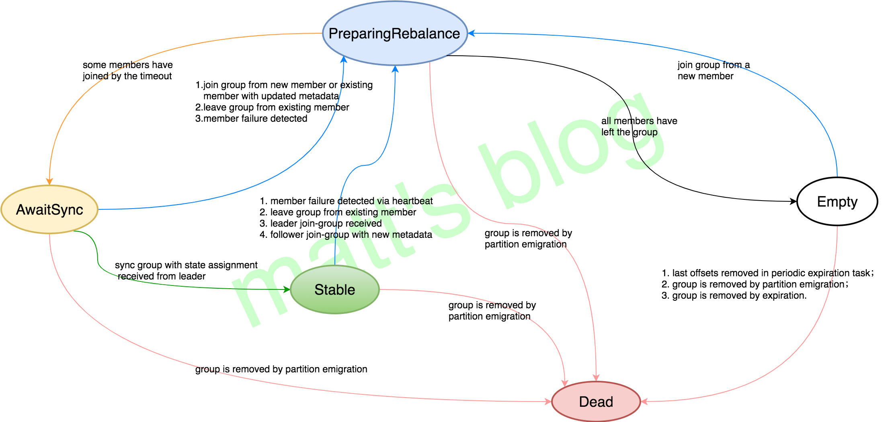

# 背景

上次讲到，消费者的重启/关闭会也是rebalance的原因之一。
大量消费者不是同一个时间完成启动，导致反复进行rebalance。
这次记录consumer group状态和rebalance流程的关系，以及kafka做出的优化。
<!-- more -->

# consumer group状态和状态转移

GroupCoordinator负责组状态维护。
kafka 0.11之前，Server端Consumer的 Group 共定义了五个状态：
- Empty：Group has no more members, but lingers until all offsets have expired. This state also represents groups which use Kafka only for offset commits and have no members.
- PreparingRebalance：Group is preparing to rebalance.
- AwaitingSync：Group is awaiting state assignment from the leader.
- Stable：Group is stable.
- Dead：Group has no more members and its metadata is being removed.

完整的状态定义和状态转移见`GroupMetadata.scala`。这里引用网上找到一张状态机图，非常值得仔细学习：

（图片来源：`https://matt33.com/2017/01/16/kafka-group/`）

# 现有问题

kafka 0.11之前，一个新consumer group的建立，要经过至少2次rebalance（假设这个组有不只一个成员）。
rebalance是一个耗时的操作，涉及状态的持久化、offset提交等。如果涉及移出partition，则成本更高。

产生多次rebalance的一个重要原因是，consumer通常不是在同一个时间启动。每次有consumer加入/离开group，都要触发rebalance，如果有相当数量的consumers，那么要经历比较长的时间才能进入stable状态。

# KIP-134

- 增加新的状态：`InitialRebalance`。
- 增加新的broker配置项：`group.initial.rebalance.delay.ms`。

InitialRebalance发生在Empty和PreparingRebalance之间。
当一个空组收到第一个JoinGroupRequest，那么：
- Group的状态：Empty => InitialRebalance
- 最长等待t=`min(rebalanceTimeout, group.initial.rebalance.delay.ms)`

(`rebalanceTimeout`对应`max.poll.interval.ms`，默认5min。)

若等待期间，有新的consumer加入，则Group依然处于InitialRebalance状态，且更新等待时间为`min(remainingRebalanceTimeout, group.initial.rebalance.delay.ms)`
若等待超时，那么JoinGrou完成，且Group状态：InitialRebalance => PreparingRebalance。 

我的理解：InitialRebalance阶段增加了单次rebalance的时间。但是一次rebalance能够收集更多的JoinGroupRequest，避免反复进入rebalance，从而减少整体总的rebalance时间。

# 参考

- [KIP-134: Delay initial consumer group rebalance](https://cwiki.apache.org/confluence/display/KAFKA/KIP-134%3A+Delay+initial+consumer+group+rebalance)
