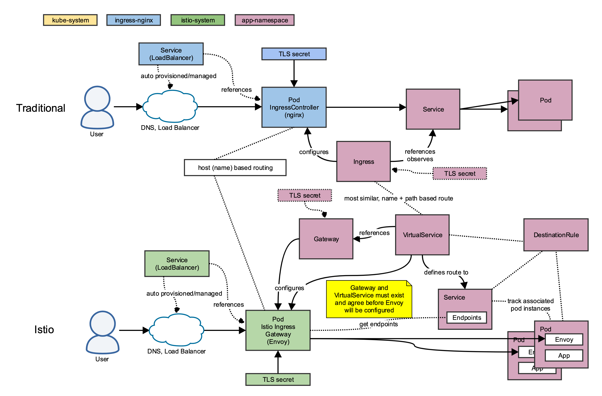



# k8s对外暴露服务方式

k8s集群向外部暴露服务的方式有三种： NodePort，LoadBalancer 和 Ingress。
<!-- more -->
NodePort 方式在服务变多的情况下会导致节点要开的端口越来越多，不好管理。
LoadBalancer 更适合结合云提供商的 LB 来使用。但是云供应商的LB是要收费的，要考虑成本问题。
Ingress 是 k8s 官方提供的用于对外暴露服务的方式。一般在云环境下是 LB + Ingress Controller 方式对外提供服务。

>Service 虽然解决了服务发现和负载均衡的问题，但对外访问的时候，NodePort类型需要在外部搭建额外的负载均衡，
>而LoadBalancer需要Kubernetes必须跑在支持的cloud provider上面。 
>Ingress就是为了解决这些限制的。

# ingress


```
    internet
        |
   [ Ingress ]
   --|-----|--
   [ Services ]
```

通常最外层流量先去到云厂商的LoadBalancer，然后路由到ingress controller。


再贴一张istio服务网格下的对比。





Ingress一般会有三个组件:
- 反向代理负载均衡器
- Ingress
- Ingress Controller


## 反向代理负载均衡器

例如nginx。

## Ingress

Ingress就是为进入集群的请求提供路由规则的集合。
Ingress可以给service提供集群外部访问的URL、负载均衡、SSL终止、HTTP路由等。
为了配置这些Ingress规则，集群管理员需要部署一个Ingress controller，它监听Ingress和service的变化，并根据规则配置负载均衡并提供访问入口。

## Ingress Controller

Ingress Controller 通过不断地跟 kubernetes API 打交道，实时的感知后端 service、pod 等变化，比如新增和减少 pod，service 增加与减少等；当得到这些变化信息后，Ingress Controller 再结合下文的 Ingress 生成配置，然后更新反向代理负载均衡器，并刷新其配置，达到服务发现的作用。

## 一个ingress的例子

```yaml
apiVersion: networking.k8s.io/v1beta1
kind: Ingress
metadata:
  name: name-virtual-host-ingress
spec:
  rules:
  - host: foo.bar.com
    http:
      paths:
      - backend:
          serviceName: service1
          servicePort: 80
  - host: bar.foo.com
    http:
      paths:
      - backend:
          serviceName: service2
          servicePort: 80
```


# 常见的ingress controller

## Kubernetes Ingress Controller

实现：Go/Lua（nginx 是用 C 写的）
这是社区开发的控制器，它基于 nginx Web 服务器，并补充了一组用于实现额外功能的 Lua 插件。

## NGINX Ingress Controller

实现：Go
NGINX 的控制器具有很高的稳定性、持续的向后兼容性，且没有任何第三方模块。

## Kong Ingress

>Kong Ingress 的一个重要特性是它只能在一个环境中运行（而不支持跨命名空间）。这是一个颇有争议的话题：有些人认为这是一个缺点，因为必须为每个环境生成实例；而另一些人认为这是一个特殊特性，因为它是更高级别的隔离，控制器故障的影响仅限于其所在的环境。


## Traefik

>最初，这个代理是为微服务请求及其动态环境的路由而创建的，因此具有许多有用的功能：连续更新配置（不重新启动）、支持多种负载均衡算法、Web UI、指标导出、对各种服务的支持协议、REST API、Canary 版本等。
>为了控制器的高可用性，你必须安装并连接其 Key-value store。

## Istio Ingress

它是一个全面的服务网格解决方案——不仅可以管理所有传入的外部流量（作为 Ingress 控制器），还可以控制集群内部的所有流量。
Istio 将 Envoy 用作每种服务的辅助代理。

# 参考

- [Ingress](https://kubernetes.io/zh/docs/concepts/services-networking/ingress/)
- [k8s服务暴露之ingress与负载均衡](https://www.cnblogs.com/xyz999/p/11717451.html)
- [K8s 工程师必懂的 10 种 Ingress 控制器](https://www.kubernetes.org.cn/5948.html)