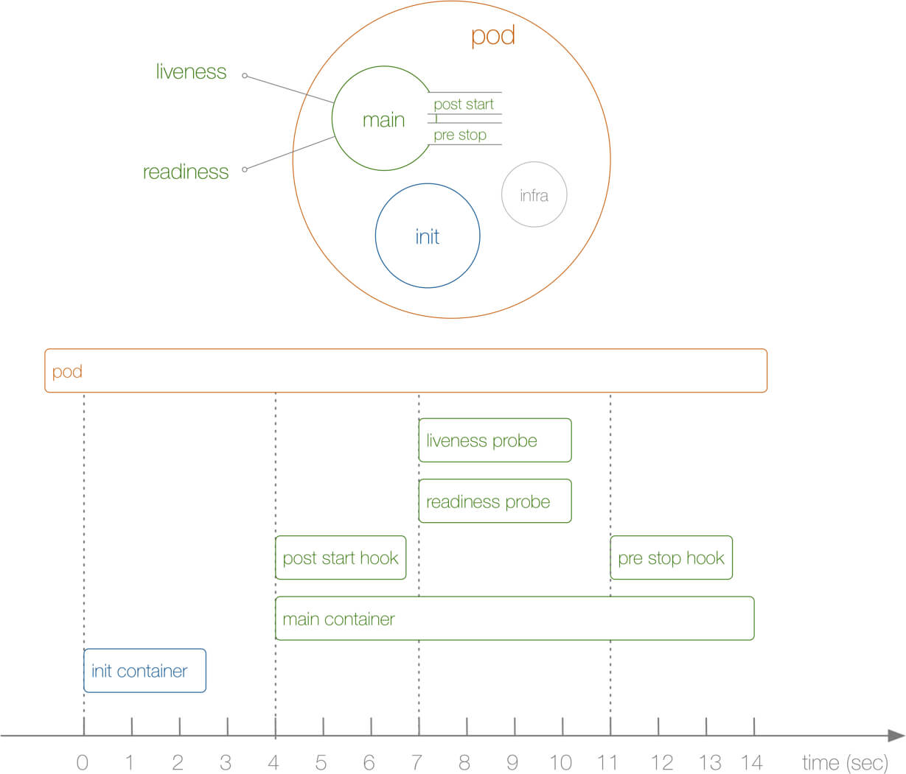

# init 容器

Pod 能够具有多个容器，应用运行在容器里面，但是它也可能有一个或多个先于应用容器启动的 Init 容器。
<!-- more -->
Init 容器与普通的容器非常像，除了如下两点：
- Init 容器总是运行到成功完成为止。
- 每个 Init 容器都必须在下一个 Init 容器启动之前成功完成。
如果 Pod 的 Init 容器失败，Kubernetes 会不断地重启该 Pod，直到 Init 容器成功为止。然而，如果 Pod 对应的 restartPolicy 为 Never，它不会重新启动。

# init 容器和pod启动过程

在 Pod 启动过程中，**Init 容器会按顺序在网络和数据卷初始化之后启动。 每个容器必须在下一个容器启动之前成功退出。** 如果由于运行时或失败退出，导致容器启动失败，它会根据 Pod 的 restartPolicy 指定的策略进行重试。 然而，如果 Pod 的 restartPolicy 设置为 Always，Init 容器失败时会使用 RestartPolicy 策略。

在所有的 Init 容器没有成功之前，Pod 将不会变成 Ready 状态。 Init 容器的端口将不会在 Service 中进行聚集。 正在初始化中的 Pod 处于 Pending 状态，但应该会将条件 Initializing 设置为 true。





（图片来源：`blog.openshift.com/kubernetes-pods-life/`）

# init 容器用途

- 它们可以包含并运行实用工具，出于安全考虑，是不建议在应用容器镜像中包含这些实用工具的。
- 它们可以包含用于安装的工具和定制化代码，这些都是在应用镜像中没有的。例如，创建镜像没必要 FROM 另一个镜像，只需要在安装过程中使用类似 sed、 awk、 python 或 dig 这样的工具。
- 应用镜像可以分离出创建和部署的角色，而没有必要联合它们构建一个单独的镜像。
- 它们使用 Linux Namespace，所以对应用容器具有不同的文件系统视图。因此，它们能够具有访问 Secret 的权限，而应用容器不能够访问。
- 它们在应用容器启动之前运行完成，然而应用容器并行运行，所以 Init 容器提供了一种简单的方式来阻塞或延迟应用容器的启动，直到满足了一组先决条件。

# init 容器实验1

`init-demo.yml`会创建一个Pod，以nginx容器作为main container，并且使用init container初始化一个index文件。
```yml
apiVersion: v1
kind: Pod
metadata:
  name: init-demo
spec:
  containers:
  - name: nginx
    image: nginx
    ports:
    - containerPort: 80
    volumeMounts:
    - name: workdir
      mountPath: /usr/share/nginx/html
  initContainers:
  - name: install
    image: busybox
    command: ["/bin/sh", "-c", "echo hello world > /work-dir/index.html"]
    volumeMounts:
    - name: workdir
      mountPath: "/work-dir"
  volumes:
  - name: workdir
    emptyDir: {}
```

```bash
# kubectl create -f init-demo.yml

# kubectl get pod
NAME                        READY   STATUS     RESTARTS   AGE
init-pod                    0/1     Init:0/1   0          147m
```
如果在pod初始化完成之前get pod，可以看到`STATUS`字段是`Init:0/1`，表明有总共1个init容器操作，已经完成了0个。


当pod初始化完毕后，检查容器文件
```bash
root@iZwz9h8m2chowowqckbcy0Z:~/k8s# kubectl exec -it init-demo cat /usr/share/nginx/html/index.html
hello world
```

# init 容器实验2

>如果 Pod 的 Init 容器失败，Kubernetes 会不断地重启该 Pod，直到 Init 容器成功为止。

这里在init container中尝试nslookup一个不存在的域名，使其一直失败。
```yml
apiVersion: v1
kind: Pod
metadata:
  name: init-demo
  labels:
    app: init
spec:
  containers:
  - name: init-container
    image: busybox
    command: ['sh', '-c', 'echo The app is running! && sleep 3600']
  initContainers:
  - name: init-myservice
    image: busybox
    command: ['sh', '-c', 'until nslookup myservice; do echo waiting for myservice; sleep 2; done;']
```

```bash
root@iZwz9h8m2chowowqckbcy0Z:~/k8s# kubectl get pod
NAME                        READY   STATUS                  RESTARTS   AGE
init-demo                   0/1     Init:CrashLoopBackOff   1          55s

root@iZwz9h8m2chowowqckbcy0Z:~/k8s# kubectl logs init-demo
Error from server (BadRequest): container "init-container" in pod "init-demo" is waiting to start: PodInitializing
```
主容器等待init container执行完毕，因此处于PodInitializing状态。

# 参考

- [Init 容器](https://kubernetes.io/zh/docs/concepts/workloads/pods/init-containers/)
- [Kubernetes: A Pod’s Life](https://blog.openshift.com/kubernetes-pods-life/)

