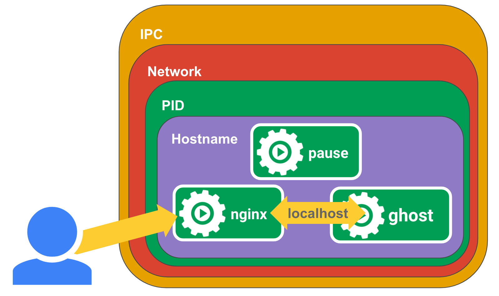

记得第一次在microk8s上运行容器，遇到pause容器无法拉取镜像的问题。今天了解下这个pause容器的用途。
<!-- more -->
# pod & pause container

我们知道，Pod是kubernetes中最基本的应用执行单元。代表一个在k8s集群运行的进程。
在Kubernetes集群中Pod有如下两种使用方式：
- 一个Pod中运行一个容器。“每个Pod中一个容器”的模式是最常见的用法。
- 在一个Pod中同时运行多个容器。一个Pod中也可以同时封装几个需要紧密耦合互相协作的容器，它们之间共享资源。Pod将这些容器的存储资源作为一个实体来管理。

可见，Kuberentes管理的是Pod而不是直接管理容器。

容器化的好处之一是资源隔离，不同容器的进程不会相互干扰；底层实现技术是linux namespace和cgroup。
但是另一方面，不同容器的进程可能需要访问其他容器的资源，才能协同工作。在kubernetes中，
pause容器作为pod中其他容器的父容器，实现了2个功能：
- 共享namespace
- 作为每个pod的PID=1的进程，用于回收僵尸进程


# linux namespace sharing

在linux中，新建一个进程，默认继承父进程的namespace。如果要在新的namespace中运行进程，可以使用unshare命令：
```bash
sudo unshare --pid --uts --ipc --mount -f chroot rootfs /bin/sh
```
当进程运行后，可以使用`setns`系统调用，把其他进程添加到这个namespace，从而形成一个pod。
docker提供了管理namespace的便捷方法。
首先新建一个pause容器。
```
docker run -d --name pause -p 8080:80 gcr.io/google_containers/pause-amd64:3.0
```
然后运行ghost容器，并且加入到pause容器的namespace。
```
docker run -d --name ghost --net=container:pause --ipc=container:pause --pid=container:pause ghost
```
这里的`--net`、`--ipc`、`--pid`作用与unshare命令类似。





# 僵尸进程，孤儿进程

僵尸进程：
- 一个进程使用fork创建子进程，如果子进程退出，而父进程并没有调用wait或waitpid获取子进程的状态信息，那么子进程的进程描述符仍然保存在系统中。这种进程称之为僵尸进程。

孤儿进程：
- 父进程退出，而它的一个或多个子进程还在运行，那么那些子进程将成为孤儿进程。孤儿进程将被init进程(进程号为1)所收养，并由init进程对它们完成状态收集工作。

僵尸进程的危害：
- 僵尸进程会占用进程号，但是系统所能使用的进程号是有限的，如果大量的产生僵死进程，将因为没有可用的进程号而导致系统不能产生新的进程。

处理僵尸进程/孤儿进程的方法：
1. 父进程可调用wait/waitpid函数回收其僵尸子进程。
2. init进程回收法。

父进程回收的问题：需要父进程去等待子进程。通常情况下，父进程要执行自己的逻辑，不会阻塞等待。另外，父进程crash，导致不能回收。
init进程避免了父进程回收的缺陷：
1. 如果父进程先于子进程结束，那么子进程的父进程自动改为 init 进程。
2. 如果 init 的子进程结束，则 init 进程会自动回收其子进程的资源而不是让它变成僵尸进程。

# pause 容器

在linux系统中，由init进程处理僵尸进程问题。
在kubernetes中，容器进程可能fork子进程，进而导致潜在的僵尸进程问题。因此引入了pause容器来执行init进程的职责。同时也承担了namespace sharing的作用。
pause容器源码很简单，核心功能是休眠（pause）。
```cpp
#include <signal.h>
#include <stdio.h>
#include <stdlib.h>
#include <sys/types.h>
#include <sys/wait.h>
#include <unistd.h>

static void sigdown(int signo) {
  psignal(signo, "Shutting down, got signal");
  exit(0);
}

static void sigreap(int signo) {
  while (waitpid(-1, NULL, WNOHANG) > 0);
}

int main() {
  if (getpid() != 1)
    /* Not an error because pause sees use outside of infra containers. */
    fprintf(stderr, "Warning: pause should be the first process\n");

  if (sigaction(SIGINT, &(struct sigaction){.sa_handler = sigdown}, NULL) < 0)
    return 1;
  if (sigaction(SIGTERM, &(struct sigaction){.sa_handler = sigdown}, NULL) < 0)
    return 2;
  if (sigaction(SIGCHLD, &(struct sigaction){.sa_handler = sigreap,
                                             .sa_flags = SA_NOCLDSTOP},
                NULL) < 0)
    return 3;

  for (;;)
    pause();
  fprintf(stderr, "Error: infinite loop terminated\n");
  return 42;
}
```

# 参考

- [The Almighty Pause Container](https://www.ianlewis.org/en/almighty-pause-container)
- [处理僵尸进程的两种经典方法](https://www.cnblogs.com/scut-fm/archive/2013/10/29/3393686.html)
- [孤儿进程与僵尸进程[总结]](https://www.cnblogs.com/Anker/p/3271773.html)