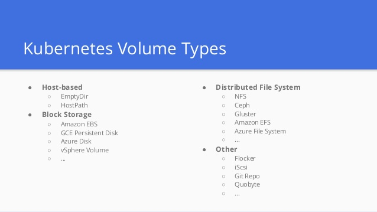

# volume 简介

Kubernetes 抽象出 Volume 对象来解决这两个问题：
- 容器中的文件在磁盘上是临时存放的，当容器崩溃时，容器内的文件将会丢失
- 当在一个 Pod 中同时运行多个容器时，常常需要在这些容器之间共享文件。

<!-- more -->

Volume的生命周期比Pod中运行的任何容器要持久，在容器重新启动时能可以保留数据。





# 使用 volume

Volume的核心是包含一些数据的目录，Pod 中的容器可以访问该目录。 
使用Volume时, Pod 声明中需要提供卷的类型 (`.spec.volumes` 字段)和卷挂载的位置 (`.spec.containers.volumeMounts` 字段)。
卷不能挂载到其他卷，也不能与其他卷有硬链接。 
Pod 中的每个容器必须独立地指定每个卷的挂载位置。

init容器的实验就使用了volume：
- [kubernetes-pod-init-container](/posts/kubernetes-pod-init-container)

```yml
apiVersion: v1
kind: Pod
metadata:
  name: init-demo
spec:
  containers:
  - name: nginx
    image: nginx
    ports:
    - containerPort: 80
    volumeMounts:
    - name: workdir
      mountPath: /usr/share/nginx/html
  initContainers:
  - name: install
    image: busybox
    command: ["/bin/sh", "-c", "echo hello world > /work-dir/index.html"]
    volumeMounts:
    - name: workdir
      mountPath: "/work-dir"
  volumes:
  - name: workdir
    emptyDir: {}
```
这里定义了一个类型为emptyDir、名字为wordir的volume。
在nginx容器中，把wordir挂载到/usr/share/nginx/html。
在install容器中，把workdir挂载到/work-dir。

接下来简单介绍几个volume type。

# emptyDir

使用emptyDir，当Pod分配到Node上时，将会创建emptyDir，并且只要Node上的Pod一直运行，Volume就会一直存。当Pod（不管任何原因）从Node上被删除时，emptyDir也同时会删除，存储的数据也将永久删除。注：删除容器不影响emptyDir。

也可以将 emptyDir.medium 字段设置为 "Memory"，以告诉 Kubernetes 安装 tmpfs（基于 RAM 的文件系统）。

emptyDir 的一些用途：
- 缓存空间，例如基于磁盘的归并排序。
- 为耗时较长的计算任务提供检查点，以便任务能方便地从崩溃前状态恢复执行。
- 在 Web 服务器容器服务数据时，保存内容管理器容器获取的文件。

# hostPath

hostPath允许挂载Node上的文件系统到Pod里面去。如果Pod需要使用Node上的文件，可以使用hostPath。

hostPath 的一些用法有：
- 运行一个需要访问 Docker 引擎内部机制的容器；请使用 hostPath 挂载 /var/lib/docker 路径。
- 在容器中运行 cAdvisor 时，以 hostPath 方式挂载 /sys。
- 允许 Pod 指定给定的 hostPath 在运行 Pod 之前是否应该存在，是否应该创建以及应该以什么方式存在。

一旦这个pod离开了这个宿主机，hostPath中的数据虽然不会被永久删除，但数据也不会随pod迁移到其他宿主机上。
由于各个宿主机上的文件系统结构和内容并不一定完全相同，所以相同pod的hostPath可能会在不同的宿主机上表现出不同的行为。

# local

Local Storage同HostPath的区别在于对Pod的调度上，使用Local Storage可以由Kubernetes自动的对Pod进行调度，而是用HostPath只能人工手动调度Pod，因为Kubernetes已经知道了每个节点上kube-reserved和system-reserved设置的本地存储限制。

```yml
apiVersion: v1
kind: PersistentVolume
metadata:
  name: example-pv
spec:
  capacity:
    storage: 100Gi
  # volumeMode field requires BlockVolume Alpha feature gate to be enabled.
  volumeMode: Filesystem
  accessModes:
  - ReadWriteOnce
  persistentVolumeReclaimPolicy: Delete
  storageClassName: local-storage
  local:
    path: /mnt/disks/ssd1
  nodeAffinity:
    required:
      nodeSelectorTerms:
      - matchExpressions:
        - key: kubernetes.io/hostname
          operator: In
          values:
          - example-node
```

使用 local 卷时，需要使用 PersistentVolume 对象的 nodeAffinity 字段。 它使 Kubernetes 调度器能够将使用 local 卷的 Pod 正确地调度到合适的节点。

# secret

Kubemetes提供了Secret来处理敏感数据，比如密码、Token和密钥，相比于直接将敏感数据配置在Pod的定义或者镜像中，Secret提供了更加安全的机制（Base64加密），防止数据泄露。Secret的创建是独立于Pod的，以数据卷的形式挂载到Pod中，Secret的数据将以文件的形式保存，容器通过读取文件可以获取需要的数据。

# 参考

- [Volumes](https://kubernetes.io/zh/docs/concepts/storage/volumes/)
