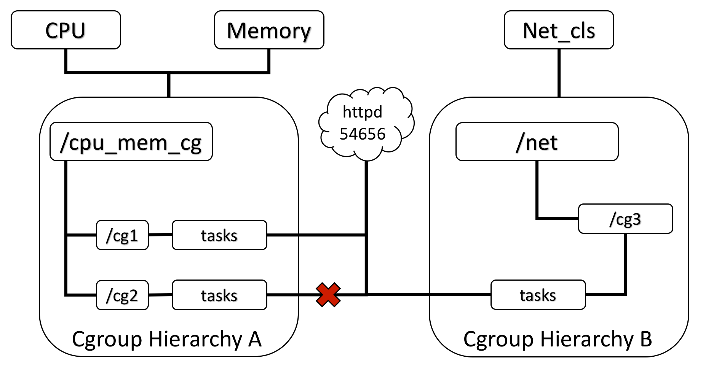

linux namespace对进程组实现了资源隔离和共享。但是没有实现资源限额、统计等功能。cgroup技术弥补了namespace的不足。
<!-- more -->

# cgroup 简介

cgroup 是 Control Groups 的缩写，是 Linux 内核提供的一种可以限制、记录、隔离进程组 (process groups) 所使用的资源 (如 cpu、内存、i/o 等等) 的机制。
cgroup 和namespace类似，也是将进程进行分组，但它的目的和namespace不一样，namespace是为了隔离进程组之间的资源，而cgroup是为了对一组进程进行统一的资源监控和限制。

cgroup的核心组成是subsystem和hierarchy。

# cgroup subsystem

cgroups为每种可以控制的资源定义了一个子系统（subsystem），又被称为资源管理器（resource controller）。
- cpu 子系统，主要限制进程的 cpu 使用率。
- cpuacct 子系统，可以统计 cgroups 中的进程的 cpu 使用报告。
- cpuset 子系统，可以为 cgroups 中的进程分配单独的 cpu 节点或者内存节点。
- memory 子系统，可以限制进程的 memory 使用量。
- blkio 子系统，可以限制进程的块设备 io。
- devices 子系统，可以控制进程能够访问某些设备。
- net_cls 子系统，可以标记 cgroups 中进程的网络数据包，然后可以使用 tc 模块（traffic control）对数据包进行控制。
- freezer 子系统，可以挂起或者恢复 cgroups 中的进程。
- ns 子系统，可以使不同 cgroups 下面的进程使用不同的 namespace。

子系统必须附加（attach）到一个层级（hierarchy）上才能起作用。

# cgroup hierarchy

一个hierarchy可以理解为一棵cgroup树，树的每个节点就是一个进程组，每棵树都会与零到多个subsystem关联。





# cgroup 功能

Cgroups提供了以下功能：
1.限制进程组可以使用的资源数量（Resource limiting）。
2.进程组的优先级控制（Prioritization）。
3.记录进程组使用的资源数量（Accounting）。
4.进程组隔离（Isolation）。
5.进程组控制（Control）。


# cgroup 操作

cgroup相关的所有操作都是基于内核中的cgroup virtual filesystem。一般情况下都是挂载到/sys/fs/cgroup目录下

通过查看/proc/cgroups知道当前系统支持哪些subsystem
```
# cat /proc/cgroups
#subsys_name	hierarchy	num_cgroups	enabled
cpuset	12	13	1
cpu	5	79	1
cpuacct	5	79	1
blkio	6	73	1
memory	3	1673	1
devices	11	73	1
freezer	8	14	1
net_cls	4	13	1
perf_event	2	13	1
net_prio	4	13	1
hugetlb	7	13	1
pids	9	81	1
rdma	10	1	1
```

查看进程属于哪些cgroup，/proc/[pid]/cgroup
```
# cat /proc/1/cgroup
12:cpuset:/
11:devices:/
10:rdma:/
9:pids:/
8:freezer:/
7:hugetlb:/
6:blkio:/
5:cpu,cpuacct:/
4:net_cls,net_prio:/
3:memory:/
2:perf_event:/
1:name=systemd:/init.scope
0::/init.scope
```

TODO： 更多cgroup的实验。

# 参考

- [Linux Cgroup系列（01）：Cgroup概述](https://segmentfault.com/a/1190000006917884)
- [Linux containers – next gen virtualization for cloud (atl summit)](https://www.slideshare.net/BodenRussell/linux-containers-next-gen-virtualization-for-cloud-atl-summit-ar4-3-copy)
- [Container 内核原理介绍](https://www.slideserve.com/lihua/container)
- [Linux资源管理之cgroups简介](https://tech.meituan.com/2015/03/31/cgroups.html)
