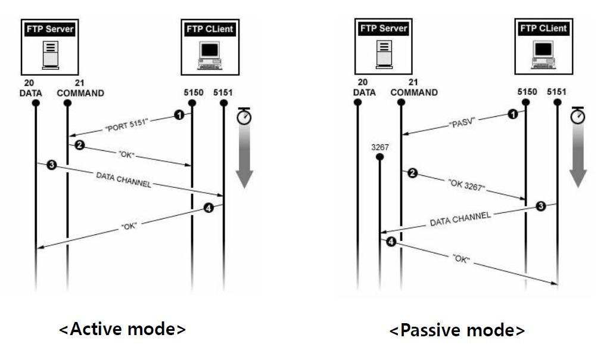
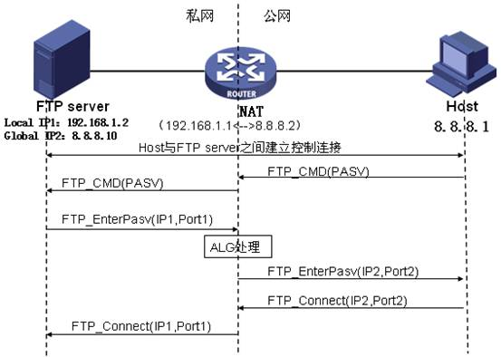
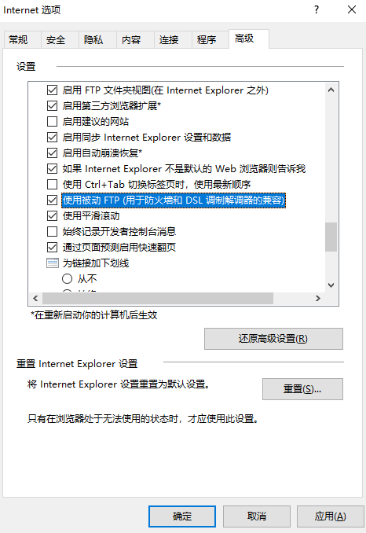

# 概述

FTP是基于TCP的。
FTP使用2个端口，一个数据端口（使用20端口）和一个命令端口（也可叫做控制端口，使用21端口）。
FTP有2种工作模式：被动和主动。
<!-- more -->
主动和被动是针对服务器视角的。
- 主动模式：由ftp server发起建立data channel。
- 被动模式：由ftp client发起建立data channel。

# 主动模式 PORT

交互流程：
1. client使用普通端口N（大于1024的端口号）向server的21端口发送指令`PORT N+1`，表示client将会使用端口号为N+1的端口作为数据端口。
2. server回复`OK`。
3. server使用20端口向client的N+1端口发起连接。
4. client在数据端口回复`OK`。

对于server前面的防火墙，需要配置：
1. 允许远程任意大于1024端口连接到server的21端口
2. 允许server的21端口向所有远程大于1024的端口建立连接
3. 允许server的20端口向所有远程大于1024的端口建立连接
4. 允许远程任意大于1024端口连接到server的20端口

# 被动模式 PASV

交互流程：
1. client使用普通端口N（大于1024的端口号）向server的21端口发送指令`PASV`
2. server回复`OK X`，表示使用X作为数据端口（X > 1024）
3. client使用端口N+1，向server的X端口（X > 1024）建立连接
4. server在X端口的连接回复`OK`

对于server前面的防火墙，需要配置：
1. 允许远程任意大于1024端口连接到server的21端口
2. 允许server的21端口向所有远程大于1024的端口建立连接
3. 允许远程任意大于1024端口连接到server的大于1024端口

# 小结

PORT模式，server只要开放21和20端口。
PASV模式，server要开放21端口和所有非特权端口。

理论上PORT模式更加安全。但是实际上因为端口固定，会导致端口sniffer更加容易。
从安全性角度看，PASV模式好一些。

PORT模式的另一个问题是，客户端都是在路由器后面，没有独立的公网IP地址，服务器想要主动连接客户端比较困难。
其中涉及NAT设备地址转换。**但是NAT一般只针对packet header的ip、port进行转换**。
但是PORT模式中，要建立data channel的具体端口是在packet body，因此NAT设备可能不能正确进行转换。（TODO： NAT ALG能够正确转换）
关于FTP NAT ALG转换的例子，参见：[NAT ALG原理与应用](http://www.h3c.com/CN/D_201206/922132_30005_0.htm)，引用其中的两幅图：

还有一个方面，client端的防火墙通常是禁止远程主动建立连接。
因此PASV模式使用得多。

客户端可以选择PORT模式还是PASV模式建立数据连接。但是是否支持在于server端。

# 参考

- [FTP 主动模式 与被动模式](https://www.cnblogs.com/loanhicks/p/8324853.html)
- [FTP协议报文详解及FTP穿越NAT](https://blog.csdn.net/ever_peng/article/details/89022796)

