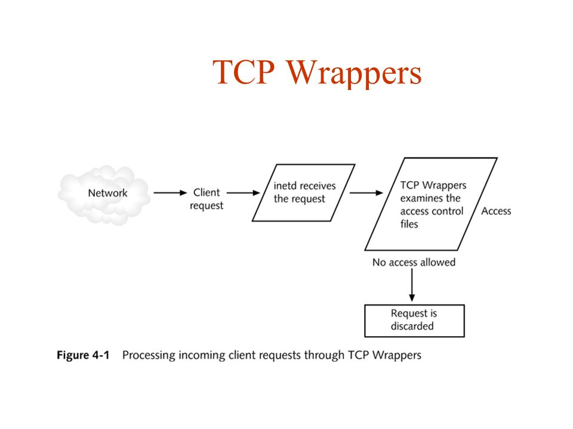
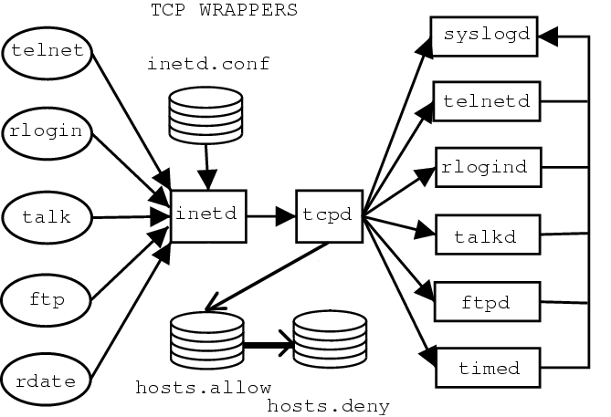

基于centos7.x系统。
<!-- more -->

# FQDN 和 PQDN

首先分清楚2个概念，摘抄自《[理解OpenShift（2）：网络之 DNS（域名服务）](https://www.cnblogs.com/sammyliu/p/10056035.html)》
>域名（Domain Name）分为两种，一种是绝对域名（Absolute Domain Name，也称为 Fully-Qualified Domain Name，简称 FQDN），另一种是相对域名（Relative Domain Name，也称为 Partially Qualified Domain Name，简称PQDN）。
>
>FQDN 能被直接到 DNS 名字服务器中查询；而 PQDN 需要先转化为FQDN 再进行查询。其做法是将 PQDN 附加一个搜索域名（search domain）来生成一个 FQDN。(对应于`resolv.conf`的`domain`或者`search`选项)。
>
>在域名系统中，**域名结尾是否是`.`被用来区分 FQDN 和 PQDN**。


# /etc/hosts

>hosts：the static table lookup for host name（主机名查询静态表）

在没有域名服务器的情况下，系统上的所有网络程序都通过查询该文件来解析对应于某个主机名的IP地址。

k8s上容器的hosts文件
```sh
[root@nacos-0 nacos]# cat /etc/hosts
# Kubernetes-managed hosts file.
127.0.0.1       localhost
::1     localhost ip6-localhost ip6-loopback
fe00::0 ip6-localnet
fe00::0 ip6-mcastprefix
fe00::1 ip6-allnodes
fe00::2 ip6-allrouters
10.244.197.129  nacos-0.nacos-center.v-base.svc.cluster.local.  nacos-0
```

hosts文件的格式如下：
```
IP地址    主机名/域名
第一部份： 网络IP地址
第二部份： 主机名或域名
第三部份： 主机名别名(可选)
```

主机名(hostname)和域名(domain）的区别：
- 主机名通常在局域网内使用，通过hosts文件，主机名就被解析到对应 ip；
- 域名通常在internet上使用，但如果本机不想使用internet上的域名解析，这时就可以更改hosts文件，加入自己的域名解析。

# /etc/hostname

主机名。相关工具是hostname。
```sh
[root@host143 ~]# cat /etc/hostname
host143

# 也可以使用hostname命令查看
[root@host143 ~]# hostname
host143

# 显示主机的ip地址（组）
[root@host143 ~]# hostname -i
172.25.20.143

# 临时修改主机名，重启就会恢复为 /etc/hostname
[root@host143 ~]# hostname aaa
[root@host143 ~]# hostname
aaa
[root@host143 ~]# cat /etc/hostname
host143
```

# /etc/host.conf 

**当系统中同时存在DNS域名解析和/etc/hosts主机表机制时，由该/etc/host.conf确定主机名解释顺序。**

作用于resolver库：
>The file /etc/host.conf contains configuration information specific to the resolver library.

```ini
order hosts,bind,nis #名称解释顺序
multi on #允许主机拥有多个IP地址，on / off，默认是off。
nospoof on #禁止IP地址欺骗
```

参见[HOST.CONF](http://man7.org/linux/man-pages/man5/host.conf.5.html)，这里列出一些配置项内容。

## order

搜索顺序，支持的查找方法为`bind`、`hosts`和`nis`，分别代表DNS、`/etc/hosts`和NIS。

## multi

表示是否运行/etc/hosts文件允许主机指定多个多个地址。
返回一台主机在 /etc/hosts 文件中出现的的所有有效地址, 而不只是第一个。
如果hosts文件很大，可能导致性能问题，因此默认是off。

## nospoof

是否允许服务器对ip地址进行其欺骗。尝试增强rlogin和rsh的安全性。
工作原理：
>It works as follows: after performing a host address lookup, the resolver library will
> perform a hostname lookup for that address.  If the two hostnames do not match, the query fails.

默认off。

## reorder 

对主机地址重排序，优先本地地址 (即在同一子网中的地址)。
>If set to on, the resolver library will attempt to reorder host addresses so that local addresses (i.e., on the same subnet) are listed first when a gethostbyname(3) is performed.

## trim
在查寻之前将被从主机名中删去。可以配置多个trim
```
trim   This keyword may be listed more than once.  Each time it
       should be followed by a list of domains, separated by colons
       (':'), semicolons (';') or commas (','), with the leading dot.
       When set, the resolver library will automatically trim the
       given domain name from the end of any hostname resolved via
       DNS.  This is intended for use with local hosts and domains.
```

# /etc/resolv.conf

用于设置DNS服务器的IP地址及DNS域名。

以下是k8s nacos的配置demo
```sh
[root@nacos-0 nacos]# cat /etc/resolv.conf
nameserver 10.68.0.2
search v-base.svc.cluster.local. svc.cluster.local. cluster.local.
options ndots:5
```

resolv.conf的配置项有
>nameserver      # 定义DNS服务器的IP地址
>domain          # 定义本地域名
>search          # 定义域名的搜索列表
>options         # 选项
>sortlist        # 对返回的域名进行排序

resolv.conf对于这些配置项的数量限制：
>The `resolv.conf` file can contain one `domain` entry or one `search` entry, a maximum of three `nameserver` entries, a `sortlist` entry, and any number of `options` entries.

## nameserver

DNS服务器的IP地址。一行一个ip，可以有多行。按照nameserver在文件中出现顺序查询。只有当第一个nameserver没有反应时才查询下面的nameserver。

## domain

>A domain entry tells the resolver routines which default domain name to append to names that do not end with a `.` (period). 

## search

当要查询没有域名的主机，主机将在由search声明的域中分别查找。
domain和search不能共存；如果同时存在，后面出现的将会被使用。
domain和search作用是类似的。当只有一个默认域名，使用domain；有多个默认域名，则使用search。

ps. 基于dns的服务发现、例如k8s，使用服务名、而不是ip加端口的形式访问服务，跟search选项有关。

>许多DNS 解析器如果发现被解析的域名中有任何的点（.）就把它当做一个 FQDN 来解析；如果域名中没有任何点，就把它当做 PQDN 来处理，并且会加上系统的默认domain name 和最后的点，来组成 FQDN。

在`resolv.conf`增加配置
```ini
search ycwu314.top
```
然后用host命令查询。注意默认的是`options ndots:1`：只要被解析域名中有任何一个点（.），那么它就会被当做 FQDN。


### 例子1

因为svc没有`.`，所以分别使用`resolv.conf`中search的主机名补全为FQDN来查询。
```sh
[root@host143 ~]# host -a svc
Trying "svc.ycwu314.top"
;; ->>HEADER<<- opcode: QUERY, status: NOERROR, id: 63724
;; flags: qr rd ra; QUERY: 1, ANSWER: 2, AUTHORITY: 0, ADDITIONAL: 0

;; QUESTION SECTION:
;svc.ycwu314.top.		IN	ANY

;; ANSWER SECTION:
svc.ycwu314.top.	3600	IN	RRSIG	HINFO 13 3 3789 20200519125111 20200517105111 34505 ycwu314.top. FgUcebSliovgQpCJz88ynUM5YoTGNFQGhSTUQ1FOPW/vsrbt8uebNYEB ugH7qxVy1WYU3bJcvm/mVZWVowlbuA==
svc.ycwu314.top.	3600	IN	HINFO	"RFC8482" ""

Received 161 bytes from 10.200.100.211#53 in 1025 ms
```

### 例子2

`a.svc`中间有`.`（不是末尾），先当作是个FQDN进行查询，查询失败再分别使用`resolv.conf`中search的主机名补全为FQDN来查询。
```sh
[root@host143 ~]# host -a a.svc
Trying "a.svc"
Received 98 bytes from 10.200.100.211#53 in 3088 ms
Trying "a.svc.ycwu314.top"
;; connection timed out; no servers could be reached

```

### 例子3

`svc.`末尾为`.`，于是作为FQDN查询，即使查询失败也不会使用`resolv.conf`中search的主机名补全。
```sh
[root@host143 ~]# host -a svc.
Trying "svc"
Received 21 bytes from 10.200.100.211#53 in 1 ms
Trying "svc"
Host svc not found: 2(SERVFAIL)
Received 21 bytes from 10.200.100.211#53 in 2 ms
```

## sortlist

调整`gethostbyname()`的返回顺序。
参数是IP/子网掩码对，最多10个。
```
sortlist 130.155.160.0/255.255.240.0 130.155.0.0
```

## options

options中常见的有下面几个，完整参见[RESOLV.CONF](http://man7.org/linux/man-pages/man5/resolv.conf.5.html)。
```
# 使用tcp而非udp来进行dns查询
# 会导致性能下降
use-vc (since glibc 2.14)
    Sets RES_USEVC in _res.options.  This option forces the
    use of TCP for DNS resolutions.

# 默认glibc并发查询A记录和AAAA记录，
# 会导致部分DNS解析器不能正确处理并且查询超时。
# 开启这个选项，改为串行方式查询A和AAAA记录。
single-request (since glibc 2.10)
    Sets RES_SNGLKUP in _res.options.  By default, glibc
    performs IPv4 and IPv6 lookups in parallel since
    version 2.9.  Some appliance DNS servers cannot handle
    these queries properly and make the requests time out.
    This option disables the behavior and makes glibc
    perform the IPv6 and IPv4 requests sequentially (at the
    cost of some slowdown of the resolving process).

# 默认glibc使用同一个端口发送A和AAAA查询，
# 部分已经只返回其中一个查询响应，导致等待超时。
# 修改此项，使用不同的端口查询A和AAAA记录。
single-request-reopen (since glibc 2.9)
    Sets RES_SNGLKUPREOP in _res.options.  The resolver
    uses the same socket for the A and AAAA requests.  Some
    hardware mistakenly sends back only one reply.  When
    that happens the client system will sit and wait for
    the second reply.  Turning this option on changes this
    behavior so that if two requests from the same port are
    not handled correctly it will close the socket and open
    a new one before sending the second request.


# 当只要被解析域名中包含不超过五个点（不以点号结尾），
# 该域名就会被当做PQDN，使用search配置拼接成FQDN。
# k8s默认为5
ndots:n
    Sets a threshold for the number of dots which must
    appear in a name given to res_query(3) (see
    resolver(3)) before an initial absolute query will be
    made.  The default for n is 1, meaning that if there
    are any dots in a name, the name will be tried first as
    an absolute name before any search list elements are
    appended to it.  The value for this option is silently
    capped to 15.

# dns查询5s超时
timeout:n
    Sets the amount of time the resolver will wait for a
    response from a remote name server before retrying the
    query via a different name server. This may not be the
    total time taken by any resolver API call and there is
    no guarantee that a single resolver API call maps to a
    single timeout.  Measured in seconds, the default is
    RES_TIMEOUT (currently 5, see <resolv.h>).  The value
    for this option is silently capped to 30.

# 轮询nameserver
rotate
    sets RES_ROTATE in _res.options, which causes round-robin 
    selection of nameservers from among those listed. This 
    has the effect of spreading the query load among all 
    listed servers, rather than having all clients try the 
    first listed server first every time.
```

## 关于`single-request-reopen`和`single-request`

使用相同端口并发查询A记录和AAAA记录，理论上性能更好、节约资源。但是实际上可能有问题：相同的src ip，相同的dest port，同样的第4层协议的连接会被防火墙看成是同一个会话，因此会存在返回包被丢弃现象。


上图中同一个端口并发查询A和AAAA记录，并且AAAA记录先返回。
于是防火墙拦截了随后相同端口返回的A记录，导致系统等待A记录返回超时。
于是系统使用新的、**不同**端口再次查询A、AAAA记录。

# /etc/hosts.allow and /etc/hosts.deny

基于tcp wrappers的ACL机制。








`/etc/hosts.deny`优先级更高。

## 检查应用是否支持tcp wrappers

包含有libwrap.so库文件的的程序就可以受TCP_Wrappers的安全控制。
```sh
# strings命令在对象文件或二进制文件中查找可打印的字符串。
strings /usr/sbin/sshd | grep hosts_access
```

或者
```sh
ldd /usr/sbin/sshd | grep libwrap
```

## 配置选项

```
daemon    要监控的服务，如 telnetd、ftpd、sshd
client    主机名、IP 地址/IP 范围，或域名
```
选项有：
```
allow    允许对客户端的访问
deny     拒绝对客户端的访问
except   会匹配第一个列表中所有项，除非匹配第二个列表。例如，允许 domainA 中所有项，除了 hostX.domainA 和 hostY.domanA。
```

配置例子参见：[TCP_Wrappers 简介](https://www.cnblogs.com/duzhaoqi/p/7607801.html)


# /etc/nsswitch.conf

`/etc/nsswitch.conf`(name service switch configuration，名字服务切换配置)，指定了"数据库" 及其查找顺序。

作用于GNU library C。

## 配置项和方法

nsswitch支持多种配置项
```
automount：自动挂载（/etc/auto.master和/etc/auto.misc）

bootparams：无盘引导选项和其他引导选项（参见bootparam的手册页）

ethers：MAC地址

group：用户所在组（/etc/group),getgrent()函数使用该文件

hosts：主机名和主机号（/etc/hosts)，gethostbyname()以及类似的函数使用该文件

networks：网络名及网络号（/etc/networks)，getnetent()函数使用该文件

passwd：用户口令（/etc/passwd)，getpwent()函数使用该文件

protocols：网络协议（/etc/protocols），getprotoent()函数使用该文件

publickey：NIS+及NFS所使用的secure_rpc的公开密钥

rpc：远程过程调用名及调用号（/etc/rpc），getrpcbyname()及类似函数使用该文件

services：网络服务（/etc/services），getservent()函数使用该文件

shadow：映射口令信息（/etc/shadow），getspnam()函数使用该文件

aliases：邮件别名，sendmail()函数使用该文件
```

控制搜索信息类型的方法:
```
files：搜索本地文件，如/etc/passwd和/etc/hosts

nis：搜索NIS数据库，nis还有一个别名，即yp

dns：查询DNS（只查询主机）

compat：passwd、group和shadow文件中的±语法
```

## 题外话： NIS

>网络信息服务(Network Information Service, NIS)
>　　NIS也曾被称YP (Yellow Pages)，它是一个基于RPC (Remote Procedure Call Protocol) 的客户机/服务器系统，允许一个NIS域中的一组机器共享一系列配置文件。在NIS环境中，有主服务器、从服务器和客户机三种类型的主机。服务器的作用是充当主机配置信息的中央数据库。主服务器上保存着这些信息的权威副本，而从服务器则是保存这些信息的冗余副本。客户机依赖于服务器向它们提供这些信息。

NIS详细参见：[【NIS】深入了解NIS](https://blog.csdn.net/younger_china/article/details/53010366)


## 例子

```
hosts:      files dns myhostname
```
其中`myhostname`是一个nss插件，返回`local`、`localhost`、`gateway`等值。具体参见：[NSS-MYHOSTNAME](http://man7.org/linux/man-pages/man8/libnss_myhostname.so.2.8.html)。

TODO：
- 疑问： `host.conf`中的order和`nsswitch.conf`的hosts都能控制解析顺序，哪个优先级更高？


## getent命令

getent可以检索nsswitch的配置。
```sh
[root@master-29 ~]# getent hosts
127.0.0.1       localhost localhost.localdomain localhost4 localhost4.localdomain4

[root@master-29 ~]# getent hosts ycwu314.top
2606:4700:3033::6818:6209 ycwu314.top
2606:4700:3033::6818:6309 ycwu314.top
```

# alpine linux

musl实现的DNS resolver行为和glic有差异。
参照官网[Functional differences from glibc](https://wiki.musl-libc.org/functional-differences-from-glibc.html)的"Name Resolver/DNS"章节：
- glibc分别使用nameserver进行查询。musl并发向所有nameserver查询。
- musl不支持 `single-request` 和 `single-request-reopen` （划重点）。
- musl v1.1.13之前不支持`domain`和`search`选项。
- musl v1.1.13以后支持`domain`和`search`选项。但是行为和glibc有差异：
 1. `.`数量小于`ndots`，则先使用`search`拼接查询，再进行字面查询，和glibc一样
 2. `.`数量等于`ndots`，则不使用`search`，直接进行全局dns查询，和glibc不一样
- musl不支持IDN (non-ASCII name lookups via DNS)。

# 参考资料

- [resolv.conf File Format for TCP/IP](https://sites.ualberta.ca/dept/chemeng/AIX-43/share/man/info/C/a_doc_lib/files/aixfiles/resolv.conf.htm)
- [/etc/resolv.conf文件中的search项作用](https://blog.csdn.net/xinlongabc/article/details/47075293)
- [CoreDNS系列1：Kubernetes内部域名解析原理、弊端及优化方式](https://hansedong.github.io/2018/11/20/9/)
- [Kubernetes pods /etc/resolv.conf ndots:5 option and why it may negatively affect your application performances](https://pracucci.com/kubernetes-dns-resolution-ndots-options-and-why-it-may-affect-application-performances.html)
- [DNS解析超时排查/etc/resolv.conf single-request-reopen参数说明](https://www.cnblogs.com/zhangmingda/p/9725746.html)
- [nsswitch.conf文件详解](https://www.cnblogs.com/cute/archive/2012/05/17/2506342.html)