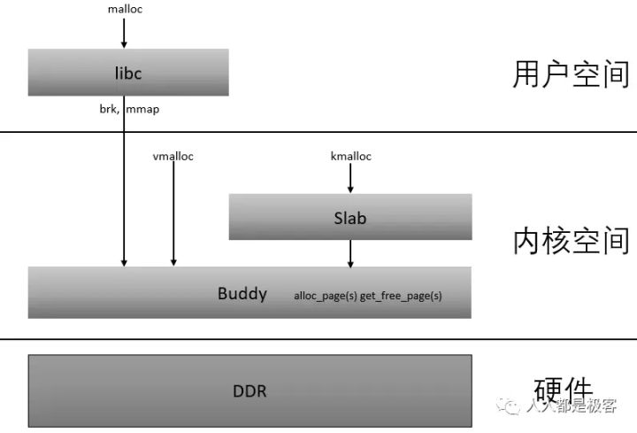
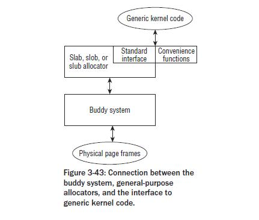
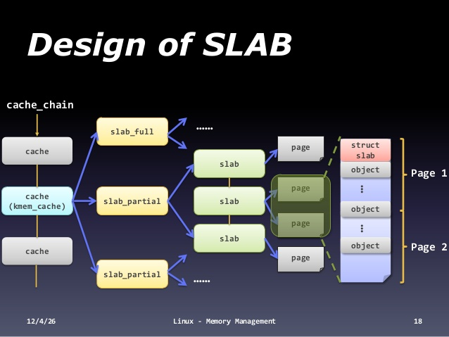
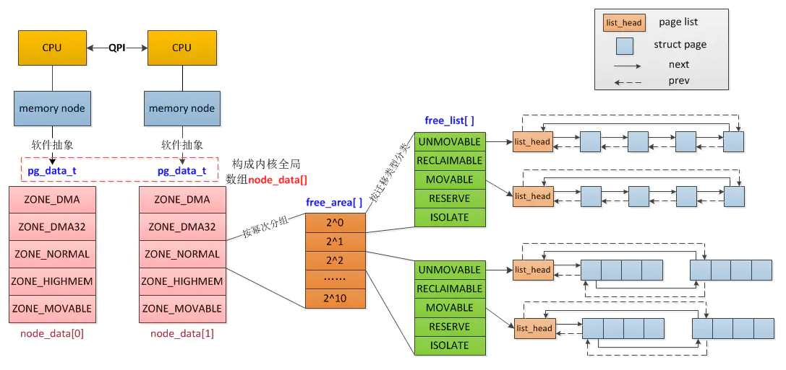

# overview

linux内核内存分配方式，有buddy system和slab两大类。
<!-- more -->





从中可以看到：
1. buddy和slab都是工作在内核空间
2. slab工作在buddy之上





>SLAB，SLOB，SLUB是内核提供的分配器，其前端接口都是一致的，其中SLAB是通用的分配器，SLOB针对微小的嵌入式系统，其算法较大简单（最先适应算法） ，SLUB是针对配备大量物理内存的大规模并行系统，通过也减小中未使用的分区来管理页组，减少SLUB本身数据结构的内存占用。


# buddy system

buddy system内存分配技术
>它将内存划分为 2 的幂次方个分区，并使用 best-fit 方法来分配内存请求。当用户释放内存时，就会检查 buddy 块，查看其相邻的内存块是否也已经被释放。如果是的话，将合并内存块以最小化内存碎片。


buddy system的缺点是产生内存浪费。

# /proc/buddyinfo

proc文件系统提供了buddyinfo的诊断信息，可以看到内存碎片情况。
```sh
# 64 bit linux
[root@host143 ~]# cat /proc/buddyinfo 
Node 0, zone      DMA      0      0      0      1      1      1      1      0      1      1      3 
Node 0, zone    DMA32     29     15      5     23     27     22      2      7      8      1    625 
Node 0, zone   Normal     54     20     27    103     85     37     33     12     27     43   2866
```

linux支持numa架构。
Node是处理器节点，每个节点都有自己的一块内存。
Zone是内存区域，代表不同范围的内存。
- DMA是低16MB内存，出于历史原因保留。
- DMA32只出现在64bit linux，是低4GB内存（`2^32`字节）。
- Normal在32bit和64bit所指向的内存空间不同。
对于32bit，是16MB~896MB。对于64bit，是所有内存。
- HighMem：只出现在32bit。是高于896MB的内存区域。

详情见[How the Linux kernel divides up your RAM](https://utcc.utoronto.ca/~cks/space/blog/linux/KernelMemoryZones)。
关于zone的详细信息，参见`/proc/zoneinfo`，此处不展开。

后面跟着的列是各个大小的可用内存块chunk的统计
>The size in bytes of a certain order is given by the formula:
>(2^order) * PAGE_SIZE
>其中order从0开始

内存严重碎片化，则高位order的计数为0。
>If the memory is heavily fragmented, the counters for higher
>order chunks will be zero and allocation of large contiguous
>areas will fail.


# slab

堆内存管理器，一般有2种搜索内存算法：
- first-fit（在堆中搜索到的第一个满足请求的内存块 ）
- best-fit（使用堆中满足请求的最合适的内存块）

>这种基于堆的分配策略的根本问题是碎片（fragmentation）。当内存块被分配后，它们会以不同的顺序在不同的时间返回。这样会在堆中留下一些洞，需要花一些时间才能有效地管理空闲内存。这种算法通常具有较高的内存使用效率（分配需要的内存），但是却需要花费更多时间来对堆进行管理。





顶层是由kmem_cache组成的链表。
每个kmem_cache包含三个成员：
- slabs_full：完全分配的 slab
- slabs_partial：部分分配的 slab
- slabs_empty：空 slab，或者没有对象被分配，是主要的候选回收对象。

每个 slab 都是一个连续的内存块（一个或多个连续页）。slab使用cache来存储不同的kernel object。

slab的优点：
- slab 缓存分配器通过对类似大小的对象进行缓存而提供这种功能，从而避免了常见的碎片问题。
- 支持硬件缓存对齐和着色

发现一张很好的图，对初步了解slab有帮助。





后续再深入[slab源码](https://elixir.bootlin.com/linux/v5.7.6/source/mm/slab.c)。

`/proc/meminfo`提供了slab的基本情况
```sh
[root@localhost conf]# cat /proc/meminfo
Slab:             237756 kB
SReclaimable:     161696 kB
SUnreclaim:        76060 kB
```

其中：
SReclaimable: slab中可回收的部分。调用kmem_getpages()时加上SLAB_RECLAIM_ACCOUNT标记，表明是可回收的，计入SReclaimable，否则计入SUnreclaim。
SUnreclaim: slab中不可回收的部分。
Slab: slab中所有的内存，等于以上两者之和。

# /proc/slabinfo

```sh
[root@host143 ~]# cat /proc/slabinfo
slabinfo - version: 2.1
# name            <active_objs> <num_objs> <objsize> <objperslab> <pagesperslab> : tunables <limit> <batchcount> <sharedfactor> : slabdata <active_slabs> <num_slabs> <sharedavail>
nf_conntrack_ffff8d7829fd0000      0      0    320   51    4 : tunables    0    0    0 : slabdata      0      0      0
nf_conntrack_ffffffff9d4fc900   1428   1428    320   51    4 : tunables    0    0    0 : slabdata     28     28      0
rpc_inode_cache       51     51    640   51    8 : tunables    0    0    0 : slabdata      1      1      0
isofs_inode_cache     51     51    640   51    8 : tunables    0    0    0 : slabdata      1      1      0

```

每行分为3个部分：
- statistics
- tunables
- slabdata

statistics各列的含义
```
active_objs
       The number of objects that are currently active (i.e., in
       use).

num_objs
       The total number of allocated objects (i.e., objects that are
       both in use and not in use).

objsize
       The size of objects in this slab, in bytes.

objperslab
       The number of objects stored in each slab.

pagesperslab
       The number of pages allocated for each slab.
```

tunables是当前cache的参数。当使用SLUB分配器，则tunables都是0。
```
limit  The maximum number of objects that will be cached.

batchcount
       On SMP systems, this specifies the number of objects to trans‐
       fer at one time when refilling the available object list.

sharedfactor
       [To be documented]
```

slabdata的列：
```
active_slabs
       The number of active slabs.

nums_slabs
       The total number of slabs.

sharedavail
       [To be documented]
```
因为对象对齐（object alignment）和slab cache overheadd，对象不会完全和pages适配。

# slub

slab、slub、slob都是内存分配器。

slab是传统的内存分配器，在实践中有如下不足（来自[Linux SLUB 分配器详解](https://www.ibm.com/developerworks/cn/linux/l-cn-slub/index.html)）：
- 较多复杂的队列管理。在 SLAB 分配器中存在众多的队列，例如针对处理器的本地对象缓存队列，slab 中空闲对象队列，每个 slab 处于一个特定状态的队列中，甚至缓冲区控制结构也处于一个队列之中。有效地管理这些不同的队列是一件费力且复杂的工作。
- slab 管理数据和队列的存储开销比较大。每个 slab 需要一个 struct slab 数据结构和一个管理所有空闲对象的 kmem_bufctl_t（4 字节的无符号整数）的数组。当对象体积较少时，kmem_bufctl_t 数组将造成较大的开销（比如对象大小为32字节时，将浪费 1/8 的空间）。为了使得对象在硬件高速缓存中对齐和使用着色策略，还必须浪费额外的内存。同时，缓冲区针对节点和处理器的队列也会浪费不少内存。测试表明在一个 1000 节点/处理器的大规模 NUMA 系统中，数 GB 内存被用来维护队列和对象的引用。
缓冲区内存回收比较复杂。
- 对 NUMA 的支持非常复杂。SLAB 对 NUMA 的支持基于物理页框分配器，无法细粒度地使用对象，因此不能保证处理器级缓存的对象来自同一节点。
- 冗余的 Partial 队列。SLAB 分配器针对每个节点都有一个 Partial 队列，随着时间流逝，将有大量的 Partial slab 产生，不利于内存的合理使用。
- 性能调优比较困难。针对每个 slab 可以调整的参数比较复杂，而且分配处理器本地缓存时，不得不使用自旋锁。
- 调试功能比较难于使用。

于是诞生了slub。
>SLUB 分配器特点是简化设计理念，同时保留 SLAB 分配器的基本思想：每个缓冲区由多个小的 slab 组成，每个 slab 包含固定数目的对象。
>SLUB 分配器简化了kmem_cache，slab 等相关的管理数据结构，摒弃了SLAB 分配器中众多的队列概念，并针对多处理器、NUMA 系统进行优化，从而提高了性能和可扩展性并降低了内存的浪费。
>为了保证内核其它模块能够无缝迁移到 SLUB 分配器，SLUB 还保留了原有 SLAB 分配器所有的接口 API 函数。

# 参考

- [Allocating kernel memory (buddy system and slab system)](https://www.geeksforgeeks.org/operating-system-allocating-kernel-memory-buddy-system-slab-system/)
- [Linux slab 分配器剖析](https://www.ibm.com/developerworks/cn/linux/l-linux-slab-allocator/index.html)
- [proc(5) — Linux manual page](https://man7.org/linux/man-pages/man5/proc.5.html)
- [Linux SLUB 分配器详解](https://www.ibm.com/developerworks/cn/linux/l-cn-slub/index.html)