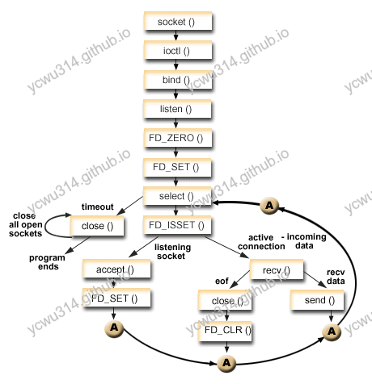

在这篇文章简单介绍了linux IO模型。
- [io-model](/posts/io-model)
linux的select、poll、epoll函数是IO多路复用的基础。这次聊聊这几个函数。
内容来自以前的有道笔记，当时没有记录参考文章。
<!-- more -->
# select





```c
typedef struct
         {
#ifdef __USE_XOPEN
    __fd_mask fds_bits[__FD_SETSIZE / __NFDBITS];
#define __FDS_BITS( set ) ((set )->fds_bits)
#     else
         __fd_mask __fds_bits[__FD_SETSIZE / __NFDBITS];
#define __FDS_BITS( set ) (( set )->__fds_bits)
#endif
         } fd_set ;
```

(一个fd占用一个bit)
由数组fds_bits[__FD_SETSIZE / __NFDBITS]的定义可以看出，它将数组fds_bits的长度从通常的__FD_SETSIZE缩短到了（__FD_SETSIZE / __NFDBITS），数组的元素的每个位表示一个描述符，那么一个元素就可以表示__NFDBITS个描述符，整个数组就可以表示（__FD_SETSIZE / __NFDBITS）* __NFDBITS = __FD_SETSIZE个描述符了。
__FDS_BITS的定义是为了便于直接引用该结构中的fds_bits，而不用关心内部具体的定义。

`int select(int maxfd,fd_set *rdset,fd_set *wrset,fd_set *exset,struct timeval *timeout);`

参数maxfd是需要监视的最大的文件描述符值+1；rdset,wrset,exset分别对应于需要检测的可读文件描述符的集合，可写文件描述符的集合及异常文件描述符的集合。struct timeval结构用于描述一段时间长度，如果在这个时间内，需要监视的描述符没有事件发生则函数返回，返回值为0。

基于**数组**的实现。

优点：
1. posix定义的，可移植性好。
2. 适用于少量连接。

缺点：
1. 单个进程可以监控的fd数量限制FD_SETSIZE。
> cat /proc/sys/fs/file-max察看。32位机默认是1024个。64位机默认是2048.

2. 对socket扫描是线性的，要扫描fd_size个，不管socket是否就绪。epoll，kqueue改进了此处，使用回调函数，不盲目扫描socket浪费cpu时间
3. 维护一个重型的fd数据结构，并且从内核空间拷贝到用户空间。
```c
/**********************************************************/
/* Copy the master fd_set over to the working fd_set.     */
/**********************************************************/
memcpy(&working_set, &master_set, sizeof(master_set));
```

<!-- more -->

# poll

```c
struct pollfd
{
  int fd;               /* 文件描述符 */
  short events;         /* 等待的事件 */
  short revents;       /* 实际发生了的事件 */
};

int poll(struct pollfd *ufds, unsigned int nfds, int timeout);
```
poll函数使用pollfd类型的结构来监控一组文件句柄，ufds是要监控的文件句柄集合，nfds是监控的文件句柄数量，timeout是等待的毫秒数，这段时间内无论I/O是否准备好，poll都会返回。timeout为负数表示无线等待，timeout为0表示调用后立即返回。
执行结果：为0表示超时前没有任何事件发生；-1表示失败；成功则返回结构体中revents不为0的文件描述符个数

优点：
1. 使用链表结构。不受fd最大数量限制

缺点：
1. 检查socket还是要遍历整个数据。
2. 水平触发：**如果这次报告fd已经可以操作但是没有处理，那么下次该fd还会被报告**。

# epoll

通常1g内存可以打开10w个epoll连接。

`int epoll_create(int size);`
创建一个epoll的句柄，size用来告诉内核需要监听的数目一共有多大。当创建好epoll句柄后，它就是会占用一个fd值，在linux下如果查看/proc/进程id/fd/，是能够看到这个fd的，所以在使用完epoll后，必须调用close() 关闭，否则可能导致fd被耗尽。

`int epoll_ctl(int epfd, int op, int fd, struct epoll_event *event);`
epoll的事件注册函数，第一个参数是 epoll_create() 的返回值，第二个参数表示动作，使用如下三个宏来表示：
```c
EPOLL_CTL_ADD    //注册新的fd到epfd中；
EPOLL_CTL_MOD    //修改已经注册的fd的监听事件；
EPOLL_CTL_DEL    //从epfd中删除一个fd；
```
第三个参数是需要监听的fd，第四个参数是告诉内核需要监听什么事，struct epoll_event 结构如下：
```c
typedef union epoll_data
{
  void        *ptr;
  int          fd;
  __uint32_t   u32;
  __uint64_t   u64;
} epoll_data_t;

struct epoll_event {
__uint32_t events; /* Epoll events */
epoll_data_t data; /* User data variable */
};
```

events 可以是以下几个宏的集合：
```c
EPOLLIN     //表示对应的文件描述符可以读（包括对端SOCKET正常关闭）；
EPOLLOUT    //表示对应的文件描述符可以写；
EPOLLPRI    //表示对应的文件描述符有紧急的数据可读（这里应该表示有带外数据到来）；
EPOLLERR    //表示对应的文件描述符发生错误；
EPOLLHUP    //表示对应的文件描述符被挂断；
EPOLLET     //将EPOLL设为边缘触发(Edge Triggered)模式，这是相对于水平触发(Level Triggered)来说的。
EPOLLONESHOT//只监听一次事件，当监听完这次事件之后，如果还需要继续监听这个socket的话，需要再次把这个socket加入到EPOLL队列里。
```
当对方关闭连接(FIN), EPOLLERR，都可以认为是一种EPOLLIN事件，在read的时候分别有0，-1两个返回值。

`int epoll_wait(int epfd, struct epoll_event *events, int maxevents, int timeout);`
参数events用来从内核得到事件的集合，maxevents 告之内核这个events有多大，这个 maxevents 的值不能大于创建 epoll_create() 时的size，参数 timeout 是超时时间（毫秒，0会立即返回，-1将不确定，也有说法说是永久阻塞）。该函数返回需要处理的事件数目，如返回0表示已超时。

epoll支持两种fd扫描方式，水平触发和边缘触发
- LT(level triggered，水平触发模式)是缺省的工作方式，并且同时支持 block 和 non-block socket。在这种做法中，内核告诉你一个文件描述符是否就绪了，然后你可以对这个就绪的fd进行IO操作。如果你不作任何操作，内核还是会继续通知你的，所以，这种模式编程出错误可能性要小一点。
- ET(edge-triggered，边缘触发模式)是高速工作方式，**只支持no-block socket**。在这种模式下，当描述符从未就绪变为就绪时，内核通过epoll告诉你。然后它会假设你知道文件描述符已经就绪，并且不会再为那个文件描述符发送更多的就绪通知，等到下次有新的数据进来的时候才会再次出发就绪事件。

ET模式减少了epoll事件被重复触发的问题。但是可能错过事件：如果一直不对这个fd作IO操作(从而导致它再次变成未就绪)，内核不会发送更多的通知(only once)。
（redis使用LT，nginx使用ET）

优点：
1. 没有描述符数量限制。
2. 支持水平触发和边缘触发
3. 使用事件回调处理就绪的fd，而非遍历fd。
epoll_ctl首先注册了文件描述符。一旦该fd就绪，就由内核激活该fd，当进程调用epoll_wait()时便得到通知。

# select，poll，epoll对比

|| select|poll|epoll
|---|---|---|---|
|单个进程打开连接数限制 | 受FD_SETSIZE限制|无限制 |无限制
|事件检查方式|遍历fd数组|同select|由内核调用事件的callback
| 打开大量FD后的性能表现| 因为线性遍历检查fd数组，所以性能线性下降|同select|只有活跃的socket才会触发epoll。因此性能只受活跃socket数量影响
|消息传播|从内核空间复制到用户空间|同select|内核与用户空间mmap同一块内存，无需复制
|事件触发模式|水平触发|水平触发|水平触发 or 边缘触发

# pselect, ppoll

解决的问题
- 在检查signal后和调用select()之前，丢失了signal。

```c
int pselect(int nfds, fd_set *readfds, fd_set *writefds, fd_set *exceptfds,
        const struct timespec *timeout, const sigset_t *sigmask);
```
```c
struct timespec {
             long    tv_sec;         /* seconds */
             long    tv_nsec;        /* nanoseconds */
         };
```
它和 select() 函数基本相同，区别在于两个不同的参数，一个是 struct timespec *timeout，另一个是 sigset_t *sigmask。
和 select() 不同，每次超时后，pselect() 并不会去修改这个时间参数，也就是说，没有必要再次对这个时间参数进行初始化。

对于最后一个参数 sigmask 表示信号屏蔽掩码。**该参数允许程序先禁止递交某些信号，再测试由这些当前被禁止的信号处理函数设置的全局变量，然后调用pselect，告诉它重新设置信号掩码。**

使用 pselect() 函数一个最大的原因正是它可以防止信号的干扰。比如说，如果你只是使用 select() 函数，在超时时间内很可能还会受到时钟信号(SIGALARM)的打断，从而影响 select() 的正常使用。

```c
while (1)
{
  if(need_to_quit)      // 1
    break;

  if(select(...) == -1) // 2
  {
    if(errno == EINTR)
      continue;
    ...
  }
  ...
}


int need_to_quit = 0; // handler interrupt
void sigquit_handler()
{
    need_to_quit = 1;
}
```
假设need_to_quit接收SIGINT信号。如果在1）和2）之间发生SIGINT，那么会丢失SIGINT信号的处理，结果可能一直在select调用中阻塞等待。

posix的解决方法：
>step 1 : you block all signals and save the current sigmask
>step 2 : check the event condition and do what is required
>step 3 : call pselect() and pass it a signal mask to enable all the signals that would provide you the events. when pselect() returns, it will restore the sigmask it had when it was entered(ie, here all the signals masked).
>step 4 : you restore the old signal mask

```c
pselect(..)
{
     // enable the signals to be received
    sigprocmask(.., &new_mask, &old_mask);  // 1
    select();                               // 2
    sigprocmask(.., &old_mask, null);
}
```
pselect类似上面的代码。但是用户模式下自己定义一个这样的函数，会在1）和2）之间产生竞争条件。posix提供的pselect会进入内核模式，不会产生竞争。

最终的代码流程如下：
```c
sigset_t new_set, old_set;
int ret;

sigfillmask(&new_set);
sigprocmask(.., null, &old_set);

while (1)
{
    sigprocmask(.., &new_set, null);

    if(need_to_quit)
        break;

    ret = pselect(.., &old_set) ;
    sigprocmask(.., &old_set, null);
    if(ret == -1)
    {
        if(errno == EINTR)
            continue;
        ...
    }
    ...
    sigprocmask(.., &old_set, null);
}
```

# kqueue

BSD系统上独有，类似epoll。但是更复杂。


