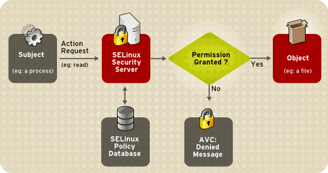
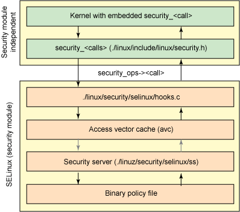

最近在排查一个网络访问问题，接触到SELinux。
<!-- more -->

# 访问控制方式

为了避免恶意代码访问资源，要有一套访问控制方式，确定应用程序能够权限。

## DAC

自主访问控制Discretionary Access Control（DAC）。
在这种形式下，一个软件或守护进程以User ID（UID）或Set owner User ID（SUID）的身份运行，并且拥有该用户的目标（文件、套接字、以及其它进程）权限。
这使得恶意代码很容易运行在特定权限之下，从而取得访问关键的子系统的权限。

## MAC

强制访问控制Mandatory Access Control（MAC）。
基于保密性和完整性强制信息的隔离以限制破坏。
使用**最小特权原则**：程序只能执行完成任务所需的操作。
该限制单元独立于传统的Linux安全机制运作，并且没有超级用户的概念。

## RBAC

基于角色的访问控制（RBAC）。
在 RBAC 中，权限是根据安全系统所授予的角色来提供的。角色的概念与传统的分组概念不同，因为一个分组代表一个或多个用户。一个角色可以代表多个用户，但它也代表一个用户集可以执行的权限。

# LSM

>Linux 内核继承了一种通用框架，将策略从实现中分离了出来，而不是采用单一的方法。该解决方案就是 Linux 安全模块（Linux Security Module，LSM）框架。
LSM 提供了一种通用的安全框架，允许将安全模型实现为可载入内核模块。

# SELinux介绍

SELinux 将 MAC 和 RBAC 都添加到了 GNU/Linux 操作系统中。
SELinux和linux内核的整体关系如下：


SELinux涉及几个概念：
- 主体Subjects
- 目标Objects
- 策略Policy
- 模式Mode

当一个主体Subject（如一个程序）尝试访问一个目标Object（如一个文件），SELinux安全服务器SELinux Security Server（在内核中）从策略数据库Policy Database中运行一个检查。基于当前的模式mode，如果 SELinux 安全服务器授予权限，该主体就能够访问该目标。如果SELinux安全服务器拒绝了权限，就会在/var/log/messages中记录一条拒绝信息。





在进程层面，SELinux模块对调用的影响如下：





这里有代码级别的分析例子，就不再展开了：[安全增强 Linux (SELinux) 剖析](https://www.ibm.com/developerworks/cn/linux/l-selinux/index.html)。

# 操作SELinux

SELinux 有三个模式：
- Enforcing 强制 — SELinux 策略强制执行，基于 SELinux 策略规则授予或拒绝主体对目标的访问
- Permissive 宽容 — SELinux 策略不强制执行，不实际拒绝访问，但会有拒绝信息写入日志
- Disabled 禁用 — 完全禁用SELinux

默认情况下，大部分系统的SELinux设置为Enforcing。

查看SELinux模式，使用`getenforce`：
```sh
[root@host143 ~]# getenforce
Enforcing
```

`sestatus`查看详情：
```sh
[root@host143 ~]# sestatus -v
SELinux status:                 enabled
SELinuxfs mount:                /sys/fs/selinux
SELinux root directory:         /etc/selinux
Loaded policy name:             targeted
Current mode:                   enforcing
Mode from config file:          enforcing
Policy MLS status:              enabled
Policy deny_unknown status:     allowed
Max kernel policy version:      31

Process contexts:
Current context:                unconfined_u:unconfined_r:unconfined_t:s0-s0:c0.c1023
Init context:                   system_u:system_r:init_t:s0
/usr/sbin/sshd                  system_u:system_r:sshd_t:s0-s0:c0.c1023

File contexts:
Controlling terminal:           unconfined_u:object_r:user_devpts_t:s0
/etc/passwd                     system_u:object_r:passwd_file_t:s0
/etc/shadow                     system_u:object_r:shadow_t:s0
/bin/bash                       system_u:object_r:shell_exec_t:s0
/bin/login                      system_u:object_r:login_exec_t:s0
/bin/sh                         system_u:object_r:bin_t:s0 -> system_u:object_r:shell_exec_t:s0
/sbin/agetty                    system_u:object_r:getty_exec_t:s0
/sbin/init                      system_u:object_r:bin_t:s0 -> system_u:object_r:init_exec_t:s0
/usr/sbin/sshd                  system_u:object_r:sshd_exec_t:s0

```


设置SELinux模式，使用`setenforce`：
```sh
# Use Enforcing or 1 to put SELinux in enforcing mode.
# Use Permissive or 0 to put SELinux in permissive mode.
[root@host143 ~]# setenforce 0
```
重启服务器后会恢复默认。

在日常操作中，常见的是关闭SELinux😂，永久关闭SELinux：
```sh
sed -i -e "s/SELINUX=enforcing/SELINUX=disabled/" /etc/selinux/config
reboot
```

看下`/etc/selinux/config`：
```sh
[root@host143 ~]# cat /etc/selinux/config 

# This file controls the state of SELinux on the system.
# SELINUX= can take one of these three values:
#     enforcing - SELinux security policy is enforced.
#     permissive - SELinux prints warnings instead of enforcing.
#     disabled - No SELinux policy is loaded.
SELINUX=disabled
# SELINUXTYPE= can take one of three two values:
#     targeted - Targeted processes are protected,
#     minimum - Modification of targeted policy. Only selected processes are protected. 
#     mls - Multi Level Security protection.
SELINUXTYPE=targeted 
```

SELINUXTYPE的targeted：
>Targeted目标 — 只有目标网络进程（dhcpd，httpd，named，nscd，ntpd，portmap，snmpd，squid，以及 syslogd）受保护

# setroubleshoot工具包

setroubleshoot提供SELinux审计日志分析、修复建议。
```
yum -y install setroubleshoot 
sealert -a /var/log/audit/audit.log
```

还有一个常用的命令：restorecon，用来恢复SELinux文件属性。
一个文件受selinux策略配置，那么移动后可能不能正常访问，可以使用restorecon恢复。


# 回到问题

在Centos7.5.1804上使用自动化脚本初始化节点，还有安装应用组件，其中包括关闭selinux步骤。
遇到的问题是，关闭selinux步骤成功，但是安装的应用组件不能被正常访问。但是重启虚拟机后就正常。
于是再找一台全新的机器，重复实验，保留现场。
检查日志，发现
```
[WARNING]: SELinux state change will take effect next reboot
```
执行的脚本是临时关闭selinux，同时修改`/etc/selinux/config`永久关闭，但是没有重启。
理论上是临时关闭成功，但是status还是enabled。
```sh
[root@localhost ~]# getenforce
Permissive
[root@localhost ~]# sestatus 
SELinux status:                 enabled
SELinuxfs mount:                /sys/fs/selinux
SELinux root directory:         /etc/selinux
Loaded policy name:             targeted
Current mode:                   permissive
Mode from config file:          disabled
Policy MLS status:              enabled
Policy deny_unknown status:     allowed
Max kernel policy version:      31
```
最后加上关闭selinux后的重启步骤。


# 其他

和SELinux功能相似的是AppArmor。
SELinux主要是红帽Red Hat Linux以及它的衍生发行版上使用。
Ubuntu和SUSE（以及它们的衍生发行版）使用的是AppArmor。

# 参考

- [安全增强 Linux (SELinux) 剖析](https://www.ibm.com/developerworks/cn/linux/l-selinux/index.html)
- [SELinux入门](https://www.linuxprobe.com/selinux-introduction.html)
- [在centos7安装完mysql 5.7之后，不能启动mysql](https://blog.csdn.net/jianye5461/article/details/88009012)
