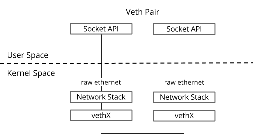
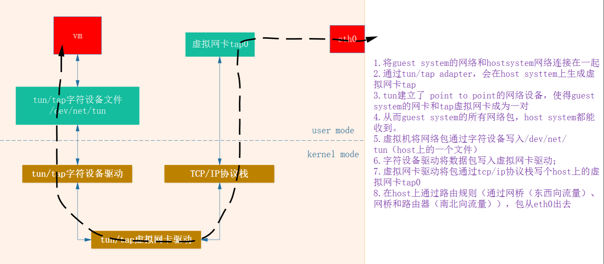

整理veth和tun/tap的学习笔记。
<!-- more -->

# veth pair

veth-pair 是成对出现的一种虚拟网络设备，一端连接着协议栈，一端连接着彼此，数据从一端出，从另一端进。
常常用来连接不同的虚拟网络组件，构建大规模的虚拟网络拓扑，比如连接 Linux Bridge、OVS、LXC 容器等。





veth的特点:
- 成对出现
- 工作在内核协议栈
- 数据从一个设备发出，在另一个设备接收

veth pair使用很灵活。可以使用veth pair直连两个netns；也可以挂载到bridge（bridge对接到物理网卡，则可以访问外网）。


docker使用veth pair的例子。容器内部的eth0和外部的vethx配对，再连接到bridge上（本质和上图一致）。


## 创建veth pair

```sh
# veth成对出现
[root@host143 ~]# ip link add dev veth0 type veth peer name veth1

# 启动设备
[root@host143 ~]# ip link set dev veth0 up
[root@host143 ~]# ip link set dev veth1 up
```


## 验证veth的联通特性

veth的一个特性是：数据从一个设备发出，在另一个设备接收。

通过抓包体验：
```sh
# 窗口1
tcpdump -n -i veth0

# 窗口2
tcpdump -n -i veth1


# 窗口3
# 指定使用veth0发送
[root@host143 ~]# ping -c 4 -I veth0  8.8.8.8 
ping: Warning: source address might be selected on device other than veth0.
PING 8.8.8.8 (8.8.8.8) from 172.25.20.143 veth0: 56(84) bytes of data.

--- 8.8.8.8 ping statistics ---
4 packets transmitted, 0 received, 100% packet loss, time 2999ms


# 窗口1
[root@host143 ~]# tcpdump -n -i veth0
tcpdump: verbose output suppressed, use -v or -vv for full protocol decode
listening on veth0, link-type EN10MB (Ethernet), capture size 262144 bytes
20:42:47.401707 ARP, Request who-has 8.8.8.8 tell 172.25.20.143, length 28
20:42:48.403141 ARP, Request who-has 8.8.8.8 tell 172.25.20.143, length 28
20:42:49.405147 ARP, Request who-has 8.8.8.8 tell 172.25.20.143, length 28
^C
3 packets captured
3 packets received by filter
0 packets dropped by kernel

# 窗口2
[root@host143 ~]# tcpdump -n -i veth1
tcpdump: verbose output suppressed, use -v or -vv for full protocol decode
listening on veth1, link-type EN10MB (Ethernet), capture size 262144 bytes
20:42:47.401716 ARP, Request who-has 8.8.8.8 tell 172.25.20.143, length 28
20:42:48.403146 ARP, Request who-has 8.8.8.8 tell 172.25.20.143, length 28
20:42:49.405151 ARP, Request who-has 8.8.8.8 tell 172.25.20.143, length 28
^C
3 packets captured
3 packets received by filter
0 packets dropped by kernel

```
从上面可见，从veth0发送的包，都流向了veth1。

1. ping会构造ICMP echo request，从socket发送到协议栈
2. 因为本地路由表没有8.8.8.8的地址，因此要构造ARP请求，查询mac地址
3. 协议栈知道从veth0发送的包，要流向veth1
4. veth1收到ARP包，交给协议栈
5. 协议栈发现本地没有8.8.8.8的地址，于是丢弃ARP包。所以没有应答包


为veth pair添加ip，再ping对方
```sh
# 分配ip
[root@host143 ~]# ip addr add 192.168.1.10/24 dev veth0
[root@host143 ~]# ip addr add 192.168.1.20/24 dev veth1

# 留意mac
[root@host143 ~]# ip addr
322: veth1@veth0: <BROADCAST,MULTICAST,UP,LOWER_UP> mtu 1500 qdisc noqueue state UP group default qlen 1000
    link/ether c6:b2:b2:46:60:cc brd ff:ff:ff:ff:ff:ff
    inet 192.168.1.20/24 scope global veth1
       valid_lft forever preferred_lft forever
    inet6 fe80::c4b2:b2ff:fe46:60cc/64 scope link 
       valid_lft forever preferred_lft forever
323: veth0@veth1: <BROADCAST,MULTICAST,UP,LOWER_UP> mtu 1500 qdisc noqueue state UP group default qlen 1000
    link/ether 5a:64:c8:d3:28:a3 brd ff:ff:ff:ff:ff:ff
    inet 192.168.1.10/24 scope global veth0
       valid_lft forever preferred_lft forever
    inet6 fe80::5864:c8ff:fed3:28a3/64 scope link 
       valid_lft forever preferred_lft forever


# veth0 ping veth1
[root@host143 ~]# ping -c 4 -I veth0 192.168.1.20
PING 192.168.1.20 (192.168.1.20) from 192.168.1.10 veth0: 56(84) bytes of data.

--- 192.168.1.20 ping statistics ---
4 packets transmitted, 0 received, 100% packet loss, time 2999ms


[root@host143 ~]# tcpdump -n -i veth0
tcpdump: verbose output suppressed, use -v or -vv for full protocol decode
listening on veth0, link-type EN10MB (Ethernet), capture size 262144 bytes
21:39:13.025468 IP 192.168.1.10 > 192.168.1.20: ICMP echo request, id 10835, seq 1, length 64
21:39:14.025172 IP 192.168.1.10 > 192.168.1.20: ICMP echo request, id 10835, seq 2, length 64
21:39:15.025190 IP 192.168.1.10 > 192.168.1.20: ICMP echo request, id 10835, seq 3, length 64
21:39:16.025165 IP 192.168.1.10 > 192.168.1.20: ICMP echo request, id 10835, seq 4, length 64
21:39:18.039146 ARP, Request who-has 192.168.1.20 tell 192.168.1.10, length 28
21:39:18.039177 ARP, Reply 192.168.1.20 is-at c6:b2:b2:46:60:cc, length 28


[root@host143 ~]# tcpdump -n -i veth1
tcpdump: verbose output suppressed, use -v or -vv for full protocol decode
listening on veth1, link-type EN10MB (Ethernet), capture size 262144 bytes
21:39:13.025476 IP 192.168.1.10 > 192.168.1.20: ICMP echo request, id 10835, seq 1, length 64
21:39:14.025178 IP 192.168.1.10 > 192.168.1.20: ICMP echo request, id 10835, seq 2, length 64
21:39:15.025196 IP 192.168.1.10 > 192.168.1.20: ICMP echo request, id 10835, seq 3, length 64
21:39:16.025171 IP 192.168.1.10 > 192.168.1.20: ICMP echo request, id 10835, seq 4, length 64
21:39:18.039151 ARP, Request who-has 192.168.1.20 tell 192.168.1.10, length 28
21:39:18.039176 ARP, Reply 192.168.1.20 is-at c6:b2:b2:46:60:cc, length 28
```

在centos 7.5上ping不通（内核3.10，很老了）。网上找到的方法：
```sh
echo 1 > /proc/sys/net/ipv4/conf/veth1/accept_local
echo 1 > /proc/sys/net/ipv4/conf/veth0/accept_local
echo 0 > /proc/sys/net/ipv4/conf/all/rp_filter
echo 0 > /proc/sys/net/ipv4/conf/veth0/rp_filter
echo 0 > /proc/sys/net/ipv4/conf/veth1/rp_filter
```
还是ping不通。尴尬啊😥

ps. 用不通的network namespace是可以ping通veth pair。

ps. 把`-I`的veth0换成对应ip，可以ping通。但是抓包显示没有收到数据包
```sh
[root@host143 ~]# ping -c 4 -I 192.168.1.10  192.168.1.20
PING 192.168.1.20 (192.168.1.20) from 192.168.1.10 : 56(84) bytes of data.
64 bytes from 192.168.1.20: icmp_seq=1 ttl=64 time=0.034 ms
64 bytes from 192.168.1.20: icmp_seq=2 ttl=64 time=0.029 ms
64 bytes from 192.168.1.20: icmp_seq=3 ttl=64 time=0.031 ms
64 bytes from 192.168.1.20: icmp_seq=4 ttl=64 time=0.029 ms

# 抓包没有数据，连ICMP echo request也没有
# tcpdump -n -i veth0
# tcpdump -n -i veth1


# 流量直接经过lo设备。。。
[root@host143 ~]# tcpdump -n -i lo
21:52:24.716430 IP 192.168.1.10 > 192.168.1.20: ICMP echo request, id 11671, seq 1, length 64
21:52:24.716440 IP 192.168.1.20 > 192.168.1.10: ICMP echo reply, id 11671, seq 1, length 64
21:52:25.716256 IP 192.168.1.10 > 192.168.1.20: ICMP echo request, id 11671, seq 2, length 64
21:52:25.716266 IP 192.168.1.20 > 192.168.1.10: ICMP echo reply, id 11671, seq 2, length 64
```

TODO. 以后再解决


## 查看对端veth设备

```sh
[root@host143 ~]# ip netns exec ns1 ethtool -S veth0
NIC statistics:
     peer_ifindex: 318

[root@host143 ~]# ip netns exec ns2 ip link
1: lo: <LOOPBACK> mtu 65536 qdisc noop state DOWN mode DEFAULT group default qlen 1000
    link/loopback 00:00:00:00:00:00 brd 00:00:00:00:00:00
318: veth1@if319: <BROADCAST,MULTICAST> mtu 1500 qdisc noop state DOWN mode DEFAULT group default qlen 1000
    link/ether fa:ad:be:ed:b0:29 brd ff:ff:ff:ff:ff:ff link-netnsid 0     
```

# tun / tap

tap/tun 提供了一台主机内用户空间的数据传输机制。它虚拟了一套网络接口，这套接口和物理的接口无任何区别，可以配置 IP，可以路由流量，不同的是，它的流量只在主机内流通。

>TUN/TAP: The user-space application/VM can read or write an ethernet frame to the tap interface and it would reach the host kernel, where it would be handled like any other ethernet frame that reached the kernel via physical (e.g. eth0) ports. You can potentially add it to a software-bridge (e.g. linux-bridge)


tun 是点对点的设备， 而 tap 是一个普通的以太网卡设备 。 也就是说 ，tun 设备其实完全不需要有物理地址的 。 它收到和发出的包不需要 arp， 也不需要有数据链路层的头 。 而 tap 设备则是有完整的物理地址和完整的以太网帧 。

TUN（Tunel）设备模拟网络层设备，处理三层报文，如IP报文。TAP设备模型链路层设备，处理二层报文，比如以太网帧。TUN用于路由，而TAP用于创建网桥。

>TUN (tunnel) devices operate at layer 3, meaning the data (packets) you will receive from the file descriptor will be IP based. Data written back to the device must also be in the form of an IP packet.
>TAP (network tap) operates much like TUN however instead of only being able to write and receive layer 3 packets to/from the file descriptor it can do so with raw ethernet packets（layer 2）. You will typically see tap devices used by KVM/Qemu virtualization, where a TAP device is assigned to a virtual guests interface during creation.

来自wiki，tun/tap对应osi的层次：


字符设备`/dev/net/tun`作为用户空间和内核空间交换数据的接口。
当内核将数据包发送到虚拟网络设备时，数据包被保存在设备相关的一个队列中，直到用户空间程序通过打开的字符设备tun的描述符读取时，它才会被拷贝到用户空间的缓冲区中，其效果就相当于，数据包直接发送到了用户空间。

tun/tap驱动程序中包含两部分：字符设备驱动和网卡驱动。利用网卡驱动部分接受来自tcp/ip协议栈的网络分包并发送或者反过来将接收到的网络分包传给协议栈处理。而字符设备驱动部门将网络分包在内核与用户态之间传送，模拟物理链路的数据接受和发送。

tun/tap设备最常用的场景是VPN，包括tunnel以及应用层的IPSec等。tap通常用于创建虚拟机网卡。
来自参考文章的例子：





# 小结


# 参考

- [TUN, TAP and Veth - Virtual Networking Devices Explained](https://www.fir3net.com/Networking/Terms-and-Concepts/virtual-networking-devices-tun-tap-and-veth-pairs-explained.html)
- [Virtual networking devices in Linux](https://stackoverflow.com/questions/25641630/virtual-networking-devices-in-linux)
- [Linux 上的基础网络设备详解](https://www.ibm.com/developerworks/cn/linux/1310_xiawc_networkdevice/)
- [Linux-虚拟网络设备-veth pair](https://blog.csdn.net/sld880311/article/details/77650937)
- [Linux-虚拟网络设备-tun/tap](https://blog.csdn.net/sld880311/article/details/77854651)
- [云计算底层技术-虚拟网络设备(tun/tap,veth)](https://opengers.github.io/openstack/openstack-base-virtual-network-devices-tuntap-veth/)
- [Linux虚拟网络设备之veth](https://segmentfault.com/a/1190000009251098)
- [veth.4.html](https://man7.org/linux/man-pages/man4/veth.4.html)